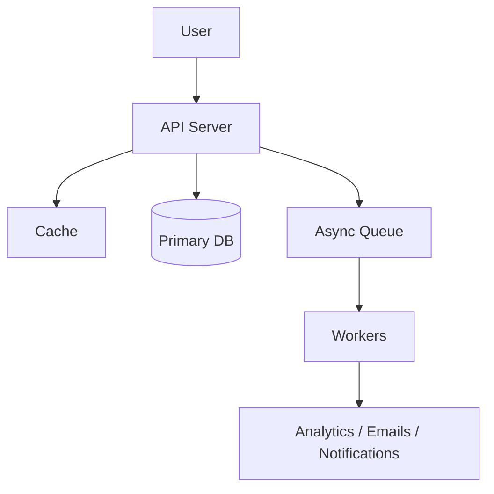

# Easy System Design Problems

[← System Design index](index.md)

Twenty foundational designs for junior-to-mid rounds. Each problem below is a compressed interview answer: name the user flow, the durable state, what you cache or queue, and the simplest scaling path that still holds under failure.

## Architecture snapshot



## Questions at a glance

| # | Question |
|---|---|
| 16 | [Design URL Shortener (TinyURL)](#16-design-url-shortener-tinyurl) |
| 17 | [Design Pastebin (Text Storage)](#17-design-pastebin-text-storage) |
| 18 | [Design Content Delivery Network (CDN)](#18-design-content-delivery-network-cdn) |
| 19 | [Design Parking Garage](#19-design-parking-garage) |
| 20 | [Design Distributed Key-Value Store](#20-design-distributed-key-value-store) |
| 21 | [Design Distributed Cache](#21-design-distributed-cache) |
| 22 | [Design Distributed Job Scheduler](#22-design-distributed-job-scheduler) |
| 23 | [Design Authentication System](#23-design-authentication-system) |
| 24 | [Design Unified Payments Interface (UPI)](#24-design-unified-payments-interface-upi) |
| 25 | [Design Task Management System (Todoist/Asana)](#25-design-task-management-system-todoist-asana) |
| 26 | [Design Email Service](#26-design-email-service) |
| 27 | [Design Logging System](#27-design-logging-system) |
| 28 | [Design Real-time Metrics System](#28-design-real-time-metrics-system) |
| 29 | [Design Comment System](#29-design-comment-system) |
| 30 | [Design Leaderboard](#30-design-leaderboard) |
| 31 | [Design Search Autocomplete](#31-design-search-autocomplete) |
| 32 | [Design QR Code Generator](#32-design-qr-code-generator) |
| 33 | [Design Session Management](#33-design-session-management) |
| 34 | [Design File Upload System](#34-design-file-upload-system) |
| 35 | [Design Recommendation System (Basic)](#35-design-recommendation-system-basic) |

---

### 16. Design URL Shortener (TinyURL)

**Why interviewers ask:** Redirect services are read-heavy, latency-sensitive, and deceptively simple. They test whether you can separate the hot read path from durable mapping storage, handle ID generation without collisions, and reason about cache vs database consistency.

**Core insight:** Treat short codes as immutable keys mapped to long URLs — optimize redirects (cache-first), generate IDs centrally or with a collision-safe strategy on create, and never lose the mapping.

**Architecture**

```txt
Client → API (create / redirect)
              ↓ read path
         Redis (hot short→long)
              ↓ miss
         SQL DB (short_url PK, long_url, created_at)
              ↓ create path
         ID generator (Base62 / counter) → write DB → optional cache fill
              ↓ async
         Queue → click analytics worker
```

- **API layer:** Stateless handlers for `POST /shorten` and `GET /{code}`; redirect returns 301/302 with minimal work on the read path.
- **SQL database:** Source of truth; unique index on `short_url`; stores long URL, optional custom alias, expiry, owner metadata.
- **Redis cache:** Caches `code → long_url` for hot links; 100:1 read-write ratio is typical — most traffic is redirect, not create.
- **ID generator:** Counter + Base62 encoding, or hash-with-retry on collision; custom aliases validated for uniqueness before insert.
- **Async queue:** Click counts and analytics off the redirect critical path so logging never blocks latency.

**Key decisions**

- **SQL vs NoSQL for mappings:** SQL wins — small rows, strong uniqueness on short codes, simple lookups; NoSQL adds little unless you need geo-sharded writes at extreme scale.
- **301 vs 302 redirects:** 301 caches at browser/CDN (good for permanent links); 302 if you need to change targets or track every hit server-side.
- **Sync vs async analytics:** Async queue for click tracking — redirect path stays sub-10ms; batch writes to analytics store.

**Scale & failure:** Redis or DB connection pool exhaustion under viral link traffic breaks first. Mitigation: cache hot codes aggressively, read replicas for DB misses, CDN in front of redirect API for globally hot URLs.

**Deep link:** [Design a URL shortener](../backend/system-design/design-a-url-shortener.md)

**Memory hook:** Short code is a permanent dictionary key — cache the dictionary lookups, generate keys safely once, redirect without thinking.

---

### 17. Design Pastebin (Text Storage)

**Why interviewers ask:** Pastebin is content-addressed storage with optional TTL — similar shape to URL shortener but with larger payloads and expiry. Interviewers want to hear how you store blobs, assign IDs, and clean up without breaking links mid-read.

**Core insight:** Generate a unique paste ID, store content durably (DB or object store for large pastes), serve reads through cache for popular snippets, and expire with TTL jobs rather than synchronous deletes.

**Architecture**

```txt
Client → API (create paste / fetch by ID)
              ↓
         Paste service
              ↓ write              ↓ read
    MongoDB (metadata + small text)  Redis (hot pastes)
              ↓ large content
         Object store (S3) + pointer in DB
              ↓ TTL
         Cleanup worker (scheduled scan / bucket lifecycle)
```

- **API layer:** `POST` accepts text + optional expiry; `GET /{id}` returns content or raw view; enforce max size limits at the edge.
- **NoSQL metadata store:** Flexible schema for paste metadata (id, size, created_at, expires_at, syntax language); good fit for variable fields.
- **Object storage:** Pastes above a threshold (e.g. 64KB) go to blob storage; DB holds only a pointer — keeps DB rows small and queries fast.
- **Cache layer:** Popular public pastes cached by ID; invalidate on expiry or admin delete.
- **TTL cleanup:** Background job or object-store lifecycle rules delete expired content; reads after expiry return 404 consistently.

**Key decisions**

- **DB inline vs object store:** Inline text in DB for small pastes (simpler); S3 for large pastes — trade simplicity on small reads vs storage cost at scale.
- **UUID vs Snowflake IDs:** Snowflake gives time-sortable, dense IDs without a central counter; UUID is fine at moderate scale with less coordination.
- **Public vs private pastes:** Optional password or signed URL — store hash of password, never plaintext; unlisted IDs act as capability tokens.

**Scale & failure:** Large paste uploads saturate API bandwidth and storage write throughput first. Mitigation: direct-to-S3 upload with presigned URLs, size caps, and rate limits per IP.

**Memory hook:** Paste ID is the address — metadata in DB, fat content in object store, cache the hits, TTL sweeps the graveyard.

---

### 18. Design Content Delivery Network (CDN)

**Why interviewers ask:** CDNs appear in almost every scale story. This problem checks whether you understand edge caching, origin offload, geo routing, and the hard part — invalidation when content changes.

**Core insight:** Push static assets to edge nodes near users; on request, serve from edge if fresh, otherwise fetch from origin once and cache — DNS/geo routing picks the nearest edge.

**Architecture**

```txt
User → GeoDNS / Anycast → Edge server (region)
                              ↓ cache hit → response
                              ↓ miss
                         Origin server (authoritative content)
                              ↓
                         Cache fill at edge + TTL headers
         Ops plane: invalidation API, health checks, real-time monitoring
```

- **Origin servers:** Authoritative source for HTML, images, JS, video; not hit on every user request once edge is warm.
- **Edge servers:** Distributed globally; hold cached copies keyed by URL + cache headers; terminate TLS close to users.
- **GeoDNS / routing:** Maps client to nearest healthy edge — latency reduction is the primary win.
- **Invalidation mechanism:** Purge by URL, path prefix, or cache tag when content updates — stale edges are the main consistency risk.
- **Monitoring:** Per-edge hit ratio, origin load, latency p99 — alerts when origin spikes (cache miss storm).

**Key decisions**

- **Push vs pull CDN:** Pull (edge fetches on miss) is default for web assets; push (pre-upload to all edges) for large static bundles or live event prep.
- **TTL vs active purge:** Long TTL + purge on publish for news sites; short TTL for semi-dynamic content — balances freshness vs origin load.
- **Cache key design:** Include host, path, query variants (or normalize) — wrong keys cause duplicate cache entries or wrong content served.

**Scale & failure:** Origin overload when many edges miss simultaneously (cache stampede) breaks first. Mitigation: stale-while-revalidate, request coalescing at edge, and shield origin behind a mid-tier cache layer.

**Memory hook:** CDN is a photocopy shop at every city — users grab the local copy; only call headquarters (origin) when the shelf is empty or the page changed.

---

### 19. Design Parking Garage

**Why interviewers ask:** This is a constrained state machine, not a web-scale fanout problem. Interviewers test transactional spot assignment, entry/exit race conditions, multi-vehicle-type pricing, and keeping physical gates in sync with digital inventory.

**Core insight:** One authoritative spot inventory updated atomically on entry/exit; gates and displays are clients of that inventory; billing derives from timestamps and vehicle class.

**Architecture**

```txt
Entry gate → Gate controller → API (allocate spot, open gate)
                                    ↓
                              Spot DB (status per bay)
                                    ↓
Exit gate → Gate controller → API (release spot, compute fee)
                                    ↓
                              Payment processor
         Display boards ← read replica / cache of available counts
         Admin dashboard ← reports, manual overrides, pricing rules
```

- **Spot database:** Each bay row tracks status (free/occupied), vehicle type allowed, level, and current session id — updates must be transactional.
- **Gate controllers:** Local hardware issues entry/exit events; API assigns nearest free compatible spot and returns gate command; idempotent event ids prevent double entry.
- **Availability display:** Reads aggregated free counts per level/type from cache or read replica — stale by a few seconds is acceptable for signage.
- **Payment processor:** On exit, fee = duration × rate(vehicle_class) + rules; integrate card/UPI; session links entry timestamp to exit.
- **Admin dashboard:** Override stuck sessions, fix misreads, configure pricing tiers and capacity per vehicle type.

**Key decisions**

- **Central DB vs per-level counters:** Per-bay rows in one DB with row-level locks — simpler than distributed counters and avoids double-booking a bay.
- **Optimistic vs pessimistic allocation:** Pessimistic (lock bay on entry request) — correct for physical scarcity; optimistic fails when two cars race for the last spot.
- **Real-time display accuracy:** Eventual consistency on display counts is fine; spot assignment itself must be strongly consistent.

**Scale & failure:** Entry peak congestion or DB lock contention on hot rows breaks first. Mitigation: partition bays by level/gate, short-lived locks, and queue at gate UI when allocation is slow.

**Memory hook:** Parking is hotel keys for cars — one ledger of which bay is occupied, gates only open when the ledger says yes, checkout computes the bill.

---

### 20. Design Distributed Key-Value Store

**Why interviewers ask:** This is the infrastructure layer under caches, metadata stores, and coordination services. Interviewers want partitioning, replication, consistency levels, and recovery without pretending you need full linearizability everywhere.

**Core insight:** Partition keys across nodes with consistent hashing, replicate each partition for fault tolerance, accept eventual consistency on reads unless the client asks for stronger guarantees.

**Architecture**

```txt
Client → Routing layer (partition key → responsible nodes)
              ↓
         Replica set (typically 3 nodes per partition)
              ↓ read/write
         Local storage (LSM / B-tree per node)
              ↓ background
         Gossip (membership) + read repair + Merkle anti-entropy
```

- **Routing layer:** Maps key to partition via consistent hashing; clients or a proxy know which nodes own a key range; rebalancing when nodes join/leave.
- **Partition storage:** Each node stores a slice of keys; get/put target one primary + replicas; O(1) expected latency per key locally.
- **Replication:** Write to N replicas (e.g. 3); read from any replica with optional quorum (R + W > N for strong read-your-writes variants).
- **Gossip protocol:** Nodes exchange membership and health — no single coordinator required for liveness discovery.
- **Anti-entropy:** Merkle trees compare replica digests; read repair fixes divergence on access; full sync heals offline nodes.

**Key decisions**

- **Consistent hashing vs range partitioning:** Consistent hashing minimizes key movement on node add/remove; range partitioning helps range scans but hot ranges hurt.
- **Eventual vs quorum consistency:** Eventual default for speed; quorum reads/writes when application needs fewer stale reads — PACELC: latency vs consistency under partition.
- **Replication factor 3:** Industry default — survives one failure with reads still available; RF=2 is cheaper but fragile during simultaneous failures.

**Scale & failure:** Hot keys on one partition node saturate first. Mitigation: key splitting, local caching on clients, or dedicated hot-key replication layers.

**Memory hook:** KV store is a ring of filing cabinets — hash picks the cabinet, three copies of each file, gossip is how cabinets learn who is still standing.

---

### 21. Design Distributed Cache

**Why interviewers ask:** Every scaled system adds a cache. This problem isolates cache-specific design — sharding, eviction, TTL, replication — and forces you to state what the source of truth is and what happens on miss or node death.

**Core insight:** Cache is disposable acceleration — shard in-memory data across nodes, evict with LRU/LFU under memory pressure, replicate hot entries only if needed, and always define invalidation.

**Architecture**

```txt
App → Cache client (consistent hash → node)
              ↓
         Cache cluster (in-memory hash tables per node)
              ↓ miss
         Source of truth (DB / service)
              ↓ optional
         Replica peer (for hot key redundancy within cluster)
```

- **In-memory store:** Hash table per node; sub-millisecond get/put; no persistence — restart means cold cache.
- **Consistent hashing:** Keys map to nodes; virtual nodes smooth distribution when cluster size changes.
- **Eviction policy:** LRU or LFU when memory cap hit — track access frequency or recency per entry.
- **TTL support:** Per-key expiry for session data, rate-limit windows, or auto-refreshing entries without manual delete.
- **Cluster communication:** Health checks, failover hints, optional replication of hot entries to a secondary node.

**Key decisions**

- **Cache aside vs read-through:** Cache-aside (app loads on miss) is most common — simple failure modes; read-through centralizes logic but couples cache to DB latency.
- **Replication inside cache:** Optional for hot keys — adds memory cost; often prefer larger cluster + client retry on miss instead.
- **LRU vs LFU:** LRU for general workloads; LFU when a few keys dominate traffic and you want to protect them from one-off scans evicting hot data.

**Scale & failure:** Single hot key on one shard node — memory and CPU on that node break first. Mitigation: local secondary cache in app, key replication, or splitting hot key into sub-keys.

**Deep link:** [Design a cache layer](../backend/system-design/design-a-cache-layer.md)

**Memory hook:** Cache is a scratch pad, not the notebook — fast, losable, hash the key to the right desk, evict when the desk is full.

---

### 22. Design Distributed Job Scheduler

**Why interviewers ask:** Cron at scale needs durable schedules, exactly-once-ish execution, worker coordination, and retries. Interviewers test leader election, idempotent workers, and how you avoid duplicate runs after crashes.

**Core insight:** Persist every schedule and run state; one active scheduler dispatches work to a queue; workers claim jobs with leases; retries and heartbeats recover from partial failure.

**Architecture**

```txt
Scheduler service (leader via election) → reads job definitions + cron
              ↓ enqueue
         Task queue (Kafka / SQS)
              ↓ claim with lease
         Worker pool (idempotent handlers)
              ↓ heartbeat + status
         State DB (job id, run id, status, next_run_at)
```

- **Scheduler service:** Computes next fire time from cron/interval; only the elected leader dispatches — avoids duplicate enqueue from multiple schedulers.
- **Task queue:** Buffers jobs between schedule tick and execution; absorbs burst; supports visibility timeout for retries.
- **Worker pool:** Pulls jobs, executes business logic, reports success/failure; must be idempotent — at-least-once delivery implies duplicates possible.
- **State database:** Tracks definitions, last run, next run, attempt count — source of truth for observability and recovery.
- **Heartbeat mechanism:** Workers extend lease while running; expired lease allows another worker to reclaim stuck jobs.

**Key decisions**

- **DB polling vs queue-driven:** Queue-driven scales better — scheduler only enqueues; workers scale horizontally without polling a central table.
- **At-least-once + idempotency vs distributed locks:** Prefer idempotent workers with dedupe keys — locks add coordination pain and deadlock risk.
- **Leader election:** Required if multiple scheduler instances — etcd/ZooKeeper or cloud leader lease; single dispatcher invariant.

**Scale & failure:** Queue backlog or poison jobs stall worker throughput first. Mitigation: dead-letter queue, per-job retry caps with backoff, and isolated worker pools for heavy vs light jobs.

**Deep link:** [Design a background job system](../backend/system-design/design-a-background-job-system.md)

**Memory hook:** Scheduler is an alarm clock with a ledger — one leader sets the alarm, queue holds the to-do, workers do the task twice-safe with idempotency keys.

---

### 23. Design Authentication System

**Why interviewers ask:** Auth mistakes become breaches. Interviewers want secure credential storage, token/session lifecycle, MFA hooks, and a clean split between authentication (who you are) and authorization (what you can do).

**Core insight:** Verify identity once at login, issue short-lived proof (JWT or session id), store secrets hashed never plaintext, and design revocation and refresh explicitly.

**Architecture**

```txt
Client → Auth API (login / register / refresh / logout)
              ↓
         User DB (bcrypt password hashes + MFA flags)
              ↓
         Token service (JWT issue + validate) OR session store (Redis)
              ↓
         OAuth broker (Google/GitHub) for social login
              ↓
         Audit log (login attempts, lockouts, admin actions)
```

- **User database:** Email/username unique; passwords stored as salted bcrypt/argon2 hashes; MFA secrets encrypted at rest.
- **JWT token service:** Access token short-lived (15 min); refresh token longer, stored hashed or in DB for revocation; validate signature + expiry on each request.
- **OAuth integration:** Redirect to provider, exchange code server-side, link or create local user — never trust client-provided provider tokens blindly.
- **MFA service:** TOTP or SMS second step after password; required for sensitive accounts or step-up auth.
- **Audit logging:** Failed logins, password changes, token refresh — supports fraud detection and compliance.

**Key decisions**

- **JWT vs server sessions:** JWT scales statelessly for APIs; server sessions in Redis simplify revocation — hybrid: short JWT + refresh token in DB is common.
- **bcrypt/argon2 vs fast hashes:** Slow password hashes only — SHA256 is wrong for passwords; tune cost factor for ~200–500ms hash time.
- **Rate limiting on login:** Throttle by IP + account — stops credential stuffing without locking legitimate users globally.

**Scale & failure:** Login endpoint under credential-stuffing attack or DB read load on token validation breaks first. Mitigation: rate limits, CAPTCHA after failures, and read-through cache for public keys / session lookups.

**Deep link:** [Design an authentication system](../backend/system-design/design-an-authentication-system.md)

**Memory hook:** Auth proves identity once, then hands a expiring hall pass — hash the secret, short-lived pass, refresh or revoke when the pass is stolen.

---

### 24. Design Unified Payments Interface (UPI)

**Why interviewers ask:** Money movement demands correctness over speed. UPI-style designs test idempotent transfers, ACID ledger, real-time settlement paths, fraud checks, and audit trails — duplicate requests must never double-pay.

**Core insight:** Every payment is a ledger transaction with idempotency keys; state machine from initiated → debited → credited → settled; reconciliation catches drift between banks and your records.

**Architecture**

```txt
User app → Payment API (idempotency-key header)
              ↓
         Account service (balance checks, VPA resolution)
              ↓
         Transaction DB (ACID, double-entry ledger rows)
              ↓
         Payment gateway / NPCI switch
              ↓
         Settlement service (batch reconcile with banks)
              ↓ parallel
         Fraud detection + notification service
```

- **Account service:** Maps UPI ID to bank account; validates payer balance and limits before debit attempt.
- **Transaction database:** ACID writes — debit and credit rows in one transaction; unique constraint on idempotency key per client request.
- **Payment gateway:** Routes to NPCI/bank network; handles async callbacks for final status — your API must reconcile pending states.
- **Settlement service:** Nightly or intraday matching of internal ledger vs bank statements; flags mismatches for ops.
- **Fraud detection:** Velocity rules, device fingerprint, anomaly on amount/geo — can block before gateway call.

**Key decisions**

- **Sync API vs async confirmation:** User sees "pending" quickly; final status from webhook — never mark success before bank ack.
- **Idempotency keys mandatory:** Retries are normal on mobile networks — same key returns same result, never duplicate debit.
- **Double-entry ledger:** Every transfer is two rows (debit + credit) — sum invariant catches corruption early.

**Scale & failure:** Gateway timeouts leaving transactions stuck in `PENDING` break user trust first. Mitigation: timeout reconciliation job, explicit status polling, and customer-visible pending state with auto-resolve.

**Deep link:** [Design a payment system](../backend/system-design/design-a-payment-system.md)

**Memory hook:** Payments are ledger math with receipts — idempotency key is the receipt number, never charge twice for the same number, reconcile when the bank disagrees.

---

### 25. Design Task Management System (Todoist/Asana)

**Why interviewers ask:** Task apps combine CRUD, sharing permissions, notifications, and search — a realistic product backend without billion-user fanout. Interviewers look for normalized task model, project membership, and async side effects.

**Core insight:** Tasks belong to projects and users through membership; API serves fast reads for a user's task list; notifications and search indexing happen asynchronously off the write path.

**Architecture**

```txt
Client → API gateway
              ↓
    Task / Project / User services
              ↓
         Primary DB (tasks, projects, assignments, due dates)
              ↓ async events
         Queue → Notification worker (due reminders, assigns)
              → Search indexer (Elasticsearch)
              → Attachment service (S3)
```

- **Task service:** CRUD on tasks — title, status, assignee, due date, project id; validates user can access project.
- **Project service:** Projects, lists, sharing rules — membership table drives authorization checks.
- **User service:** Profiles, preferences, timezone for reminder scheduling.
- **Notification service:** Consumes events (assigned, due soon, comment) — email/push via queue; never blocks task save.
- **Search service:** Indexes task text and metadata for full-text filter across projects user can see.

**Key decisions**

- **Monolith vs services:** Modular monolith early — task + project tightly coupled; split notification/search when teams scale independently.
- **Optimistic UI sync:** Client can show pending edits; server is source of truth — version field or updated_at for conflict detection on concurrent edits.
- **Reminder scheduling:** Per-user timezone cron via job scheduler — fire reminders through notification queue, not polling DB every minute globally.

**Scale & failure:** Search index lag or notification queue backlog breaks perceived freshness first. Mitigation: prioritize near-due reminders, incremental search indexing, and read replicas for list views.

**Memory hook:** Tasks are rows with owners and deadlines — write fast to DB, fan out slow stuff (email, search) through a queue.

---

### 26. Design Email Service

**Why interviewers ask:** Email is async reliable delivery with external dependencies (SMTP, spam reputation). Interviewers want queue-based sending, retry policy, bounce handling, and separation of compose API from delivery workers.

**Core insight:** Accept send request fast, persist outbound mail, deliver through workers with retries — never block the API on SMTP round trips or provider throttles.

**Architecture**

```txt
Client → Email API (compose + enqueue)
              ↓
         Outbound queue (high throughput)
              ↓
         Email workers → SMTP / provider API (SES, SendGrid)
              ↓ status webhooks
         Delivery DB (sent, delivered, bounced, complained)
              ↓
         Bounce handler (suppress bad addresses)
              ↓
         Analytics (open/click optional)
```

- **Email API:** Validates recipients, attachments size, templates; writes row + queue message; returns message id immediately.
- **Outbound queue:** Decouples API from delivery rate; workers pull batches respecting provider rate limits.
- **SMTP integration:** TLS to provider; handle 4xx retry, 5xx fail or DLQ depending on code; idempotent send using message id.
- **Bounce handling:** Parse provider webhook — hard bounce marks address undeliverable; soft bounce retries with backoff.
- **Analytics:** Optional tracking pixels and link redirects — separate from core delivery path.

**Key decisions**

- **Transactional vs marketing streams:** Separate IPs/domains and queues — marketing spam complaints should not kill password-reset email.
- **At-least-once delivery:** Queue + retries — consumers must dedupe by message id if provider lacks native idempotency.
- **Attachment storage:** Store in object storage; queue holds pointer — keeps queue messages small.

**Scale & failure:** Provider rate limits or IP reputation degradation throttle throughput first. Mitigation: multiple sending domains, exponential backoff, and bounce suppression lists.

**Deep link:** [Design an email delivery system](../backend/system-design/design-an-email-delivery-system.md)

**Memory hook:** Email API is the post office counter — take the letter, stamp it, workers actually drive the trucks; bounces update the do-not-send list.

---

### 27. Design Logging System

**Why interviewers ask:** Operators need to search logs across thousands of instances. This tests ingestion throughput, indexing strategy, retention tiers, and query latency — the ELK-shaped pipeline interviewers know well.

**Core insight:** Separate ingest (high volume, loss-tolerant with buffering), storage (time-series friendly, indexed by timestamp + keywords), and query UI — retention and cardinality are design inputs, not afterthoughts.

**Architecture**

```txt
App instances → Log agent (Filebeat / Fluentd)
              ↓
         Logstash / ingest pipeline (parse, enrich)
              ↓
         Elasticsearch cluster (indexed log documents)
              ↓
         Kibana / Grafana (search, dashboards)
              ↓ optional
         Alerting rules → on-call
```

- **Collection agents:** Tail files or receive syslog on each host; batch and compress before ship — avoid per-line HTTP from app threads.
- **Ingest pipeline:** Parse JSON/logfmt, extract fields (service, trace_id, level), drop noisy debug in prod if needed.
- **Elasticsearch:** Stores inverted indexes for full-text search; shard by time index (daily) for easy retention drops.
- **Query layer:** Kibana for ad-hoc search; structured queries on `trace_id` for request debugging.
- **Alerting:** Threshold or anomaly on error rate — links log signal to paging.

**Key decisions**

- **Elasticsearch vs columnar (ClickHouse):** ES wins interactive search; columnar wins cheap analytics at petabyte scale — many teams use both.
- **Retention tiers:** Hot 7d on fast disks, warm 30d, cold archive to S3 — cost control is mandatory at volume.
- **Structured vs raw logs:** JSON logs with trace ids — pays off in search speed vs grep-ing unstructured blobs.

**Scale & failure:** Ingest burst during incidents overwhelms indexing throughput first. Mitigation: buffering queue (Kafka), dynamic shard scaling, and sampling for debug-level floods while preserving errors.

**Deep link:** [Design a logging system](../backend/system-design/design-a-logging-system.md)

**Memory hook:** Logs are a firehose into a searchable lake — agents collect, pipeline shapes, index makes grep instant, TTL deletes old water.

---

### 28. Design Real-time Metrics System

**Why interviewers ask:** Metrics differ from logs — numeric time series, high cardinality risk, aggregation windows, and dashboard queries. Interviewers expect Prometheus-style pull or push, downsampling, and alert evaluation.

**Core insight:** Collect numeric samples with timestamps, aggregate in rolling windows, store time-series efficiently, query recent data fast — cardinality control is as important as ingestion rate.

**Architecture**

```txt
Servers / apps → Metrics exporter (Prometheus scrape or push gateway)
              ↓
         Time-series DB (Prometheus / InfluxDB)
              ↓ recording rules (pre-aggregate)
         Grafana dashboards
              ↓
         Alertmanager (threshold + routing)
```

- **Collection:** Pull model scrapes `/metrics` endpoints on interval; push gateway for short-lived jobs — each sample is `(name, labels, value, timestamp)`.
- **Aggregation:** Recording rules compute rates, histogram quantiles, and rollups — dashboards query aggregates, not raw billions of points.
- **Time-series storage:** Prometheus local TSDB or Influx — optimized append-only blocks per metric series.
- **Query layer:** PromQL / Flux for range queries — p99 latency, error rate over 5m windows.
- **Visualization:** Grafana dashboards per service SLO; drill from alert to graph to logs via shared labels.

**Key decisions**

- **Pull vs push:** Pull simplifies service discovery and avoids unauthenticated push floods; push needed for batch jobs and edge devices.
- **Cardinality limits:** Unbounded label values (user_id on every metric) explode storage — cap labels to service, endpoint, status code.
- **Retention vs cost:** Raw 15s resolution for days, downsampled 5m for months — balances incident debug vs disk.

**Scale & failure:** Cardinality explosion or slow queries on unaggregated high-volume metrics break storage and dashboards first. Mitigation: label discipline, recording rules, and federation for multi-cluster views.

**Deep link:** [Design an analytics dashboard backend](../backend/system-design/design-an-analytics-dashboard-backend.md)

**Memory hook:** Metrics are heartbeat samples on a timeline — scrape often, label lightly, aggregate before the dashboard asks hard questions.

---

### 29. Design Comment System

**Why interviewers ask:** Comments combine threaded writes, paginated reads, and optional real-time updates — a common social feature pattern. Interviewers watch for tree modeling, hot-post read amplification, and moderation hooks.

**Core insight:** Store comments as rows with `parent_id` for threading; paginate by post + cursor; cache top threads on viral posts; push new comments via WebSocket only if live updates matter.

**Architecture**

```txt
Client → Comment API (post / list / reply)
              ↓
         Comments DB (post_id, parent_id, author, body, created_at)
              ↓ read hot posts
         Redis (cached thread pages)
              ↓ optional
         WebSocket fanout (new comment events)
              ↓ async
         Moderation queue (spam scan)
```

- **Comments table:** `parent_id` NULL for top-level; index on `(post_id, created_at)` for pagination; optional `path` materialization for deep trees.
- **API layer:** Create validates post exists and user permission; list returns cursor-based pages to avoid OFFSET cost on large threads.
- **Cache:** First page of popular posts — invalidate on new top-level comment or configurable TTL.
- **WebSocket layer:** Subscribe per post room; broadcast new comment id — clients fetch full body via API for consistency.
- **Moderation worker:** Async toxicity/spam scoring before or after publish depending on strictness.

**Key decisions**

- **Adjacency list vs closure table:** Adjacency (`parent_id`) is simple; closure table speeds "all descendants" but costs write complexity — adjacency + cursor pagination is enough for most feeds.
- **Sync moderation vs post-moderate:** Post-moderate faster UX; pre-moderate for regulated brands — queue holds comment until score passes.
- **Denormalized counts:** `reply_count` on parent updated async — avoids COUNT(*) on every render.

**Scale & failure:** Viral post comment reads hammer DB and cache on one `post_id` first. Mitigation: cache thread pages, read replicas, and rate limit writes per user per post.

**Deep link:** [Design a comments system](../backend/system-design/design-a-comments-system.md)

**Memory hook:** Comments are a tree in a table — parent_id points up, paginate by post, cache the flame war's first page.

---

### 30. Design Leaderboard

**Why interviewers ask:** Leaderboards need fast rank queries and fast score updates — classic Redis sorted-set territory. Interviewers test O(log n) rank vs full table scans and how you handle global vs friend leaderboards.

**Core insight:** Keep scores in a sorted set for real-time rank and top-N; optionally persist to DB for durability; batch extreme write bursts through a queue if needed.

**Architecture**

```txt
Game client → Score API (report score delta)
              ↓
         Redis sorted set (member= user_id, score= points)
              ↓ optional burst
         Message queue → batch score updater
              ↓ durability
         DB snapshot (periodic or on milestone)
         Read API: ZREVRANK / ZRANGE top N
```

- **Redis sorted set:** `ZADD` updates score O(log n); `ZRANGE` top 100 O(log n + N); `ZREVRANK` user rank O(log n) — ideal for live boards.
- **Score API:** Validates anti-cheat basics (max delta, rate limit); applies increment to sorted set.
- **Batch path:** Extreme QPS games enqueue score events; worker batches `ZADD` to reduce Redis command storms.
- **DB snapshot:** Periodic export for historical seasons and recovery if Redis restarts — leaderboard can rebuild from event log.
- **Scoped boards:** Separate sorted set keys per game mode, region, or weekly season — avoids one giant set.

**Key decisions**

- **Redis only vs Redis + DB:** Redis for live board; DB for history — pure Redis risks data loss on crash unless AOF/RDB tuned.
- **Exact rank vs approximate:** Exact rank for top 1000 users; approximate (HyperLogLog / bucketing) for "you beat X% of players" at huge scale.
- **Global cache top 100:** Precompute `ZRANGE 0 99` every second for homepage — sub-ms read for spectators.

**Scale & failure:** Single global sorted set with millions of members makes rank queries slower and memory heavy first. Mitigation: shard by league/region, trim inactive players to cold storage, and cache top-N separately.

**Memory hook:** Leaderboard is a live exam ranking — sorted set is the score sheet, ZADD moves you up, ZRANGE reads the podium.

---

### 31. Design Search Autocomplete

**Why interviewers ask:** Autocomplete is prefix search under strict latency (sub-100ms) with frequency ranking and typo tolerance. Interviewers expect trie or prefix index, caching top queries, and batch vs real-time index updates.

**Core insight:** Precompute prefix → top suggestions offline or incrementally; serve reads from memory/cache; accept slightly stale popularity counts for speed.

**Architecture**

```txt
User typing → Autocomplete API (prefix + limit)
              ↓
         Redis (top prefixes → suggestion list)
              ↓ miss
         Trie / prefix index in memory per shard
              ↓ fallback
         Elasticsearch prefix query
              ↓ background
         Batch job updates frequencies from search logs
```

- **Trie data structure:** Nodes per character; leaf lists hold top-k terms per prefix — fast prefix walk.
- **Frequency data:** Counts from query logs drive ranking — "ap" → apple beats aperture if apple searched more.
- **Redis cache:** Hot prefixes (e.g. first 2 chars) map to serialized top-10 lists — absorbs majority traffic.
- **Elasticsearch fallback:** Handles typos (fuzzy) and rare prefixes trie does not cover — higher latency path.
- **Update pipeline:** Nightly batch rebuild or streaming counter increments — trade freshness vs write amplification on trie.

**Key decisions**

- **Real-time vs batch index updates:** Batch is simpler and stable for ranking; streaming counters + periodic trie merge for fresher trends.
- **Trie in memory vs ES only:** Memory trie for p99 latency; ES alone often misses <100ms at scale without dedicated prefix indexes.
- **Personalization:** Optional second rank signal (user history) — keep default global trie for cold users.

**Scale & failure:** Memory per trie shard or ES cluster load on rare long prefixes breaks latency first. Mitigation: max prefix length for trie, shard by first character, and aggressive Redis caching for head prefixes.

**Deep link:** [Design a search autocomplete system](../backend/system-design/design-a-search-autocomplete-system.md)

**Memory hook:** Autocomplete is a pre-read mind — trie stores "if they typed this far, they probably want that," cache the first two letters hardest.

---

### 32. Design QR Code Generator

**Why interviewers ask:** QR codes combine image generation, URL mapping (like shortener), and scan analytics. Interviewers look for cache of generated images, redirect service reuse, and tracking without slowing generation.

**Core insight:** QR encodes a short redirect URL; store mapping once; cache generated PNG/SVG by payload hash; redirect path identical to URL shortener read pattern.

**Architecture**

```txt
Client → QR API (target URL → image bytes or URL to image)
              ↓
         Mapping DB (qr_id / short code → destination URL)
              ↓
         Image cache (CDN or Redis blob cache by code)
              ↓ on scan
         Redirect service (same as shortener) → analytics event
```

- **QR API:** Validates URL, assigns short code, generates QR image (library server-side), stores mapping, returns image or CDN URL.
- **Mapping database:** Same shape as shortener — code to long URL plus optional campaign metadata.
- **Image cache:** Generated QR for a given code rarely changes — store in CDN/S3 with long TTL; regenerate only on destination change.
- **Redirect on scan:** Phone camera hits short URL; 302 redirect to destination; log scan timestamp, geo, device.
- **Analytics tracking:** Async pipeline aggregates scans per code for dashboard.

**Key decisions**

- **Generate on create vs on first scan:** Generate on create — predictable latency for API; lazy gen saves storage for unused codes.
- **Dynamic vs static QR:** Dynamic QR points to your redirect URL so destination can change without reprinting — mapping update only.
- **Reuse shortener stack:** Same Redis + DB redirect tier — QR is encode + analytics wrapper.

**Scale & failure:** Image generation CPU on uncached create bursts saturates API workers first. Mitigation: cache aggressively, offload image bytes to CDN, and rate limit generation per account.

**Memory hook:** QR is a barcode for a short link — store the link, paint the picture once, redirect and count every scan.

---

### 33. Design Session Management

**Why interviewers ask:** Sessions bridge stateless HTTP and logged-in users. Interviewers test secure token generation, server-side vs client-side storage, expiry, rotation, and hijacking defenses — often adjacent to auth but focused on request-time validation.

**Core insight:** On login create a random session id, store session record server-side (or signed token with short life), validate on every request, expire and rotate aggressively.

**Architecture**

```txt
Login success → Session service creates session_id (crypto random)
              ↓
         Session store (Redis: session_id → user_id, expiry, metadata)
              ↓ Set-Cookie (HttpOnly, Secure, SameSite)
Client requests → API middleware validates session → attach user context
              ↓ logout / expiry
         Delete session row + clear cookie
```

- **Session store:** Redis with TTL matching session lifetime — fast get on every authenticated request; cluster for HA.
- **Session tokens:** 128+ bit random ids — never sequential; optional secondary rotation token for sensitive actions.
- **Cookie policy:** HttpOnly (no JS access), Secure (HTTPS only), SameSite=Lax/Strict — reduces XSS and CSRF session theft.
- **HTTPS only:** Session ids meaningless if sent over plaintext — terminate TLS at edge.
- **Validation middleware:** Central gate — reject expired or missing session before handler logic; optional sliding expiry on activity.

**Key decisions**

- **Server session vs JWT in cookie:** Server session enables instant revocation and smaller cookies; JWT avoids Redis lookup but revocation is harder.
- **Sliding vs fixed expiry:** Sliding extends on activity (better UX); fixed expiry simpler for security audits — often 24h sliding with max absolute cap.
- **Session fixation defense:** Regenerate session id on login privilege change — attacker cannot preset id before user authenticates.

**Scale & failure:** Redis session store memory or connection count under global login spike breaks first. Mitigation: TTL discipline, session data minimal (user id only), and Redis cluster with read preference for validation.

**Memory hook:** Session is a coat-check ticket — random number on a server rack, cookie is the ticket in the user's hand, invalidate the rack slot on logout.

---

### 34. Design File Upload System

**Why interviewers ask:** Large uploads cannot stream through your API servers reliably. Interviewers expect chunked upload, direct-to-object-store paths, resume support, virus scan async, and access control on the final object.

**Core insight:** Client uploads chunks directly to temporary storage or presigned S3 URLs; API tracks upload session state; on complete, assemble, scan, move to final bucket with ACL.

**Architecture**

```txt
Client → Upload API (init session → presigned URLs per chunk)
              ↓ direct
         Temp storage / S3 multipart upload
              ↓ complete callback
         Upload coordinator (verify chunks, finalize object)
              ↓ async
         Virus scan worker → quarantine or promote
              ↓
         Final storage (S3) + metadata DB (owner, ACL, size)
         Download API checks ACL before presigned GET
```

- **Chunk-based upload:** Split file into parts; parallel upload; resume by re-requesting missing chunk ids — survives mobile disconnects.
- **Temporary storage:** Staging bucket or multipart upload state — auto-expire incomplete uploads after 24h.
- **Virus scanning:** Scan staging copy before promoting to public bucket — block or delete on malware match.
- **Final storage:** S3 with versioning optional; metadata in DB for listing user's files without listing entire bucket.
- **Access control:** Object ACL or app-level check — download only via short-lived presigned URL after permission verify.

**Key decisions**

- **Through API vs presigned direct:** Presigned direct to S3 — saves API bandwidth and scales uploads horizontally.
- **Sync vs async virus scan:** Async promote — user sees "processing" until scan passes; sync only for small trusted uploads.
- **Single region vs cross-region:** Start single region; cross-region replication for durability geo-requirements — adds cost and consistency lag.

**Scale & failure:** Incomplete multipart uploads filling storage or virus scan queue lag blocking promotion breaks operations first. Mitigation: lifecycle rules on temp prefix, scan worker autoscaling, and upload size quotas per tier.

**Deep link:** [Design a file upload service](../backend/system-design/design-a-file-upload-service.md)

**Memory hook:** Upload is moving boxes — API tracks the manifest, client ships chunks to the warehouse door, scan before stocking, ACL before opening the box for others.

---

### 35. Design Recommendation System (Basic)

**Why interviewers ask:** Even a "basic" recommender tests whether you can start simple — popularity baseline, then collaborative or content signals — without jumping to deep learning. Interviewers want offline batch compute, fast online serve, and cold-start handling.

**Core insight:** Precompute item similarities or user neighborhoods offline; online API returns top-N from precomputed lists with fallbacks for new users (popular items) and new items (content features).

**Architecture**

```txt
User events → Event log (clicks, purchases, views)
              ↓ batch (nightly)
         ML / batch job (collaborative filtering matrix)
              ↓
         Recommendation store (user_id → ranked item ids)
              ↓ online
         Rec API → merge with popularity fallback + filters
              ↓
         Cache hot users' lists in Redis
```

- **Event log:** Immutable click/purchase stream — training data source; at-least-once ingest from app analytics.
- **Batch job:** User-based CF ("users like you bought") or item-based CF ("similar items") — compute offline due to cost.
- **Recommendation store:** Per-user ranked list in DB or key-value — online read is lookup not matrix math.
- **Rec API:** Fetch precomputed list; apply business rules (exclude already purchased, in-stock filter); slice top 20.
- **Cache:** Redis for active users' lists — refresh after batch run or on significant new interaction.

**Key decisions**

- **User-based vs item-based CF:** Item-based scales better (fewer items than users); user-based can feel more personal for small catalogs.
- **Content-based fallback:** New items use category/tags similarity when interaction data missing — solves cold-start item side.
- **Popularity baseline:** New users get trending/popular until enough events exist — never return empty.

**Scale & failure:** Batch job delay means stale recommendations after trends shift — perceived quality drops first. Mitigation: hourly mini-batches for trending, real-time counter for "hot now," and explore slot in UI.

**Deep link:** [Design a recommendation backend](../backend/system-design/design-a-recommendation-backend.md)

**Memory hook:** Basic rec is homework done overnight — batch job writes cheat sheets per user, API just reads the cheat sheet and falls back to "most popular" for strangers.
