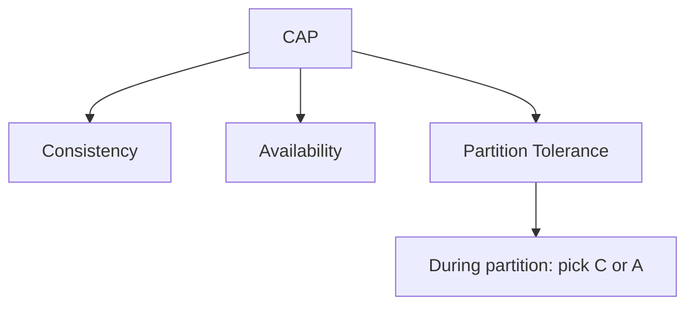

# CAP Theorem

## 1. Why This Exists — The Problem First

You deploy a database across three data centers for fault tolerance. A network cable gets cut between regions. Replica A has the latest balance for a user; replica B still shows the old balance. A read hits B and returns stale data — or you block all reads until replicas agree and your checkout page times out.

Distributed systems cannot pretend the network is perfect. CAP gives you vocabulary for the forced choice during that failure: do you keep serving responses, or do you guarantee every node agrees on the same data right now?

## 2. The Analogy — Make It Obvious

Imagine a chain of bank branches that normally sync balances with headquarters every few seconds.

One morning, the phone lines between regions go down — a **partition**. A customer walks into Branch East and asks to withdraw $500. Branch West still thinks they have $800; Branch East's ledger shows $300 after a deposit that never propagated.

The branch manager has two bad options:

- **Stay open (Availability):** Process the withdrawal using local books. Customers get served, but East and West may disagree on balances until the lines are fixed.
- **Close the doors (Consistency):** Refuse withdrawals until HQ confirms the true balance. Everyone sees the same number, but customers wait at the door.

The partition is not optional in a real distributed system — networks fail. CAP says: during a partition, you cannot fully have both "always open" and "everyone sees the same books at every instant."

## 3. How It Actually Works — The Full Explanation

CAP describes three properties of a distributed data store:

**Consistency (C)** — Every read returns the most recent write, or an error. All nodes agree on the same value at the same logical time. Not "eventually they'll match" — right now, for this read.

**Availability (A)** — Every request to a non-failing node gets a response (not an error), without guarantee that it reflects the latest write.

**Partition tolerance (P)** — The system keeps operating when messages between nodes are lost or delayed — i.e., when the network splits.

The theorem: in the presence of a network partition, you must choose between C and A. You cannot have all three simultaneously during the partition.

Why partition tolerance is non-negotiable: if your system spans more than one machine or rack, partitions will happen (cable cuts, switch failures, GC pauses, misconfigured security groups). Saying "we'll choose CA" only works for a single-node database — the moment you replicate for availability, P enters the picture.

What teams actually pick:

| Choice | During partition | Typical use |
|---|---|---|
| **CP** | Reject or block some operations to preserve consistency | Banking ledgers, inventory with strict invariants, ZooKeeper/etcd coordination |
| **AP** | Keep serving reads/writes; replicas may diverge temporarily | Social feeds, shopping carts, DNS, DynamoDB-style key-value |

The "CA" label (e.g. single-node PostgreSQL) means "no partition scenario" — useful, but not a distributed trade-off.



## 4. Real Code — See It Working

Two replicas during a partition — same user balance, different views:

```javascript
// Simplified replica state after network split
const replicaEast = { userId: 'u1', balance: 300 }; // saw deposit
const replicaWest = { userId: 'u1', balance: 800 }; // never got deposit

// AP-style read: always respond (may be stale)
function readAP(replica) {
  return { balance: replica.balance }; // 300 or 800 depending on which node
}

// CP-style read: refuse if quorum / leader can't confirm latest
function readCP(replica, hasQuorum) {
  if (!hasQuorum) {
    throw new Error('unavailable: cannot guarantee consistent read');
  }
  return { balance: replica.balance };
}
```

MongoDB replica set behavior (conceptual): with `writeConcern: 'majority'` and a partition isolates the primary, writes fail until a new majority is elected — **CP lean**. DynamoDB-style systems accept writes to reachable nodes and reconcile later — **AP lean**.

## 5. The Interview Questions — All of Them, Done Properly

**Q: What is the CAP theorem?**

In a distributed system, when a network partition occurs, you cannot simultaneously guarantee full consistency and full availability. Partition tolerance is required in any real distributed deployment, so the practical choice during a failure is CP or AP.

**Q: Can you have all three?**

Not during a partition. Outside partitions, many systems feel "fully consistent and available" — that's normal operation. CAP is about the failure mode, not the happy path.

**Q: Is PostgreSQL CA or CP?**

A single PostgreSQL instance is effectively CA — one node, no partition between replicas. A replicated PostgreSQL cluster with synchronous replication leans CP under partition (writes may block). Async replication leans toward AP for reads (replicas can lag).

**Q: What does MongoDB choose?**

Configurable, but default replica-set behavior with majority writes is CP-leaning: if the primary can't reach a majority, it steps down and writes fail rather than diverge. You can tune read preferences toward secondary reads (more AP for reads).

**Q: What does DynamoDB choose?**

AP-leaning: optimized for high availability and partition tolerance; consistency is tunable per operation (strongly consistent reads cost more latency).

**Q: How do you use CAP in a system design interview?**

Name the data that must never be wrong (money, inventory counts) → CP or strong consistency. Name the data where stale is acceptable (likes, feed ranking) → AP or eventual consistency. State the product risk explicitly.

## 6. The Traps — What Goes Wrong

**"We chose all three."** No. Clarify you optimize for normal operation but have a partition story.

**Confusing CAP Consistency with ACID Consistency.** CAP consistency is about all nodes seeing the same data at read time. ACID consistency is about transaction invariants. Related ideas, different layers.

**Treating CA systems as distributed.** Single-node MySQL is not making a distributed CAP trade-off.

**Ignoring which operations matter.** You might be CP for writes and AP for reads (common pattern). CAP is about the guarantees you claim during partition, not a single label for the whole product.

**Memorizing database labels without nuance.** "MongoDB is CP" is a shorthand; read/write concerns and election timeouts change behavior.

## 7. Compare With Related Concepts

**CAP vs PACELC.** CAP covers the partition case only. PACELC adds: even without a partition, you trade latency against consistency. Use CAP for failure-mode vocabulary; use PACELC for everyday read latency decisions.

**CAP vs Strong vs Eventual Consistency.** CAP is the umbrella trade-off; strong and eventual are specific consistency models you pick when you lean CP or AP.

**CAP vs Consensus (Raft/Paxos).** Consensus algorithms help you achieve consistency across replicas; CAP explains why you sometimes choose not to wait for consensus (availability).

## 8. 🧠 The Memory Hook — What Sticks

When the network breaks, you pick a side: keep answering (AP) or keep agreeing (CP). Partitions are guaranteed; pretending otherwise is how production incidents become postmortems.
