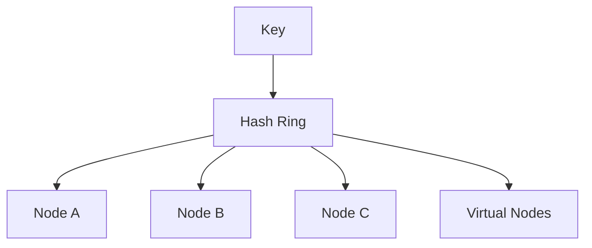

# Consistent Hashing

## 1. Why This Exists — The Problem First

You cache user sessions across four Redis servers using `hash(userId) % 4`. Server 3 dies; you replace it and scale to five servers. Now the modulus is `% 5` and **most keys map to a different server** — a cache stampede hits your database as nearly everything misses at once.

You need a routing scheme where adding or removing one node only moves keys that belonged to that node — not the entire keyspace. Consistent hashing does exactly that.

## 2. The Analogy — Make It Obvious

**Modulo hashing — numbered parking spots.** Cars assigned `licensePlate % 10` → spots 0–9. When you add an eleventh lot, the formula changes to `% 11` and almost every car gets a new spot overnight.

**Consistent hashing — a circular clock face.** Each server gets a position on the ring (e.g. at 2:00, 7:00, 11:00). Each key hashes to a time on the clock and walks clockwise to the first server. Add a new server at 4:00 — only keys between 2:00 and 4:00 (that used to belong to the 7:00 server) move. The rest stay put.

**Virtual nodes — multiple labels per server.** One physical machine gets several positions on the ring (e.g. "Server-A#1", "Server-A#2") so load spreads evenly; without them, uneven arc sizes create hotspots.

## 3. How It Actually Works — The Full Explanation

1. Hash both keys and nodes onto a fixed ring (0 to 2³²−1 or similar).
2. To locate a key's server: hash the key, walk clockwise on the ring to the first node hash ≥ key hash (wrap around if needed).
3. **Add a node:** only keys in the arc before the new node on the ring relocate to it — roughly **1/n** of keys for n nodes.
4. **Remove a node:** its keys transfer to the next clockwise node — again ~1/n redistribution.

**Virtual nodes (vnodes):** each physical server is mapped to many points on the ring (e.g. 100–200). Improves load balance when nodes have heterogeneous capacity — a bigger machine gets more virtual points.

**Where it's used:**
- Distributed caches: Memcached clients, Redis Cluster slot mapping (variant)
- CDNs and request routing
- Dynamo-style storage partitioning
- Load balancers and service meshes for sticky routing

**Replication:** often walk clockwise to find primary, next nodes for replicas.



**Key benefit:** adding one server rehashes ~**1/n** keys, not ~(n−1)/n as with naive modulo.

## 4. Real Code — See It Working

Minimal consistent hash ring in JavaScript:

```javascript
const crypto = require('crypto');

function hash(key) {
  const h = crypto.createHash('md5').update(key).digest();
  return h.readUInt32BE(0); // 0 .. 2^32-1
}

class ConsistentHashRing {
  constructor() {
    this.ring = new Map(); // hash -> nodeId
    this.sortedHashes = [];
  }

  addNode(nodeId, vnodes = 128) {
    for (let i = 0; i < vnodes; i++) {
      const h = hash(`${nodeId}#${i}`);
      this.ring.set(h, nodeId);
      this.sortedHashes.push(h);
    }
    this.sortedHashes.sort((a, b) => a - b);
  }

  removeNode(nodeId, vnodes = 128) {
    for (let i = 0; i < vnodes; i++) {
      const h = hash(`${nodeId}#${i}`);
      this.ring.delete(h);
    }
    this.sortedHashes = this.sortedHashes.filter((h) => this.ring.has(h));
  }

  getNode(key) {
    if (this.sortedHashes.length === 0) return null;
    const h = hash(key);
    // clockwise: first ring point >= h, else wrap
    for (const point of this.sortedHashes) {
      if (point >= h) return this.ring.get(point);
    }
    return this.ring.get(this.sortedHashes[0]);
  }
}

const ring = new ConsistentHashRing();
ring.addNode('cache-a');
ring.addNode('cache-b');
ring.addNode('cache-c');

console.log(ring.getNode('user:42')); // one of cache-a/b/c
ring.addNode('cache-d'); // only ~1/4 of keys should move to cache-d
```

Compare naive modulo — almost everything moves when n changes:

```javascript
function moduloRoute(key, n) {
  return `server-${hash(key) % n}`;
}
// n=4 -> n=5: most keys change server
```

## 5. The Interview Questions — All of Them, Done Properly

**Q: What problem does consistent hashing solve?**

Minimizes key redistribution when nodes join or leave a cluster. Naive `hash(key) % n` reshuffles nearly all keys when n changes; consistent hashing moves roughly 1/n.

**Q: How does the ring work?**

Keys and nodes hash to points on a circle. A key is owned by the first node encountered walking clockwise from the key's position.

**Q: What are virtual nodes?**

Multiple ring positions per physical server. Spreads load evenly and lets you weight bigger machines with more vnodes.

**Q: Where is it used?**

Memcached client libraries, DynamoDB-style partitioning, CDN routing, Redis Cluster (16,384 hash slots — consistent hashing concept with fixed slots), distributed caches.

**Q: What happens when a node fails?**

Its keys migrate to the next clockwise node (may cause temporary hotspot). Production systems add replication and gradual rebalancing.

**Q: How many keys move when adding one server?**

Approximately 1/n of all keys, where n is the new node count — the headline interview number.

## 6. The Traps — What Goes Wrong

**Skipping virtual nodes.** Without vnodes, a few machines can own huge arc segments — hotspots.

**Assuming perfect balance.** Hash functions and small clusters still skew; monitor and adjust vnode counts.

**Ignoring replication.** Primary placement is not enough — replicas need a policy too.

**Confusing with rendezvous hashing.** Alternative (highest random weight) — different algorithm, similar goal.

**Forgetting rebalancing time.** Keys move logically immediately; physical migration takes bandwidth and causes transient misses.

**Using weak hash for security.** Consistent hashing is for routing, not cryptography — MD5 as position hash is fine for placement, not for auth.

## 7. Compare With Related Concepts

**Consistent hashing vs modulo sharding.** Modulo is simple but catastrophic on topology change. Consistent hashing is the standard answer for dynamic caches.

**Consistent hashing vs range partitioning.** Range splits by key range (A–M, N–Z); consistent hashing splits by hash position. Ranges risk hotspots on popular prefixes; hashing spreads load.

**Consistent hashing vs Redis Cluster slots.** Redis uses 16,384 fixed slots mapped to nodes — slot migration on node add/remove, same minimal-movement idea with operational tooling built in.

**Consistent hashing vs load balancer round-robin.** Round-robin ignores key affinity; consistent hashing gives sticky key→node mapping for caches.

## 8. 🧠 The Memory Hook — What Sticks

Put keys and servers on a clock face; walk clockwise to find the owner. Add a server, only its slice of the clock changes hands — about one-nth of the keys, not the whole warehouse.
