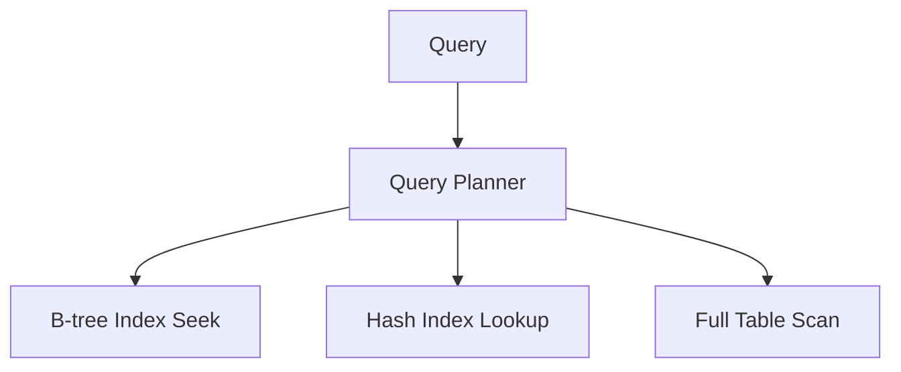

# Database Indexing

## 1. Why This Exists — The Problem First

Your `users` table has ten million rows. `SELECT * FROM users WHERE email = 'alice@example.com'` takes eight seconds because the database reads every row — full table scan. You add an index on `email` and the same query drops to two milliseconds.

Then writes slow down and disk usage jumps. Indexes are not free speed buttons; they're a trade: pay on write and storage to buy read performance. The skill is matching indexes to how queries actually run, not sprinkling them on every column.

## 2. The Analogy — Make It Obvious

A textbook without an index: find "photosynthesis" by reading every page front to back — O(n).

The index at the back lists terms in sorted order with page numbers. Look up "photosynthesis," jump to page 214 — O(log n) for a B-tree style index.

Composite index = index organized by last name, then first name. Looking up "Smith, Alice" is fast; looking up only "Alice" without the last name is like using a phone book sorted by surname to find everyone named Alice — the structure doesn't help.

## 3. How It Actually Works — The Full Explanation

An index is a separate data structure pointing to row locations (heap files, clustered keys, etc.). The query planner chooses: use index seek, index scan, or full table scan based on selectivity, statistics, and cost.

**B-tree index (default in PostgreSQL, MySQL InnoDB, most SQL DBs):**
- Keys stored in sorted tree structure
- Efficient for `=`, `<`, `>`, `BETWEEN`, `ORDER BY`, prefix `LIKE 'foo%'`
- Logarithmic lookup; supports range scans
- Default choice when unsure

**Hash index:**
- O(1) equality lookups on exact key
- No range queries — "all orders between Jan and Mar" can't use a hash index
- Niche: in-memory engines, some NoSQL secondary indexes

**Composite (multi-column) index:**
- Column order matters — leftmost prefix rule
- Index `(country, city, zip)` helps `WHERE country = 'US'`, `WHERE country = 'US' AND city = 'NYC'`, but not `WHERE city = 'NYC'` alone (usually)
- Put most selective or most filtered columns first, aligned with query patterns

**Costs:**
- Every `INSERT`/`UPDATE`/`DELETE` may update multiple index entries — write amplification
- Extra disk and memory
- Wrong indexes slow the planner or waste maintenance

**Covering index:** index includes all columns the query needs — avoids table lookup (index-only scan).



## 4. Real Code — See It Working

Create indexes matched to queries:

```sql
-- Equality lookup on email
CREATE INDEX idx_users_email ON users (email);

SELECT id, name FROM users WHERE email = 'alice@example.com';
```

Composite index for a common filter + sort:

```sql
-- Queries: WHERE status = 'open' ORDER BY created_at DESC
CREATE INDEX idx_orders_status_created ON orders (status, created_at DESC);

SELECT * FROM orders
WHERE status = 'open'
ORDER BY created_at DESC
LIMIT 20;
```

Leftmost prefix trap:

```sql
-- Index: (status, created_at)
-- Fast: WHERE status = 'open'
-- Fast: WHERE status = 'open' AND created_at > '2026-01-01'
-- Slow (often): WHERE created_at > '2026-01-01'  -- can't use leading column
```

Check what the planner does:

```sql
EXPLAIN ANALYZE
SELECT * FROM users WHERE email = 'alice@example.com';
-- Look for: Index Scan using idx_users_email vs Seq Scan
```

Over-indexing writes:

```sql
-- Five indexes on one table = five structures to update per INSERT
CREATE INDEX idx_a ON events (user_id);
CREATE INDEX idx_b ON events (type);
CREATE INDEX idx_c ON events (created_at);
-- ... only keep indexes that real queries use
```

## 5. The Interview Questions — All of Them, Done Properly

**Q: What is a database index?**

A secondary structure (usually B-tree) that lets the engine find rows without scanning the entire table. Trades faster reads for slower writes and more storage.

**Q: B-tree vs hash index?**

B-tree: sorted, supports equality and range, default for most SQL workloads. Hash: equality only, O(1) lookup, poor for ranges and sorting.

**Q: How do composite indexes work?**

Multiple columns in one index; order matters. Queries must use a leftmost prefix of the indexed columns to benefit (with exceptions like index-only scans on included columns).

**Q: When should you not add an index?**

Low-cardinality columns alone (e.g. boolean `is_active`), tables with heavy writes and rare reads, columns never in `WHERE`/`JOIN`/`ORDER BY`.

**Q: What is write amplification?**

Each index must be updated on row change. Ten indexes on a hot insert table means ten tree updates per row.

**Q: How do you design indexes for an interview schema?**

List the top 3–5 queries, write the `WHERE` and `ORDER BY`, propose composite indexes that match leftmost filters, mention covering columns if SELECT is narrow.

## 6. The Traps — What Goes Wrong

**Indexing every column.** Write path collapses; planner may pick wrong index.

**Wrong composite column order.** `(created_at, status)` when every query filters `status` first — index unused.

**Assuming OR uses indexes well.** `WHERE a = 1 OR b = 2` often degrades to scans unless both sides are indexed and merged.

**Leading wildcard LIKE.** `LIKE '%foo'` can't use a standard B-tree index; `LIKE 'foo%'` can.

**Ignoring statistics.** Stale stats → planner chooses seq scan on million-row table.

**Duplicate/redundant indexes.** `(a)` and `(a, b)` — the single-column one may be redundant if all `a` queries also filter `b`.

## 7. Compare With Related Concepts

**Index vs Partitioning.** Index speeds finding rows within storage; partitioning splits data across files/shards by key range. Complementary — partition pruning reduces data scanned; index finds rows within a partition.

**Index vs Cache (Redis).** Cache stores computed or hot rows in memory; index is inside the DB's storage engine. Cache invalidation is separate problem.

**Clustered vs non-clustered.** Clustered index defines row physical order (MySQL PK); non-clustered is separate structure with pointers (SQL Server model). Affects whether lookup is one hop or two.

**Index vs Full-text search.** B-tree helps exact/prefix; full-text inverted indexes help `MATCH AGAINST` / `to_tsvector` style search.

## 8. 🧠 The Memory Hook — What Sticks

Index for the query, not the table. B-tree for ranges and equality; hash for exact-only; composite order is the whole game. Every index is a tax on every write.
