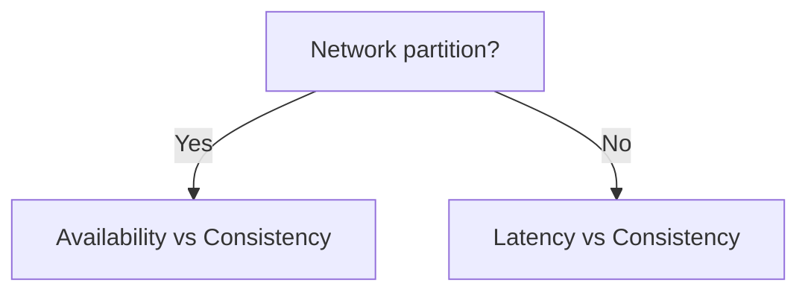

# PACELC Theorem

## 1. Why This Exists — The Problem First

CAP helps you argue about network partitions — maybe 0.01% of your system's lifetime. The other 99.99%, the network is fine, and interviewers still ask: "Why does this read feel instant but might be stale? Why does a strongly consistent read cost 50ms more?"

CAP is silent on that. PACELC fills the gap: distributed systems trade **latency vs consistency** even when nothing is on fire.

## 2. The Analogy — Make It Obvious

A restaurant has two modes.

**Emergency (partition):** The kitchen and front desk lose contact. Either the host keeps seating people with whatever menu scraps are at the bar (**Availability**), or the host stops seating until the kitchen confirms today's specials match the printed menu (**Consistency**). That's CAP — the **PA** or **ELC** when **P** happens.

**Normal Tuesday (no partition):** Phones work fine. Now the trade-off is different. The waiter can run to the kitchen and read the chef's whiteboard before answering "is the salmon still available?" (**Consistency**, slower). Or the waiter guesses from what they served five minutes ago (**Latency**, faster, might be wrong if the last salmon just sold).

PACELC: **If Partition → A or C; Else → Latency or Consistency.**

## 3. How It Actually Works — The Full Explanation

PACELC decomposes into two decisions:

**When there is a partition (P):**
- **PA** — favor availability; replicas may diverge
- **PC** — favor consistency; block or error until agreement

This is CAP restated: during P, pick A or C.

**When there is no partition (else — E):**
- **EL** — favor low latency; reads may come from a nearby replica without waiting for global agreement
- **EC** — favor consistency; reads wait for quorum, leader confirmation, or synchronous replication

Most large-scale consumer systems are **PA/EL** in PACELC terms: stay available during partitions, and in normal operation prefer fast reads over strict global consistency. Financial cores often aim for **PC/EC**.

| System (simplified) | Partition behavior | Normal operation |
|---|---|---|
| Dynamo-style KV | PA | EL (eventual reads default) |
| Cassandra (tunable) | PA | EL by default; EC if you use `QUORUM`/`ALL` |
| etcd / ZooKeeper | PC | EC |
| Spanner | PC | EC (with TrueTime bounds) |

The interview move: don't stop at "we're AP." Say "we're PA/EL — available under partition, low-latency reads in steady state, with optional strongly consistent reads on the payment path."



## 4. Real Code — See It Working

Same Dynamo-style API, different consistency/latency knobs — no partition assumed:

```javascript
// EL: read from nearest replica — fast, may be stale
async function getProductEL(productId) {
  return await dynamo.get({
    TableName: 'Products',
    Key: { id: productId },
    // default: eventually consistent read
  });
}

// EC: read waits for quorum of replicas — slower, linearizable for this key
async function getProductEC(productId) {
  return await dynamo.get({
    TableName: 'Products',
    Key: { id: productId },
    ConsistentRead: true,
  });
}
```

Cassandra-style (conceptual):

```sql
-- EL-ish: ONE replica responds
SELECT * FROM posts WHERE id = ?;

-- EC-ish: wait for quorum agreement
SELECT * FROM posts WHERE id = ? USING CONSISTENCY QUORUM;
```

The code path is the same API; the consistency level changes latency and correctness guarantees.

## 5. The Interview Questions — All of Them, Done Properly

**Q: What is PACELC?**

An extension of CAP. If **P**artition, choose **A**vailability or **C**onsistency. **E**lse (no partition), choose **L**atency or **C**onsistency. It models trade-offs in both failure and normal operation.

**Q: Why not just use CAP?**

CAP only describes the partition scenario. Most user-facing latency complaints happen when the network is healthy — PACELC names that everyday trade-off.

**Q: What do "most systems" choose?**

Often PA/EL: stay up during partitions, optimize for fast reads when healthy, accept eventual consistency on non-critical paths. Payment and inventory paths override with EC reads/writes.

**Q: How is this different from tunable consistency?**

PACELC is the framework; tunable consistency (per-query `QUORUM`, `ConsistentRead`, etc.) is how databases implement the EL vs EC choice.

**Q: Does PACELC replace CAP?**

No. It extends it. Use both: CAP for partition failure mode, PACELC for steady-state design.

## 6. The Traps — What Goes Wrong

**Stopping at "we're eventual consistency."** Interviewers want to know *when* you upgrade to strong reads and what latency cost you accept.

**Assuming EL means "no consistency ever."** You can mix: EL for feeds, EC for checkout — same system, different paths.

**Ignoring the PA vs PC partition story.** A system can be EL normally but still need a partition plan (fail writes vs accept conflicts).

**Treating PACELC as a rigid taxonomy.** Real databases are tunable; labels are shorthand for default behavior.

**Confusing latency with availability.** EL is about how fresh a read is when nodes are reachable; A is about whether you respond at all during a split.

## 7. Compare With Related Concepts

**PACELC vs CAP.** CAP = partition only. PACELC = partition + normal operation. Always mention both in a senior answer.

**PACELC vs Strong vs Eventual Consistency.** PACELC is the decision framework; strong/eventual are the consistency models you select on the EC vs EL branch.

**PACELC vs CQRS.** CQRS separates read and write models — often EL on reads, EC on writes — a pattern that implements PACELC-style trade-offs in architecture.

## 8. 🧠 The Memory Hook — What Sticks

Partitions: pick A or C. Peaceful days: pick fast or correct. Senior designs name both modes and which user journeys pay for the "correct" branch.
