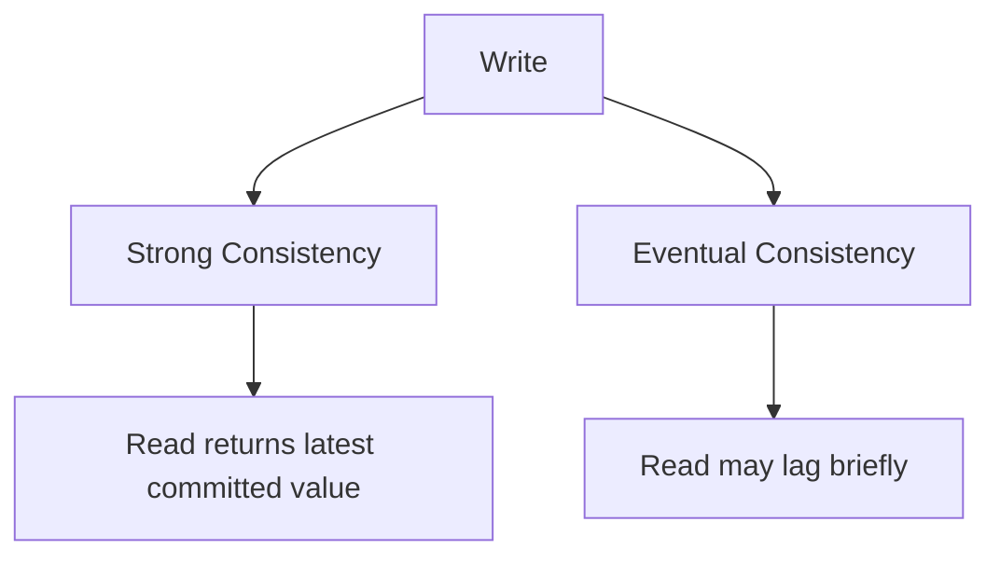

# Strong vs Eventual Consistency

## 1. Why This Exists — The Problem First

A user transfers $1,000, then immediately opens their balance screen — it still shows the old amount for two seconds. Or they post a tweet and refresh; the post is missing. They assume the app is broken.

Replicating data across machines buys scale and fault tolerance, but copies lag. **Strong consistency** makes every read see the latest write — at a cost. **Eventual consistency** lets replicas catch up in the background — faster, simpler, but briefly wrong. The product decision is: which wrongness can users tolerate, and for how long?

## 2. The Analogy — Make It Obvious

**Strong consistency — live TV delay buffer at zero.** Everyone watching sees the same frame at the same moment. If the studio updates the scoreboard, every screen updates before anyone can react. Expensive coordination; no one sees an old score.

**Eventual consistency — newspapers in different cities.** The story breaks in New York; Chicago's evening edition might still print the old headline. By tomorrow, all editions match. Readers in Chicago aren't lied to forever — just until the print run catches up.

Pick live sports scoring for strong. Pick "likes on a photo" for eventual.

## 3. How It Actually Works — The Full Explanation

**Strong consistency** (in practice: linearizable reads for a single object, or serializable transactions across objects) means:

- After a write completes, every subsequent read returns that value (or a later one).
- Reads may wait for replication, leader confirmation, or quorum.
- Higher latency, lower throughput, more coordination failures during partitions.

**Eventual consistency** means:

- If writes stop, all replicas will converge to the same value given enough time.
- Reads immediately after a write may return stale data from a lagging replica.
- Lower latency, higher availability, simpler happy-path code — but application logic must handle staleness.

Common patterns:

| Pattern | Behavior |
|---|---|
| Read-your-writes | User always sees their own updates (session stickiness or version tokens) |
| Monotonic reads | User never sees time go backward (v1 → v2 → v1) |
| Causal consistency | Causally related ops seen in order (weaker than strong, stronger than blind eventual) |

Where each fits:

- **Strong:** balances, inventory deduction, seat booking, unique username registration
- **Eventual:** social feeds, view counts, recommendations, CDN asset propagation



**Measuring "eventual":** Define an SLA — "99% of reads reflect writes within 500ms" — not just "eventually."

## 4. Real Code — See It Working

PostgreSQL — strong within a transaction:

```sql
BEGIN;
UPDATE accounts SET balance = balance - 100 WHERE id = 1;
UPDATE accounts SET balance = balance + 100 WHERE id = 2;
COMMIT;
-- Subsequent read in same session sees committed state
SELECT balance FROM accounts WHERE id = 1;
```

DynamoDB — eventual vs strong read on the same table:

```javascript
// Eventual: default, lower latency
await docClient.get({ TableName: 'Orders', Key: { id: 'o1' } });

// Strong: ConsistentRead waits for latest replicated value
await docClient.get({
  TableName: 'Orders',
  Key: { id: 'o1' },
  ConsistentRead: true,
});
```

Application-level read-your-writes without strong global consistency:

```javascript
// After write, attach version to session; reads include minVersion
async function createPost(userId, body) {
  const post = await db.insert({ userId, body });
  session.lastWriteVersion = post.version;
  return post;
}

async function listPosts(userId, session) {
  // Route to primary or pass version so replica rejects stale read
  return db.query(userId, { minVersion: session.lastWriteVersion });
}
```

## 5. The Interview Questions — All of Them, Done Properly

**Q: What is the difference between strong and eventual consistency?**

Strong: reads always reflect the latest completed write. Eventual: replicas may temporarily disagree; they converge when replication catches up. Trade-off is correctness freshness vs latency and availability.

**Q: When do you use strong consistency?**

Money, inventory, booking scarce resources, anything where stale reads cause double-spend or oversell. If the business cost of a stale read exceeds the cost of waiting, go strong.

**Q: When is eventual consistency acceptable?**

Social feeds, analytics, non-critical counters, search indexes — where brief staleness is invisible or harmless.

**Q: Can you mix both in one system?**

Yes — and you should. Checkout strong; product catalog eventual. Same database, different read APIs or routes.

**Q: What is read-your-writes?**

A session guarantee: after I write, I see my write, even if other users might not yet. Weaker than global strong consistency but fixes the "I posted and it's gone" UX bug.

**Q: How do you explain staleness to product?**

"We guarantee all users see the same count within 2 seconds" — a measurable window, not hand-waving "eventual."

## 6. The Traps — What Goes Wrong

**Using eventual for money.** Classic outage pattern: double withdrawal, negative inventory.

**Assuming strong is free.** Every strong read may cross regions or wait for quorum — latency and availability hit.

**Ignoring read-your-writes.** Global eventual + no session stickiness = users think their own writes failed.

**No defined convergence time.** "Eventual" without SLA is not a design.

**Confusing database consistency with UI caching.** A CDN or browser cache can make a strongly consistent backend look eventual.

**Over-using strong everywhere.** Kills scale; only pay for strong on paths that need it.

## 7. Compare With Related Concepts

**Strong vs Linearizability.** Linearizability is the formal model for "strong" single-object reads/writes. In interviews, they're often used interchangeably for one key.

**Eventual vs Causal.** Causal preserves order of related events (comment after post) without full global strong — middle ground for collaborative apps.

**Strong vs ACID.** ACID is transaction semantics on one database; strong consistency in CAP/PACELC is about replicas agreeing. A single-node ACID DB is strongly consistent by default.

**Eventual vs Cache invalidation.** Both deliver stale-then-fresh behavior; caches are often eventual by design with TTLs.

## 8. 🧠 The Memory Hook — What Sticks

Strong = everyone sees the latest write, now. Eventual = everyone sees the latest write, soon. Pick soon for likes; pick now for ledgers.
