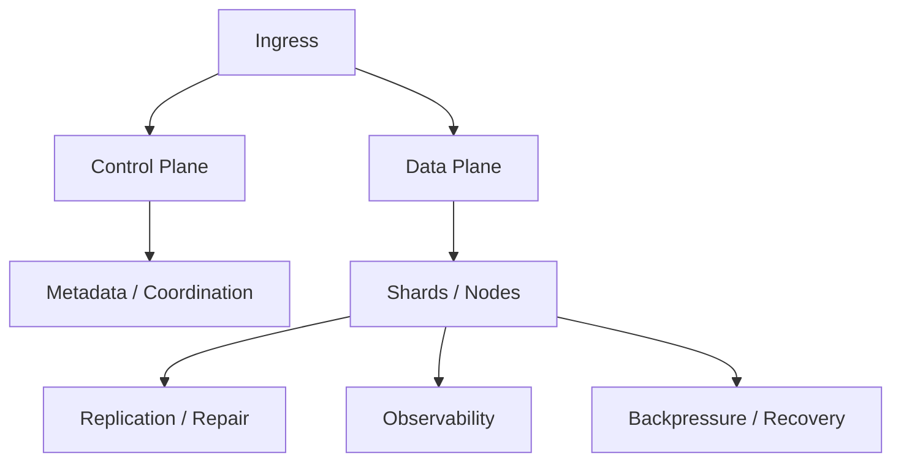

# Hard System Design Problems

[← System Design index](index.md)

These answers are about distributed systems, coordination, consistency, and reliability. Show the control plane, the data plane, and how the system recovers.

## Architecture snapshot



## Questions at a glance

| # | Question |
|---|---|
| 71 | [Design Distributed Transaction System](#71-design-distributed-transaction-system) |
| 72 | [Design Database Replication](#72-design-database-replication) |
| 73 | [Design Database Sharding Strategy](#73-design-database-sharding-strategy) |
| 74 | [Design Real-time Analytics Platform](#74-design-real-time-analytics-platform) |
| 75 | [Design High-Frequency Trading System](#75-design-high-frequency-trading-system) |
| 76 | [Design Ride-Sharing with Surge Pricing](#76-design-ride-sharing-with-surge-pricing) |
| 77 | [Design Video Conference (Zoom)](#77-design-video-conference-zoom) |
| 78 | [Design Real-time Multiplayer Game Server](#78-design-real-time-multiplayer-game-server) |
| 79 | [Design Smart Cache System](#79-design-smart-cache-system) |
| 80 | [Design Spam Detection System](#80-design-spam-detection-system) |
| 81 | [Design Recommendation Algorithm](#81-design-recommendation-algorithm) |
| 82 | [Design Email Delivery System](#82-design-email-delivery-system) |
| 83 | [Design Bug Tracking System (Jira)](#83-design-bug-tracking-system-jira) |
| 84 | [Design Document Management System](#84-design-document-management-system) |
| 85 | [Design A/B Testing Platform](#85-design-a-b-testing-platform) |
| 86 | [Design ML/AI Infrastructure](#86-design-ml-ai-infrastructure) |
| 87 | [Design Large Language Model (LLM) Inference API](#87-design-large-language-model-llm-inference-api) |
| 88 | [Design Microservices Architecture](#88-design-microservices-architecture) |
| 89 | [Design GraphQL API](#89-design-graphql-api) |
| 90 | [Design Multi-Tenancy System](#90-design-multi-tenancy-system) |
| 91 | [Design Data Warehouse](#91-design-data-warehouse) |
| 92 | [Design IoT System](#92-design-iot-system) |
| 93 | [Design Content Moderation System](#93-design-content-moderation-system) |
| 94 | [Design GDPR-Compliant System](#94-design-gdpr-compliant-system) |
| 95 | [Design Distributed Consensus for Blockchain](#95-design-distributed-consensus-for-blockchain) |

---

### 71. **Design Distributed Transaction System**

**Why interviewers ask** — Every microservice owns its own database; they want to hear how you keep cross-service updates correct without pretending one giant ACID database still exists.

**Core insight** — Distributed transactions are a consistency model choice: 2PC for rare all-or-nothing commits, sagas for long-running workflows, event sourcing when auditability matters more than immediate read consistency.

**Architecture**

```txt
Client → API → Transaction coordinator (or saga orchestrator)
            → Service A (local TX) → DB A
            → Service B (local TX) → DB B
            → Event log / outbox → async consumers + compensations
```

- **2PC path** — Coordinator sends prepare to all participants, waits for votes, then commit or abort; holds locks during prepare.
- **Saga path** — Chain of local transactions; each step publishes an event; failed step triggers compensating actions in reverse order.
- **Event sourcing** — Append-only event log is source of truth; projections rebuild state; replay enables recovery and audit.
- **Outbox pattern** — Write business row and outbound event in same local transaction; relay publishes to message bus.

**Key decisions** — 2PC blocks under coordinator or partition failure (not partition-tolerant); choreography sagas are simpler but harder to debug than orchestration; idempotency keys on every step prevent duplicate side effects.

**Scale & failure** — Coordinator is a single point of failure unless clustered; saga timeouts need explicit compensation; event replay must be deterministic; monitor in-doubt transactions and stuck compensations.

**Deep link** — [Strong vs eventual consistency](foundations/strong-vs-eventual-consistency.md) · [CAP theorem](foundations/cap-theorem.md)

**Memory hook** — 2PC locks everyone in a room; sagas undo step by step; events never forget.

---

### 72. **Design Database Replication**

**Why interviewers ask** — Reads outgrow a single primary; they want failover, read scaling, and an honest answer about replication lag.

**Core insight** — Replication trades write latency and consistency for availability and read throughput; the replication mode (sync vs async) defines what users see after a write.

**Architecture**

```txt
Writes → Primary → replication stream (binlog/WAL) → Replica pool
Reads  → load balancer → replicas (or primary for read-your-writes)
Failover → health checks → promote replica → update DNS/proxy target
```

- **Master-slave** — Single write primary; async replicas serve reads; simple but failover requires promotion and brief write outage.
- **Master-master** — Multi-primary writes; needs conflict resolution (last-write-wins, vector clocks, or app-level merge).
- **Leaderless** — Quorum reads and writes (Dynamo-style); tunable consistency via R + W > N.
- **Semi-sync** — Ack after one replica persists; balances durability with latency.

**Key decisions** — Async replication for scale (accept stale reads) vs sync for financial data; route critical reads to primary; use replication lag metrics to shed stale replica traffic.

**Scale & failure** — Read replicas scale horizontally; split-brain on failover needs fencing (STONITH) or consensus-based leader election; replica lag can serve minutes-old data after bursts.

**Deep link** — [Strong vs eventual consistency](foundations/strong-vs-eventual-consistency.md) · [PACELC theorem](foundations/pacelc-theorem.md)

**Memory hook** — Primary writes, replicas read — lag is a feature you must name, not hide.

---

### 73. **Design Database Sharding Strategy**

**Why interviewers ask** — A single database hits CPU, storage, or connection limits; the shard key you pick determines pain for the next five years.

**Core insight** — Sharding partitions data across independent databases; a good shard key spreads load evenly and keeps most queries single-shard.

**Architecture**

```txt
Client → Router / proxy → shard map (consistent hash or directory)
                      → Shard 1 | Shard 2 | Shard N
Cross-shard queries → scatter-gather coordinator → merge results
Resharding → dual-write → backfill → cutover → retire old mapping
```

- **Hash-based** — `hash(tenant_id) % N` for even spread; resharding needs consistent hashing or virtual buckets.
- **Range-based** — Time or ID ranges; great for time-series, risky for hot latest range.
- **Directory-based** — Lookup table maps key → shard; flexible but lookup service is critical path.
- **Geo-sharding** — Partition by region for latency and compliance.

**Key decisions** — Avoid cross-shard joins in the hot path; colocate related entities (user + their orders); plan resharding before you need it.

**Scale & failure** — Hot shards need sub-sharding or key splitting; scatter-gather is slow and fragile; data migration during resharding uses dual-write with verification.

**Deep link** — [Vertical vs horizontal partitioning](foundations/vertical-vs-horizontal-partitioning.md) · [Consistent hashing](foundations/consistent-hashing.md)

**Memory hook** — Shard key is forever — even distribution beats clever joins.

---

### 74. **Design Real-time Analytics Platform**

**Why interviewers ask** — Product teams want dashboards that update in seconds while the event firehose runs at millions of events per second.

**Core insight** — Separate the write path (append-only stream ingestion) from the read path (pre-aggregated OLAP slices); never scan raw events at query time.

**Architecture**

```txt
Producers → Kafka (partitioned by event type / tenant)
         → Stream processor (Flink / Spark Streaming) → rollups
         → OLAP store (ClickHouse / Druid) + materialized views
Query API → dashboards (Grafana) + ad-hoc SQL with time + dimension filters
```

- **Ingestion** — Schema registry, validation, dead-letter queue for bad events.
- **Stream processing** — Sliding/tumbling windows for counts, sums, percentiles; watermarks handle late events.
- **Storage** — Columnar format, partition by date, sort key matches common filters.
- **Serving** — Precompute hot metrics; cache dashboard queries in Redis.

**Key decisions** — At-least-once ingestion with idempotent aggregations; lambda architecture (batch + speed layer) only if you need historical correction; dimension cardinality limits what you pre-aggregate.

**Scale & failure** — Kafka partitions scale ingest; processor backpressure sheds or samples non-critical events; OLAP replicas for query QPS; late data triggers recomputation windows.

**Deep link** — [Analytics dashboard backend](../backend/system-design/design-an-analytics-dashboard-backend.md) · [Apache Kafka](foundations/apache-kafka.md)

**Memory hook** — Stream to aggregate, OLAP to query — never grep the firehose at read time.

---

### 75. **Design High-Frequency Trading System**

**Why interviewers ask** — Extreme latency sensitivity separates engineers who understand hardware, kernel bypass, and failure modes from those who only know CRUD APIs.

**Core insight** — Every microsecond is a hop removed; the matching engine runs colocated with the exchange feed on bare metal with deterministic, garbage-free code paths.

**Architecture**

```txt
Market data feed (multicast) → in-memory order book → matching engine
Client orders → gateway → risk checks → matching engine → exchange ACK
                     ↓
              audit log (append-only) + compliance reporting (async)
```

- **Matching engine** — Price-time priority queue in memory; lock-free or single-threaded per instrument to avoid contention.
- **Market data** — Kernel bypass (DPDK), FPGA for feed normalization on the most latency-critical paths.
- **Risk** — Pre-trade checks (position limits, credit) on the hot path; kill switch halts trading in microseconds.
- **Persistence** — Async write-ahead log; recovery replays from last checkpoint.

**Key decisions** — C++/Rust over managed runtimes to avoid GC pauses; colocation in exchange data center; separate hot path from reporting path entirely.

**Scale & failure** — Active-passive hot standby with shared-nothing failover; clock sync (PTP) for ordering; regulatory audit trail must survive crashes without blocking trades.

**Memory hook** — Colocate, eliminate hops, never GC on the hot path.

---

### 76. **Design Ride-Sharing with Surge Pricing**

**Why interviewers ask** — Combines real-time geospatial matching with dynamic pricing economics — supply, demand, and fairness in one system.

**Core insight** — Surge is a feedback loop: raise price where demand exceeds supply to pull more drivers in and throttle riders until the market rebalances.

**Architecture**

```txt
Rider app → trip request → geospatial index (drivers near pickup)
                        → matching service → assign driver
                        → pricing service (demand/supply ratio per geo-cell)
Driver app → location pings → cell aggregator → surge multiplier cache
```

- **Matching** — Geohash cells index available drivers; greedy or batch assignment minimizes wait time.
- **Surge calculation** — `multiplier = f(active_riders / available_drivers)` per cell; refresh every 30–60s; cap max multiplier.
- **Price prediction** — Historical patterns pre-warm surge for events (concerts, rain).
- **Trip state** — Locked fare at request time or live adjustment — pick one and document it.

**Key decisions** — Show surge before confirm to avoid bait-and-switch; smooth multipliers to prevent flicker; separate cells small enough to be fair, large enough for stable supply.

**Scale & failure** — Partition by city/region; stale driver locations cause bad matches — TTL evict idle pins; gaming (wait for surge drop) needs rate limits and minimum fare floors.

**Deep link** — [Ride booking backend](../backend/system-design/design-a-ride-booking-backend.md) · [Payment system](../backend/system-design/design-a-payment-system.md)

**Memory hook** — Cells count riders vs drivers — price is the valve that balances the market.

---

### 77. **Design Video Conference (Zoom)**

**Why interviewers ask** — Real-time media at 100+ participants tests UDP/WebRTC knowledge, SFU vs MCU tradeoffs, and graceful degradation under packet loss.

**Core insight** — Use an SFU (Selective Forwarding Unit) so each client uploads once and the server forwards streams — far cheaper than transcoding every stream in an MCU.

**Architecture**

```txt
Client ↔ Signaling server (WebSocket) — join, ICE, SDP exchange
Client ↔ SFU media server — WebRTC RTP streams (audio/video/screen)
       ↔ TURN relay (fallback when NAT blocks P2P)
Recording → subscribe all streams → encode → object storage
```

- **Signaling** — Room state, participant list, mute/kick, screen-share token.
- **SFU** — Forwards packets without decode; simulcast layers let server pick resolution per receiver bandwidth.
- **Adaptation** — TWCC/BWE lowers bitrate on congestion; prioritize audio over video.
- **Recording** — Server-side compositor or per-participant tracks stored separately.

**Key decisions** — SFU for large meetings, MCU only for heavy compositing/recording; regional media servers for latency; E2E encryption complicates server-side features.

**Scale & failure** — Horizontal SFU pools per region; participant migrates on node failure via ICE restart; TURN bandwidth is expensive — monitor and cap.

**Deep link** — [Real-time chat](../backend/system-design/design-a-real-time-chat-system.md)

**Memory hook** — Signaling sets up the room, SFU forwards streams — upload once, download many.

---

### 78. **Design Real-time Multiplayer Game Server**

**Why interviewers ask** — Sub-100ms latency, authoritative state, and cheat prevention — the server is the referee, not a message relay.

**Core insight** — Server simulates truth; clients predict locally and reconcile; send deltas, not full world state, prioritized by relevance.

**Architecture**

```txt
Matchmaker → assign players to regional game server instance
Game server (authoritative) ← client inputs (UDP)
                          → state deltas → clients (interest management)
Anti-cheat → server validates physics bounds, rate limits actions
Persistence → async checkpoint of match results / inventory
```

- **State sync** — Fixed tick rate (e.g. 20–60 Hz); serialize only changed entities in player's AOI (area of interest).
- **Latency hiding** — Client-side prediction for movement; server rewind for hit detection.
- **Matchmaking** — Skill-based queues (ELO/MMR), region preference, party grouping.
- **Scaling** — One process per match; lobby service routes players; shard by game mode.

**Key decisions** — UDP for gameplay, TCP for lobby/meta; server authoritative over client claims; compression and quantization for positions.

**Scale & failure** — Game server crash ends match with refund/compensation policy; replay logs for dispute resolution; bot backfill when queues are thin.

**Memory hook** — Server is truth, client predicts, deltas only — never broadcast the whole world.

---

### 79. **Design Smart Cache System**

**Why interviewers ask** — Caching is easy to add and hard to do well; they want eviction policy, prediction, and multi-tier reasoning beyond "put Redis in front."

**Core insight** — A smart cache predicts what will be hot next and places it before the miss — combining admission, eviction, and tier placement beats a single LRU.

**Architecture**

```txt
Client → L1 (in-process) → L2 (Redis cluster) → L3 (CDN / edge)
                      ↓ miss
                   Origin DB / API
Prediction service ← access logs + ML features → prefetch queue
```

- **Admission** — Bloom filter or ML classifier rejects one-hit wonders before they pollute cache.
- **Eviction** — ARC balances recency and frequency; LFU for skewed Zipf workloads.
- **Prefetch** — Lookahead on session patterns (cart → checkout items); async warm on publish events.
- **Invalidation** — TTL + pub/sub on writes; versioned keys for gradual rollout.

**Key decisions** — Multi-tier: hot in-process, shared in Redis, static at CDN; separate cache namespaces per tenant; stampede protection with request coalescing.

**Scale & failure** — Redis cluster shards by key; cache miss storm on expiry — use jittered TTLs; stale reads OK for many workloads — document max staleness.

**Deep link** — [Cache layer](../backend/system-design/design-a-cache-layer.md)

**Memory hook** — Admit wisely, evict smartly, prefetch before the miss hurts.

---

### 80. **Design Spam Detection System**

**Why interviewers ask** — High-volume classification at low latency with evolving adversaries — rules for speed, ML for nuance, humans for edge cases.

**Core insight** — Layered defense: cheap rules catch obvious spam instantly; ML scores the rest; feedback loop retrains on new attack patterns.

**Architecture**

```txt
Inbound message → rule engine (keywords, URL reputation, IP blocklist)
               → feature extractor → ML model (gradient boosting / transformer)
               → score + action (allow / quarantine / block)
User reports → label queue → retrain pipeline → shadow deploy → promote
```

- **Rule layer** — Regex, domain blacklists, SPF/DKIM failures for email; sub-millisecond.
- **ML layer** — Features: n-grams, sender history, link entropy; batch train, online scoring.
- **Real-time inference** — Model served on GPU pool or optimized CPU; cache scores per content hash.
- **Feedback** — User "mark spam" and false-positive appeals feed labeled dataset.

**Key decisions** — Fail open vs closed depends on product (email quarantine vs social post); ensemble rules + ML; separate models per channel (SMS vs email).

**Scale & failure** — Horizontal scoring workers; model version rollback on precision drop; adversarial attacks trigger emergency rule deploys before retrain completes.

**Memory hook** — Rules catch knives, ML catches knives dressed as spoons, users teach both.

---

### 81. **Design Recommendation Algorithm**

**Why interviewers ask** — Connects ML theory to production: cold start, sparsity, latency budgets, and avoiding filter bubbles at scale.

**Core insight** — No single algorithm wins; hybrid retrieval (candidate generation) plus ranking (precision) runs offline for heavy compute and online for milliseconds.

**Architecture**

```txt
Offline: interaction logs → matrix factorization / embeddings → candidate index
Online:  user context → retrieve top-K candidates → ranker (ML) → diversity re-rank → serve
         ↓
    impression / click logging → feedback loop
```

- **Collaborative filtering** — User-user or item-item similarity; matrix factorization for latent factors.
- **Content-based** — Item features + user profile vectors for cold-start items.
- **Two-tower retrieval** — Embed user and item separately; ANN search (FAISS) for fast candidate pull.
- **Ranking** — GBDT or neural ranker on rich features; exploration slot for new items.

**Key decisions** — Candidate set size vs latency; re-rank for diversity to break filter bubble; separate models per surface (home vs search).

**Scale & failure** — Precompute item embeddings; fallback to popular/trending on cold users; A/B test ranker changes with guardrail metrics (retention, not just CTR).

**Deep link** — [Recommendation backend](../backend/system-design/design-a-recommendation-backend.md)

**Memory hook** — Retrieve wide, rank narrow, explore a little — cold users get content, warm users get collab.

---

### 82. **Design Email Delivery System**

**Why interviewers ask** — Reliable async delivery at scale: queues, retries, bounces, reputation, and the difference between sending and receiving mail.

**Core insight** — Email is an async pipeline with unreliable downstream SMTP peers; partition queues by recipient domain, retry with backoff, and track reputation as a first-class metric.

**Architecture**

```txt
App → outbound API → per-domain queue → SMTP workers → recipient MX servers
                  → delivery status DB (sent / deferred / bounced)
Bounce handler ← webhook / IMAP ← parse hard vs soft bounce → suppression list
```

- **Queue** — Partition by recipient domain to isolate slow domains; priority lanes for transactional vs marketing.
- **SMTP client** — Connection pooling per domain; exponential backoff on 4xx; stop on 5xx hard bounce.
- **Deliverability** — SPF, DKIM, DMARC alignment; warm up new IPs gradually; monitor blocklist status.
- **Suppression** — Hard bounces and unsubscribes never re-sent; global suppression list checked before enqueue.

**Key decisions** — Separate transactional and marketing sending domains/IPs; idempotent send IDs prevent duplicates on retry; throttle per domain to avoid reputation damage.

**Scale & failure** — Workers scale per queue depth; greylisting causes temporary 4xx — retry, don't suppress; provider outage buffers in durable queue for hours.

**Deep link** — [Email delivery system](../backend/system-design/design-an-email-delivery-system.md)

**Memory hook** — Queue by domain, retry soft bounces, suppress hard ones — reputation is the real inbox key.

---

### 83. **Design Bug Tracking System (Jira)**

**Why interviewers ask** — Workflow-heavy CRUD with search, permissions, and notifications — tests whether you can model state machines and multi-tenant project isolation.

**Core insight** — Issues are stateful entities driven by configurable workflows; search and notifications are async paths off the write-critical issue service.

**Architecture**

```txt
Client → API gateway → Issue service (CRUD + workflow transitions)
                    → Project / permission service
                    → Search indexer (Elasticsearch) ← change events
                    → Notification service ← assignment / status change events
```

- **Issue model** — Type, status, assignee, priority, custom fields per project schema.
- **Workflow engine** — Valid transitions per issue type; guards (only assignee can close); post-functions (auto-notify).
- **Search** — Denormalized index updated via event stream; JQL-like query language.
- **Permissions** — Project-scoped roles; field-level visibility for sensitive custom fields.

**Key decisions** — Eventual consistency on search index is fine; optimistic locking on issue updates prevents lost edits; webhook delivery is at-least-once with retry.

**Scale & failure** — Shard issues by project; hot projects get dedicated index shards; notification storms batched and deduplicated; audit log append-only for compliance.

**Deep link** — [Background job system](../backend/system-design/design-a-background-job-system.md) · [Notification system](../backend/system-design/design-a-notification-system.md)

**Memory hook** — Issues flow through workflows, search lags slightly, notifications chase state changes.

---

### 84. **Design Document Management System**

**Why interviewers ask** — Files plus metadata, versioning, collaboration, and permissions — the Dropbox/Google Docs problem without hand-waving conflict resolution.

**Core insight** — Blob storage holds content; metadata DB holds versions, ACLs, and pointers; real-time collaboration needs operational transform or CRDT on a sync channel.

**Architecture**

```txt
Client → upload API → object storage (S3) + metadata DB (version graph)
       → sync service (WebSocket) → OT/CRDT merge → broadcast deltas
       → search indexer (full-text extract) ← async pipeline
Permission service → ACL check on every read/write
```

- **Versioning** — Immutable blobs per version; metadata points to head; diff storage for text docs.
- **Collaboration** — WebSocket room per document; server orders operations; periodic snapshot to storage.
- **Search** — Async text extraction (PDF, DOCX); index title + body + tags.
- **Sharing** — Link tokens with expiry; inherit folder ACLs; audit who accessed what.

**Key decisions** — Last-write-wins for simple files; OT/CRDT for concurrent edits; chunk large uploads with resumable multipart.

**Scale & failure** — CDN for download; storage tiering for old versions; conflict on offline edit resolved on reconnect with user prompt if OT cannot auto-merge.

**Deep link** — [File upload service](../backend/system-design/design-a-file-upload-service.md) · [Role-based access](../backend/system-design/design-a-role-based-access-system.md)

**Memory hook** — Blobs are immutable versions, metadata is the map, OT keeps editors from clobbering each other.

---

### 85. **Design A/B Testing Platform**

**Why interviewers ask** — Experiment assignment must be consistent, metrics trustworthy, and bad experiments stoppable — statistics meets production engineering.

**Core insight** — Deterministic bucketing assigns users to variants; event pipeline computes significance offline; guardrails catch harm before the p-value looks good.

**Architecture**

```txt
SDK / API → assignment service (hash(user_id + experiment_id) → variant)
         → exposure event → analytics pipeline
User actions → conversion events → metric aggregator
Analysis service → significance tests (t-test, chi-square) + confidence intervals
Dashboard → experiment status, early stopping, guardrail alerts
```

- **Assignment** — Sticky bucketing so user always sees same variant; stratify by segment if needed.
- **Metrics** — Primary (conversion) vs guardrail (latency, error rate, revenue); pre-register hypotheses.
- **Statistics** — Sequential testing or fixed horizon; correct for multiple comparisons; minimum sample size before peeking.
- **Lifecycle** — Draft → running → paused → concluded; feature flag integration for code deployment.

**Key decisions** — Hash bucketing over random per request; intent-to-treat analysis; kill switch on guardrail breach regardless of primary metric.

**Scale & failure** — Assignment is stateless and cacheable; event loss biases results — at-least-once with dedup keys; overlapping experiments need mutual exclusion groups.

**Deep link** — [Analytics dashboard backend](../backend/system-design/design-an-analytics-dashboard-backend.md)

**Memory hook** — Hash picks the variant, events prove the lift, guardrails kill the harm.

---

### 86. **Design ML/AI Infrastructure**

**Why interviewers ask** — ML is not just a model file; they want the full lifecycle: data pipelines, training at scale, serving with low latency, and monitoring for drift.

**Core insight** — Separate offline training (batch, GPU clusters, experiment tracking) from online inference (low-latency, versioned, monitored) with a feature store bridging both.

**Architecture**

```txt
Data sources → ingestion + validation → feature store (online + offline)
              → training pipeline (distributed GPUs) → model registry
Inference API → model server (batching, GPU pool) → A/B shadow traffic
Monitoring → drift detection, latency, prediction distribution alerts
```

- **Data pipeline** — Versioned datasets, schema validation, feature engineering jobs (Airflow/Spark).
- **Training** — Distributed training, hyperparameter search, experiment tracking (MLflow).
- **Serving** — Model versioning, canary deploy, batching for GPU utilization.
- **Monitoring** — Data drift, concept drift, performance degradation triggers retrain.

**Key decisions** — Feature store ensures train-serve consistency; batch inference for offline vs real-time API for online; model registry gates promotion.

**Scale & failure** — GPU autoscaling on queue depth; fallback to previous model version on error rate spike; training job checkpointing for spot instance preemption.

**Deep link** — [Recommendation backend](../backend/system-design/design-a-recommendation-backend.md)

**Memory hook** — Features feed training, registry gates serving, monitors trigger retrain.

---

### 87. **Design Large Language Model (LLM) Inference API**

**Why interviewers ask** — LLMs are expensive and slow; they want batching, caching, quantization, and cost-per-token reasoning.

**Core insight** — Throughput and latency pull in opposite directions; batch requests, cache prompt prefixes, and quantize models to fit more tokens per GPU second.

**Architecture**

```txt
Client → API gateway (rate limit, auth) → request queue
       → inference workers (GPU) with continuous batching
       → KV cache per active sequence
Optional: prompt embedding cache, speculative decoding, model parallel across GPUs
```

- **Batching** — Dynamic batching merges concurrent requests; increases GPU utilization at cost of tail latency.
- **Caching** — Cache prompt prefix KV states for repeated system prompts; semantic cache for near-duplicate queries.
- **Quantization** — INT8/FP8 reduces memory, increases tokens/sec; quality tradeoff per use case.
- **Scaling** — Model parallel splits layers across GPUs; data parallel for independent prompts.

**Key decisions** — Streaming responses for UX; max context window enforcement; separate tiers for latency-sensitive vs batch workloads.

**Scale & failure** — Queue backpressure with 429 when saturated; preemption policy for long contexts; multi-region replicas for availability.

**Memory hook** — Batch for throughput, cache prefixes, quantize for capacity — tokens per dollar is the metric.

---

### 88. **Design Microservices Architecture**

**Why interviewers ask** — Tests service boundaries, discovery, resilience patterns, and observability — not just "split the monolith."

**Core insight** — Microservices buy independent deployability at the cost of distributed complexity; invest in API gateway, service mesh observability, and failure isolation from day one.

**Architecture**

```txt
Client → API gateway (auth, rate limit, routing)
      → Service A ↔ Service B (sync REST/gRPC)
      → Message bus (async events)
Service registry (Consul/Eureka) + config server
Observability: traces (Jaeger) + metrics (Prometheus) + logs (ELK)
```

- **Service registry** — Health-checked instances; client-side or server-side load balancing.
- **API gateway** — Single entry, TLS termination, request routing, cross-cutting auth.
- **Resilience** — Circuit breakers, retries with jitter, bulkheads per dependency.
- **Data** — Database per service; sagas for cross-service transactions.

**Key decisions** — Sync for query paths needing immediate answer; async events for decoupling; avoid distributed monolith (tight coupling).

**Scale & failure** — Circuit breaker opens on dependency failure; bulkhead limits blast radius; chaos testing validates failover paths.

**Deep link** — [Microservices vs monolith](foundations/microservices-vs-monolith.md) · [API gateway vs load balancer](foundations/api-gateway-vs-load-balancer.md)

**Memory hook** — Gateway in front, registry underneath, breakers around every call.

---

### 89. **Design GraphQL API**

**Why interviewers ask** — Clients want flexible queries; you must prevent malicious deep queries, solve N+1 fetches, and explain caching tradeoffs vs REST.

**Core insight** — GraphQL shifts complexity to the server: one endpoint, client-specified shape — protect with query cost analysis and DataLoader batching.

**Architecture**

```txt
Client → GraphQL gateway → resolvers per type/field
                        → DataLoader (batch + cache per request)
                        → backing REST/DB services
Query validator → depth limit, complexity score, timeout
```

- **Schema** — Types, queries, mutations; federation for multi-team ownership.
- **N+1 fix** — DataLoader batches field resolves into single DB/API call per tick.
- **Complexity limits** — Reject queries exceeding depth/cost budget before execution.
- **Caching** — HTTP caching harder; use persisted queries or CDN for public read-heavy fields.

**Key decisions** — GraphQL for mobile/clients with varied data needs; REST for simple CRUD and cache-friendly public APIs; subscriptions over WebSocket for live data.

**Scale & failure** — Query timeout kills runaway resolvers; partial errors in GraphQL response; rate limit per API key.

**Deep link** — [Scalable REST API](../backend/system-design/design-a-scalable-rest-api.md)

**Memory hook** — Client picks the shape, server batches the fetches, complexity limits guard the door.

---

### 90. **Design Multi-Tenancy System**

**Why interviewers ask** — SaaS economics require shared infrastructure with tenant isolation — data, performance, and configuration.

**Core insight** — Isolation level is a spectrum: DB-per-tenant (max isolation, max cost) to shared schema with row-level security (max efficiency, noisy-neighbor risk).

**Architecture**

```txt
Request → tenant resolver (subdomain / JWT claim) → tenant context
        → app layer enforces tenant_id on every query
        → shared DB (RLS) | schema-per-tenant | DB-per-tenant
Resource quotas → per-tenant rate limits, compute caps
```

- **Shared schema + RLS** — `tenant_id` column on every table; DB policies enforce isolation.
- **Schema per tenant** — Migrations per tenant; moderate isolation.
- **DB per tenant** — Enterprise tier; full isolation, ops overhead scales with tenants.
- **Noisy neighbor** — Per-tenant CPU/memory quotas; dedicated pool for premium tier.

**Key decisions** — Start shared, offer dedicated for enterprise; tenant ID in every log line and trace span; never trust client-supplied tenant ID without auth.

**Scale & failure** — Connection pooling per tenant tier; shard large tenants to dedicated resources; tenant-specific backup/restore for compliance.

**Deep link** — [Multi-tenant SaaS backend](../backend/system-design/design-a-multi-tenant-saas-backend.md)

**Memory hook** — Tenant ID on everything — isolation is a column, a schema, or a whole database.

---

### 91. **Design Data Warehouse**

**Why interviewers ask** — OLAP at petabyte scale: batch + streaming ingest, columnar storage, and cost-aware query planning.

**Core insight** — Warehouse optimizes for analytical scans, not OLTP row lookups; ETL/ELT transforms raw events into dimensional models analysts can query.

**Architecture**

```txt
Sources → CDC / batch extract → staging (S3) → ELT (dbt/Spark)
         → columnar warehouse (Snowflake/BigQuery/Redshift)
         → BI tools (Tableau/Looker) + ad-hoc SQL
Query engine → partition pruning, materialized views, result cache
```

- **Ingestion** — Batch (nightly Airflow) + streaming (Kafka → Flink) for near-real-time marts.
- **Modeling** — Star/snowflake schema; fact tables for events, dimension tables for entities.
- **Storage** — Columnar, compressed, partitioned by date; sort keys match filter columns.
- **Query optimization** — MPP execution, spill to disk, workload management queues.

**Key decisions** — ELT (load raw, transform in warehouse) vs ETL; separate dev/prod warehouses; cost alerts on scan volume.

**Scale & failure** — Auto-suspend idle clusters; materialized views for hot dashboards; backfill jobs idempotent for reprocessing.

**Deep link** — [Analytics dashboard backend](../backend/system-design/design-an-analytics-dashboard-backend.md)

**Memory hook** — Land raw, model stars, scan columns — partitions are your best index.

---

### 92. **Design IoT System**

**Why interviewers ask** — Millions of constrained devices, bursty telemetry, edge processing, and time-series storage at scale.

**Core insight** — Devices are unreliable and bandwidth-poor; push intelligence to the edge, ingest via lightweight protocols, store time-series efficiently.

**Architecture**

```txt
Devices → MQTT broker cluster → stream processor → time-series DB (Influx/Timescale)
       → edge gateway (local rules, aggregation, offline buffer)
Device registry → provisioning, firmware OTA, certificate rotation
Alerting → threshold rules + anomaly detection on telemetry streams
```

- **Protocols** — MQTT for pub/sub telemetry; CoAP for constrained devices; LoRaWAN for long-range low-power.
- **Ingestion** — Partition topics by device type/region; backpressure when downstream slow.
- **Edge** — Filter, aggregate, and act locally; sync to cloud when connected.
- **Time-series DB** — Retention policies, downsampling old data, tag-based queries.

**Key decisions** — At-least-once delivery with device-side dedup; certificate-based device identity; OTA updates staged by cohort.

**Scale & failure** — MQTT broker clustering; device offline buffer with cap; command queue with TTL for actuation.

**Memory hook** — MQTT in, time-series down, edge thinks before the cloud does.

---

### 93. **Design Content Moderation System**

**Why interviewers ask** — Billions of posts, harmful content, false positives, and human reviewer burnout — automated + human + community layers.

**Core insight** — Tiered moderation: fast automated filters catch obvious violations; edge cases go to human review queues; community reports feed the training loop.

**Architecture**

```txt
Upload → hash check (CSAM/perceptual) → ML classifiers (image, text, video frames)
      → score → auto-action (block / label / queue for review)
Human review UI → priority queue by severity × virality
Appeals → re-review → label correction → model retrain
```

- **Automated** — Perceptual hashing for known-bad content; NLP for hate speech; video frame sampling.
- **Human review** — SLA by severity; reviewer wellness (rotation, blur tools); inter-rater agreement tracking.
- **Community** — User reports weighted by reporter trust score; voting on borderline content.
- **Feedback** — False positive appeals improve model; shadow mode before rule deploy.

**Key decisions** — Fail closed for CSAM (hash match); fail open vs closed for spam varies; regional policy differences need geo-specific models.

**Scale & failure** — Pre-filter reduces human queue volume 90%+; viral content fast-tracked to front of queue; model rollback on precision drop.

**Memory hook** — Machines filter the obvious, humans judge the edge, appeals teach the machine.

---

### 94. **Design GDPR-Compliant System**

**Why interviewers ask** — Privacy by design: right to erasure, portability, consent, and audit trails — not a legal checklist bolted on later.

**Core insight** — Personal data must be discoverable, deletable, and exportable across all stores; design data maps and deletion cascades before you accumulate years of logs.

**Architecture**

```txt
User request → identity verification → data map lookup (all PII locations)
            → erasure workflow (hard delete + anonymize analytics)
            → export job (JSON bundle of user data)
Consent service → granular opt-in/out → propagates to marketing, analytics
Audit log → immutable record of access, deletion, consent changes
```

- **Right to erasure** — Soft delete with grace period, then hard delete; anonymize irreplaceable aggregates.
- **Portability** — Machine-readable export within SLA (e.g. 30 days).
- **Consent** — Versioned consent records; block processing without valid consent.
- **Privacy by design** — Minimize collection, encrypt at rest, pseudonymize analytics IDs.

**Key decisions** — Data inventory (what, where, why); cascade delete across DB, S3, backups, search index; legal hold overrides erasure.

**Scale & failure** — Async deletion jobs for large accounts; verify deletion with audit scan; backup retention policy aligned with erasure requests.

**Deep link** — [Audit log system](../backend/system-design/design-an-audit-log-system.md)

**Memory hook** — Map every copy, delete them all, prove you did — consent gates the rest.

---

### 95. **Design Distributed Consensus for Blockchain**

**Why interviewers ask** — Byzantine fault tolerance, fork choice, and the energy/latency tradeoffs between PoW, PoS, and BFT — consensus as a product decision.

**Core insight** — Consensus defines who gets to append the next block and what "final" means; mechanism choice trades decentralization, throughput, and energy.

**Architecture**

```txt
Transactions → mempool → block proposer (miner/validator)
                      → consensus round (PoW puzzle / PoS vote / BFT commit)
                      → append to chain → propagate to peers
Nodes → full (full history) | light (headers + Merkle proofs)
```

- **Proof of Work** — Miners compete on hash puzzle; highest chain wins; energy-intensive, proven decentralization.
- **Proof of Stake** — Validators stake collateral; slashing for dishonesty; faster finality, lower energy.
- **BFT (PBFT/Tendermint)** — Permissioned validators; 2f+1 honest nodes; low latency, limited decentralization.
- **Fork choice** — Longest chain (PoW) vs finalized checkpoints (PoS Casper FFG).

**Key decisions** — Permissionless vs permissioned; finality time vs throughput; on-chain vs off-chain (L2) scaling.

**Scale & failure** — 51% attack on PoW; nothing-at-stake mitigated by slashing in PoS; network partition → chain halt or fork until reunification.

**Deep link** — [CAP theorem](foundations/cap-theorem.md) · [Strong vs eventual consistency](foundations/strong-vs-eventual-consistency.md)

**Memory hook** — PoW burns energy for trust, PoS stakes money, BFT votes fast in small groups.
