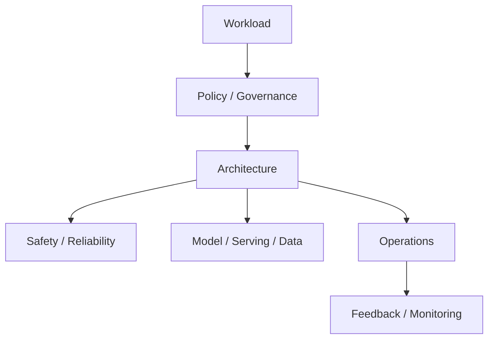

# Advanced & Specialist Areas

[← System Design index](index.md)

These designs combine platform thinking, governance, and production reliability. Frame them around constraints first, then architecture, then operations.

## Architecture snapshot



## Questions at a glance

| # | Question |
|---|---|
| 96 | [Design High-Availability Disaster Recovery](#96-design-high-availability-disaster-recovery) |
| 97 | [Design Financial System with Consistency Guarantees](#97-design-financial-system-with-consistency-guarantees) |
| 98 | [Design Real-time Bidding (Ad Tech)](#98-design-real-time-bidding-ad-tech) |
| 99 | [Design Circuit Breaker Pattern](#99-design-circuit-breaker-pattern) |
| 100 | [Design Monitoring & Alerting System](#100-design-monitoring-alerting-system) |

---

### 96. **Design High-Availability Disaster Recovery**

**Why interviewers ask** — Region outages, bad deploys, and ransomware are inevitable. Interviewers test whether you translate business SLAs into concrete RPO/RTO targets and pick backup, replication, or multi-region strategies that actually meet them.

**Core insight** — DR is not "more backups" — define how much data loss (RPO) and downtime (RTO) the business accepts, then build standby capacity and automated failover to hit those numbers; untested plans are fiction.

**Architecture**

```txt
Primary region (active) → sync/async replication → standby (warm/hot)
Periodic snapshots → immutable object storage (cross-region, encrypted)
Health monitor → failover controller → DNS/global LB shift → promote replica
Quarterly game days: restore drill → measure actual RPO/RTO achieved
```

- **RPO** — Max acceptable data loss window; drives backup frequency and replication mode (sync ≈ zero loss, async = bounded lag).
- **RTO** — Max acceptable outage; drives hot standby vs cold restore (minutes vs hours).
- **Backup & recovery** — Full/incremental snapshots to durable storage; versioned; restore tested on schedule.
- **Replication** — Streaming replica in same or cross-region; automatic failover with leader election and fencing.
- **Multi-region** — Active-active or active-passive; global traffic routing; survive full region failure.

**Key decisions** — Sync replication for tight RPO on money data; async for cost/latency tradeoff; hot standby for low RTO; backups alone only when hours of downtime are acceptable.

**Scale & failure** — Split-brain during failover, replication lag exceeding RPO, and restore drills that fail in production break DR first. Mitigation: quorum fencing, lag alerts with write freeze, mandatory game days.

**Memory hook** — RPO is how much history you can lose; RTO is how long the lights stay off; rehearsals prove the plan is real.

---

### 97. **Design Financial System with Consistency Guarantees**

**Why interviewers ask** — Money must never be wrong under concurrency, retries, or partial failures. Interviewers test ACID ledger design, double-entry bookkeeping, immutable audit trails, and when you sacrifice availability for consistency.

**Core insight** — Ledger is immutable source of truth; every transfer is double-entry balanced; external gateway calls are idempotent and reconciled async — correctness always beats speed.

**Architecture**

```txt
Client → Payment API (idempotency key) → ledger DB (ACID, serializable)
                                      → fraud scoring (velocity + rules + ML)
                                      → gateway adapter (async webhook confirm)
                                      → reconciliation batch + immutable audit log
```

- **ACID transactions** — Balance updates in one txn; rollback on any failure; isolation prevents double-spend races.
- **Double-entry** — Every debit paired with credit; account sums invariant always holds.
- **Audit trail** — Append-only journal; who/when/what; regulatory export; never mutate balance without a matching entry.
- **Fraud detection** — Pre-authorization scoring; velocity limits; block before capture not after.
- **Distributed money** — Saga or outbox over 2PC across services; local txn plus async completion and nightly reconciliation.

**Key decisions** — Strong consistency on ledger shard; idempotency keys on all writes; pessimistic lock or serializable isolation on balance rows; eventual reads only for non-money views with explicit staleness bounds.

**Scale & failure** — Hot-account lock contention, duplicate webhook delivery, and gateway timeout with unknown state break money flows first. Mitigation: shard ledger by account, webhook dedup table, pending state plus reconciliation jobs.

**Deep link** — [Payment system](../backend/system-design/design-a-payment-system.md)

**Memory hook** — Ledger never lies; idempotency key at the door; reconcile what you cannot confirm synchronously.

---

### 98. **Design Real-time Bidding (Ad Tech)**

**Why interviewers ask** — Ad auctions must close in under 100ms across millions of QPS with complex targeting — the latency budget is the product.

**Core insight** — Page load triggers parallel bid requests to SSPs/DSPs; highest eligible bid wins before a hard timeout; the hot path uses precomputed profiles and CDN creatives, not synchronous DB joins.

**Architecture**

```txt
Publisher page → ad tag → SSP auction server
                        → parallel bid fanout to N DSPs (<80ms wall clock)
                        → each DSP: profile lookup (Redis) + targeting + bid price
                        → second-price auction → winner creative from CDN
                        → impression pixel + async billing stream (Kafka)
```

- **Bid flow** — OpenRTB-style request with user context; parallel HTTP to bidders; timeout returns house ad or no-bid.
- **Latency** — Profile and segment data in memory; pre-approved creatives on CDN; zero heavy DB on auction path.
- **Targeting** — Geo, device, interests compiled offline into key-value profiles; boolean filter in auction worker.
- **Throughput** — Horizontally scaled auction tier; connection pools to bidders; drop late bids past deadline.

**Key decisions** — Separate real-time auction from campaign management UI; frequency caps in Redis; fraud and billing async; second-price auction reduces bid-shading games.

**Scale & failure** — Slow DSP poisoning auction latency, profile store outage stripping targeting, and timeout storms causing blank ads break revenue first. Mitigation: per-DSP circuit breakers, cached fallback segments, strict auction wall clock.

**Deep link** — [Advertising platform](medium.md#59-design-advertising-platform)

**Memory hook** — Fan out bids in parallel, cut at the deadline, bill impressions after the ad is already on screen.

---

### 99. **Design Circuit Breaker Pattern**

**Why interviewers ask** — Cascading failure is the default when dependencies slow down. Interviewers want the closed/open/half-open state machine and how you stop retry storms from amplifying outages.

**Core insight** — Track failure rate per dependency; when threshold is exceeded, fail fast locally instead of waiting on a sick service; half-open probes recovery before restoring full traffic.

**Architecture**

```txt
Caller service → circuit breaker wrapper → downstream dependency
                      ↓ rolling failure counter
              Closed (pass) → Open (fail fast) → Half-open (limited probes)
                      ↓ open state
              Fallback (cache / default / degraded response)
```

- **States** — Closed: normal calls pass; Open: immediate failure or fallback after threshold; Half-open: limited probes test recovery.
- **Failure threshold** — Error rate or consecutive failures over a window (e.g. 50% in 10s or 5 consecutive timeouts).
- **Open timeout** — Duration before half-open trial (e.g. 30s) — prevents immediate retry storm on flapping dependency.
- **Success threshold** — Consecutive successes in half-open to close (e.g. 3 of 5 probes succeed).
- **Isolation** — Per-dependency breaker plus bulkhead — one slow endpoint must not exhaust all threads.

**Key decisions** — Breaker complements bounded retries, not infinite loops; fallbacks must be safe (stale cache OK for recommendations, not for auth); emit metrics on every state transition.

**Scale & failure** — Mis-tuned breaker blocking healthy traffic, half-open stampede when many instances probe simultaneously, and missing fallback causing user-visible errors break resilience first. Mitigation: per-endpoint tuning, jittered half-open entry, graceful degradation by design.

**Memory hook** — Breaker is a fuse — too many failures trip it open; half-open is one careful finger on the switch before full power returns.

---

### 100. **Design Monitoring & Alerting System**

**Why interviewers ask** — Operators need signal not noise at scale. Interviewers expect ingestion pipelines, cardinality control, alert routing, and on-call workflows that move from metric to action.

**Core insight** — Separate collection, storage, query, visualization, and alerting; treat retention and label cardinality as first-class inputs; alerts tie to runbooks and symptoms (SLO breach), not raw CPU spikes.

**Architecture**

```txt
Apps/infra → exporters (metrics / logs / traces) → ingestion gateway
                                            → TSDB (Prometheus / Influx)
                                            → recording rules / aggregations
         Grafana dashboards ← query API
         Alertmanager ← rule engine (threshold + anomaly)
                      → on-call routing (PagerDuty) → escalation → incident tracker
```

- **Metrics collection** — Pull scrapes or push gateway; standardized labels (service, env); RED/USE framework per service.
- **Storage** — Time-series append-only blocks; retention tiers (raw 15d, downsampled 1y); federation for multi-cluster views.
- **Alerting** — Threshold (error rate > 1%) and anomaly detection; alert grouping to reduce pages; severity and ownership labels.
- **Visualization** — Dashboards per SLO; drill alert → metric → trace → log via shared correlation IDs.
- **On-call** — Rotation schedules, escalation policies, incident lifecycle (ack → resolve → postmortem).

**Key decisions** — Pull vs push collection tradeoffs; cardinality limits (never `user_id` as a metric label); alert on user-visible symptoms where possible, not infrastructure noise.

**Scale & failure** — Cardinality explosion, alert fatigue from noisy rules, and ingestion lag hiding incidents break observability first. Mitigation: label allowlists, SLO burn-rate alerts, HA ingest with remote-write buffering.

**Deep link** — [Design an analytics dashboard backend](../backend/system-design/design-an-analytics-dashboard-backend.md) · [Real-time metrics system](easy.md#28-design-real-time-metrics-system)

**Memory hook** — Collect cheaply, label lightly, alert on user pain, route to a human with a runbook.
