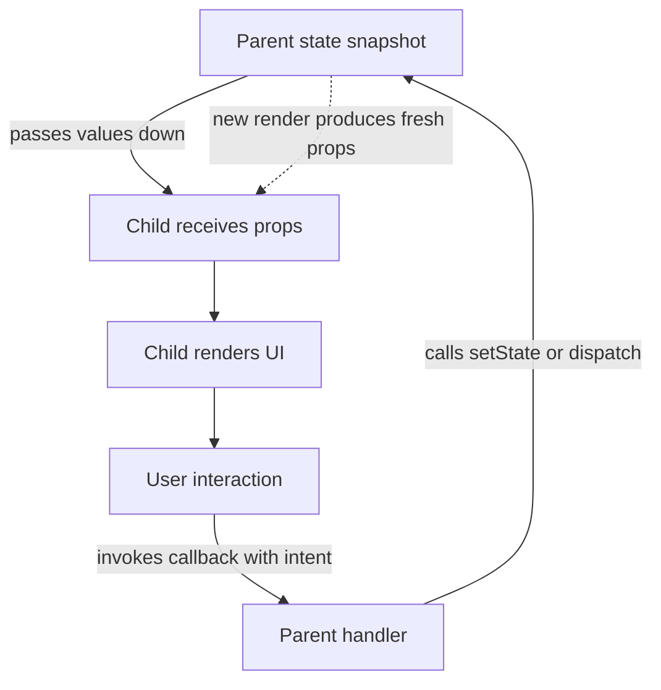

# One-Way Data Flow (Unidirectional Data Binding)

## 1. Why This Exists — The Problem First

Imagine a checkout page where the permission badge, cart total, and shipping form all read the same user object. If any component can change that object directly, a permission can flip while the user is paying, a total can become stale, and the next render may overwrite a value that another component just changed. Debugging becomes a search through every component that might have touched the shared reference.

Older two-way binding systems made this easy to create: a model changed the view, the view changed the model, and watchers reacted to both. In a large graph of watchers, one update could trigger another component, which changed the first model again, producing cycles or an error such as AngularJS's `10 $digest() iterations reached. Aborting!`.

React's answer is an ownership rule: a state value has an owner, the owner renders it downward, and other components request changes through explicit events. That gives each update a visible path instead of a web of hidden writes. The rule does not prevent all bugs, but it makes the source of a state transition inspectable.

## 2. The Analogy — Make It Obvious

Think of a restaurant with a head chef and several line cooks. The head chef owns the master order board. Each station receives a printed prep slip, cooks from that slip, and plates what it was asked to make. A cook does not walk over and scribble on the master board or change another station's slip.

The master order board is the state owned by the parent component. A printed slip is a prop: a read-only input derived from the current state. Cooking and plating are rendering: the child turns its inputs into UI. When the grill station needs a change, it uses the intercom to tell the head chef, “86 ribeye.” That intercom is a callback prop. The chef validates the request, updates the board, and prints fresh slips. The new state then flows down again.

The mapping matters in both directions. The slip does not update the board by itself, and the intercom does not change the board by magic; the owner decides how to handle the request. Likewise, a React child can call a callback, but only the state owner can decide whether and how to call its setter.

## 3. How It Actually Works — The Full Explanation

The loop is easiest to follow as: **state snapshot → props → user event → callback request → owner update → new render**.



**State and ownership.** A component that calls `useState` or `useReducer` owns that local state. During one render, the component sees a snapshot of the state. It passes values, derived values, and functions to children through props. The child receives those props as inputs; it should not treat them as a writable shared store. JavaScript objects are still references, so “read-only props” is an architectural contract, not a magical deep freeze. React does not generally freeze every prop object for you.

**The request travels through a callback.** A child does not reach into a parent to call the parent's setter. The parent gives the child a function such as `onRemove` or `onQuantityChange`. When the user acts, the child invokes that function with an intent or payload. The function was created in the parent's render, so it closes over the parent's update logic. The call feels like communication upward, but technically the child is invoking a function it was handed.

**The owner performs the transition.** The parent handler can validate the payload, reject it, ask a server to persist it, or dispatch a domain action. For local state it calls a setter such as `setItems`. With an updater function—`setItems(current => ...)`—the transition is calculated from the latest queued state rather than from a possibly stale render variable. For arrays and objects, create new references for the changed parts so the update is explicit and shallow comparisons remain useful.

**Rendering starts again.** A state setter schedules React to render the component again. The component function runs with a new state snapshot, derives the next UI, and passes fresh props to its children. React compares the resulting element tree with the previous one and commits the necessary DOM changes. A parent update can cause child functions to run too; `React.memo` may skip a child when its props compare equal, but one-way flow itself is about ownership and direction, not an automatic performance guarantee.

**Element identity decides what state survives.** React does not preserve a component's local state merely because its function received an equal-looking object prop. It matches an element by its component or host type, its position in the rendered tree, and its `key` when one is supplied. If the same `Counter` remains at the same position, its state is preserved across new props; if a different `key` identifies it, or a different component type occupies that position, React treats it as a new instance and initializes fresh state. In a list, stable keys such as `item.id` let a row keep its draft or input state when other rows are inserted or removed. A changing key is therefore a deliberate reset boundary, not just a rendering hint.

This is different from JavaScript object reference identity. `{ id: 'a' } !== { id: 'a' }` because those are two object references, but creating a new prop object does not by itself reset the child's state. Conversely, mutating the same object reference does not make React's element identity change. Object references affect shallow comparisons and whether a value looks changed to memoization; element type, position, and key determine which component state belongs to which rendered instance.

**Render, events, and effects have different jobs.** Render should derive the UI from the current snapshot: if `items` determines the total, calculate the total while rendering instead of storing a second total and trying to synchronize it later. An event handler is where a user expresses intent, such as submitting a form or choosing a quantity, so it can validate that intent and update owned state. An Effect is for synchronizing React with an external system after a render—for example, subscribing to a WebSocket, controlling a non-React widget, or sending an analytics observation. Using an Effect to copy one piece of React state into another for ordinary data flow adds an extra render and creates a second source of truth; it is not what makes data flow one-way.

**Local UI state and server-owned data are different ownership problems.** A menu's open state, selected tab, or unfinished form draft belongs to the UI and can usually be updated immediately by the component or its nearest owner. A list fetched from an API is owned by the server; the client holds a cached snapshot with loading, error, freshness, and invalidation rules. A cache may be stale by design, then revalidate in the background or refetch after a mutation. The mutation must also define concurrency behavior: reconcile or optimistically update the cache, invalidate affected queries, ignore an older response, or use a version/request ID so an out-of-order response cannot overwrite newer server data. A cache library can manage those rules, but it does not turn server data into local UI state.

**Why the model scales.** A displayed value can be traced from the child prop to the owner state and then to the handler or reducer that changes it. Presentational children can be tested with ordinary props and spies. A state update has a named entry point, so logging actions or reducer transitions gives a useful history. The model also limits mutation authority: siblings do not write to one another, and intermediate components do not need to know how a state transition is implemented.

**Flux at a larger boundary.** Local React state uses the same shape as Flux-style state management: a view emits an action, a state owner reduces that action into a new snapshot, and the view renders the snapshot. Redux, Zustand, and other stores vary in APIs and subscription behavior, but the useful invariant is the same: consumers read state and dispatch intent; the store or owner controls transitions. A library can provide a different transport mechanism without making arbitrary shared mutation safe.

## 4. Real Code — See It Working

The following is a complete React/TypeScript module for a cart component. It is a contextual module: it can be rendered by any React application, but the host application's `createRoot` setup is intentionally outside the study example.

```tsx
import { useState } from 'react';

interface CartItem {
  id: string;
  name: string;
  unitPrice: number;
  quantity: number;
}

interface CartRowProps {
  item: CartItem;
  onUpdateQuantity: (id: string, nextQuantity: number) => void;
  onRemove: (id: string) => void;
}

function CartRow({ item, onUpdateQuantity, onRemove }: CartRowProps) {
  return (
    <li>
      <span>{item.name}</span>{' '}
      <span>${item.unitPrice.toFixed(2)}</span>{' '}
      <button
        type="button"
        disabled={item.quantity === 1}
        onClick={() => onUpdateQuantity(item.id, item.quantity - 1)}
      >
        -
      </button>{' '}
      <span aria-label={`${item.name} quantity`}>{item.quantity}</span>{' '}
      <button
        type="button"
        onClick={() => onUpdateQuantity(item.id, item.quantity + 1)}
      >
        +
      </button>{' '}
      <button type="button" onClick={() => onRemove(item.id)}>
        Remove
      </button>
    </li>
  );
}

interface OrderSummaryProps {
  totalAmount: number;
  itemCount: number;
}

function OrderSummary({ totalAmount, itemCount }: OrderSummaryProps) {
  return (
    <p>
      {itemCount} item{itemCount === 1 ? '' : 's'} · ${totalAmount.toFixed(2)}
    </p>
  );
}

export function ShoppingCartApp() {
  // The parent owns the source of truth. Children receive snapshots and callbacks.
  const [items, setItems] = useState<CartItem[]>([
    { id: 'keyboard', name: 'Mechanical Keyboard', unitPrice: 120, quantity: 1 },
    { id: 'mouse', name: 'Wireless Mouse', unitPrice: 60, quantity: 2 },
  ]);

  const handleUpdateQuantity = (id: string, nextQuantity: number) => {
    if (nextQuantity < 1) return;

    // Return a new array and a new object only for the changed item.
    setItems((currentItems) =>
      currentItems.map((item) =>
        item.id === id ? { ...item, quantity: nextQuantity } : item,
      ),
    );
  };

  const handleRemove = (id: string) => {
    setItems((currentItems) => currentItems.filter((item) => item.id !== id));
  };

  // These values are derived during render, so they cannot drift from `items`.
  const totalAmount = items.reduce(
    (sum, item) => sum + item.unitPrice * item.quantity,
    0,
  );
  const itemCount = items.reduce((sum, item) => sum + item.quantity, 0);

  return (
    <main>
      <h1>Shopping cart</h1>
      <ul>
        {items.map((item) => (
          <CartRow
            key={item.id}
            item={item}
            onUpdateQuantity={handleUpdateQuantity}
            onRemove={handleRemove}
          />
        ))}
      </ul>
      <OrderSummary totalAmount={totalAmount} itemCount={itemCount} />
    </main>
  );
}
```

The data path is visible: `items` becomes each row's `item` prop, while `handleUpdateQuantity` and `handleRemove` become callback props. A click creates no local copy of the cart and mutates no row. It sends an intent to the parent, which computes the next array and lets the next render produce the new row and summary.

The same contract appears in a controlled input:

```tsx
import { useState } from 'react';

export function SearchBox() {
  const [query, setQuery] = useState('');

  return (
    <label>
      Search
      <input
        value={query}
        onChange={(event) => setQuery(event.target.value)}
      />
    </label>
  );
}
```

Here React state supplies `value` to the DOM, the browser supplies the event payload, and the handler updates React state. The input is controlled because the DOM is not the independent source of truth for its displayed value.

For reducer-based ownership, the same loop is explicit: `dispatch(action)` sends intent to the owner, the reducer calculates the next snapshot from the previous snapshot and that action, and React renders again.

```tsx
import { useReducer } from 'react';

type CounterState = { count: number };
type CounterAction = { type: 'increment' } | { type: 'decrement' };

function counterReducer(
  previousState: CounterState,
  action: CounterAction,
): CounterState {
  switch (action.type) {
    case 'increment':
      return { count: previousState.count + 1 };
    case 'decrement':
      return { count: previousState.count - 1 };
    default:
      throw new Error(`Unknown action: ${action satisfies never}`);
  }
}

export function Counter() {
  const [state, dispatch] = useReducer(counterReducer, { count: 0 });

  return (
    <div>
      <output>{state.count}</output>
      <button type="button" onClick={() => dispatch({ type: 'decrement' })}>
        -
      </button>
      <button type="button" onClick={() => dispatch({ type: 'increment' })}>
        +
      </button>
    </div>
  );
}
```

The example is a complete component module; its `useReducer` import is separate from the earlier `SearchBox` example. A click dispatches an action object; React calls `counterReducer(previousState, action)`, receives a new state snapshot, and renders `Counter` with that snapshot. The reducer is pure: it does not mutate `previousState`, make network calls, read the DOM, or dispatch another action. The component (or store) owns when dispatch happens; the reducer owns only the deterministic state transition. An API call belongs in an event handler or a dedicated server-state mutation layer, with its eventual result represented by another action.

## 5. The Interview Questions — All of Them, Done Properly

**Q: What is one-way data flow, and what problem does it solve?**

It is an ownership and communication pattern. State is read downward through props or another subscription mechanism, while children communicate requested changes through explicit callbacks or actions. The state owner performs the transition and produces the next render. This makes hidden writes, circular watcher chains, and unclear debugging paths less likely; it does not make every component pure or guarantee that an application has only one global state object.

**Q: How can a child update state owned by its parent?**

The parent passes a callback such as `onSave` or `onChange`. The child calls it in response to a user event and passes the smallest useful payload. The callback executes the parent's logic, where validation and `setState` or `dispatch` happen. The child requests a transition; it does not own or directly mutate the parent's state.

**Q: Does Context violate one-way data flow?**

No. Context changes how a value is delivered, not who is allowed to define its transitions. A provider makes a value available to descendants, and consumers read the current value. If that value includes a setter or dispatch function, a consumer can request a change through that function, but the state owner still decides how the change is applied. Context removes repetitive prop forwarding; it does not turn the value into a safely mutable global variable.

**Q: How do controlled components implement the same idea?**

The current field value flows from React state into the input's `value` prop. A browser event carries the user's proposed value to the handler, and the handler updates React state. The next render supplies the accepted value again. This is useful when validation, formatting, conditional UI, or submit behavior must be driven by React state. An uncontrolled input can be a better fit when the DOM should own the value or when integrating with a non-React library.

**Q: How does this improve testing and debugging?**

A child that renders from props can be rendered with a small fixture and tested with callback spies. The test can assert both what it displays and the intent it emits without constructing a whole application. At the application boundary, reducer actions, store transitions, and network requests can be logged as explicit causes. DevTools can help inspect render paths, but one-way flow does not automatically provide time travel; that requires state history or tooling designed to record transitions.

**Q: What is the relationship between one-way flow and immutability?**

They solve different parts of the problem. One-way flow says where data and change requests move. Immutability says a state transition produces new references instead of changing an existing object in place. New references make the transition visible to React and to shallow comparisons used by memoization. Immutability is not required for the directional idea itself, but uncontrolled in-place mutation can change data behind React's back and make the directional contract practically unreliable.

**Q: How are component identity and object identity different?**

Object identity is JavaScript reference equality. It affects whether a shallow comparison sees a prop as changed, but it does not decide whether React preserves a component's local state. Component or element identity comes from type, tree position, and `key`; that matching tells React whether a rendered instance is the same one as before. A new `{ ...user }` object can still be passed to the same component instance, while changing `key={user.id}` changes which instance owns its local state. This is why keys can intentionally reset an editor, whereas changing an object reference alone cannot.

**Q: When should an Effect be used in a one-way data flow design?**

Use an Effect when React must synchronize with something outside React, such as a subscription, browser API, timer, media player, or third-party widget. Do not use it as a general “when state A changes, set state B” mechanism when B can be derived during render, and do not move a click's direct intent into an Effect just because the Effect can observe a flag later. Render derives the description of the UI; event handlers process user intent; Effects reconcile the committed UI with external systems.

**Q: How do server state and local UI state differ?**

Local UI state is owned by the client interaction—whether a dialog is open, what tab is selected, or what a user has typed into an unsaved draft. Server state is a client-held cache of data whose authority remains on the server. It needs freshness and invalidation policy: a query may be fresh, stale and revalidated, or invalidated after a related mutation. Mutations also need concurrency handling such as optimistic rollback, request sequencing, version checks, or refetching so a late response cannot replace a newer snapshot. Keeping these categories separate prevents a fetched record from being treated like an ordinary local variable with no cache lifecycle.

**Q: When should state be lifted up?**

Lift state to the closest common owner of the components that need to read or change it. Keeping it lower reduces the number of renders and props involved. Lifting it too far creates unnecessary prop plumbing; keeping duplicate copies in siblings creates synchronization bugs. Context or an external store is appropriate when the shared boundary is broad enough that repeated forwarding is materially harder to maintain.

## 6. The Traps — What Goes Wrong

**Trap: mutating an object received as a prop.** JavaScript lets a child execute `user.age += 1` when `user` is an object prop, but that changes the parent's object without a state transition. React may not schedule a render, and other consumers can observe different values at different times. Pass `onAgeChange` and let the owner create `{ ...user, age: user.age + 1 }` instead.

**Trap: copying props into local state just to mirror them.** `useState(initialProp)` uses the prop only for the initial mount. Later parent renders do not automatically replace the child's state. If the value is derived, render from the prop directly. If the child needs a deliberate draft, name that separate ownership clearly and define when it resets—for example, a parent `key` can intentionally remount an editor for a different record.

**Trap: calling a callback while rendering.** `onClick={onIncrement()}` invokes the function during render and passes its return value as the handler. If it updates state, it can cause an update loop. Use `onClick={onIncrement}` when the signature already matches, or `onClick={() => onIncrement()}` when arguments must be supplied.

**Trap: treating prop drilling as a correctness failure.** Passing a value through one or two layers is often the clearest design. The problem is maintenance when many components forward data they do not use. Before creating a mutable singleton, try composition, a focused context, or a store with an explicit update API. A global object such as `globalCart.items.push(item)` is outside React's tracked state and gives rendering no reliable notification.

**Trap: assuming “one-way” means events physically travel up the tree.** The callback is a function reference passed down. The child invokes it; JavaScript runs the function in the parent's closure. Saying “events go up” is a useful shorthand for intent direction, not a claim that React bubbles arbitrary component events upward like DOM events.

**Trap: expecting one-way flow to solve server races.** Two requests can still finish out of order, and a stale response can overwrite newer state. The component boundary remains one-way, but the application still needs request IDs, cancellation, version checks, or a server-state library for freshness and concurrency rules.

**Trap: using an Effect to synchronize ordinary derived data.** If `total` is a pure function of `items`, storing both and updating `total` in an Effect creates a render where they can disagree and then another render to repair it. Derive `total` during render. Reserve the Effect for an external boundary, and put a user-triggered mutation in the event handler that expresses the intent.

**Trap: confusing a new object with a new component.** Passing `{ ...item }` creates a new JavaScript reference, but React can preserve the row's local state when its type, position, and key still match. Using an array index as a key can instead attach preserved state to the wrong item after insertion or sorting. Use a stable domain key for identity, and change the key only when a reset is intentional.

**Trap: treating a server cache as the source of truth.** A cached response can be stale, even when it is rendered through a normal prop. After a successful or optimistic mutation, invalidate or update every affected cache entry and define what happens if requests overlap. Without that policy, one-way props only distribute whichever snapshot arrived last; they do not guarantee that it is the newest server version.

## 7. Compare With Related Concepts

| Concept | Key difference | Use it when |
| :--- | :--- | :--- |
| **One-way data flow** | The owner publishes values; consumers emit explicit intent. | You want traceable ownership and predictable component communication. |
| **Two-way binding** | A view and model are wired to update each other automatically. | It can be convenient for small forms, but use caution when many watchers or shared models interact. |
| **Prop drilling** | Data is passed through intermediate components that may not consume it. | Use it for short, local paths; use composition or Context when forwarding becomes noisy. |
| **Context** | A descendant reads a provider value without every intermediate component accepting a prop. | Use it for a stable cross-cutting boundary such as theme, locale, or authenticated user state. |
| **Flux/Redux-style store** | The state owner and transition log live outside an individual component tree. | Use it when many distant parts of the application need shared transitions, history, or coordinated updates. |
| **Component identity vs. object identity** | React matches stateful instances by type, position, and key; JavaScript compares object references. | Use stable keys for instance preservation or deliberate resets; use immutable object references for clear value changes and shallow comparisons. |
| **Local UI state vs. server state** | UI state belongs to the client interaction; server state is an authoritative remote record held in a freshness-managed cache. | Use local state for drafts and controls; use a query/cache layer for fetching, invalidation, revalidation, and mutation concurrency. |
| **Controlled input** | React owns the current field value and sends it to the DOM. | Use it when validation, formatting, or other UI depends on the value during editing. |
| **Uncontrolled input** | The DOM owns the current field value; React reads it through a ref or form submission. | Use it for simple forms or integrations where an external widget owns the input. |

The practical rule is: keep state close to its consumers, pass values down, pass intent callbacks down, and let the owner decide the transition. Choose Context or a store to improve the delivery boundary—not to justify untracked mutation.

## 8. 🧠 The Memory Hook — What Sticks

Picture a waterfall with an intercom beside it: the water of state only runs downhill, while a child can call the owner to request a change. The child can point at the water and report what it needs, but only the owner opens the gate; that is why the next value has one inspectable source.
