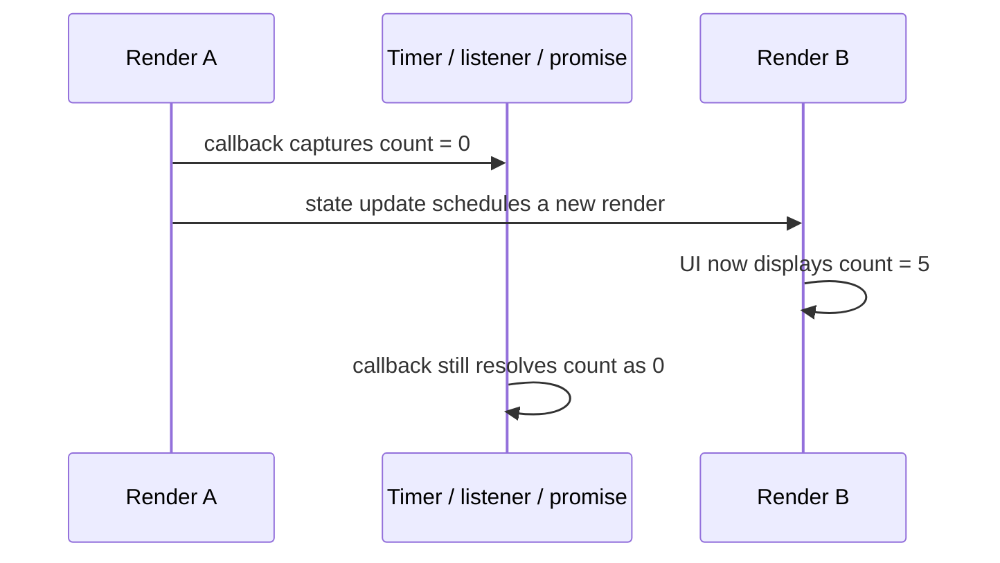

# Stale Closures

## 1. Why This Exists — The Problem First

The dashboard says there are 12 unread messages. You click “mark one read” three times, but the count becomes 11 instead of 9. Or an interval that should refresh a token keeps sending the token that existed when the component first mounted. The UI is rendering newer state, while a delayed callback is still reasoning from an older render.

That mismatch is a stale closure. It is not React losing state, and it is not a browser timer bug. It is a JavaScript function retaining access to the variables from the render that created it, combined with work that runs later.

## 2. The Analogy — Make It Obvious

Think of each render as a printed work order handed to a delivery driver. The order says, “deliver to room 401” and “the customer has 12 unread messages.” The driver keeps that paper even if the hotel later moves the customer to room 902 or the unread count changes to 9.

The render is the work order, the local variables are the values printed on it, and the callback is the driver carrying the order into the future. A new render prints a new order; it does not edit every old order already handed out. A timer, DOM listener, promise continuation, or subscription can keep an old driver alive. When that driver acts, it follows its own paper.

Sometimes the order should be replaced whenever a value changes. That is what an effect dependency describes. Sometimes the instruction is naturally “take whatever number is current and add one”; a functional state update is that instruction. Sometimes a long-lived driver genuinely needs to look at a shared whiteboard; a ref can provide that, but the whiteboard is mutable and therefore needs stricter discipline than a render snapshot.

## 3. How It Actually Works — The Full Explanation

A React component is called again for every render. Each call has its own bindings for values such as `count`, `roomId`, and `onSave`. If render A has `count = 0` and render B has `count = 5`, those are not one variable changing from 0 to 5. They are two different `count` bindings created by two different function calls.

JavaScript functions retain the lexical environment in which they were created. That retained environment is the closure. Therefore, a callback created during render A continues to read render A’s `count`, even after render B has committed. The callback is stale only relative to the state the user now sees; its captured value itself is behaving correctly.

The timing usually looks like this:



The important distinction is between reading state and enqueuing a state update. `setCount(count + 1)` reads `count` from the callback’s closure first, computes a value, and asks React to set that value. If the closure captured 0, it enqueues 1. `setCount(current => current + 1)` does not read the captured `count`. It enqueues an updater function; when React processes the update queue, it supplies the latest state at that point. Several updater functions can therefore compose in order.

Dependency arrays are not a general “make values live” switch. For `useEffect`, they tell React when the effect’s synchronization should be torn down and established again. For `useCallback` and `useMemo`, they tell React when to return a new memoized result. Every reactive value read by the callback belongs in the dependency list unless the code has been changed so that value is no longer a reactive read. An empty array means “this setup uses the values from its initial render”; it does not mean “run once but always see current values.”

This is why an interval effect often has one of two correct shapes. If the interval only updates from prior state, keep the interval stable and use a functional update. If it needs the current `delay` or another changing resource, include that value so the old interval is cleaned up and a new one is installed. Cleanup matters: otherwise every render or dependency change can leave another live callback behind.

Refs are different from state. `useRef` returns one stable object across renders, and changing `ref.current` does not trigger a render. Old and new callbacks that captured that object can all observe its latest property. This is useful for imperative integrations such as a WebSocket callback or a timer that must stay subscribed while consulting the latest configuration. It is not a substitute for declaring a real dependency, because a ref can hide data flow from React and can be read at times when the UI has not been updated to match it.

Async work adds a second problem. A request callback can close over an old query or request-specific state, and two requests can complete out of order. The stale closure explains which render’s values the callback reads; the race condition explains why an older response is allowed to win. Cancellation, request identity, or a data-fetching library solves the race. Adding a dependency alone does not make an already-started request’s response arrive in the right order.

## 4. Real Code — See It Working

The first example is plain JavaScript, so it can run with `node stale-closure.js`. It shows the closure mechanism without React. The `message` binding used by `logLater` remains the one from the call that created the function.

```js
function makeLogger(message) {
  return function logLater() {
    console.log(message);
  };
}

const logInitialStatus = makeLogger("queued");
const currentStatus = "sent";

// This logs "queued": currentStatus is a different binding and cannot rewrite
// the message captured by logInitialStatus.
logInitialStatus();
console.log(currentStatus); // sent
```

Here is a self-contained React + TypeScript example. It assumes a normal React 18+ application and can be rendered as `<Counter />`. The interval is created once, but it never gets stuck at 1 because the updater receives the current state from React.

```tsx
import { useEffect, useState } from "react";
import type { Dispatch, SetStateAction } from "react";

function useCounterInterval(setCount: Dispatch<SetStateAction<number>>) {
  useEffect(() => {
    const intervalId = window.setInterval(() => {
      // Do not read `count` from this old callback. Ask React for the latest
      // state when it processes the update.
      setCount((current) => current + 1);
    }, 1000);

    return () => window.clearInterval(intervalId);
  }, []);
}

export function Counter() {
  const [count, setCount] = useState(0);
  useCounterInterval(setCount);

  return <output aria-live="polite">{count}</output>;
}
```

The common broken form captures the initial value. With `count = 0`, every tick computes `0 + 1`, so React receives `1` repeatedly. This is a complete component so the contrast can be copied into a React + TypeScript app and run:

```tsx
import { useEffect, useState } from "react";

export function BrokenCounter() {
  const [count, setCount] = useState(0);

  useEffect(() => {
    const intervalId = window.setInterval(() => {
      setCount(count + 1); // `count` is from the render that installed the interval
    }, 1000);

    return () => window.clearInterval(intervalId);
  }, []);

  return <output aria-live="polite">{count}</output>;
}
```

An ordinary React event handler is different from a long-lived external listener. React attaches the handler for the committed render, so a later render replaces it with a new closure that sees that render's snapshot. Inside one click, though, the handler still sees one snapshot: two direct updates both calculate from the same `count`, while two functional updates are processed in sequence.

```tsx
import { useState } from "react";

export function EventHandlerSnapshots() {
  const [count, setCount] = useState(0);

  function addTwiceDirectly() {
    setCount(count + 1);
    setCount(count + 1); // Both calls read this handler's same snapshot.
  }

  function addTwiceFunctionally() {
    setCount((current) => current + 1);
    setCount((current) => current + 1); // Each updater receives the latest queued value.
  }

  return (
    <div>
      <output aria-live="polite">{count}</output>
      <button onClick={addTwiceDirectly}>Direct: add 1</button>
      <button onClick={addTwiceFunctionally}>Functional: add 2</button>
    </div>
  );
}
```

After either click causes a render, React recreates these functions and the next click uses the new `count` snapshot. A listener registered directly on `window`, a timer, or a subscription is different: if it is installed once, it can keep the old handler indefinitely. Recreate that external listener when its dependencies change, or use a deliberate latest-value mechanism such as a ref or effect event when the subscription itself must stay stable.

This listener stays registered while `label` changes, but it still uses the latest label because the handler reads the shared ref at event time. The cleanup removes the exact function that was added, so the listener does not survive unmounting:

```tsx
import { useEffect, useRef, useState } from "react";

export function WindowKeyLogger({ label }: { label: string }) {
  const [lastKey, setLastKey] = useState("");
  const latestLabel = useRef(label);
  latestLabel.current = label;

  useEffect(() => {
    function handleKeyDown(event: KeyboardEvent) {
      setLastKey(`${latestLabel.current}: ${event.key}`);
    }

    window.addEventListener("keydown", handleKeyDown);
    return () => window.removeEventListener("keydown", handleKeyDown);
  }, []);

  return <output aria-live="polite">{lastKey}</output>;
}
```

When a long-lived callback needs the latest value rather than the latest previous state, a ref makes that intent explicit. This hook keeps one interval while the callback reads the current `onTick` function. It is a targeted escape hatch for an imperative subscription; ordinary render logic should still use props and state directly.

```tsx
import { useEffect, useRef } from "react";

export function useStableInterval(
  onTick: () => void,
  delayMs: number | null,
) {
  const latestOnTick = useRef(onTick);
  latestOnTick.current = onTick;

  useEffect(() => {
    if (delayMs === null) return;

    const intervalId = window.setInterval(() => {
      latestOnTick.current();
    }, delayMs);

    return () => window.clearInterval(intervalId);
  }, [delayMs]);
}
```

For an async search, the dependency keeps the effect aligned with the query. `AbortController` is best-effort: it asks the browser to stop work, but it cannot guarantee that the server stopped processing or that a response already resolved will be undone. The request identity check is the correctness guard, so an older response cannot replace results for the latest query even if abort is too late. The exact fetch API assumes a browser environment.

```tsx
import { useEffect, useRef, useState } from "react";

function useSearchResults(query: string) {
  const [results, setResults] = useState<string[]>([]);
  const [error, setError] = useState<string | null>(null);
  const latestRequestId = useRef(0);

  useEffect(() => {
    const controller = new AbortController();
    let active = true;
    const requestId = ++latestRequestId.current;
    setError(null);

    fetch(`/api/search?q=${encodeURIComponent(query)}`, {
      signal: controller.signal,
    })
      .then((response) => {
        if (!response.ok) throw new Error(`HTTP ${response.status}`);
        return response.json() as Promise<{ items: string[] }>;
      })
      .then((data) => {
        // Abort may be too late, so only the newest request may publish results.
        // `active` independently blocks publication after unmount if abort fails.
        if (!active || requestId !== latestRequestId.current) return;
        setResults(data.items);
      })
      .catch((error: unknown) => {
        // Abort is expected when a newer query replaces this request.
        if (error instanceof DOMException && error.name === "AbortError") return;
        // Surface real failures only while this effect is still current and mounted.
        if (!active || requestId !== latestRequestId.current) return;
        setError(error instanceof Error ? error.message : "Search failed");
      });

    return () => {
      active = false;
      controller.abort();
    };
  }, [query]);

  return { results, error };
}

export function SearchResults({ query }: { query: string }) {
  const { results, error } = useSearchResults(query);
  return (
    <>
      {error && <p role="alert">{error}</p>}
      <ul>{results.map((result) => <li key={result}>{result}</li>)}</ul>
    </>
  );
}
```

## 5. The Interview Questions — All of Them, Done Properly

**Q: What is a stale closure, and why is it especially visible in React?**

A stale closure is a callback that later reads values from the lexical environment where it was created, even though newer values now exist. React makes this easy to see because a function component runs again on every render. Each run creates a new set of bindings, while timers, listeners, promises, and subscriptions may still retain callbacks from older runs. This is ordinary JavaScript closure behavior interacting with React’s snapshot-style rendering model.

**Q: Does React mutate the `count` variable after `setCount`?**

No. `count` is a binding belonging to one particular render. Calling `setCount` schedules another render; it does not rewrite the already-running function call or its closures. The next render gets a new `count` binding. This is why logging `count` immediately after `setCount` prints the old render’s value.

**Q: Why does `setCount(count + 1)` fail in an interval, while `setCount(current => current + 1)` works?**

The first form evaluates `count + 1` inside the callback, so it uses the callback’s captured value. An interval installed during the initial render can keep using 0 forever and repeatedly request 1. The functional form gives React an updater function. React calls it while processing the queue and passes the latest state, so each tick derives the next value from the state that actually exists then.

**Q: What do dependency arrays have to do with stale closures?**

An effect dependency list controls when React replaces an effect’s setup and cleanup. If an effect reads `roomId` but declares `[]`, it remains connected using the room from the render that installed it. Declaring `[roomId]` lets React clean up the old connection and create a callback from the new render. The list must describe the values the effect reads; it should not be edited merely to silence reruns. For `useCallback` or `useMemo`, the same dependency principle controls whether the memoized function or value is replaced, not whether JavaScript closures become mutable.

**Q: How do you fix a stale closure?**

First identify what the callback needs. Use a functional updater when it only needs to calculate new state from previous state. Include a reactive value in the dependency list when the external work should be recreated for that value. Move user-triggered work into the event handler when it is not synchronization. Use a ref only when a stable imperative callback must consult the latest value without recreating the subscription. For async work, also handle cancellation or request identity, because freshness and response ordering are separate concerns.

**Q: When should a ref hold the latest value?**

Use a ref when the callback’s identity or subscription should remain stable, but its imperative behavior must consult a changing value. Examples include a browser event listener, a WebSocket connection, or a timer that should not be torn down whenever a callback prop changes. Update the ref on each render and read `ref.current` at callback time. Do not use this pattern to hide a dependency that should cause synchronization or to mirror state that the UI needs to render.

**Q: Are stale closures the same as a race condition in data fetching?**

No. A stale closure is about which render’s bindings a callback can read. A race condition is about multiple operations completing in an order different from the order they were started. A request can have a fresh closure and still race with an older request. Abort the obsolete request, associate responses with a request ID, or use a data-fetching library that manages this lifecycle.

**Q: Can `useCallback` prevent stale closures?**

Not by itself. `useCallback(fn, dependencies)` returns the same function identity until a dependency changes, so an incomplete dependency list can preserve a stale closure deliberately. A complete list lets React return a function created from the render containing the new values. If the callback only updates state from prior state, a functional updater may let it have fewer dependencies because it no longer reads the state variable.

**Q: Why does adding a dependency sometimes cause a loop?**

Usually because the effect is doing work that should not be an effect, or because it creates a new dependency each render. For example, an effect that sets derived state from props creates unnecessary render cycles; calculate the value during render instead. If an effect subscribes to an external system, the right fix is to make setup and cleanup correct, stabilize only genuinely stable inputs, and keep user-event logic in the event handler. Removing the dependency hides the loop while risking stale behavior.

## 6. The Traps — What Goes Wrong

**Treating state as a mutable variable.** `setCount` schedules a render; it does not change the `count` binding inside an already-created callback. Read the new value during the next render, or use a functional updater when the callback needs to derive state.

**Using an empty dependency list as “run once with live values.”** `[]` gives the effect the values from its setup render. It is appropriate only when the setup truly does not depend on changing reactive values, or when the callback uses a deliberate stable interface such as a functional updater or a carefully scoped ref.

**Fixing a stale interval by removing cleanup.** Reinstalling the interval can refresh the closure, but without cleanup every old interval keeps firing. The result is accelerated updates, duplicate requests, and callbacks that survive after the component is gone. Every subscription setup needs a matching cleanup.

**Putting every value in a ref.** A ref is invisible to React’s rendering and dependency analysis. It can solve a stable-subscription problem, but it can also make the UI and imperative code disagree. Prefer state and dependencies when a value should participate in rendering or synchronization.

**Confusing stale state with stale server data.** A closure may read an old local render snapshot; a cache may contain an old server response. They need different fixes. Functional updates do not invalidate a cache, and cache revalidation does not change what an old callback captured.

**Calling an old request’s response “just a stale closure.”** If search for `rea` returns after search for `react`, the old response can overwrite the new one. The closure may explain why the callback labels the response, but cancellation or latest-request checking is what enforces the winning response.

**Disabling exhaustive-deps to stop an effect from rerunning.** The rerun is often evidence that the effect is coupled to a changing value. Investigate whether the effect needs that value, whether the work belongs in an event handler, or whether the external resource needs proper cleanup. A linter suppression turns a visible lifecycle problem into a hidden data bug.

## 7. Compare With Related Concepts

**Stale closure vs. stale server/cache data:** A stale closure is an old JavaScript render environment retained by a callback. Stale server data is an old response held by a cache or client store. Use closure techniques for callbacks; use invalidation, revalidation, or cache policies for server data.

**Functional updater vs. dependency refresh:** A functional updater is best when the operation is “derive the next state from the previous state,” such as incrementing a counter. A dependency refresh is best when an external resource or callback must be rebuilt around a new prop or state value. Use the updater to avoid reading state; use dependencies to synchronize an external system.

**Ref vs. state:** State is a render input and updates the UI when changed. A ref is a stable mutable cell and changing it does not render. Use state for declarative UI; use a ref for an imperative value that a stable callback must inspect.

**Closure vs. `useCallback`:** A closure is the JavaScript mechanism that retains lexical bindings. `useCallback` is a React optimization that may reuse a function identity. `useCallback` does not remove closure semantics; use a complete dependency list or avoid reading a changing value through a functional updater.

**Stale closure vs. lost update:** A stale closure computes from an old captured value. A lost update happens when multiple writes are computed from the same old value, such as two `setCount(count + 1)` calls producing only one increment. Functional updates address both when the intended operation is based on previous state.

## 8. 🧠 The Memory Hook — What Sticks

Every render hands its callbacks a paper snapshot; React never edits yesterday’s paper. When future work needs “whatever is current,” either ask React with a functional updater, replace the subscription through dependencies, or deliberately read a shared ref—each choice says exactly where freshness comes from.
