# Foundations & Framework

[← System Design index](index.md)

These questions are about the vocabulary and trade-offs that appear in every larger design. Answer them by defining the layer, the responsibility boundary, and the failure mode.

## Architecture snapshot

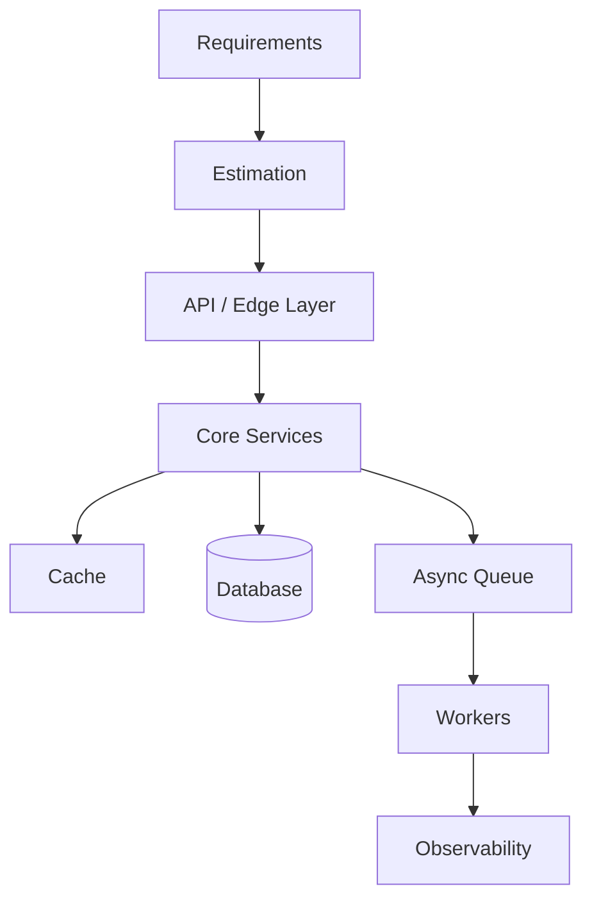

## Questions at a glance

| # | Question |
|---|---|
| 1 | [API Gateway vs Load Balancer](#1-api-gateway-vs-load-balancer) |
| 2 | [Reverse Proxy vs Forward Proxy](#2-reverse-proxy-vs-forward-proxy) |
| 3 | [Horizontal vs Vertical Scaling](#3-horizontal-vs-vertical-scaling) |
| 4 | [Microservices vs Monolithic Architecture](#4-microservices-vs-monolithic-architecture) |
| 5 | [Vertical vs Horizontal Partitioning](#5-vertical-vs-horizontal-partitioning) |
| 6 | [Rate Limiter](#6-rate-limiter) |
| 7 | [Single Sign On (SSO)](#7-single-sign-on-sso) |
| 8 | [Apache Kafka - How it Works & Why It's Fast](#8-apache-kafka-how-it-works-why-its-fast) |
| 9 | [Kafka vs RabbitMQ vs ActiveMQ](#9-kafka-vs-rabbitmq-vs-activemq) |
| 10 | [JWT vs OAuth vs SAML](#10-jwt-vs-oauth-vs-saml) |
| 11 | [CAP Theorem](#11-cap-theorem) |
| 12 | [PACELC Theorem](#12-pacelc-theorem) |
| 13 | [Strong vs Eventual Consistency](#13-strong-vs-eventual-consistency) |
| 14 | [Database Indexing](#14-database-indexing) |
| 15 | [Consistent Hashing](#15-consistent-hashing) |

---
### 1. **API Gateway vs Load Balancer**

#### Answer summary

Use a load balancer to distribute traffic and keep instances healthy; use an API gateway for Layer 7 policy such as authentication, routing, request shaping, and rate limiting. In interviews, say that the load balancer solves transport distribution while the gateway solves API control, and that real systems often need both.

#### Key points

- Responsibility boundaries and where each component sits in the stack
- When you choose one vs the other, and when you combine them
- What breaks first at scale or under failure
- The one-sentence interview takeaway

#### Interview details

- API Gateway = Layer 7 policy, routing, authentication, and rate limiting.
- Load Balancer = Layer 4/5 traffic distribution and health-based failover.
- Use both when you need an edge policy layer plus horizontal scale.

#### Diagram

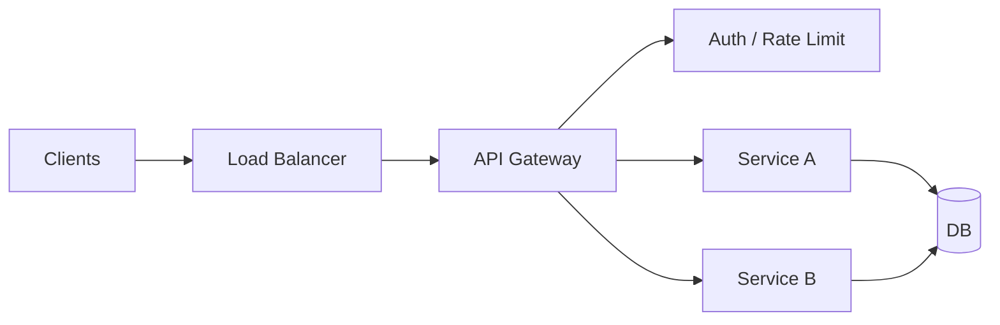

Original source notes

{{#include ../../../100_System_Design_Interview_Questions_Complete_Guide.md:55:58}}

---

### 2. **Reverse Proxy vs Forward Proxy**

#### Answer summary

A forward proxy protects and abstracts the client, while a reverse proxy protects and abstracts the server. Explain that forward proxies sit near the caller, reverse proxies sit near the service, and both can be combined with caching and TLS termination.

#### Key points

- Responsibility boundaries and where each component sits in the stack
- When you choose one vs the other, and when you combine them
- What breaks first at scale or under failure
- The one-sentence interview takeaway

#### Interview details

- Forward proxy represents the client; reverse proxy represents the server.
- Forward proxy is common for privacy/corporate policy; reverse proxy is common for load balancing and TLS termination.
- Use reverse proxies at the edge of web services.

#### Diagram

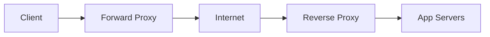

Original source notes

{{#include ../../../100_System_Design_Interview_Questions_Complete_Guide.md:60:63}}

---

### 3. **Horizontal vs Vertical Scaling**

#### Answer summary

Vertical scaling buys time by making one machine bigger, but horizontal scaling is the long-term strategy because it spreads load across multiple nodes and improves fault tolerance. Mention that mature systems usually start vertical, then move horizontal once capacity or availability demands it.

#### Key points

- Responsibility boundaries and where each component sits in the stack
- When you choose one vs the other, and when you combine them
- What breaks first at scale or under failure
- The one-sentence interview takeaway

#### Interview details

- Vertical scaling = bigger machine, simpler, but limited by hardware ceilings.
- Horizontal scaling = more machines, more fault tolerant, but needs distribution and coordination.
- Start vertical, then go horizontal when reliability or throughput demands it.

#### Diagram

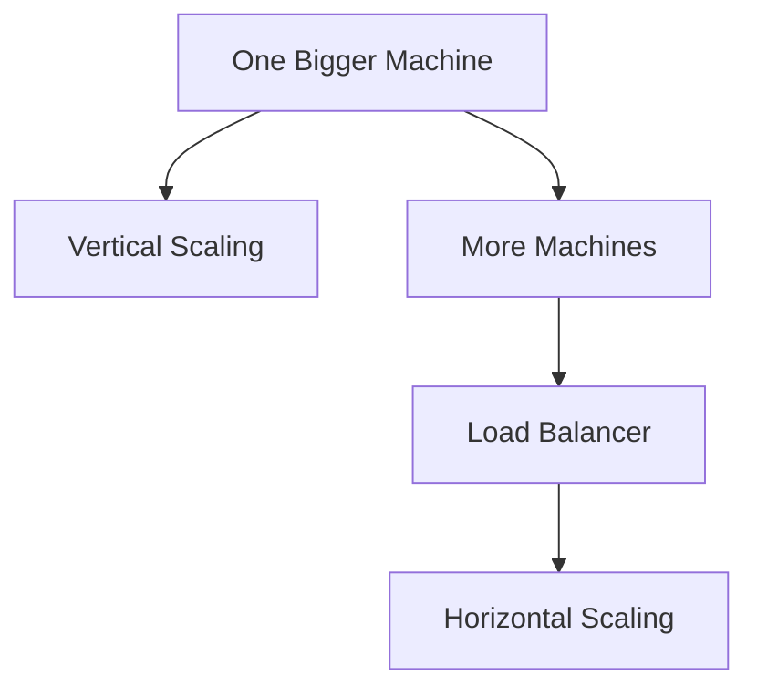

Original source notes

{{#include ../../../100_System_Design_Interview_Questions_Complete_Guide.md:65:68}}

---

### 4. **Microservices vs Monolithic Architecture**

#### Answer summary

A monolith is simpler to build, deploy, and debug; microservices are better when teams, scaling profiles, or release cadence demand independent services. The right answer is rarely “always microservices”—it is to describe when the operational overhead is worth it.

#### Key points

- Responsibility boundaries and where each component sits in the stack
- When you choose one vs the other, and when you combine them
- What breaks first at scale or under failure
- The one-sentence interview takeaway

#### Interview details

- Monolith = single deployable unit, easier to reason about.
- Microservices = independent deploys and scaling, but more operational overhead.
- Choose the simplest structure that can still evolve with the team and traffic.

#### Diagram

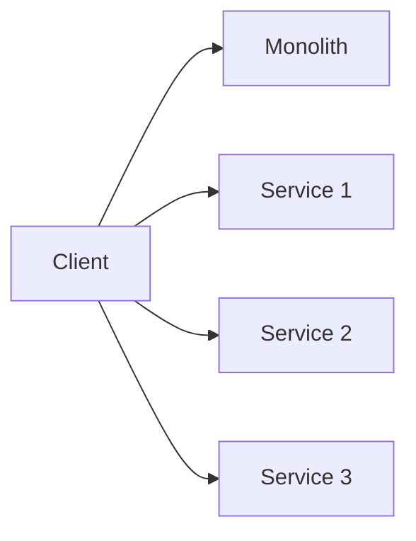

Original source notes

{{#include ../../../100_System_Design_Interview_Questions_Complete_Guide.md:70:73}}

---

### 5. **Vertical vs Horizontal Partitioning**

#### Answer summary

Vertical partitioning splits data by columns or responsibility, while horizontal partitioning splits by rows or shard key. Say that vertical splits reduce wide-row access cost, while horizontal splits are the real scaling play when one table becomes too large.

#### Key points

- Responsibility boundaries and where each component sits in the stack
- When you choose one vs the other, and when you combine them
- What breaks first at scale or under failure
- The one-sentence interview takeaway

#### Interview details

- Vertical partitioning splits columns/concerns; horizontal partitioning splits rows/shards.
- Vertical helps isolate hot columns; horizontal helps scale the dataset.
- In real systems, horizontal partitioning is the main scale-out move.

#### Diagram

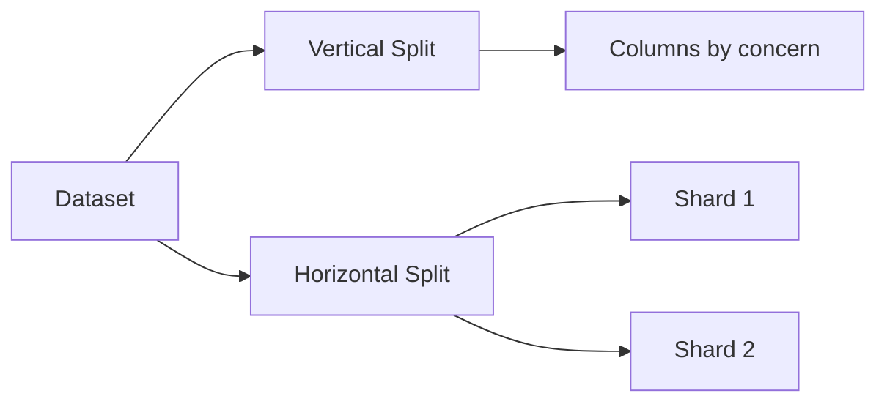

Original source notes

{{#include ../../../100_System_Design_Interview_Questions_Complete_Guide.md:75:78}}

---

### 6. **Rate Limiter**

#### Answer summary

Use this page as a study loop: understand the framework, apply it to the questions, then rehearse the answer under time pressure.

#### Key points

- What problem the pattern solves
- Why the common alternative is not enough
- How to explain the trade-off in one sentence

#### Interview details

- Request flow and primary API
- Durable state and hot-path acceleration
- Failure handling and observability

#### Diagram

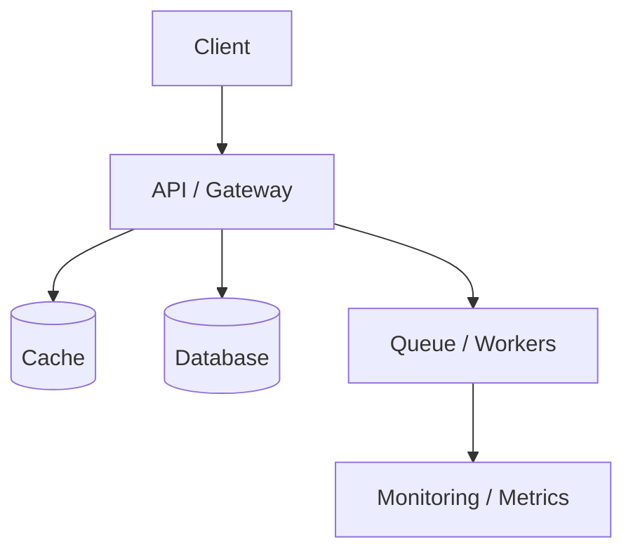

Original source notes

{{#include ../../../100_System_Design_Interview_Questions_Complete_Guide.md:80:84}}

---

### 7. **Single Sign On (SSO)**

#### Answer summary

Use this page as a study loop: understand the framework, apply it to the questions, then rehearse the answer under time pressure.

#### Key points

- What problem the pattern solves
- Why the common alternative is not enough
- How to explain the trade-off in one sentence

#### Interview details

- Request flow and primary API
- Durable state and hot-path acceleration
- Failure handling and observability

#### Diagram

Original source notes

{{#include ../../../100_System_Design_Interview_Questions_Complete_Guide.md:86:90}}

---

### 8. **Apache Kafka - How it Works & Why It's Fast**

#### Answer summary

Use this page as a study loop: understand the framework, apply it to the questions, then rehearse the answer under time pressure.

#### Key points

- What problem the pattern solves
- Why the common alternative is not enough
- How to explain the trade-off in one sentence

#### Interview details

- Request flow and primary API
- Durable state and hot-path acceleration
- Failure handling and observability

#### Diagram

Original source notes

{{#include ../../../100_System_Design_Interview_Questions_Complete_Guide.md:92:96}}

---

### 9. **Kafka vs RabbitMQ vs ActiveMQ**

#### Answer summary

Kafka is a durable distributed log: producers write to partitioned topics, brokers replicate the log, and consumer groups read at their own pace. Explain that its strength comes from sequential I/O, batching, and replayability, not from being “just a queue.”

#### Key points

- Responsibility boundaries and where each component sits in the stack
- When you choose one vs the other, and when you combine them
- What breaks first at scale or under failure
- The one-sentence interview takeaway

#### Interview details

- Kafka is a replicated log, not just a queue.
- Partitions enable parallelism; consumer groups enable independent processing; replay enables recovery.
- Choose Kafka for streaming and event history, RabbitMQ for traditional task delivery.

#### Diagram

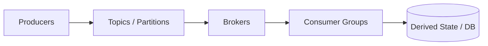

Original source notes

{{#include ../../../100_System_Design_Interview_Questions_Complete_Guide.md:98:102}}

---

### 10. **JWT vs OAuth vs SAML**

#### Answer summary

JWT is a token format, OAuth is an authorization framework, and SAML is an enterprise identity assertion protocol. The interview-safe answer is that OAuth decides access delegation, JWT often carries the claims, and SAML is common in enterprise SSO.

#### Key points

- Responsibility boundaries and where each component sits in the stack
- When you choose one vs the other, and when you combine them
- What breaks first at scale or under failure
- The one-sentence interview takeaway

#### Interview details

- JWT is a token format; OAuth is a delegated authorization framework; SAML is enterprise SSO.
- JWT often carries claims, OAuth defines access flow, SAML is common in enterprise identity exchanges.
- Use the protocol that matches the trust boundary and audience.

#### Diagram

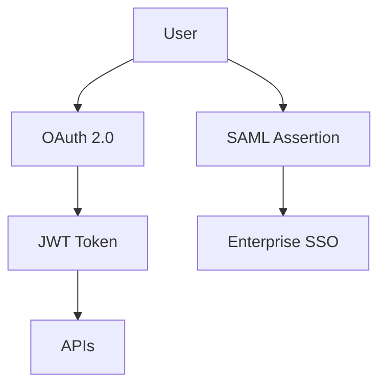

Original source notes

{{#include ../../../100_System_Design_Interview_Questions_Complete_Guide.md:104:108}}

---

### 11. **CAP Theorem**

#### Answer summary

CAP is about the trade-off a distributed system makes during network partitions: you can’t fully guarantee consistency, availability, and partition tolerance at the same time. Say explicitly which two properties the system prioritizes during a partition and why.

#### Key points

- Responsibility boundaries and where each component sits in the stack
- When you choose one vs the other, and when you combine them
- What breaks first at scale or under failure
- The one-sentence interview takeaway

#### Interview details

- During a partition, you must trade off consistency and availability.
- Partition tolerance is non-negotiable in distributed systems.
- State the trade-off explicitly and connect it to product risk.

#### Diagram

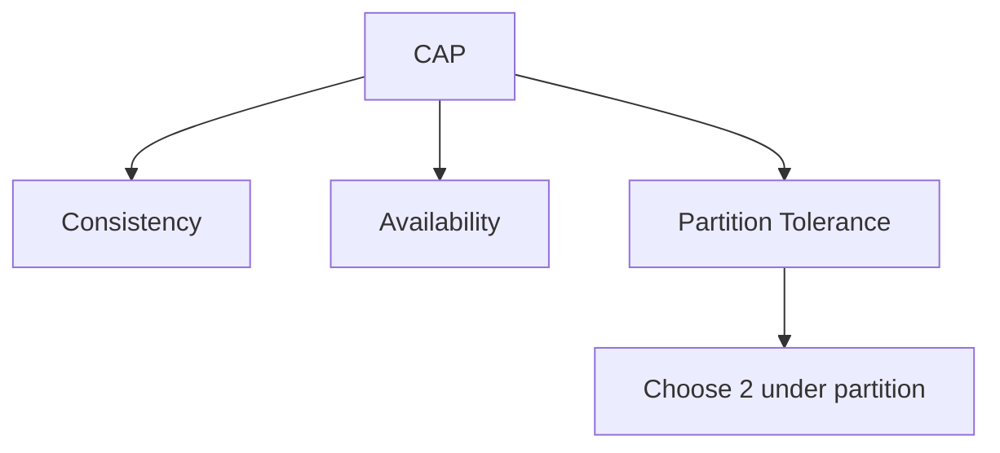

Original source notes

{{#include ../../../100_System_Design_Interview_Questions_Complete_Guide.md:110:115}}

---

### 12. **PACELC Theorem**

#### Answer summary

PACELC extends CAP by saying that even when there is no partition, the system still trades latency against consistency. Use it to explain the normal operating mode, not just the failure mode, and tie the choice back to user experience.

#### Key points

- Responsibility boundaries and where each component sits in the stack
- When you choose one vs the other, and when you combine them
- What breaks first at scale or under failure
- The one-sentence interview takeaway

#### Interview details

- When partitioned, choose availability or consistency; when healthy, choose latency or consistency.
- PACELC helps explain normal-operation trade-offs, not just failure-mode trade-offs.
- Use it to justify read latency vs strong correctness.

#### Diagram

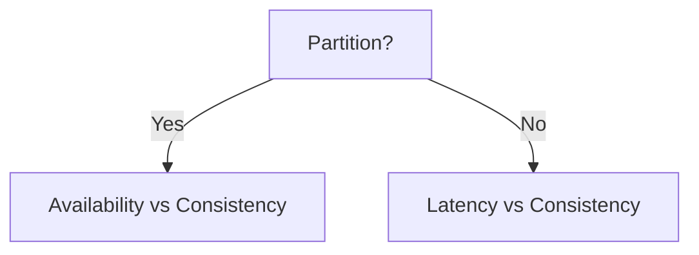

Original source notes

{{#include ../../../100_System_Design_Interview_Questions_Complete_Guide.md:117:121}}

---

### 13. **Strong vs Eventual Consistency**

#### Answer summary

Strong consistency returns the latest committed value at the cost of latency and coordination, while eventual consistency improves availability and responsiveness but allows short-term staleness. The right answer depends on whether correctness or freshness is the stronger business requirement.

#### Key points

- Responsibility boundaries and where each component sits in the stack
- When you choose one vs the other, and when you combine them
- What breaks first at scale or under failure
- The one-sentence interview takeaway

#### Interview details

- Strong consistency returns the latest committed value; eventual consistency favors availability and low latency.
- Strong consistency is safer for money and invariants; eventual consistency is common for feeds and social features.
- Explain the acceptable window of staleness.

#### Diagram

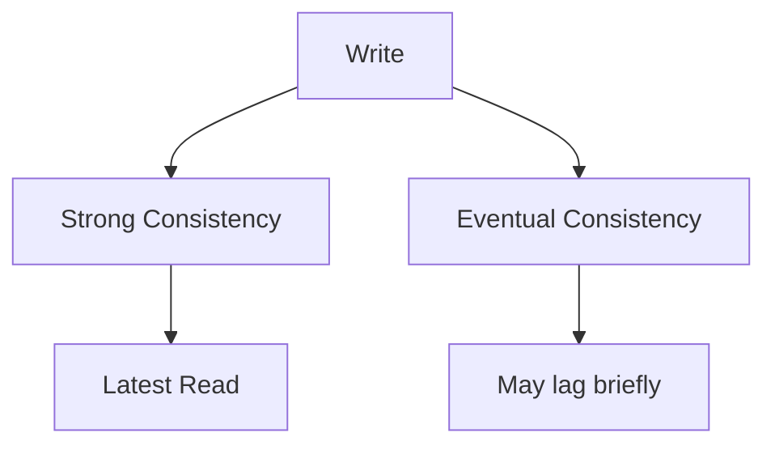

Original source notes

{{#include ../../../100_System_Design_Interview_Questions_Complete_Guide.md:123:127}}

---

### 14. **Database Indexing**

#### Answer summary

Indexes trade write cost and storage for faster reads. Explain that B-tree indexes are the default for range and equality filters, hash indexes are more niche, and a good index matches the query pattern instead of the table schema.

#### Key points

- Responsibility boundaries and where each component sits in the stack
- When you choose one vs the other, and when you combine them
- What breaks first at scale or under failure
- The one-sentence interview takeaway

#### Interview details

- Indexes speed reads but cost write amplification and storage.
- B-tree indexes are the default for equality and range queries; order the columns to match your access pattern.
- Avoid over-indexing everything; index for the query, not the table.

#### Diagram

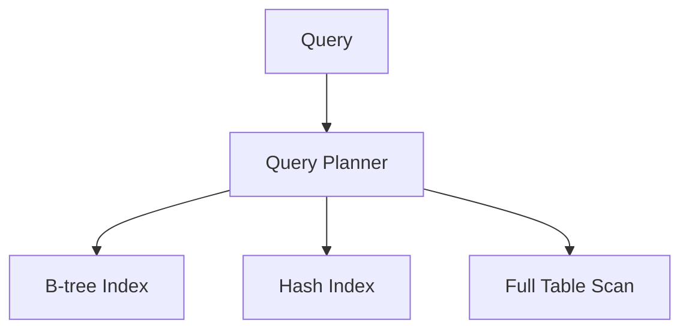

Original source notes

{{#include ../../../100_System_Design_Interview_Questions_Complete_Guide.md:129:133}}

---

### 15. **Consistent Hashing**

#### Answer summary

Consistent hashing minimizes key movement when nodes are added or removed by mapping both keys and nodes to a ring. Mention virtual nodes, rebalancing, and why the pattern is popular in caches and distributed storage.

#### Key points

- Responsibility boundaries and where each component sits in the stack
- When you choose one vs the other, and when you combine them
- What breaks first at scale or under failure
- The one-sentence interview takeaway

#### Interview details

- Consistent hashing limits key movement when the cluster changes.
- Virtual nodes reduce hotspots and make rebalancing smoother.
- It is the standard answer for distributed caches and shard routers.

#### Diagram

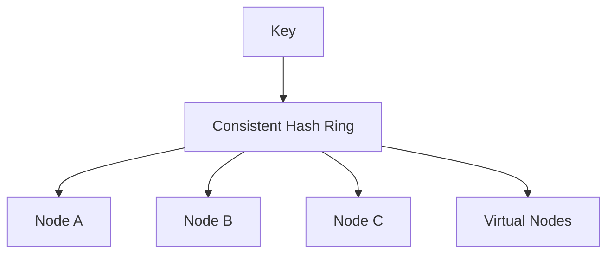

Original source notes

{{#include ../../../100_System_Design_Interview_Questions_Complete_Guide.md:135:142}}

