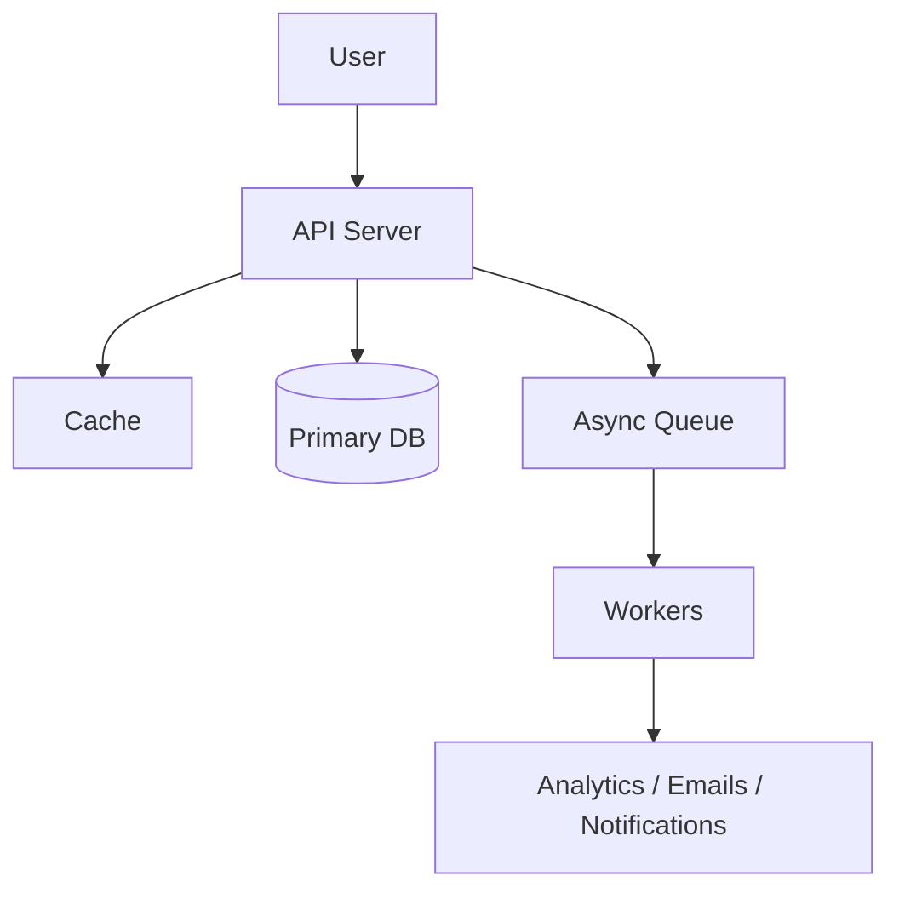
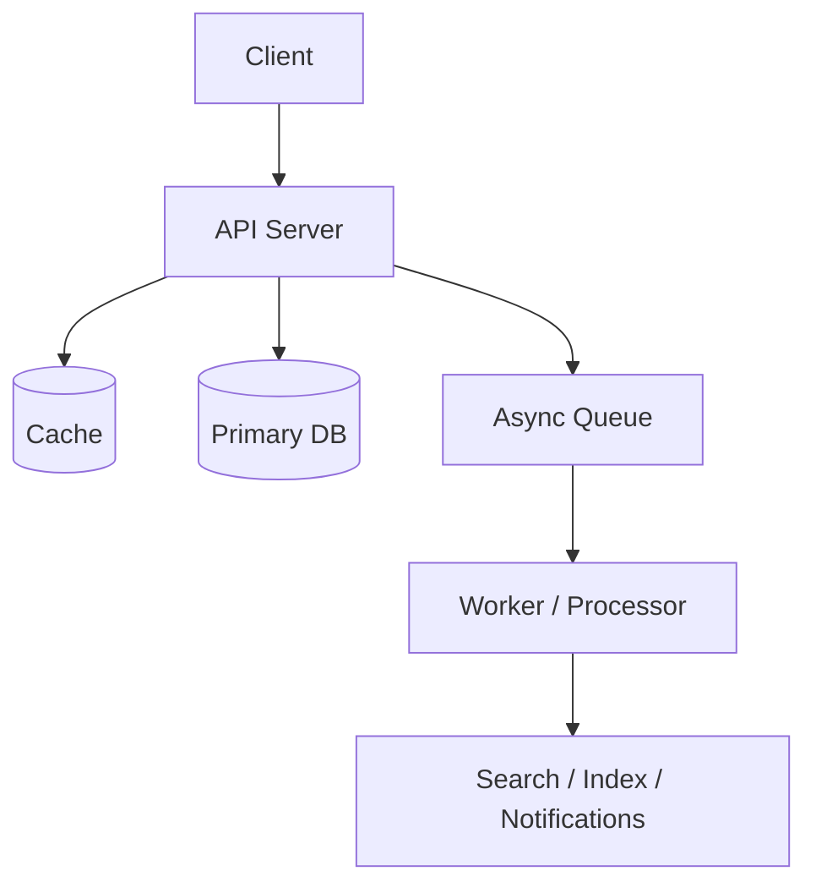
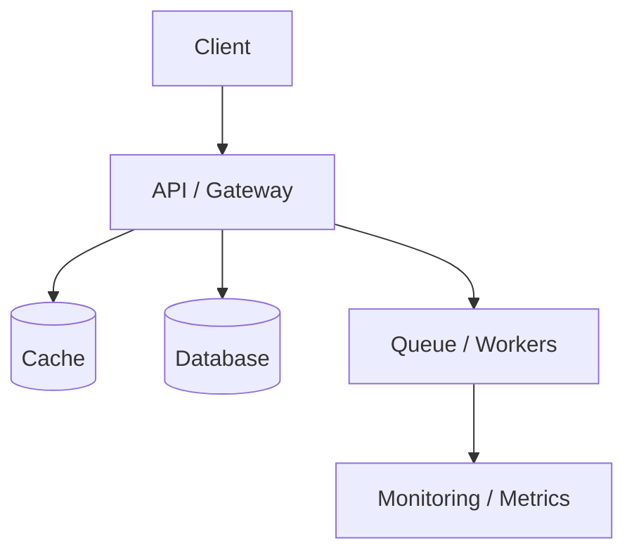
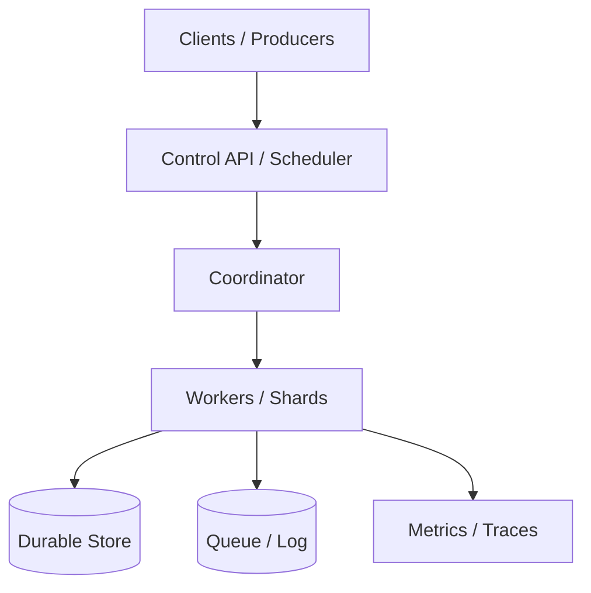

# Easy System Design Problems

[← System Design index](index.md)

These solutions should sound like a real interview answer: identify the user flow, durable state, cache or queue, and the simplest scaling path that still works.

## Architecture snapshot



## Questions at a glance

| # | Question |
|---|---|
| 16 | [Design URL Shortener (TinyURL)](#16-design-url-shortener-tinyurl) |
| 17 | [Design Pastebin (Text Storage)](#17-design-pastebin-text-storage) |
| 18 | [Design Content Delivery Network (CDN)](#18-design-content-delivery-network-cdn) |
| 19 | [Design Parking Garage](#19-design-parking-garage) |
| 20 | [Design Distributed Key-Value Store](#20-design-distributed-key-value-store) |
| 21 | [Design Distributed Cache](#21-design-distributed-cache) |
| 22 | [Design Distributed Job Scheduler](#22-design-distributed-job-scheduler) |
| 23 | [Design Authentication System](#23-design-authentication-system) |
| 24 | [Design Unified Payments Interface (UPI)](#24-design-unified-payments-interface-upi) |
| 25 | [Design Task Management System (Todoist/Asana)](#25-design-task-management-system-todoist-asana) |
| 26 | [Design Email Service](#26-design-email-service) |
| 27 | [Design Logging System](#27-design-logging-system) |
| 28 | [Design Real-time Metrics System](#28-design-real-time-metrics-system) |
| 29 | [Design Comment System](#29-design-comment-system) |
| 30 | [Design Leaderboard](#30-design-leaderboard) |
| 31 | [Design Search Autocomplete](#31-design-search-autocomplete) |
| 32 | [Design QR Code Generator](#32-design-qr-code-generator) |
| 33 | [Design Session Management](#33-design-session-management) |
| 34 | [Design File Upload System](#34-design-file-upload-system) |
| 35 | [Design Recommendation System (Basic)](#35-design-recommendation-system-basic) |

---
### 16. **Design URL Shortener (TinyURL)**

#### Answer summary

Design this as a stateless URL service in front of a durable ID store: an API generates a short code, Redis accelerates hot redirects, and the database keeps the long-to-short mapping plus analytics metadata.

#### Key points

- What the client path looks like end to end
- Where the source of truth lives
- Which components absorb burstiness or slow work
- How you scale, observe, and recover

#### Interview details

- Short-code generation, durable mapping, redirect path, cache hot URLs, and analytics.
- Source of truth is the mapping store; cache is only an acceleration layer.
- Handle collisions and keep redirects idempotent.

#### Diagram



<details>
<summary>Original source notes</summary>

{{#include ../../../100_System_Design_Interview_Questions_Complete_Guide.md:148:172}}

</details>

---

### 17. **Design Pastebin (Text Storage)**

#### Answer summary

A paste service is mostly a content-addressing problem: generate an ID, store the payload durably, cache hot pastes, and expire or archive old snippets without breaking redirects.

#### Key points

- What the client path looks like end to end
- Where the source of truth lives
- Which components absorb burstiness or slow work
- How you scale, observe, and recover

#### Interview details

- Store snippets durably, assign a short ID, and support TTL/expiry.
- Cache popular pastes and isolate large-paste storage if needed.
- Think about privacy, moderation, and cleanup jobs.

#### Diagram


<details>
<summary>Original source notes</summary>

{{#include ../../../100_System_Design_Interview_Questions_Complete_Guide.md:174:189}}

</details>

---

### 18. **Design Content Delivery Network (CDN)**

#### Answer summary

A CDN design should minimize latency by pushing static content to the edge, routing users to the nearest node, and keeping cache invalidation and origin fetches explicit.

#### Key points

- What the client path looks like end to end
- Where the source of truth lives
- Which components absorb burstiness or slow work
- How you scale, observe, and recover

#### Interview details

- Edge caching, origin fetches, invalidation, and geo routing.
- CDN is about latency reduction and offloading the origin.
- Explain freshness, cache keys, and global failover.

#### Diagram



<details>
<summary>Original source notes</summary>

{{#include ../../../100_System_Design_Interview_Questions_Complete_Guide.md:191:206}}

</details>

---

### 19. **Design Parking Garage**

#### Answer summary

A parking garage design is a state-tracking system: spots, gates, billing, and availability must stay in sync even when entry and exit events are bursty or partially failing.

#### Key points

- What the client path looks like end to end
- Where the source of truth lives
- Which components absorb burstiness or slow work
- How you scale, observe, and recover

#### Interview details

- Track spot state, gate events, payments, and vehicle classes.
- Use a transactional store for availability and a display/update path for realtime info.
- Explain entry/exit races and fee calculation.

#### Diagram


<details>
<summary>Original source notes</summary>

{{#include ../../../100_System_Design_Interview_Questions_Complete_Guide.md:208:223}}

</details>

---

### 20. **Design Distributed Key-Value Store**

#### Answer summary

Focus on partitioning, replication, and recovery. A distributed KV store needs a routing layer, replicated shards, quorum or anti-entropy mechanisms, and a clear story for failover and consistency.

#### Key points

- What the client path looks like end to end
- Where the source of truth lives
- Which components absorb burstiness or slow work
- How you scale, observe, and recover

#### Interview details

- Partition routing, replication, and read/write quorum strategy.
- Use anti-entropy or repair to heal divergence.
- Explain consistency levels and node failure handling.

#### Diagram



<details>
<summary>Original source notes</summary>

{{#include ../../../100_System_Design_Interview_Questions_Complete_Guide.md:225:240}}

</details>

---

### 21. **Design Distributed Cache**

#### Answer summary

A distributed cache should explain sharding, eviction, replication, and invalidation. The best interview answer clarifies what the cache accelerates, what the source of truth is, and what happens on a miss or failure.

#### Key points

- What the client path looks like end to end
- Where the source of truth lives
- Which components absorb burstiness or slow work
- How you scale, observe, and recover

#### Interview details

- Sharding, eviction, replication, and invalidation.
- Cache must be fast, disposable, and well-observed.
- Describe what happens on miss, eviction, and invalidation.

#### Diagram


<details>
<summary>Original source notes</summary>

{{#include ../../../100_System_Design_Interview_Questions_Complete_Guide.md:242:257}}

</details>

---

### 22. **Design Distributed Job Scheduler**

#### Answer summary

A distributed scheduler needs persistence, leader election or coordination, idempotent workers, and retries. Describe how jobs are claimed, how duplicates are prevented, and how failures are recovered.

#### Key points

- What the client path looks like end to end
- Where the source of truth lives
- Which components absorb burstiness or slow work
- How you scale, observe, and recover

#### Interview details

- Job store, dispatcher, worker pool, retries, and lease/claim semantics.
- Scheduler should avoid duplicate execution and support backoff.
- Explain leader election or coordination.

#### Diagram


<details>
<summary>Original source notes</summary>

{{#include ../../../100_System_Design_Interview_Questions_Complete_Guide.md:259:274}}

</details>

---

### 23. **Design Authentication System**

#### Answer summary

Design auth around secure identity proofing, session or token issuance, password storage, token refresh, and revocation. The solution should clearly separate authentication from authorization.

#### Key points

- What the client path looks like end to end
- Where the source of truth lives
- Which components absorb burstiness or slow work
- How you scale, observe, and recover

#### Interview details

- Identity verification, token/session issuance, refresh, and revocation.
- Passwords are hashed; sessions/tokens are short-lived and auditable.
- Separate authentication from authorization.

#### Diagram


<details>
<summary>Original source notes</summary>

{{#include ../../../100_System_Design_Interview_Questions_Complete_Guide.md:276:297}}

</details>

---

### 24. **Design Unified Payments Interface (UPI)**

#### Answer summary

A payments design needs a durable ledger, idempotency, reconciliation, and auditability. Explain how you keep money movement correct under retries, partial failures, and duplicate requests.

#### Key points

- What the client path looks like end to end
- Where the source of truth lives
- Which components absorb burstiness or slow work
- How you scale, observe, and recover

#### Interview details

- Ledger, idempotency, reconciliation, and audit trail.
- Correctness beats speed; every side effect needs a retry-safe path.
- Explain double-entry style invariants where appropriate.

#### Diagram


<details>
<summary>Original source notes</summary>

{{#include ../../../100_System_Design_Interview_Questions_Complete_Guide.md:299:315}}

</details>

---

### 25. **Design Task Management System (Todoist/Asana)**

#### Answer summary

A task manager is a CRUD-plus-collaboration problem: durable task state, sharing, notifications, and search/indexing matter more than raw throughput.

#### Key points

- What the client path looks like end to end
- Where the source of truth lives
- Which components absorb burstiness or slow work
- How you scale, observe, and recover

#### Interview details

- Tasks, comments, attachments, search, notifications, and collaboration.
- Use async workers for notifications and indexing.
- Mention sharing permissions and offline sync if relevant.

#### Diagram


<details>
<summary>Original source notes</summary>

{{#include ../../../100_System_Design_Interview_Questions_Complete_Guide.md:317:333}}

</details>

---

### 26. **Design Email Service**

#### Answer summary

Email systems are fundamentally about reliable delivery: queue outbound mail, retry intelligently, track delivery state, and isolate spam/abuse controls from the sending path.

#### Key points

- What the client path looks like end to end
- Where the source of truth lives
- Which components absorb burstiness or slow work
- How you scale, observe, and recover

#### Interview details

- Compose, queue, deliver, retry, and track status.
- Separate sending from inboxing; treat retries and bounces explicitly.
- Talk about throttling and spam/abuse controls.

#### Diagram


<details>
<summary>Original source notes</summary>

{{#include ../../../100_System_Design_Interview_Questions_Complete_Guide.md:335:350}}

</details>

---

### 27. **Design Logging System**

#### Answer summary

Observability systems should separate ingestion, aggregation, storage, query, and alerting. Call out retention, sampling, cardinality, and how operators get from a signal to an action.

#### Key points

- What the client path looks like end to end
- Where the source of truth lives
- Which components absorb burstiness or slow work
- How you scale, observe, and recover

#### Interview details

- Ingestion, processing, storage, query, and alerting.
- Treat retention and cardinality as first-class design inputs.
- Explain how operators move from signal to action.

#### Diagram


<details>
<summary>Original source notes</summary>

{{#include ../../../100_System_Design_Interview_Questions_Complete_Guide.md:352:362}}

</details>

---

### 28. **Design Real-time Metrics System**

#### Answer summary

Observability systems should separate ingestion, aggregation, storage, query, and alerting. Call out retention, sampling, cardinality, and how operators get from a signal to an action.

#### Key points

- What the client path looks like end to end
- Where the source of truth lives
- Which components absorb burstiness or slow work
- How you scale, observe, and recover

#### Interview details

- Ingestion, processing, storage, query, and alerting.
- Treat retention and cardinality as first-class design inputs.
- Explain how operators move from signal to action.

#### Diagram


<details>
<summary>Original source notes</summary>

{{#include ../../../100_System_Design_Interview_Questions_Complete_Guide.md:364:374}}

</details>

---

### 29. **Design Comment System**

#### Answer summary

This design is a good fit for a stateless API tier backed by a durable store, a cache for hot reads, and background workers for heavier side effects.

#### Key points

- What the client path looks like end to end
- Where the source of truth lives
- Which components absorb burstiness or slow work
- How you scale, observe, and recover

#### Interview details

- Stateless API, durable store, hot cache, and background jobs if needed.
- Be explicit about read/write paths and failure behavior.
- Mention indexing or precomputation if reads are hot.

#### Diagram


<details>
<summary>Original source notes</summary>

{{#include ../../../100_System_Design_Interview_Questions_Complete_Guide.md:376:389}}

</details>

---

### 30. **Design Leaderboard**

#### Answer summary

This design is a good fit for a stateless API tier backed by a durable store, a cache for hot reads, and background workers for heavier side effects.

#### Key points

- What the client path looks like end to end
- Where the source of truth lives
- Which components absorb burstiness or slow work
- How you scale, observe, and recover

#### Interview details

- Stateless API, durable store, hot cache, and background jobs if needed.
- Be explicit about read/write paths and failure behavior.
- Mention indexing or precomputation if reads are hot.

#### Diagram


<details>
<summary>Original source notes</summary>

{{#include ../../../100_System_Design_Interview_Questions_Complete_Guide.md:391:404}}

</details>

---

### 31. **Design Search Autocomplete**

#### Answer summary

This design is a good fit for a stateless API tier backed by a durable store, a cache for hot reads, and background workers for heavier side effects.

#### Key points

- What the client path looks like end to end
- Where the source of truth lives
- Which components absorb burstiness or slow work
- How you scale, observe, and recover

#### Interview details

- Stateless API, durable store, hot cache, and background jobs if needed.
- Be explicit about read/write paths and failure behavior.
- Mention indexing or precomputation if reads are hot.

#### Diagram


<details>
<summary>Original source notes</summary>

{{#include ../../../100_System_Design_Interview_Questions_Complete_Guide.md:406:421}}

</details>

---

### 32. **Design QR Code Generator**

#### Answer summary

This design is a good fit for a stateless API tier backed by a durable store, a cache for hot reads, and background workers for heavier side effects.

#### Key points

- What the client path looks like end to end
- Where the source of truth lives
- Which components absorb burstiness or slow work
- How you scale, observe, and recover

#### Interview details

- Stateless API, durable store, hot cache, and background jobs if needed.
- Be explicit about read/write paths and failure behavior.
- Mention indexing or precomputation if reads are hot.

#### Diagram


<details>
<summary>Original source notes</summary>

{{#include ../../../100_System_Design_Interview_Questions_Complete_Guide.md:423:437}}

</details>

---

### 33. **Design Session Management**

#### Answer summary

This design is a good fit for a stateless API tier backed by a durable store, a cache for hot reads, and background workers for heavier side effects.

#### Key points

- What the client path looks like end to end
- Where the source of truth lives
- Which components absorb burstiness or slow work
- How you scale, observe, and recover

#### Interview details

- Stateless API, durable store, hot cache, and background jobs if needed.
- Be explicit about read/write paths and failure behavior.
- Mention indexing or precomputation if reads are hot.

#### Diagram


<details>
<summary>Original source notes</summary>

{{#include ../../../100_System_Design_Interview_Questions_Complete_Guide.md:439:453}}

</details>

---

### 34. **Design File Upload System**

#### Answer summary

This design is a good fit for a stateless API tier backed by a durable store, a cache for hot reads, and background workers for heavier side effects.

#### Key points

- What the client path looks like end to end
- Where the source of truth lives
- Which components absorb burstiness or slow work
- How you scale, observe, and recover

#### Interview details

- Stateless API, durable store, hot cache, and background jobs if needed.
- Be explicit about read/write paths and failure behavior.
- Mention indexing or precomputation if reads are hot.

#### Diagram


<details>
<summary>Original source notes</summary>

{{#include ../../../100_System_Design_Interview_Questions_Complete_Guide.md:455:470}}

</details>

---

### 35. **Design Recommendation System (Basic)**

#### Answer summary

Design Recommendation System (Basic) by starting with the user flow, then naming the durable state, hot-path cache, async pipeline, and failure handling. A strong answer is less about naming technologies and more about explaining why each component exists.

#### Key points

- What the client path looks like end to end
- Where the source of truth lives
- Which components absorb burstiness or slow work
- How you scale, observe, and recover

#### Interview details

- Request flow and primary API
- Durable state and hot-path acceleration
- Failure handling and observability

#### Diagram

```mermaid
flowchart TD
  Client[Client] --> API[API / Gateway]
  API --> Cache[(Cache)]
  API --> DB[(Database)]
  API --> Queue[Queue / Workers]
  Queue --> Obs[Monitoring / Metrics]
```

<details>
<summary>Original source notes</summary>

{{#include ../../../100_System_Design_Interview_Questions_Complete_Guide.md:472:484}}

</details>
