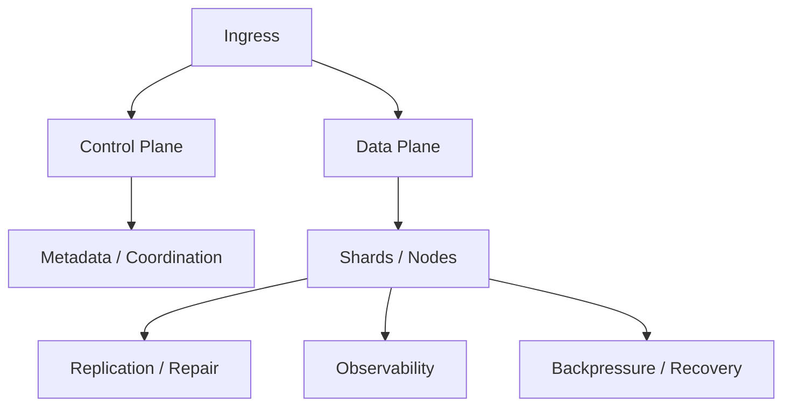
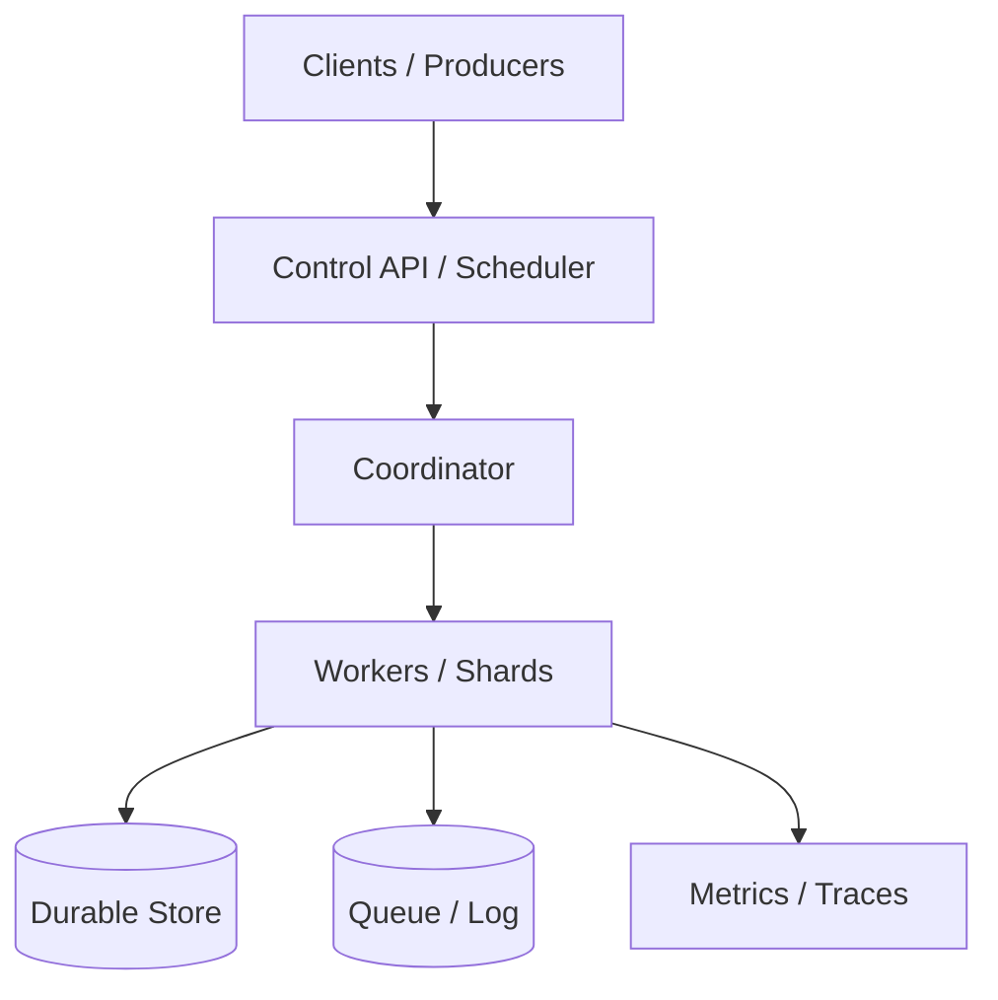

# Hard System Design Problems

[← System Design index](index.md)

These answers are about distributed systems, coordination, consistency, and reliability. Show the control plane, the data plane, and how the system recovers.

## Architecture snapshot



## Questions at a glance

| # | Question |
|---|---|
| 61 | [Design Distributed Web Crawler](#61-design-distributed-web-crawler) |
| 62 | [Design Location-Based Service (Yelp)](#62-design-location-based-service-yelp) |
| 63 | [Design Distributed Task Scheduler](#63-design-distributed-task-scheduler) |
| 64 | [Design Distributed Locking Service](#64-design-distributed-locking-service) |
| 65 | [Design Distributed Consensus Protocol](#65-design-distributed-consensus-protocol) |
| 66 | [Design Key-Value Store (Dynamo/Cassandra style)](#66-design-key-value-store-dynamo-cassandra-style) |
| 67 | [Design Distributed File System (GFS/HDFS)](#67-design-distributed-file-system-gfs-hdfs) |
| 68 | [Design Distributed Message Queue (Kafka)](#68-design-distributed-message-queue-kafka) |
| 69 | [Design Video Processing Pipeline](#69-design-video-processing-pipeline) |
| 70 | [Design Distributed Search Engine](#70-design-distributed-search-engine) |
| 71 | [Design Distributed Transaction System](#71-design-distributed-transaction-system) |
| 72 | [Design Database Replication](#72-design-database-replication) |
| 73 | [Design Database Sharding Strategy](#73-design-database-sharding-strategy) |
| 74 | [Design Real-time Analytics Platform](#74-design-real-time-analytics-platform) |
| 75 | [Design High-Frequency Trading System](#75-design-high-frequency-trading-system) |
| 76 | [Design Ride-Sharing with Surge Pricing](#76-design-ride-sharing-with-surge-pricing) |
| 77 | [Design Video Conference (Zoom)](#77-design-video-conference-zoom) |
| 78 | [Design Real-time Multiplayer Game Server](#78-design-real-time-multiplayer-game-server) |
| 79 | [Design Smart Cache System](#79-design-smart-cache-system) |
| 80 | [Design Spam Detection System](#80-design-spam-detection-system) |
| 81 | [Design Recommendation Algorithm](#81-design-recommendation-algorithm) |
| 82 | [Design Email Delivery System](#82-design-email-delivery-system) |
| 83 | [Design Bug Tracking System (Jira)](#83-design-bug-tracking-system-jira) |
| 84 | [Design Document Management System](#84-design-document-management-system) |
| 85 | [Design A/B Testing Platform](#85-design-a-b-testing-platform) |

---
### 61. **Design Distributed Web Crawler**

#### Answer summary

This is a distributed-systems question: explain the control plane, the data plane, partitioning, replication, recovery, and the operational model that keeps the system stable under load.

#### Key points

- What the client path looks like end to end
- Where the source of truth lives
- Which components absorb burstiness or slow work
- How you scale, observe, and recover

#### Interview details

- Control plane, data plane, partitioning, replication, and recovery.
- Asynchronous processing is used wherever the user does not need an immediate response.
- Explain hotspots, backpressure, and observability.

#### Diagram



<details>
<summary>Original source notes</summary>

{{#include ../../../100_System_Design_Interview_Questions_Complete_Guide.md:1227:1276}}

</details>

---

### 62. **Design Location-Based Service (Yelp)**

#### Answer summary

This is a distributed-systems question: explain the control plane, the data plane, partitioning, replication, recovery, and the operational model that keeps the system stable under load.

#### Key points

- What the client path looks like end to end
- Where the source of truth lives
- Which components absorb burstiness or slow work
- How you scale, observe, and recover

#### Interview details

- Control plane, data plane, partitioning, replication, and recovery.
- Asynchronous processing is used wherever the user does not need an immediate response.
- Explain hotspots, backpressure, and observability.

#### Diagram


<details>
<summary>Original source notes</summary>

{{#include ../../../100_System_Design_Interview_Questions_Complete_Guide.md:1278:1308}}

</details>

---

### 63. **Design Distributed Task Scheduler**

#### Answer summary

This is a distributed-systems question: explain the control plane, the data plane, partitioning, replication, recovery, and the operational model that keeps the system stable under load.

#### Key points

- What the client path looks like end to end
- Where the source of truth lives
- Which components absorb burstiness or slow work
- How you scale, observe, and recover

#### Interview details

- Control plane, data plane, partitioning, replication, and recovery.
- Asynchronous processing is used wherever the user does not need an immediate response.
- Explain hotspots, backpressure, and observability.

#### Diagram


<details>
<summary>Original source notes</summary>

{{#include ../../../100_System_Design_Interview_Questions_Complete_Guide.md:1310:1350}}

</details>

---

### 64. **Design Distributed Locking Service**

#### Answer summary

This is a distributed-systems question: explain the control plane, the data plane, partitioning, replication, recovery, and the operational model that keeps the system stable under load.

#### Key points

- What the client path looks like end to end
- Where the source of truth lives
- Which components absorb burstiness or slow work
- How you scale, observe, and recover

#### Interview details

- Control plane, data plane, partitioning, replication, and recovery.
- Asynchronous processing is used wherever the user does not need an immediate response.
- Explain hotspots, backpressure, and observability.

#### Diagram


<details>
<summary>Original source notes</summary>

{{#include ../../../100_System_Design_Interview_Questions_Complete_Guide.md:1352:1385}}

</details>

---

### 65. **Design Distributed Consensus Protocol**

#### Answer summary

This is a distributed-systems question: explain the control plane, the data plane, partitioning, replication, recovery, and the operational model that keeps the system stable under load.

#### Key points

- What the client path looks like end to end
- Where the source of truth lives
- Which components absorb burstiness or slow work
- How you scale, observe, and recover

#### Interview details

- Control plane, data plane, partitioning, replication, and recovery.
- Asynchronous processing is used wherever the user does not need an immediate response.
- Explain hotspots, backpressure, and observability.

#### Diagram


<details>
<summary>Original source notes</summary>

{{#include ../../../100_System_Design_Interview_Questions_Complete_Guide.md:1387:1405}}

</details>

---

### 66. **Design Key-Value Store (Dynamo/Cassandra style)**

#### Answer summary

Design Key-Value Store (Dynamo/Cassandra style) by starting with the user flow, then naming the durable state, hot-path cache, async pipeline, and failure handling. A strong answer is less about naming technologies and more about explaining why each component exists.

#### Key points

- What the client path looks like end to end
- Where the source of truth lives
- Which components absorb burstiness or slow work
- How you scale, observe, and recover

#### Interview details

- Request flow and primary API
- Durable state and hot-path acceleration
- Failure handling and observability

#### Diagram


<details>
<summary>Original source notes</summary>

{{#include ../../../100_System_Design_Interview_Questions_Complete_Guide.md:1407:1435}}

</details>

---

### 67. **Design Distributed File System (GFS/HDFS)**

#### Answer summary

This is a distributed-systems question: explain the control plane, the data plane, partitioning, replication, recovery, and the operational model that keeps the system stable under load.

#### Key points

- What the client path looks like end to end
- Where the source of truth lives
- Which components absorb burstiness or slow work
- How you scale, observe, and recover

#### Interview details

- Control plane, data plane, partitioning, replication, and recovery.
- Asynchronous processing is used wherever the user does not need an immediate response.
- Explain hotspots, backpressure, and observability.

#### Diagram


<details>
<summary>Original source notes</summary>

{{#include ../../../100_System_Design_Interview_Questions_Complete_Guide.md:1437:1461}}

</details>

---

### 68. **Design Distributed Message Queue (Kafka)**

#### Answer summary

This is a distributed-systems question: explain the control plane, the data plane, partitioning, replication, recovery, and the operational model that keeps the system stable under load.

#### Key points

- What the client path looks like end to end
- Where the source of truth lives
- Which components absorb burstiness or slow work
- How you scale, observe, and recover

#### Interview details

- Control plane, data plane, partitioning, replication, and recovery.
- Asynchronous processing is used wherever the user does not need an immediate response.
- Explain hotspots, backpressure, and observability.

#### Diagram


<details>
<summary>Original source notes</summary>

{{#include ../../../100_System_Design_Interview_Questions_Complete_Guide.md:1463:1497}}

</details>

---

### 69. **Design Video Processing Pipeline**

#### Answer summary

This is a distributed-systems question: explain the control plane, the data plane, partitioning, replication, recovery, and the operational model that keeps the system stable under load.

#### Key points

- What the client path looks like end to end
- Where the source of truth lives
- Which components absorb burstiness or slow work
- How you scale, observe, and recover

#### Interview details

- Control plane, data plane, partitioning, replication, and recovery.
- Asynchronous processing is used wherever the user does not need an immediate response.
- Explain hotspots, backpressure, and observability.

#### Diagram


<details>
<summary>Original source notes</summary>

{{#include ../../../100_System_Design_Interview_Questions_Complete_Guide.md:1499:1529}}

</details>

---

### 70. **Design Distributed Search Engine**

#### Answer summary

This is a distributed-systems question: explain the control plane, the data plane, partitioning, replication, recovery, and the operational model that keeps the system stable under load.

#### Key points

- What the client path looks like end to end
- Where the source of truth lives
- Which components absorb burstiness or slow work
- How you scale, observe, and recover

#### Interview details

- Control plane, data plane, partitioning, replication, and recovery.
- Asynchronous processing is used wherever the user does not need an immediate response.
- Explain hotspots, backpressure, and observability.

#### Diagram


<details>
<summary>Original source notes</summary>

{{#include ../../../100_System_Design_Interview_Questions_Complete_Guide.md:1531:1553}}

</details>

---

### 71. **Design Distributed Transaction System**

#### Answer summary

This is a distributed-systems question: explain the control plane, the data plane, partitioning, replication, recovery, and the operational model that keeps the system stable under load.

#### Key points

- What the client path looks like end to end
- Where the source of truth lives
- Which components absorb burstiness or slow work
- How you scale, observe, and recover

#### Interview details

- Control plane, data plane, partitioning, replication, and recovery.
- Asynchronous processing is used wherever the user does not need an immediate response.
- Explain hotspots, backpressure, and observability.

#### Diagram


<details>
<summary>Original source notes</summary>

{{#include ../../../100_System_Design_Interview_Questions_Complete_Guide.md:1555:1576}}

</details>

---

### 72. **Design Database Replication**

#### Answer summary

This is a distributed-systems question: explain the control plane, the data plane, partitioning, replication, recovery, and the operational model that keeps the system stable under load.

#### Key points

- What the client path looks like end to end
- Where the source of truth lives
- Which components absorb burstiness or slow work
- How you scale, observe, and recover

#### Interview details

- Control plane, data plane, partitioning, replication, and recovery.
- Asynchronous processing is used wherever the user does not need an immediate response.
- Explain hotspots, backpressure, and observability.

#### Diagram


<details>
<summary>Original source notes</summary>

{{#include ../../../100_System_Design_Interview_Questions_Complete_Guide.md:1578:1598}}

</details>

---

### 73. **Design Database Sharding Strategy**

#### Answer summary

This is a distributed-systems question: explain the control plane, the data plane, partitioning, replication, recovery, and the operational model that keeps the system stable under load.

#### Key points

- What the client path looks like end to end
- Where the source of truth lives
- Which components absorb burstiness or slow work
- How you scale, observe, and recover

#### Interview details

- Control plane, data plane, partitioning, replication, and recovery.
- Asynchronous processing is used wherever the user does not need an immediate response.
- Explain hotspots, backpressure, and observability.

#### Diagram


<details>
<summary>Original source notes</summary>

{{#include ../../../100_System_Design_Interview_Questions_Complete_Guide.md:1600:1614}}

</details>

---

### 74. **Design Real-time Analytics Platform**

#### Answer summary

This is a distributed-systems question: explain the control plane, the data plane, partitioning, replication, recovery, and the operational model that keeps the system stable under load.

#### Key points

- What the client path looks like end to end
- Where the source of truth lives
- Which components absorb burstiness or slow work
- How you scale, observe, and recover

#### Interview details

- Control plane, data plane, partitioning, replication, and recovery.
- Asynchronous processing is used wherever the user does not need an immediate response.
- Explain hotspots, backpressure, and observability.

#### Diagram


<details>
<summary>Original source notes</summary>

{{#include ../../../100_System_Design_Interview_Questions_Complete_Guide.md:1616:1630}}

</details>

---

### 75. **Design High-Frequency Trading System**

#### Answer summary

This is a distributed-systems question: explain the control plane, the data plane, partitioning, replication, recovery, and the operational model that keeps the system stable under load.

#### Key points

- What the client path looks like end to end
- Where the source of truth lives
- Which components absorb burstiness or slow work
- How you scale, observe, and recover

#### Interview details

- Control plane, data plane, partitioning, replication, and recovery.
- Asynchronous processing is used wherever the user does not need an immediate response.
- Explain hotspots, backpressure, and observability.

#### Diagram


<details>
<summary>Original source notes</summary>

{{#include ../../../100_System_Design_Interview_Questions_Complete_Guide.md:1632:1652}}

</details>

---

### 76. **Design Ride-Sharing with Surge Pricing**

#### Answer summary

This is a distributed-systems question: explain the control plane, the data plane, partitioning, replication, recovery, and the operational model that keeps the system stable under load.

#### Key points

- What the client path looks like end to end
- Where the source of truth lives
- Which components absorb burstiness or slow work
- How you scale, observe, and recover

#### Interview details

- Control plane, data plane, partitioning, replication, and recovery.
- Asynchronous processing is used wherever the user does not need an immediate response.
- Explain hotspots, backpressure, and observability.

#### Diagram


<details>
<summary>Original source notes</summary>

{{#include ../../../100_System_Design_Interview_Questions_Complete_Guide.md:1654:1673}}

</details>

---

### 77. **Design Video Conference (Zoom)**

#### Answer summary

This is a distributed-systems question: explain the control plane, the data plane, partitioning, replication, recovery, and the operational model that keeps the system stable under load.

#### Key points

- What the client path looks like end to end
- Where the source of truth lives
- Which components absorb burstiness or slow work
- How you scale, observe, and recover

#### Interview details

- Control plane, data plane, partitioning, replication, and recovery.
- Asynchronous processing is used wherever the user does not need an immediate response.
- Explain hotspots, backpressure, and observability.

#### Diagram


<details>
<summary>Original source notes</summary>

{{#include ../../../100_System_Design_Interview_Questions_Complete_Guide.md:1675:1710}}

</details>

---

### 78. **Design Real-time Multiplayer Game Server**

#### Answer summary

This is a distributed-systems question: explain the control plane, the data plane, partitioning, replication, recovery, and the operational model that keeps the system stable under load.

#### Key points

- What the client path looks like end to end
- Where the source of truth lives
- Which components absorb burstiness or slow work
- How you scale, observe, and recover

#### Interview details

- Control plane, data plane, partitioning, replication, and recovery.
- Asynchronous processing is used wherever the user does not need an immediate response.
- Explain hotspots, backpressure, and observability.

#### Diagram


<details>
<summary>Original source notes</summary>

{{#include ../../../100_System_Design_Interview_Questions_Complete_Guide.md:1712:1743}}

</details>

---

### 79. **Design Smart Cache System**

#### Answer summary

This is a distributed-systems question: explain the control plane, the data plane, partitioning, replication, recovery, and the operational model that keeps the system stable under load.

#### Key points

- What the client path looks like end to end
- Where the source of truth lives
- Which components absorb burstiness or slow work
- How you scale, observe, and recover

#### Interview details

- Control plane, data plane, partitioning, replication, and recovery.
- Asynchronous processing is used wherever the user does not need an immediate response.
- Explain hotspots, backpressure, and observability.

#### Diagram


<details>
<summary>Original source notes</summary>

{{#include ../../../100_System_Design_Interview_Questions_Complete_Guide.md:1745:1757}}

</details>

---

### 80. **Design Spam Detection System**

#### Answer summary

This is a distributed-systems question: explain the control plane, the data plane, partitioning, replication, recovery, and the operational model that keeps the system stable under load.

#### Key points

- What the client path looks like end to end
- Where the source of truth lives
- Which components absorb burstiness or slow work
- How you scale, observe, and recover

#### Interview details

- Control plane, data plane, partitioning, replication, and recovery.
- Asynchronous processing is used wherever the user does not need an immediate response.
- Explain hotspots, backpressure, and observability.

#### Diagram

```mermaid
flowchart TD
  Client[Clients / Producers] --> API[Control API / Scheduler]
  API --> Coord[Coordinator]
  Coord --> Workers[Workers / Shards]
  Workers --> Store[(Durable Store)]
  Workers --> Queue[(Queue / Log)]
  Workers --> Obs[Metrics / Traces]
```

<details>
<summary>Original source notes</summary>

{{#include ../../../100_System_Design_Interview_Questions_Complete_Guide.md:1759:1782}}

</details>

---

### 81. **Design Recommendation Algorithm**

#### Answer summary

This is a distributed-systems question: explain the control plane, the data plane, partitioning, replication, recovery, and the operational model that keeps the system stable under load.

#### Key points

- What the client path looks like end to end
- Where the source of truth lives
- Which components absorb burstiness or slow work
- How you scale, observe, and recover

#### Interview details

- Control plane, data plane, partitioning, replication, and recovery.
- Asynchronous processing is used wherever the user does not need an immediate response.
- Explain hotspots, backpressure, and observability.

#### Diagram

```mermaid
flowchart TD
  Client[Clients / Producers] --> API[Control API / Scheduler]
  API --> Coord[Coordinator]
  Coord --> Workers[Workers / Shards]
  Workers --> Store[(Durable Store)]
  Workers --> Queue[(Queue / Log)]
  Workers --> Obs[Metrics / Traces]
```

<details>
<summary>Original source notes</summary>

{{#include ../../../100_System_Design_Interview_Questions_Complete_Guide.md:1784:1808}}

</details>

---

### 82. **Design Email Delivery System**

#### Answer summary

Email systems are fundamentally about reliable delivery: queue outbound mail, retry intelligently, track delivery state, and isolate spam/abuse controls from the sending path.

#### Key points

- What the client path looks like end to end
- Where the source of truth lives
- Which components absorb burstiness or slow work
- How you scale, observe, and recover

#### Interview details

- Compose, queue, deliver, retry, and track status.
- Separate sending from inboxing; treat retries and bounces explicitly.
- Talk about throttling and spam/abuse controls.

#### Diagram

```mermaid
flowchart TD
  Client[Clients / Producers] --> API[Control API / Scheduler]
  API --> Coord[Coordinator]
  Coord --> Workers[Workers / Shards]
  Workers --> Store[(Durable Store)]
  Workers --> Queue[(Queue / Log)]
  Workers --> Obs[Metrics / Traces]
```

<details>
<summary>Original source notes</summary>

{{#include ../../../100_System_Design_Interview_Questions_Complete_Guide.md:1810:1832}}

</details>

---

### 83. **Design Bug Tracking System (Jira)**

#### Answer summary

This is a distributed-systems question: explain the control plane, the data plane, partitioning, replication, recovery, and the operational model that keeps the system stable under load.

#### Key points

- What the client path looks like end to end
- Where the source of truth lives
- Which components absorb burstiness or slow work
- How you scale, observe, and recover

#### Interview details

- Control plane, data plane, partitioning, replication, and recovery.
- Asynchronous processing is used wherever the user does not need an immediate response.
- Explain hotspots, backpressure, and observability.

#### Diagram

```mermaid
flowchart TD
  Client[Clients / Producers] --> API[Control API / Scheduler]
  API --> Coord[Coordinator]
  Coord --> Workers[Workers / Shards]
  Workers --> Store[(Durable Store)]
  Workers --> Queue[(Queue / Log)]
  Workers --> Obs[Metrics / Traces]
```

<details>
<summary>Original source notes</summary>

{{#include ../../../100_System_Design_Interview_Questions_Complete_Guide.md:1834:1843}}

</details>

---

### 84. **Design Document Management System**

#### Answer summary

This is a distributed-systems question: explain the control plane, the data plane, partitioning, replication, recovery, and the operational model that keeps the system stable under load.

#### Key points

- What the client path looks like end to end
- Where the source of truth lives
- Which components absorb burstiness or slow work
- How you scale, observe, and recover

#### Interview details

- Control plane, data plane, partitioning, replication, and recovery.
- Asynchronous processing is used wherever the user does not need an immediate response.
- Explain hotspots, backpressure, and observability.

#### Diagram

```mermaid
flowchart TD
  Client[Clients / Producers] --> API[Control API / Scheduler]
  API --> Coord[Coordinator]
  Coord --> Workers[Workers / Shards]
  Workers --> Store[(Durable Store)]
  Workers --> Queue[(Queue / Log)]
  Workers --> Obs[Metrics / Traces]
```

<details>
<summary>Original source notes</summary>

{{#include ../../../100_System_Design_Interview_Questions_Complete_Guide.md:1845:1855}}

</details>

---

### 85. **Design A/B Testing Platform**

#### Answer summary

This is a distributed-systems question: explain the control plane, the data plane, partitioning, replication, recovery, and the operational model that keeps the system stable under load.

#### Key points

- What the client path looks like end to end
- Where the source of truth lives
- Which components absorb burstiness or slow work
- How you scale, observe, and recover

#### Interview details

- Control plane, data plane, partitioning, replication, and recovery.
- Asynchronous processing is used wherever the user does not need an immediate response.
- Explain hotspots, backpressure, and observability.

#### Diagram

```mermaid
flowchart TD
  Client[Clients / Producers] --> API[Control API / Scheduler]
  API --> Coord[Coordinator]
  Coord --> Workers[Workers / Shards]
  Workers --> Store[(Durable Store)]
  Workers --> Queue[(Queue / Log)]
  Workers --> Obs[Metrics / Traces]
```

<details>
<summary>Original source notes</summary>

{{#include ../../../100_System_Design_Interview_Questions_Complete_Guide.md:1857:1880}}

</details>
