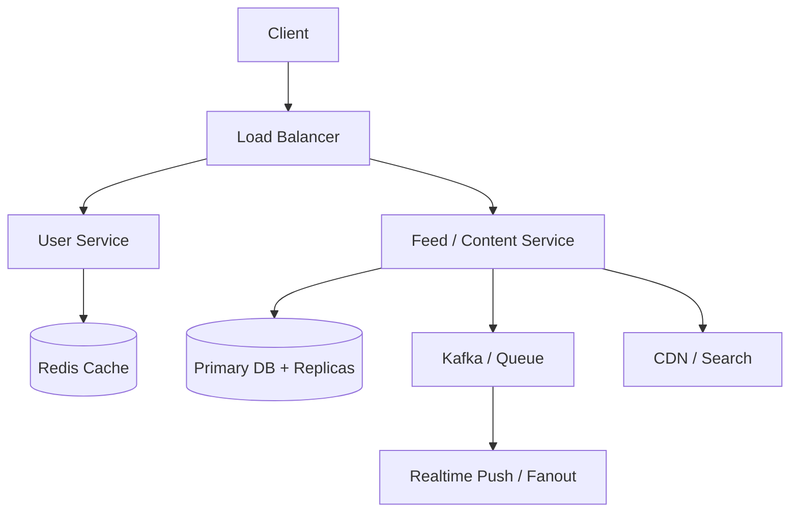
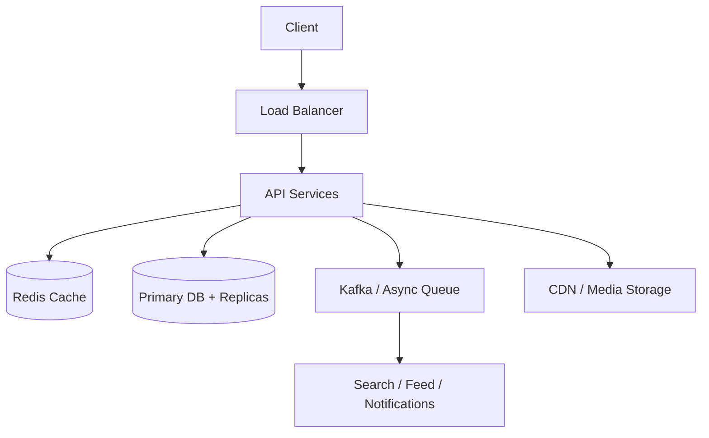
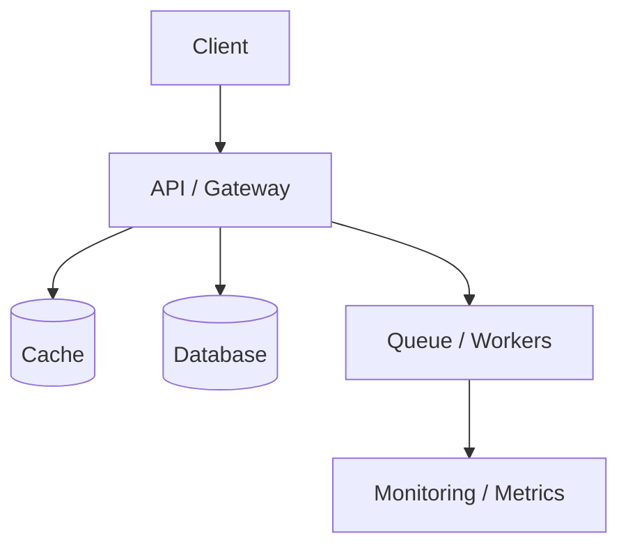

# Medium System Design Problems

[← System Design index](index.md)

These are product-scale systems. Explain request flow, fanout, caching, search, async work, and the trade-off between simplicity and scale.

## Architecture snapshot



## Questions at a glance

| # | Question |
|---|---|
| 36 | [Design Instagram](#36-design-instagram) |
| 37 | [Design Twitter](#37-design-twitter) |
| 38 | [Design Facebook](#38-design-facebook) |
| 39 | [Design WhatsApp](#39-design-whatsapp) |
| 40 | [Design YouTube](#40-design-youtube) |
| 41 | [Design Netflix](#41-design-netflix) |
| 42 | [Design Uber](#42-design-uber) |
| 43 | [Design Google Maps](#43-design-google-maps) |
| 44 | [Design Dropbox](#44-design-dropbox) |
| 45 | [Design Spotify](#45-design-spotify) |
| 46 | [Design TikTok](#46-design-tiktok) |
| 47 | [Design Airbnb](#47-design-airbnb) |
| 48 | [Design E-commerce (Amazon)](#48-design-e-commerce-amazon) |
| 49 | [Design Rate Limiter](#49-design-rate-limiter) |
| 50 | [Design Notification System](#50-design-notification-system) |
| 51 | [Design Messenger (Facebook Messenger)](#51-design-messenger-facebook-messenger) |
| 52 | [Design Slack](#52-design-slack) |
| 53 | [Design Twitch (Live Streaming)](#53-design-twitch-live-streaming) |
| 54 | [Design Booking.com](#54-design-booking-com) |
| 55 | [Design Payment System](#55-design-payment-system) |
| 56 | [Design Flight Booking System](#56-design-flight-booking-system) |
| 57 | [Design Google Search](#57-design-google-search) |
| 58 | [Design News Feed Aggregation (Reddit)](#58-design-news-feed-aggregation-reddit) |
| 59 | [Design Advertising Platform](#59-design-advertising-platform) |
| 60 | [Design Google Docs](#60-design-google-docs) |

---
### 36. **Design Instagram**

#### Answer summary

This is a product-scale design: start with the edge tier, then explain the main services, caches, storage, asynchronous pipelines, and the read path that keeps the user experience fast.

#### Key points

- What the client path looks like end to end
- Where the source of truth lives
- Which components absorb burstiness or slow work
- How you scale, observe, and recover

#### Interview details

- Edge/API layer, service decomposition, cache, primary store, async queue, and specialized read paths like search or CDN.
- Describe fanout, personalization, and media/search delivery if they matter.
- Call out the major trade-off: consistency, latency, and cost.

#### Diagram



<details>
<summary>Original source notes</summary>

{{#include ../../../100_System_Design_Interview_Questions_Complete_Guide.md:490:567}}

</details>

---

### 37. **Design Twitter**

#### Answer summary

This is a product-scale design: start with the edge tier, then explain the main services, caches, storage, asynchronous pipelines, and the read path that keeps the user experience fast.

#### Key points

- What the client path looks like end to end
- Where the source of truth lives
- Which components absorb burstiness or slow work
- How you scale, observe, and recover

#### Interview details

- Edge/API layer, service decomposition, cache, primary store, async queue, and specialized read paths like search or CDN.
- Describe fanout, personalization, and media/search delivery if they matter.
- Call out the major trade-off: consistency, latency, and cost.

#### Diagram


<details>
<summary>Original source notes</summary>

{{#include ../../../100_System_Design_Interview_Questions_Complete_Guide.md:569:607}}

</details>

---

### 38. **Design Facebook**

#### Answer summary

This is a product-scale design: start with the edge tier, then explain the main services, caches, storage, asynchronous pipelines, and the read path that keeps the user experience fast.

#### Key points

- What the client path looks like end to end
- Where the source of truth lives
- Which components absorb burstiness or slow work
- How you scale, observe, and recover

#### Interview details

- Edge/API layer, service decomposition, cache, primary store, async queue, and specialized read paths like search or CDN.
- Describe fanout, personalization, and media/search delivery if they matter.
- Call out the major trade-off: consistency, latency, and cost.

#### Diagram


<details>
<summary>Original source notes</summary>

{{#include ../../../100_System_Design_Interview_Questions_Complete_Guide.md:609:637}}

</details>

---

### 39. **Design WhatsApp**

#### Answer summary

This is a product-scale design: start with the edge tier, then explain the main services, caches, storage, asynchronous pipelines, and the read path that keeps the user experience fast.

#### Key points

- What the client path looks like end to end
- Where the source of truth lives
- Which components absorb burstiness or slow work
- How you scale, observe, and recover

#### Interview details

- Edge/API layer, service decomposition, cache, primary store, async queue, and specialized read paths like search or CDN.
- Describe fanout, personalization, and media/search delivery if they matter.
- Call out the major trade-off: consistency, latency, and cost.

#### Diagram


<details>
<summary>Original source notes</summary>

{{#include ../../../100_System_Design_Interview_Questions_Complete_Guide.md:639:681}}

</details>

---

### 40. **Design YouTube**

#### Answer summary

This is a product-scale design: start with the edge tier, then explain the main services, caches, storage, asynchronous pipelines, and the read path that keeps the user experience fast.

#### Key points

- What the client path looks like end to end
- Where the source of truth lives
- Which components absorb burstiness or slow work
- How you scale, observe, and recover

#### Interview details

- Edge/API layer, service decomposition, cache, primary store, async queue, and specialized read paths like search or CDN.
- Describe fanout, personalization, and media/search delivery if they matter.
- Call out the major trade-off: consistency, latency, and cost.

#### Diagram


<details>
<summary>Original source notes</summary>

{{#include ../../../100_System_Design_Interview_Questions_Complete_Guide.md:683:728}}

</details>

---

### 41. **Design Netflix**

#### Answer summary

This is a product-scale design: start with the edge tier, then explain the main services, caches, storage, asynchronous pipelines, and the read path that keeps the user experience fast.

#### Key points

- What the client path looks like end to end
- Where the source of truth lives
- Which components absorb burstiness or slow work
- How you scale, observe, and recover

#### Interview details

- Edge/API layer, service decomposition, cache, primary store, async queue, and specialized read paths like search or CDN.
- Describe fanout, personalization, and media/search delivery if they matter.
- Call out the major trade-off: consistency, latency, and cost.

#### Diagram


<details>
<summary>Original source notes</summary>

{{#include ../../../100_System_Design_Interview_Questions_Complete_Guide.md:730:744}}

</details>

---

### 42. **Design Uber**

#### Answer summary

This is a product-scale design: start with the edge tier, then explain the main services, caches, storage, asynchronous pipelines, and the read path that keeps the user experience fast.

#### Key points

- What the client path looks like end to end
- Where the source of truth lives
- Which components absorb burstiness or slow work
- How you scale, observe, and recover

#### Interview details

- Edge/API layer, service decomposition, cache, primary store, async queue, and specialized read paths like search or CDN.
- Describe fanout, personalization, and media/search delivery if they matter.
- Call out the major trade-off: consistency, latency, and cost.

#### Diagram


<details>
<summary>Original source notes</summary>

{{#include ../../../100_System_Design_Interview_Questions_Complete_Guide.md:746:786}}

</details>

---

### 43. **Design Google Maps**

#### Answer summary

This is a product-scale design: start with the edge tier, then explain the main services, caches, storage, asynchronous pipelines, and the read path that keeps the user experience fast.

#### Key points

- What the client path looks like end to end
- Where the source of truth lives
- Which components absorb burstiness or slow work
- How you scale, observe, and recover

#### Interview details

- Edge/API layer, service decomposition, cache, primary store, async queue, and specialized read paths like search or CDN.
- Describe fanout, personalization, and media/search delivery if they matter.
- Call out the major trade-off: consistency, latency, and cost.

#### Diagram


<details>
<summary>Original source notes</summary>

{{#include ../../../100_System_Design_Interview_Questions_Complete_Guide.md:788:823}}

</details>

---

### 44. **Design Dropbox**

#### Answer summary

This is a product-scale design: start with the edge tier, then explain the main services, caches, storage, asynchronous pipelines, and the read path that keeps the user experience fast.

#### Key points

- What the client path looks like end to end
- Where the source of truth lives
- Which components absorb burstiness or slow work
- How you scale, observe, and recover

#### Interview details

- Edge/API layer, service decomposition, cache, primary store, async queue, and specialized read paths like search or CDN.
- Describe fanout, personalization, and media/search delivery if they matter.
- Call out the major trade-off: consistency, latency, and cost.

#### Diagram


<details>
<summary>Original source notes</summary>

{{#include ../../../100_System_Design_Interview_Questions_Complete_Guide.md:825:865}}

</details>

---

### 45. **Design Spotify**

#### Answer summary

This is a product-scale design: start with the edge tier, then explain the main services, caches, storage, asynchronous pipelines, and the read path that keeps the user experience fast.

#### Key points

- What the client path looks like end to end
- Where the source of truth lives
- Which components absorb burstiness or slow work
- How you scale, observe, and recover

#### Interview details

- Edge/API layer, service decomposition, cache, primary store, async queue, and specialized read paths like search or CDN.
- Describe fanout, personalization, and media/search delivery if they matter.
- Call out the major trade-off: consistency, latency, and cost.

#### Diagram


<details>
<summary>Original source notes</summary>

{{#include ../../../100_System_Design_Interview_Questions_Complete_Guide.md:867:883}}

</details>

---

### 46. **Design TikTok**

#### Answer summary

This is a product-scale design: start with the edge tier, then explain the main services, caches, storage, asynchronous pipelines, and the read path that keeps the user experience fast.

#### Key points

- What the client path looks like end to end
- Where the source of truth lives
- Which components absorb burstiness or slow work
- How you scale, observe, and recover

#### Interview details

- Edge/API layer, service decomposition, cache, primary store, async queue, and specialized read paths like search or CDN.
- Describe fanout, personalization, and media/search delivery if they matter.
- Call out the major trade-off: consistency, latency, and cost.

#### Diagram


<details>
<summary>Original source notes</summary>

{{#include ../../../100_System_Design_Interview_Questions_Complete_Guide.md:885:919}}

</details>

---

### 47. **Design Airbnb**

#### Answer summary

This is a product-scale design: start with the edge tier, then explain the main services, caches, storage, asynchronous pipelines, and the read path that keeps the user experience fast.

#### Key points

- What the client path looks like end to end
- Where the source of truth lives
- Which components absorb burstiness or slow work
- How you scale, observe, and recover

#### Interview details

- Edge/API layer, service decomposition, cache, primary store, async queue, and specialized read paths like search or CDN.
- Describe fanout, personalization, and media/search delivery if they matter.
- Call out the major trade-off: consistency, latency, and cost.

#### Diagram


<details>
<summary>Original source notes</summary>

{{#include ../../../100_System_Design_Interview_Questions_Complete_Guide.md:921:937}}

</details>

---

### 48. **Design E-commerce (Amazon)**

#### Answer summary

This is a product-scale design: start with the edge tier, then explain the main services, caches, storage, asynchronous pipelines, and the read path that keeps the user experience fast.

#### Key points

- What the client path looks like end to end
- Where the source of truth lives
- Which components absorb burstiness or slow work
- How you scale, observe, and recover

#### Interview details

- Edge/API layer, service decomposition, cache, primary store, async queue, and specialized read paths like search or CDN.
- Describe fanout, personalization, and media/search delivery if they matter.
- Call out the major trade-off: consistency, latency, and cost.

#### Diagram


<details>
<summary>Original source notes</summary>

{{#include ../../../100_System_Design_Interview_Questions_Complete_Guide.md:939:956}}

</details>

---

### 49. **Design Rate Limiter**

#### Answer summary

Design Rate Limiter by starting with the user flow, then naming the durable state, hot-path cache, async pipeline, and failure handling. A strong answer is less about naming technologies and more about explaining why each component exists.

#### Key points

- What the client path looks like end to end
- Where the source of truth lives
- Which components absorb burstiness or slow work
- How you scale, observe, and recover

#### Interview details

- Request flow and primary API
- Durable state and hot-path acceleration
- Failure handling and observability

#### Diagram



<details>
<summary>Original source notes</summary>

{{#include ../../../100_System_Design_Interview_Questions_Complete_Guide.md:958:990}}

</details>

---

### 50. **Design Notification System**

#### Answer summary

This is a product-scale design: start with the edge tier, then explain the main services, caches, storage, asynchronous pipelines, and the read path that keeps the user experience fast.

#### Key points

- What the client path looks like end to end
- Where the source of truth lives
- Which components absorb burstiness or slow work
- How you scale, observe, and recover

#### Interview details

- Edge/API layer, service decomposition, cache, primary store, async queue, and specialized read paths like search or CDN.
- Describe fanout, personalization, and media/search delivery if they matter.
- Call out the major trade-off: consistency, latency, and cost.

#### Diagram


<details>
<summary>Original source notes</summary>

{{#include ../../../100_System_Design_Interview_Questions_Complete_Guide.md:992:1022}}

</details>

---

### 51. **Design Messenger (Facebook Messenger)**

#### Answer summary

This is a product-scale design: start with the edge tier, then explain the main services, caches, storage, asynchronous pipelines, and the read path that keeps the user experience fast.

#### Key points

- What the client path looks like end to end
- Where the source of truth lives
- Which components absorb burstiness or slow work
- How you scale, observe, and recover

#### Interview details

- Edge/API layer, service decomposition, cache, primary store, async queue, and specialized read paths like search or CDN.
- Describe fanout, personalization, and media/search delivery if they matter.
- Call out the major trade-off: consistency, latency, and cost.

#### Diagram


<details>
<summary>Original source notes</summary>

{{#include ../../../100_System_Design_Interview_Questions_Complete_Guide.md:1024:1032}}

</details>

---

### 52. **Design Slack**

#### Answer summary

This is a product-scale design: start with the edge tier, then explain the main services, caches, storage, asynchronous pipelines, and the read path that keeps the user experience fast.

#### Key points

- What the client path looks like end to end
- Where the source of truth lives
- Which components absorb burstiness or slow work
- How you scale, observe, and recover

#### Interview details

- Edge/API layer, service decomposition, cache, primary store, async queue, and specialized read paths like search or CDN.
- Describe fanout, personalization, and media/search delivery if they matter.
- Call out the major trade-off: consistency, latency, and cost.

#### Diagram


<details>
<summary>Original source notes</summary>

{{#include ../../../100_System_Design_Interview_Questions_Complete_Guide.md:1034:1049}}

</details>

---

### 53. **Design Twitch (Live Streaming)**

#### Answer summary

This is a product-scale design: start with the edge tier, then explain the main services, caches, storage, asynchronous pipelines, and the read path that keeps the user experience fast.

#### Key points

- What the client path looks like end to end
- Where the source of truth lives
- Which components absorb burstiness or slow work
- How you scale, observe, and recover

#### Interview details

- Edge/API layer, service decomposition, cache, primary store, async queue, and specialized read paths like search or CDN.
- Describe fanout, personalization, and media/search delivery if they matter.
- Call out the major trade-off: consistency, latency, and cost.

#### Diagram


<details>
<summary>Original source notes</summary>

{{#include ../../../100_System_Design_Interview_Questions_Complete_Guide.md:1051:1065}}

</details>

---

### 54. **Design Booking.com**

#### Answer summary

This is a product-scale design: start with the edge tier, then explain the main services, caches, storage, asynchronous pipelines, and the read path that keeps the user experience fast.

#### Key points

- What the client path looks like end to end
- Where the source of truth lives
- Which components absorb burstiness or slow work
- How you scale, observe, and recover

#### Interview details

- Edge/API layer, service decomposition, cache, primary store, async queue, and specialized read paths like search or CDN.
- Describe fanout, personalization, and media/search delivery if they matter.
- Call out the major trade-off: consistency, latency, and cost.

#### Diagram


<details>
<summary>Original source notes</summary>

{{#include ../../../100_System_Design_Interview_Questions_Complete_Guide.md:1067:1080}}

</details>

---

### 55. **Design Payment System**

#### Answer summary

A payments design needs a durable ledger, idempotency, reconciliation, and auditability. Explain how you keep money movement correct under retries, partial failures, and duplicate requests.

#### Key points

- What the client path looks like end to end
- Where the source of truth lives
- Which components absorb burstiness or slow work
- How you scale, observe, and recover

#### Interview details

- Ledger, idempotency, reconciliation, and audit trail.
- Correctness beats speed; every side effect needs a retry-safe path.
- Explain double-entry style invariants where appropriate.

#### Diagram

```mermaid
flowchart TD
  Client[Client] --> LB[Load Balancer]
  LB --> API[API Services]
  API --> Cache[(Redis Cache)]
  API --> DB[(Primary DB + Replicas)]
  API --> MQ[Kafka / Async Queue]
  API --> CDN[CDN / Media Storage]
  MQ --> Search[Search / Feed / Notifications]
```

<details>
<summary>Original source notes</summary>

{{#include ../../../100_System_Design_Interview_Questions_Complete_Guide.md:1082:1113}}

</details>

---

### 56. **Design Flight Booking System**

#### Answer summary

Design Flight Booking System by starting with the user flow, then naming the durable state, hot-path cache, async pipeline, and failure handling. A strong answer is less about naming technologies and more about explaining why each component exists.

#### Key points

- What the client path looks like end to end
- Where the source of truth lives
- Which components absorb burstiness or slow work
- How you scale, observe, and recover

#### Interview details

- Request flow and primary API
- Durable state and hot-path acceleration
- Failure handling and observability

#### Diagram

```mermaid
flowchart TD
  Client[Client] --> LB[Load Balancer]
  LB --> API[API Services]
  API --> Cache[(Redis Cache)]
  API --> DB[(Primary DB + Replicas)]
  API --> MQ[Kafka / Async Queue]
  API --> CDN[CDN / Media Storage]
  MQ --> Search[Search / Feed / Notifications]
```

<details>
<summary>Original source notes</summary>

{{#include ../../../100_System_Design_Interview_Questions_Complete_Guide.md:1115:1132}}

</details>

---

### 57. **Design Google Search**

#### Answer summary

This is a product-scale design: start with the edge tier, then explain the main services, caches, storage, asynchronous pipelines, and the read path that keeps the user experience fast.

#### Key points

- What the client path looks like end to end
- Where the source of truth lives
- Which components absorb burstiness or slow work
- How you scale, observe, and recover

#### Interview details

- Edge/API layer, service decomposition, cache, primary store, async queue, and specialized read paths like search or CDN.
- Describe fanout, personalization, and media/search delivery if they matter.
- Call out the major trade-off: consistency, latency, and cost.

#### Diagram

```mermaid
flowchart TD
  Client[Client] --> LB[Load Balancer]
  LB --> API[API Services]
  API --> Cache[(Redis Cache)]
  API --> DB[(Primary DB + Replicas)]
  API --> MQ[Kafka / Async Queue]
  API --> CDN[CDN / Media Storage]
  MQ --> Search[Search / Feed / Notifications]
```

<details>
<summary>Original source notes</summary>

{{#include ../../../100_System_Design_Interview_Questions_Complete_Guide.md:1134:1158}}

</details>

---

### 58. **Design News Feed Aggregation (Reddit)**

#### Answer summary

This is a product-scale design: start with the edge tier, then explain the main services, caches, storage, asynchronous pipelines, and the read path that keeps the user experience fast.

#### Key points

- What the client path looks like end to end
- Where the source of truth lives
- Which components absorb burstiness or slow work
- How you scale, observe, and recover

#### Interview details

- Edge/API layer, service decomposition, cache, primary store, async queue, and specialized read paths like search or CDN.
- Describe fanout, personalization, and media/search delivery if they matter.
- Call out the major trade-off: consistency, latency, and cost.

#### Diagram

```mermaid
flowchart TD
  Client[Client] --> LB[Load Balancer]
  LB --> API[API Services]
  API --> Cache[(Redis Cache)]
  API --> DB[(Primary DB + Replicas)]
  API --> MQ[Kafka / Async Queue]
  API --> CDN[CDN / Media Storage]
  MQ --> Search[Search / Feed / Notifications]
```

<details>
<summary>Original source notes</summary>

{{#include ../../../100_System_Design_Interview_Questions_Complete_Guide.md:1160:1174}}

</details>

---

### 59. **Design Advertising Platform**

#### Answer summary

This is a product-scale design: start with the edge tier, then explain the main services, caches, storage, asynchronous pipelines, and the read path that keeps the user experience fast.

#### Key points

- What the client path looks like end to end
- Where the source of truth lives
- Which components absorb burstiness or slow work
- How you scale, observe, and recover

#### Interview details

- Edge/API layer, service decomposition, cache, primary store, async queue, and specialized read paths like search or CDN.
- Describe fanout, personalization, and media/search delivery if they matter.
- Call out the major trade-off: consistency, latency, and cost.

#### Diagram

```mermaid
flowchart TD
  Client[Client] --> LB[Load Balancer]
  LB --> API[API Services]
  API --> Cache[(Redis Cache)]
  API --> DB[(Primary DB + Replicas)]
  API --> MQ[Kafka / Async Queue]
  API --> CDN[CDN / Media Storage]
  MQ --> Search[Search / Feed / Notifications]
```

<details>
<summary>Original source notes</summary>

{{#include ../../../100_System_Design_Interview_Questions_Complete_Guide.md:1176:1190}}

</details>

---

### 60. **Design Google Docs**

#### Answer summary

This is a product-scale design: start with the edge tier, then explain the main services, caches, storage, asynchronous pipelines, and the read path that keeps the user experience fast.

#### Key points

- What the client path looks like end to end
- Where the source of truth lives
- Which components absorb burstiness or slow work
- How you scale, observe, and recover

#### Interview details

- Edge/API layer, service decomposition, cache, primary store, async queue, and specialized read paths like search or CDN.
- Describe fanout, personalization, and media/search delivery if they matter.
- Call out the major trade-off: consistency, latency, and cost.

#### Diagram

```mermaid
flowchart TD
  Client[Client] --> LB[Load Balancer]
  LB --> API[API Services]
  API --> Cache[(Redis Cache)]
  API --> DB[(Primary DB + Replicas)]
  API --> MQ[Kafka / Async Queue]
  API --> CDN[CDN / Media Storage]
  MQ --> Search[Search / Feed / Notifications]
```

<details>
<summary>Original source notes</summary>

{{#include ../../../100_System_Design_Interview_Questions_Complete_Guide.md:1192:1221}}

</details>
