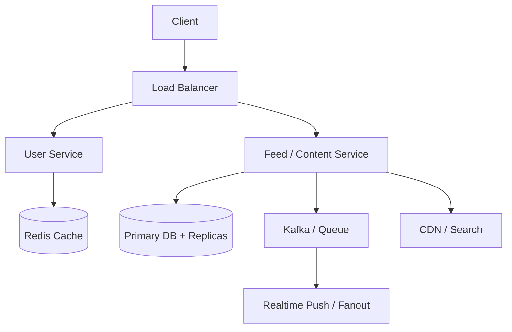

# Medium System Design Problems

[← System Design index](index.md)

These are product-scale systems. Explain request flow, fanout, caching, search, async work, and the trade-off between simplicity and scale.

## Architecture snapshot


```mermaid
flowchart TD
  C[Client] --> LB[Load Balancer]
  LB --> S1[User Service]
  LB --> S2[Feed / Content Service]
  S1 --> R[(Redis Cache)]
  S2 --> DB[(Primary DB + Replicas)]
  S2 --> MQ[Kafka / Queue]
  S2 --> CDN[CDN / Search]
  MQ --> RT[Realtime Push / Fanout]
```

## Questions at a glance

| # | Question |
|---|---|
| 36 | [Design Instagram](#36-design-instagram) |
| 37 | [Design Twitter](#37-design-twitter) |
| 38 | [Design Facebook](#38-design-facebook) |
| 39 | [Design WhatsApp](#39-design-whatsapp) |
| 40 | [Design YouTube](#40-design-youtube) |
| 41 | [Design Netflix](#41-design-netflix) |
| 42 | [Design Uber](#42-design-uber) |
| 43 | [Design Google Maps](#43-design-google-maps) |
| 44 | [Design Dropbox](#44-design-dropbox) |
| 45 | [Design Spotify](#45-design-spotify) |
| 46 | [Design TikTok](#46-design-tiktok) |
| 47 | [Design Airbnb](#47-design-airbnb) |
| 48 | [Design E-commerce (Amazon)](#48-design-e-commerce-amazon) |
| 49 | [Design Rate Limiter](#49-design-rate-limiter) |
| 50 | [Design Notification System](#50-design-notification-system) |
| 51 | [Design Messenger (Facebook Messenger)](#51-design-messenger-facebook-messenger) |
| 52 | [Design Slack](#52-design-slack) |
| 53 | [Design Twitch (Live Streaming)](#53-design-twitch-live-streaming) |
| 54 | [Design Booking.com](#54-design-booking-com) |
| 55 | [Design Payment System](#55-design-payment-system) |
| 56 | [Design Flight Booking System](#56-design-flight-booking-system) |
| 57 | [Design Google Search](#57-design-google-search) |
| 58 | [Design News Feed Aggregation (Reddit)](#58-design-news-feed-aggregation-reddit) |
| 59 | [Design Advertising Platform](#59-design-advertising-platform) |
| 60 | [Design Google Docs](#60-design-google-docs) |
| 61 | [Design Distributed Web Crawler](#61-design-distributed-web-crawler) |
| 62 | [Design Location-Based Service (Yelp)](#62-design-location-based-service-yelp) |
| 63 | [Design Distributed Task Scheduler](#63-design-distributed-task-scheduler) |
| 64 | [Design Distributed Locking Service](#64-design-distributed-locking-service) |
| 65 | [Design Distributed Consensus Protocol](#65-design-distributed-consensus-protocol) |
| 66 | [Design Key-Value Store (Dynamo/Cassandra style)](#66-design-key-value-store-dynamo-cassandra-style) |
| 67 | [Design Distributed File System (GFS/HDFS)](#67-design-distributed-file-system-gfs-hdfs) |
| 68 | [Design Distributed Message Queue (Kafka)](#68-design-distributed-message-queue-kafka) |
| 69 | [Design Video Processing Pipeline](#69-design-video-processing-pipeline) |
| 70 | [Design Distributed Search Engine](#70-design-distributed-search-engine) |

---
### 36. **Design Instagram**

**Why interviewers ask** — Tests whether you can split a social product into read-heavy feeds, write-heavy media uploads, and real-time engagement without one path blocking the other.

**Core insight** — Photos are immutable blobs served from CDN; the hard part is feed fanout (push to followers vs pull at read time) and keeping likes/comments fast without locking the feed.

**Architecture**

```txt
Client → API Gateway → [User | Photo | Feed | Social] services
                              ↓           ↓         ↓
                         PostgreSQL    S3 + CDN   Redis feed cache
                              ↓
                         Kafka → search index, notifications, analytics
```

- **User service** — profiles, follow graph in relational DB, cached in Redis.
- **Photo service** — upload to object storage, async resize/compress, serve via CDN.
- **Feed service** — hybrid fanout: push posts into follower feed caches for normal users; pull/merge for celebrities with huge follower counts.
- **Social layer** — likes/comments as separate counters; WebSocket or push for live updates.

**Key decisions** — Push fanout for low-latency home feed vs pull for celebrity posts; eventual consistency on feed is acceptable; denormalize follower lists for fanout workers; shard by user ID.

**Scale & failure** — Shard user and media metadata; read replicas for profiles; CDN absorbs image traffic; if fanout queue backs up, degrade to pull-based feed for affected users; idempotent post IDs prevent duplicate feed entries.

**Deep link** — [Social media feed](../backend/system-design/design-a-social-media-feed.md) · [Comments](../backend/system-design/design-a-comments-system.md) · [Image upload](../backend/system-design/design-an-image-upload-and-resize-service.md)

**Memory hook** — Store photos in S3, serve from CDN, fanout feeds in Redis — celebrities break push, so hybrid.

---

### 37. **Design Twitter**

**Why interviewers ask** — The classic fanout problem: one tweet from a celebrity must not write to 10 million follower timelines synchronously.

**Core insight** — Tweets are append-only and immutable; feed generation is the bottleneck, solved with hybrid push/pull and aggressive caching of hot timelines.

**Architecture**

```txt
Client → Tweet API → Cassandra (tweets by tweet_id, user timeline)
                  → Fanout service → Redis (precomputed home feeds)
                  → Trending service (Kafka + time windows)
                  → Elasticsearch (search)
```

- **Write path** — Persist tweet, enqueue fanout job; for users under follower threshold, push tweet ID into each follower's feed cache.
- **Read path** — Merge cached home feed with on-demand fetch for high-fanout authors.
- **Trending** — Count hashtags in sliding windows via stream processing.

**Key decisions** — Hybrid fanout (push for regular users, pull for celebrities); Cassandra for time-ordered tweets; cache top-K tweets per user; separate search index from timeline store.

**Scale & failure** — Partition tweets by ID; fanout workers scale horizontally; stale feed cache is OK briefly; trending can lag seconds; rate-limit posting to stop abuse.

**Deep link** — [Social media feed](../backend/system-design/design-a-social-media-feed.md) · [Like/follow](../backend/system-design/design-a-like-follow-system.md)

**Memory hook** — Immutable tweets, hybrid fanout — push the small fish, pull the whales.

---

### 38. **Design Facebook**

**Why interviewers ask** — Goes beyond Twitter: richer graph (friends, groups, pages), ranked feed, and real-time notifications at billion-user scale.

**Core insight** — The social graph is the product; newsfeed is graph traversal plus ranking, not just chronological fanout.

**Architecture**

```txt
Client → API → Graph service (friends, groups) → graph store / custom index
            → Feed aggregator → candidate posts → ranking ML → cached feed
            → Notification service → WebSocket + message queue
            → Search (people, posts)
```

- **Graph layer** — Store relationships; run BFS-style candidate generation for "friends + groups" posts.
- **Ranking** — Score candidates by recency, engagement, affinity; precompute features offline.
- **Notifications** — Queue events (likes, comments, tags); push via WebSocket with FCM/APNs fallback.

**Key decisions** — Separate graph store from feed store; rank at read time or pre-rank top candidates; notification delivery is at-least-once with dedup keys.

**Scale & failure** — Partition graph by user ID; cache ranked feed slices; notification storms get throttled and batched; search lags primary graph slightly.

**Deep link** — [Social media feed](../backend/system-design/design-a-social-media-feed.md) · [Notification system](../backend/system-design/design-a-notification-system.md)

**Memory hook** — Graph for who you see, rank for what you see first, queue for what pings you.

---

### 39. **Design WhatsApp**

**Why interviewers ask** — Proves you understand persistent connections, message ordering, delivery guarantees, and E2E encryption under massive concurrent load.

**Core insight** — Messages must arrive in order per chat with at-least-once delivery; online users get WebSocket push, offline users get store-and-forward plus push notification.

**Architecture**

```txt
Client ↔ WebSocket gateway (connection pool) → Message service → Cassandra (messages)
                                            → Presence (Redis)
                                            → Media service → encrypted blob storage
                                            → Notification service (FCM/APNs)
```

- **Connection service** — Long-lived WebSocket per device; route by user ID to the right gateway node.
- **Message service** — Write to durable log keyed by chat; ack pipeline: sent → delivered → read.
- **Presence** — Heartbeat every few seconds; Redis for online status.
- **Media** — Encrypt client-side, upload ciphertext, decrypt on recipient device.

**Key decisions** — Cassandra for write-heavy chat history; message queue for offline delivery retries; E2E means server stores ciphertext only; per-chat ordering via sequence numbers.

**Scale & failure** — Shard chats across nodes; reconnect replays missed sequence range; exponential backoff on push; never drop without durable write first.

**Deep link** — [Real-time chat](../backend/system-design/design-a-real-time-chat-system.md) · [Notification system](../backend/system-design/design-a-notification-system.md)

**Memory hook** — WebSocket if online, queue if offline, sequence numbers keep chat order.

---

### 40. **Design YouTube**

**Why interviewers ask** — Combines huge blob storage, async transcoding pipelines, CDN streaming, and recommendation at planetary scale.

**Core insight** — Upload and watch are different systems: upload is async pipeline to many encoded renditions; watch is read-heavy CDN with adaptive bitrate.

**Architecture**

```txt
Upload → chunk ingest → transcode workers (480p–4K, thumbnails, captions) → object storage
Watch  → CDN (HLS/DASH segments) ← metadata DB + recommendation service
       → Search index (Elasticsearch) + trending
```

- **Upload** — Resumable chunked upload; virus scan; enqueue transcode jobs per quality level.
- **Storage** — Hot replicas for viral videos; cold tier for long tail.
- **Streaming** — ABR player picks segment quality from bandwidth; CDN at edge.
- **Discovery** — Collaborative filtering + engagement signals; separate from video bytes.

**Key decisions** — Never block upload on transcode (async); multiple renditions mandatory; search index is eventually consistent with catalog.

**Scale & failure** — 500+ hours uploaded per minute needs elastic worker pools; CDN handles view spikes; if transcode lags, serve lower quality first; dedupe identical uploads via content hash.

**Deep link** — [File upload](../backend/system-design/design-a-file-upload-service.md) · [Recommendation backend](../backend/system-design/design-a-recommendation-backend.md)

**Memory hook** — Upload is a factory line, watch is a CDN menu of quality levels.

---

### 41. **Design Netflix**

**Why interviewers ask** — YouTube plus DRM, regional licensing, and personalization where buffering kills retention.

**Core insight** — Playback must start fast with adaptive quality; content rights and DRM constrain what can play where; recommendations drive what users press play on.

**Architecture**

```txt
Client → CDN (encrypted streams, per-device keys) ← encoding pipeline
      → Catalog + license service (region, subscription tier)
      → Recommendation API ← offline ML features + real-time signals
      → Download manager (offline encrypted cache)
```

- **Streaming** — Pre-encoded ladders per title; client ABR; Open Connect-style CDN placement.
- **DRM** — License server ties playback to device; keys rotate.
- **Catalog** — Regional availability rules enforced at API layer.
- **Recommendations** — Blend collaborative filtering with session context.

**Key decisions** — CDN closer to users than origin; offline downloads are encrypted with expiry; separate control plane (catalog) from data plane (bytes).

**Scale & failure** — Edge cache warms popular titles; license check failure blocks play cleanly; recommendation stale is OK; failover CDN region on outage.

**Deep link** — [Recommendation backend](../backend/system-design/design-a-recommendation-backend.md)

**Memory hook** — Bytes on CDN, keys from DRM, titles from license rules, order from ML.

---

### 42. **Design Uber**

**Why interviewers ask** — Real-time geospatial matching, ETA accuracy, surge pricing, and payments in one flow where seconds matter.

**Core insight** — Driver location is high-churn ephemeral state; matching is a geospatial nearest-neighbor problem; pricing and payment must be correct even when GPS jitters.

**Architecture**

```txt
Rider/Driver apps → Location service (WebSocket, geohash index)
                 → Matching service (quadtree/geohash, rank by ETA)
                 → Trip state machine → Payment service
                 → Pricing (surge by supply/demand zone)
                 → Maps/ETA (routing API + ML)
```

- **Location** — Drivers ping every ~4s; index by geohash cell in Redis or spatial DB.
- **Matching** — Query nearby available drivers; rank by ETA, rating, acceptance rate.
- **Trip lifecycle** — requested → matched → in-progress → completed; idempotent state transitions.
- **Surge** — Partition city into zones; multiply fare when demand/supply ratio exceeds threshold.

**Key decisions** — Eventual consistency OK for driver position; strong consistency for trip state and payment; geohash prefix for shard routing.

**Scale & failure** — Regional data centers; stale driver location may miss match — refresh and retry; payment retries with idempotency keys; surge caps prevent runaway fares.

**Deep link** — [Ride booking backend](../backend/system-design/design-a-ride-booking-backend.md) · [Payment system](../backend/system-design/design-a-payment-system.md)

**Memory hook** — Geohash finds the car, state machine runs the trip, idempotency saves the fare.

---

### 43. **Design Google Maps**

**Why interviewers ask** — Massive geospatial data, sub-second routing, live traffic fusion, and tile rendering at global scale.

**Core insight** — Roads are a weighted graph; routing is preprocessing plus fast query; maps are pre-rendered tiles on CDN, not drawn per request.

**Architecture**

```txt
Client → Tile CDN (precomputed map tiles)
      → Places API → geospatial index (geohash / S2 cells)
      → Routing engine (preprocessed graph, A* / contraction hierarchies)
      → Traffic service (probe data + ML) → edge weights
```

- **Map data** — Road graph stored in shards by region; intersections as nodes, roads as edges with distance/time cost.
- **Routing** — Preprocess hub labels or CH for fast point-to-point; reweight edges with live traffic.
- **Search** — Autocomplete on place names with geo bias toward user location.
- **Tiles** — Zoom-level pyramid; CDN cache by tile coordinates.

**Key decisions** — Precompute what you can (tiles, routing overlays); traffic updates edge weights, not the whole graph; geospatial index choice (geohash vs quadtree) drives nearby search.

**Scale & failure** — Regional graph shards; stale traffic better than no route; tile CDN absorbs render load; fallback to static weights if probes sparse.

**Deep link** — [Search autocomplete](../backend/system-design/design-a-search-autocomplete-system.md)

**Memory hook** — Tiles are pictures, routing is a weighted graph, traffic rewrites the weights.

---

### 44. **Design Dropbox**

**Why interviewers ask** — Sync across devices with conflicts, offline edits, and deduplication — harder than simple upload/download.

**Core insight** — Sync at block level, not file level: content-addressed chunks dedupe storage; metadata tracks versions and per-device sync state.

**Architecture**

```txt
Client (sync agent) → Metadata API → file tree, versions, permissions
                   → Block API → content-addressed blob store (hash = block ID)
                   → Sync engine → delta detection, conflict resolution
```

- **Upload** — Split file into blocks; hash each block; upload only missing blocks.
- **Metadata** — File path, version vector, block list in SQL/NoSQL.
- **Sync** — Compare local vs remote block lists; download deltas; notify other devices via push/long poll.
- **Conflicts** — Last-write-wins or create "conflicted copy" for user merge.

**Key decisions** — Block-level dedup saves storage; metadata is source of truth for structure; clients do heavy lifting to reduce server work.

**Scale & failure** — Cross-DC replication for blocks; metadata DB sharded by account; partial upload resumes via block manifest; conflict copies beat silent data loss.

**Deep link** — [File upload service](../backend/system-design/design-a-file-upload-service.md)

**Memory hook** — Files are lists of hashes; sync means diff the hash lists.

---

### 45. **Design Spotify**

**Why interviewers ask** — Audio streaming with playlists, cross-device sync, offline mode, and discovery — latency-sensitive reads plus social graph.

**Core insight** — Music files are CDN assets; playlists and listening state are metadata; recommendations keep users in the app.

**Architecture**

```txt
Client → Streaming CDN (audio segments) ← catalog service
      → Playlist / library service → user collections DB
      → Playback state sync (device handoff)
      → Recommendation engine (collaborative + editorial)
      → Search index (artists, tracks, podcasts)
```

- **Catalog** — Rights-managed track metadata; regional availability like Netflix.
- **Playlists** — User-curated and algorithmic; stored as ordered track IDs.
- **Playback** — Buffer ahead; quality adapts to bandwidth; offline = encrypted local cache.
- **Discovery** — Daily mixes from taste profile + session context.

**Key decisions** — Separate bytes (CDN) from rights (catalog API); playlist edits are cheap metadata writes; recommendations batch-computed, refreshed incrementally.

**Scale & failure** — CDN for playback spikes; rights check on every stream start; sync conflicts on playlist rare — last-write-wins with version; recommendation lag acceptable.

**Deep link** — [Recommendation backend](../backend/system-design/design-a-recommendation-backend.md)

**Memory hook** — Tracks are CDN files, playlists are ID lists, discovery is ML on those lists.

---

### 46. **Design TikTok**

**Why interviewers ask** — Recommendation-first feed (not social-first), short-video pipeline, and viral spike handling.

**Core insight** — The For You Page is the product; upload/transcode is commodity; ranking loop (watch time, rewatches, shares) drives retention.

**Architecture**

```txt
Upload → transcode (multi-bitrate short video) → object storage + CDN
For You → candidate retrieval (billions → thousands) → real-time ranker → cache
Social  → duets/stitches (video graph), comments, likes
Analytics → engagement stream → ML training + creator dashboards
```

- **Video pipeline** — Fast transcode for short clips; music sync and effects as async jobs.
- **FYP** — Two-stage retrieval then ranking; explore/exploit for new creators.
- **Viral handling** — Auto-scale CDN; hot video replicated to more edge pops.

**Key decisions** — Optimize for watch-time, not follower graph; cache ranked feed per user with short TTL; A/B infra for ranking experiments.

**Scale & failure** — Engagement Kafka must not block playback; ranking stale by seconds is fine; transcode backlog degrades upload UX before read path.

**Deep link** — [Social media feed](../backend/system-design/design-a-social-media-feed.md) · [Recommendation backend](../backend/system-design/design-a-recommendation-backend.md) · [Comments](../backend/system-design/design-a-comments-system.md)

**Memory hook** — FYP is retrieve then rank; followers matter less than seconds watched.

---

### 47. **Design Airbnb**

**Why interviewers ask** — Geospatial search, inventory calendars with no double-booking, reviews, and payments in a marketplace.

**Core insight** — Listings are searchable inventory with date-level availability; booking must be atomic per listing-night; trust comes from reviews and verified identity.

**Architecture**

```txt
Guest → Search (geo + filters + availability index) → listing detail
     → Booking service (hold → confirm → pay) → calendar (per-night inventory)
     → Payment escrow → host payout
     → Review service (post-stay, bilateral)
```

- **Listings** — Host CRUD, photos on CDN, geospatial index for "near me."
- **Calendar** — Each night is inventory unit; pessimistic lock or compare-and-swap on book.
- **Search** — Pre-filter by date range availability before ranking results.

**Key decisions** — Booking hold with TTL (15–30 min) before payment; strong consistency on calendar writes; search index eventually consistent with availability.

**Scale & failure** — Shard listings by region; double-booking prevented by row-level lock or serializable transaction; payment failure releases hold; review spam filtered async.

**Deep link** — [Booking system](../backend/system-design/design-a-booking-system.md) · [Payment system](../backend/system-design/design-a-payment-system.md)

**Memory hook** — Search finds nights, calendar locks nights, payment confirms nights.

---

### 48. **Design E-commerce (Amazon)**

**Why interviewers ask** — Classic commerce split: catalog browse, cart, checkout, inventory, fulfillment — each with different consistency needs.

**Core insight** — Catalog is read-heavy and cacheable; order placement needs ACID inventory decrement and idempotent payment; cart is per-user soft state.

**Architecture**

```txt
Browse → product catalog (cache + search index)
Cart   → session/user cart service (Redis)
Checkout → order service (ACID) → inventory reserve → payment → shipping queue
       → warehouse/fulfillment workers
```

- **Catalog** — Product, SKU, price; CDN for images; search via inverted index.
- **Cart** — Merge anonymous and logged-in carts; no inventory hold until checkout.
- **Order** — Saga or 2PC across inventory + payment; order ID as idempotency key.
- **Inventory** — Reserve on checkout start; release on timeout or cancel.

**Key decisions** — Don't hold inventory in cart; idempotent checkout API; eventual consistency OK for catalog/search; strong for money and stock.

**Scale & failure** — Read replicas and cache for catalog; inventory hot SKUs sharded; payment retry safe via idempotency; oversell prevented by atomic decrement.

**Deep link** — [Order management](../backend/system-design/design-an-order-management-system.md) · [Inventory](../backend/system-design/design-an-inventory-management-system.md) · [Payment system](../backend/system-design/design-a-payment-system.md)

**Memory hook** — Cart is soft, checkout is hard — inventory and money lock together.

---

### 49. **Design Rate Limiter**

**Why interviewers ask** — Every API needs fair usage and abuse protection; they want algorithm knowledge plus distributed counter design.

**Core insight** — Rate limiting is atomic counter math on a shared store; algorithm choice trades burst tolerance vs memory vs boundary accuracy.

**Architecture**

```txt
Request → API gateway → rate limit middleware → Redis (atomic INCR / Lua token bucket)
                     → allowed → upstream service
                     → denied  → 429 + Retry-After
```

- **Token bucket** — Allows bursts; refill rate caps average; most common in production APIs.
- **Leaky bucket** — Smooths output rate; good for protecting downstream.
- **Sliding window** — Accurate but memory-heavy; hybrid counter approximates cheaply.
- **Fixed window** — Simple but double-burst at boundary.

**Key decisions** — Enforce at gateway edge; key = user ID or API key; Redis cluster for distributed counts; fail-open vs fail-closed on Redis outage.

**Scale & failure** — Lua scripts for atomic check-and-decrement; local cache for coarse global limits; per-tenant tiers in config service; monitor throttle rate for abuse signals.

**Deep link** — [Rate limiter](../backend/system-design/design-a-rate-limiter.md) · [Foundation: algorithms](foundations/rate-limiter.md)

**Memory hook** — Token bucket for bursts, Redis Lua for atomic, gateway for enforcement.

---

### 50. **Design Notification System**

**Why interviewers ask** — Multi-channel delivery (push, email, SMS) with templates, scheduling, retries, and user preferences at high volume.

**Core insight** — Producers fire events; notification service routes to channel workers asynchronously — never block the caller on SMTP or FCM latency.

**Architecture**

```txt
App event → Notification API → template render → priority queue (Kafka)
                            → [email | SMS | push] workers → provider APIs
                            → delivery status store + DLQ for failures
```

- **API** — Accept event + user + channel prefs; return immediately after enqueue.
- **Templates** — Parameterized per locale; versioned in DB.
- **Workers** — Per-channel retry with exponential backoff; dead letter after N attempts.
- **Analytics** — Track sent, delivered, opened, clicked per campaign.

**Key decisions** — At-least-once delivery with dedup keys; user preference opt-out honored before enqueue; separate queues per channel for isolation.

**Scale & failure** — Kafka partitions by user ID; provider rate limits trigger backoff; DLQ for manual replay; idempotent notification IDs prevent duplicate pushes.

**Deep link** — [Notification system](../backend/system-design/design-a-notification-system.md) · [Distributed notification](../backend/system-design/design-a-distributed-notification-service.md)

**Memory hook** — Enqueue fast, deliver slow, retry with dedup keys.

---

### 51. **Design Messenger (Facebook Messenger)**

**Why interviewers ask** — Chat at Facebook scale with social features, lighter encryption than WhatsApp, and platform integration.

**Core insight** — Same chat backbone as messaging apps (persistent connection, durable store, delivery acks) plus social graph for presence, read receipts, and rich media.

**Architecture**

```txt
Client ↔ WebSocket cluster → Message service → message store (Cassandra/Scylla)
                          → Presence + typing indicators (Redis)
                          → Media service → CDN
                          → Social graph for contact discovery
                          → Push notification fallback
```

- **Messaging** — 1:1 and group chats; sequence numbers per conversation.
- **Realtime** — Typing, online status, read receipts over same socket.
- **Media** — Thumbnails async; full res on CDN.
- **Integration** — Facebook identity, friend list import.

**Key decisions** — Transport encryption in transit; server-readable for moderation/search unlike WhatsApp E2E; group fanout similar to feed fanout.

**Scale & failure** — Shard by conversation ID; gateway sticky sessions; store-then-ack; push when socket disconnected.

**Deep link** — [Real-time chat](../backend/system-design/design-a-real-time-chat-system.md)

**Memory hook** — WhatsApp bones, Facebook graph skin, server can read for safety.

---

### 52. **Design Slack**

**Why interviewers ask** — Team chat with channels, threads, search, files, and integrations — org structure shapes the data model.

**Core insight** — Workspace is the tenancy boundary; channels index messages for search; realtime delivery plus durable log for history and compliance.

**Architecture**

```txt
Client ↔ WebSocket → Message API → append-only message log (per channel)
                → Channel/workspace ACL service
                → Search index (Elasticsearch, near-real-time)
                → File uploads → object storage
                → Integration bots → outbound webhooks + Events API
```

- **Workspaces** — Multi-tenant; roles (admin, member, guest) gate channel access.
- **Messages** — Thread replies as parent-child; edit/delete propagate to index.
- **Search** — Index message text, files, users; respect ACL at query time.
- **Files** — Upload to S3; virus scan; preview generation async.

**Key decisions** — Channel ID as partition key for message ordering; search lags writes by seconds; integrations are untrusted — rate limit and sandbox.

**Scale & failure** — Hot channels shard message log; search replicas for read; WebSocket reconnect replays from last seen timestamp; export for compliance.

**Deep link** — [Real-time chat](../backend/system-design/design-a-real-time-chat-system.md)

**Memory hook** — Workspace walls, channel logs, search catches up async.

---

### 53. **Design Twitch (Live Streaming)**

**Why interviewers ask** — Sub-5-second live latency, one-to-many video fanout, and synchronized chat at massive concurrent viewer counts.

**Core insight** — Ingest once, transcode to multiple bitrates, fan out via CDN; chat is separate real-time path from video bytes.

**Architecture**

```txt
Broadcaster → ingest (RTMP/WebRTC) → transcode ladder → CDN origin → edge viewers
Viewers     → CDN (HLS low-latency) + chat WebSocket → chat service → message fanout
            → clip/VOD storage (post-stream)
```

- **Ingest** — Single upstream per stream; failover encoder node.
- **Transcode** — Real-time ladders (360p–1080p); LL-HLS for low latency.
- **Distribution** — CDN absorbs viewer scale; origin shield for popular streams.
- **Chat** — Partitioned room per channel; rate limit and moderation bots.

**Key decisions** — Trade latency vs buffer (LL-HLS vs standard HLS); chat never blocks video; VOD is async record of live session.

**Scale & failure** — Viral stream adds CDN capacity; chat shard by channel; ingest failure kills stream — alert broadcaster; donate/events are idempotent webhooks.

**Deep link** — [File upload](../backend/system-design/design-a-file-upload-service.md) · [Real-time chat](../backend/system-design/design-a-real-time-chat-system.md)

**Memory hook** — One ingest, many CDN edges, chat rides a separate socket.

---

### 54. **Design Booking.com**

**Why interviewers ask** — Travel inventory search across hotels with date-range availability and zero double-booking tolerance.

**Core insight** — Each property-night is inventory; search must filter unavailable dates before ranking; booking is a short hold then confirm with payment.

**Architecture**

```txt
Search → geo + date availability index → ranked hotel results
Book   → hold room-night rows (TTL) → payment → confirm → supplier notification
       → review aggregation (post-stay)
```

- **Inventory** — Per hotel, per room type, per night availability counter.
- **Search** — Inverted index on location + precomputed availability bitmaps for date ranges.
- **Booking** — Serializable transaction or row lock on inventory decrement; hold expires in 15–30 min.

**Key decisions** — Pessimistic locking on scarce inventory; search index refreshed async from inventory DB; cancellation restores inventory with policy rules.

**Scale & failure** — Regional inventory shards; hold TTL prevents ghost blocks; payment failure rolls back hold; overbooking triggers compensation workflow.

**Deep link** — [Booking system](../backend/system-design/design-a-booking-system.md)

**Memory hook** — Filter by available nights first, lock the night, then charge the card.

---

### 55. **Design Payment System**

**Why interviewers ask** — Money must be correct under retries, duplicates, and partial failures — correctness beats speed.

**Core insight** — Ledger is source of truth; every charge is idempotent; external gateway calls are async with reconciliation.

**Architecture**

```txt
Client → Payment API (idempotency key) → ledger DB (ACID, double-entry)
                                      → gateway adapter (Stripe/PayPal)
                                      → fraud scoring (rules + ML)
                                      → settlement/reconciliation batch jobs
```

- **Ledger** — Debit/credit entries; immutable audit trail; never update in place.
- **Idempotency** — Same key returns same result on retry; prevents double charge.
- **Gateway** — Tokenize cards; PCI scope minimized; webhook confirms async status.
- **Fraud** — Velocity checks, device fingerprint, block before capture.

**Key decisions** — Strong consistency on ledger; at-least-once webhooks with dedup; saga for multi-step refunds; never fail open on fraud.

**Scale & failure** — Shard ledger by merchant; gateway timeout → pending state + reconciliation; chargebacks are async dispute workflow; audit log immutable.

**Deep link** — [Payment system](../backend/system-design/design-a-payment-system.md)

**Memory hook** — Idempotency key at the door, ledger never lies, webhooks finish the story.

---

### 56. **Design Flight Booking System**

**Why interviewers ask** — Same as hotel booking but seat-level inventory, GDS integration, and strict no-overbook rules.

**Core insight** — A seat on a flight is a finite resource; reservation must atomically decrement seat count or fail; payment confirms the hold.

**Architecture**

```txt
Search → flight schedule + seat availability cache (by flight + class)
Reserve → lock seat row (pessimistic) or optimistic with retry → payment → ticket issue
        → PNR record → email/itinerary
Timeout → release held seats after 15–30 min
```

- **Inventory** — Seats per flight segment and fare class; separate from schedule metadata.
- **Booking** — Two-phase: hold seats, then pay; hold has TTL.
- **Ticketing** — Immutable ticket record after payment; changes are rebooking flows.

**Key decisions** — Pessimistic lock for last seats on full flights; optimistic OK when plenty of capacity; idempotent booking reference (PNR).

**Scale & failure** — Hot routes shard inventory; hold expiry job releases seats; payment failure must release hold in same transaction; airline API outage queues retry.

**Deep link** — [Booking system](../backend/system-design/design-a-booking-system.md) · [Payment system](../backend/system-design/design-a-payment-system.md)

**Memory hook** — Hold the seat with a timer, pay or lose it, PNR is the receipt.

---

### 57. **Design Google Search**

**Why interviewers ask** — The full search stack: crawl, index, rank, query — tests understanding of inverted indexes and scale.

**Core insight** — Offline batch builds the index; online path is milliseconds of index lookup plus ranking — crawl never blocks query.

**Architecture**

```txt
Crawler → URL frontier → fetch → parse → index builders (MapReduce)
Query   → query parser (spell, expand) → retrieve from inverted index → rank (PageRank + relevance)
       → snippet generation → results page
```

- **Crawler** — Distributed frontier; politeness per domain; dedup via bloom filter.
- **Index** — Inverted index: term → posting list of (doc, positions); sharded by term.
- **Ranking** — Static scores (PageRank) plus query-dependent signals (BM25, clicks).
- **Serving** — Replicated index shards; query fanout to shards then merge top-K.

**Key decisions** — Batch index rebuild plus incremental updates; spelling correction before retrieval; freshness vs quality tradeoff for news queries.

**Scale & failure** — Billions of docs sharded across clusters; crawler respects robots.txt; index replica failover; stale index better than down.

**Deep link** — [Search autocomplete](../backend/system-design/design-a-search-autocomplete-system.md)

**Memory hook** — Crawl offline, index inverted, query online in milliseconds.

---

### 58. **Design News Feed Aggregation (Reddit)**

**Why interviewers ask** — Community-based feeds with voting, ranking algorithms (hot/best/top), and threaded comments at scale.

**Core insight** — Posts belong to subreddits; score is function of votes + time decay; ranking is computed or precomputed per sort mode.

**Architecture**

```txt
Post → subreddit partition → vote service (atomic counters)
Feed → hot/best/new/top rankers (different formulas) → cache per subreddit + user home
Comments → tree structure (parent_id), depth limits, collapse threads
Moderation → spam ML + human mod queue
```

- **Voting** — Up/down per user per post; prevent double vote; aggregate score async or sync.
- **Hot ranking** — Log score + time decay (e.g. Reddit's hot algorithm).
- **Comments** — Store adjacency list or path enumeration; load top-level then lazy-fetch replies.

**Key decisions** — Eventual consistency on vote counts OK for display; strong dedup on user votes; separate read path for controversial/live threads.

**Scale & failure** — Shard posts by subreddit; cache hot threads; vote storms buffered in Redis; spam detection async before front page.

**Deep link** — [Comments system](../backend/system-design/design-a-comments-system.md) · [Social media feed](../backend/system-design/design-a-social-media-feed.md)

**Memory hook** — Subreddit shards posts, votes feed the ranker, comments are trees.

---

### 59. **Design Advertising Platform**

**Why interviewers ask** — Real-time ad serving, billing, click fraud, and campaign management — latency and money both matter.

**Core insight** — Ad request must resolve targeting, auction, and creative serve in tens of milliseconds; billing and attribution are async.

**Architecture**

```txt
Publisher page → ad server → user profile + context → auction (RTB bids)
                          → winner creative from CDN → impression/click trackers
Campaign DB ← billing (CPM/CPC) ← click/conversion stream (Kafka)
Fraud service ← anomaly detection on click patterns
```

- **Campaign manager** — Advertisers set budget, targeting, creatives.
- **Ad server** — Match eligible ads; run second-price or unified auction.
- **Tracking** — Pixel fires on impression/click; dedupe fraudulent clicks.
- **Billing** — Aggregate events into invoices; pacing prevents budget blowout.

**Key decisions** — Separate hot ad serve path from cold reporting; frequency capping in Redis; fraud blocks before billing.

**Scale & failure** — CDN for creatives; auction timeout returns house ad; click spam triggers account freeze; budget exhaustion stops serve in real time.

**Deep link** — [Analytics dashboard backend](../backend/system-design/design-an-analytics-dashboard-backend.md)

**Memory hook** — Auction in milliseconds, bill in batches, fraud watches clicks.

---

### 60. **Design Google Docs**

**Why interviewers ask** — Real-time collaborative editing with conflict resolution — OT or CRDT — plus version history at scale.

**Core insight** — Single document is a sequence of operations; concurrent edits merge via OT (transform against concurrent ops) or CRDT (merge without central ordering).

**Architecture**

```txt
Client ↔ WebSocket → collaboration server → apply/transform ops → document state
                  → broadcast ops to other clients in same doc
                  → snapshot + op log storage (periodic snapshot + incremental ops)
                  → version history API (replay ops or diff snapshots)
```

- **Sync** — Client sends ops (insert/delete with position/identifier); server orders and transforms.
- **Storage** — Snapshot every N ops plus append-only op log; GC old ops after snapshot.
- **Presence** — Cursor and selection per user via same channel.

**Key decisions** — OT needs central server ordering; CRDT allows offline but different data model; snapshot interval trades storage vs replay cost.

**Scale & failure** — Shard collaboration server by document ID; reconnect replays missed ops from version vector; large docs split into segments; conflict-free intent is the goal.

**Memory hook** — Ops not snapshots over the wire; transform or CRDT, then persist the log.

---

### 61. **Design Distributed Web Crawler**

**Why interviewers ask** — Tests distributed work queues, deduplication, politeness, and scale to billions of pages without traps or duplicates.

**Core insight** — Crawling is a pipeline: frontier schedules URLs, fetchers download, parsers extract links back to frontier — dedup and politeness are first-class.

**Architecture**

```txt
URL frontier (priority queue) → fetcher pool → parser → link extractor
       ↑                                              ↓
       └──────── duplicate filter (Bloom + exact) ← storage (HDFS/S3)
```

- **Frontier** — Priority by freshness, PageRank estimate; per-domain rate limits.
- **Fetcher** — HTTP client with timeouts, redirects, robots.txt check.
- **Dedup** — Bloom filter for fast probably-seen; exact store for confirmation.
- **Storage** — Raw HTML and extracted metadata to distributed object store.

**Key decisions** — Politeness delay per domain; never crawl infinite URL traps (calendar, session IDs); distributed frontier with lease-based work stealing.

**Scale & failure** — Horizontal fetchers; frontier backpressure when storage lags; robots.txt cached; failed fetches retry with cap; trap detection via URL pattern heuristics.

**Memory hook** — Frontier schedules, fetcher obeys robots, Bloom stops déjà vu.

---

### 62. **Design Location-Based Service (Yelp)**

**Why interviewers ask** — Geospatial nearest-neighbor queries over millions of POIs with filters, reviews, and real-time updates.

**Core insight** — Lat/long queries need spatial indexing (geohash, quadtree, or R-tree) — not brute-force scan.

**Architecture**

```txt
Client → Search API (lat, lng, radius, filters) → geospatial index
       → business profile service → reviews + photos (CDN)
       → ranking (distance + rating + popularity)
```

- **Storage** — Businesses with coordinates; partitioned by geohash prefix.
- **Index** — Elasticsearch geo_point or custom geohash sorted sets; query nearby cells plus neighbors.
- **Updates** — Business hours, closures stream to index async.

**Key decisions** — Geohash prefix sharding for even distribution; cache popular city queries; filter by open-now requires fresh hours data.

**Scale & failure** — Replicate index; stale review count OK; geohash boundary cases query adjacent cells; CDN for images.

**Deep link** — [Search autocomplete](../backend/system-design/design-a-search-autocomplete-system.md)

**Memory hook** — Geohash turns "near me" into a string prefix lookup.

---

### 63. **Design Distributed Task Scheduler**

**Why interviewers ask** — Cron at scale: trigger jobs on time, distribute to workers, handle failures without duplicate side effects.

**Core insight** — Scheduler owns when; queue owns delivery; workers own execution — idempotency prevents duplicate runs.

**Architecture**

```txt
Scheduler (time wheel / priority queue) → task queue (Kafka/SQS)
                                     → worker pool → execute + report status
                                     → state DB (pending/running/succeeded/failed)
                                     → execution history + retry policy
```

- **Scheduler** — Leader-elected; scan due tasks; push to queue with visibility timeout.
- **Workers** — Pull tasks; heartbeat; at-least-once delivery means idempotent handlers.
- **Dependencies** — DAG scheduler for job chains; skip downstream on parent failure.

**Key decisions** — At-least-once + idempotency, not exactly-once magic; lease/timeout requeues stuck jobs; separate queues by priority.

**Scale & failure** — Scheduler failover via leader election; poison messages to DLQ; backpressure when workers saturated; clock skew handled with NTP and grace windows.

**Deep link** — [Background job system](../backend/system-design/design-a-background-job-system.md)

**Memory hook** — Scheduler rings the bell, queue holds the ticket, workers need idempotent hands.

---

### 64. **Design Distributed Locking Service**

**Why interviewers ask** — Mutual exclusion across processes: leader election, critical sections, and avoiding split-brain.

**Core insight** — A lock is a lease with expiry — holder must renew; fencing tokens prevent stale holder from writing.

**Architecture**

```txt
Client → SET key NX EX ttl (Redis) or ephemeral znode (ZooKeeper) or lease (etcd)
      → critical work
      → release (compare-and-delete Lua / version check)
Watchers → notify on lock release for election
```

- **Redis** — Fast; `SET NX EX` plus Lua unlock; risk if holder pauses past TTL.
- **ZooKeeper/etcd** — Consensus-backed; sequential nodes for fair queue; watches for failover.
- **Fencing** — Monotonic token passed to storage so late writer cannot commit.

**Key decisions** — Always set TTL (deadlock prevention); lock scope minimal; prefer etcd/ZK when correctness > speed.

**Scale & failure** — TTL expiry frees zombie locks; fencing prevents stale leader writes; network partition may split locks — design for minority partition unavailability.

**Memory hook** — Locks are leases with expiry; fencing beats stale leaders.

---

### 65. **Design Distributed Consensus Protocol**

**Why interviewers ask** — Foundation for replicated logs (Raft/Paxos) — how replicas agree when nodes fail.

**Core insight** — Elect one leader; leader appends to replicated log; majority ack before commit — safety over liveness during partition.

**Architecture**

```txt
Followers ← heartbeat ← Leader → client writes as log entries
    ↓                      ↓
 replicate log → majority commit → apply to state machine
Leader election on timeout (randomized backoff)
```

- **Leader election** — Term numbers; vote for first candidate with up-to-date log.
- **Log replication** — Leader sends entries; followers ack; commit when majority stored.
- **Safety** — Committed entries never lost if majority survives; single leader per term.

**Key decisions** — Raft for understandability vs Paxos for theory; odd number of nodes (3 or 5); committed means durable, not just leader-local.

**Scale & failure** — Minority failure transparent; majority loss stops writes (CP); split-brain prevented by term + majority vote; leader crash triggers re-election in ~seconds.

**Memory hook** — Majority ack commits the entry; term number picks the real leader.

---

### 66. **Design Key-Value Store (Dynamo/Cassandra style)**

**Why interviewers ask** — Partitioning, replication, quorum reads/writes, and eventual consistency with anti-entropy — core NoSQL distributed storage.

**Core insight** — Consistent hashing places keys on ring; replicate to N nodes; R + W quorum trades consistency vs availability.

**Architecture**

```txt
Client → coordinator → consistent hash → replica nodes (RF=3)
                    → write: W acks, read: R acks
                    → gossip (membership, failure detection)
                    → hinted handoff + read repair + Merkle anti-entropy
```

- **Partitioning** — Hash ring with virtual nodes for even load.
- **Replication** — Preference list; write to N replicas; read from R of them.
- **Consistency** — Vector clocks resolve conflicts; quorum: R + W > RF for strong read-your-writes.
- **Repair** — Read repair on mismatch; background Merkle tree compare.

**Key decisions** — Tunable consistency per query; eventual default for availability; hinted handoff for temporary replica down.

**Scale & failure** — Add nodes with minimal key movement (virtual nodes); replica failure reduces W temporarily; network partition → stale reads unless quorum; gossip detects failures.

**Deep link** — [Cache layer](../backend/system-design/design-a-cache-layer.md) · [Foundation: consistent hashing](foundations/consistent-hashing.md)

**Memory hook** — Ring picks replicas, quorum picks freshness, gossip spreads failure news.

---

### 67. **Design Distributed File System (GFS/HDFS)**

**Why interviewers ask** — Large-file storage for batch analytics: master metadata, chunk servers, replication — classic data-plane split.

**Core insight** — Files split into large immutable chunks (64–128 MB); master holds namespace; clients read/write chunks directly from chunkservers.

**Architecture**

```txt
Client → Master (file → chunk mapping, lease for writes)
      → Chunkservers (replicate chunks, default RF=3)
Write: primary chunkserver serializes mutations, replicates chain
Read: client asks master for chunk locations, then parallel read
```

- **Master** — In-memory namespace; periodic checkpoint to disk; not on data path for reads.
- **Chunks** — Large size amortizes metadata; append-only for writes (WORM bias).
- **Replication** — Rack-aware placement; re-replicate on node failure.

**Key decisions** — Single master (with standby) simplifies design; large chunks suit sequential scan; leases coordinate concurrent writers to same chunk.

**Scale & failure** — Master failover to shadow; chunkserver heartbeat to master; missing replica re-replicated; master is bottleneck — keep metadata only, not bytes.

**Memory hook** — Master knows names, chunkservers hold bytes, big chunks amortize metadata.

---

### 68. **Design Distributed Message Queue (Kafka)**

**Why interviewers ask** — Durable ordered logs, consumer groups, partitioning — backbone of modern event-driven systems.

**Core insight** — Log is the abstraction: producers append to partitions; consumers track offset; ordering guaranteed per partition only.

**Architecture**

```txt
Producer → partition (by key or round-robin) → broker leaders + followers
Consumer group → each partition consumed by one member → commit offset
ZooKeeper/KRaft → controller, leader election, metadata
```

- **Topics** — Split into partitions for parallelism; key hash keeps related events ordered.
- **Replication** — Leader serves reads/writes; ISR followers replicate; acks=all for durability.
- **Consumer groups** — Rebalance on member join/leave; at-least-once by default.

**Key decisions** — Partition count sets max consumer parallelism; retention by time/size; idempotent producer + transactional writes for exactly-once semantics when needed.

**Scale & failure** — Broker failure elects new partition leader from ISR; consumer lag alerts backlog; disk-bound — sequential write is the performance win.

**Deep link** — [Foundation: Apache Kafka](foundations/apache-kafka.md)

**Memory hook** — Append-only log, order inside partition, consumer offset is the bookmark.

---

### 69. **Design Video Processing Pipeline**

**Why interviewers ask** — Async media factory: ingest, transcode, store, deliver — ties upload to playback with cost and latency tradeoffs.

**Core insight** — Video processing is a DAG of jobs per asset; prioritize fast low-res preview while high-res encodes in background.

**Architecture**

```txt
Upload (chunked) → virus scan → metadata extract → encode queue
                → workers (parallel renditions) → object storage
                → CDN publish → playback API (manifest per device)
```

- **Ingest** — Resumable multipart; validate format; enqueue by priority (live vs VOD).
- **Encoding** — Farm of workers; GPU for H.264/HEVC/AV1; thumbnail and sprite generation.
- **Storage** — Lifecycle policies; hot CDN for popular; glacier for archive.
- **DRM** — Optional packaging step before CDN.

**Key decisions** — Job DAG with retry per stage; idempotent job IDs per rendition; preview quality first for UX.

**Scale & failure** — Autoscale workers on queue depth; failed transcode retries with backoff; partial outputs never marked ready; cost cap via spot instances for batch.

**Deep link** — [File upload](../backend/system-design/design-a-file-upload-service.md) · [Image upload and resize](../backend/system-design/design-an-image-upload-and-resize-service.md)

**Memory hook** — Upload enqueues a DAG; ship low-res first, polish in the background.

---

### 70. **Design Distributed Search Engine**

**Why interviewers ask** — End-to-end search: crawl, index, rank, serve — distributed index shards and query merge.

**Core insight** — Build inverted index offline at scale; online query fans out to shard holders, merges top results, reranks globally.

**Architecture**

```txt
Crawler → document store → index builders (MapReduce/Spark) → shard servers
Query node → parse → fanout to shards → local top-K → global merge + rank
         → spell check, query expansion, snippet highlight
```

- **Indexing** — Term → postings list; compress postings; incremental segment merge.
- **Sharding** — By term range or document ID; each shard holds slice of index.
- **Ranking** — Two-phase: cheap retrieval then ML rerank on top candidates.
- **Freshness** — Near-real-time segment for recent docs plus main index.

**Key decisions** — Batch vs incremental index; replicated shards for QPS; caching for head queries.

**Scale & failure** — Shard replica failover; slow shard timeout with partial results; index lag acceptable for non-news; query cache for popular terms.

**Deep link** — [Search autocomplete](../backend/system-design/design-a-search-autocomplete-system.md)

**Memory hook** — Shards answer locally, merger picks global winners.
