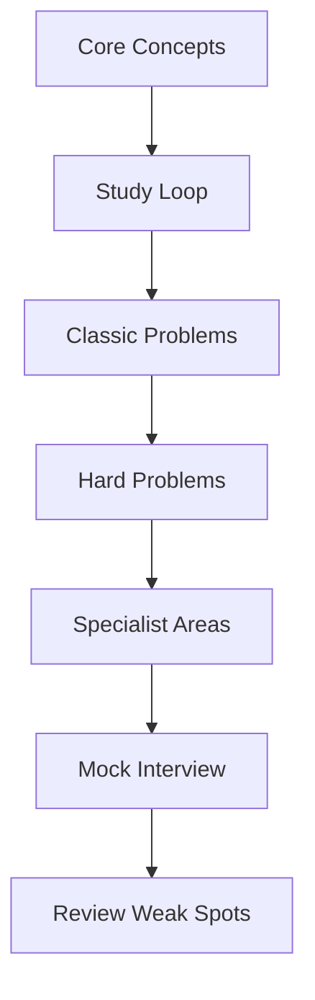

# Preparation Strategy

[← System Design index](index.md)

Use this page as a study loop: review the framework, then revisit the hard problems, then rehearse the checklist as if you were in a mock interview.

## Study loop

## Sections at a glance

| Section | Focus |
|---|---|
| How to use this guide | The RESHADED framework and the study approach |
| Recommended resources | Books, courses, and practice resources |
| Interview checklist | Final review points before the interview |
| Common mistakes | Mistakes to avoid during system design interviews |

---

Original source notes

{{#include ../../../100_System_Design_Interview_Questions_Complete_Guide.md:2211:2390}}

