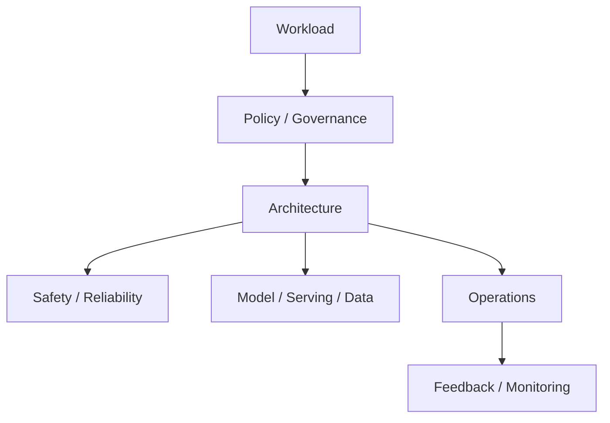
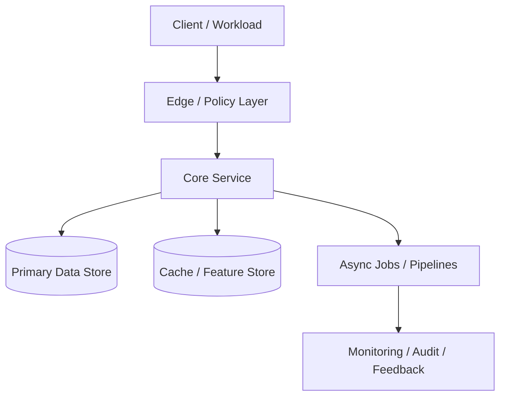
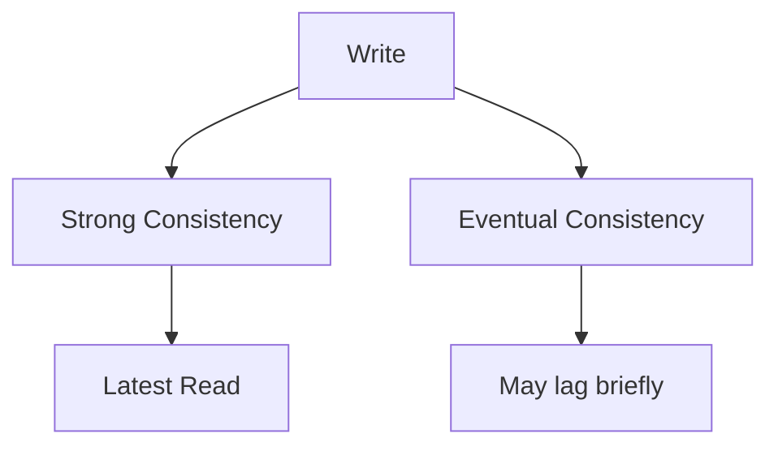

# Advanced & Specialist Areas

[← System Design index](index.md)

These designs combine platform thinking, governance, and production reliability. Frame them around constraints first, then architecture, then operations.

## Architecture snapshot

## Questions at a glance

| # | Question |
|---|---|
| 86 | [Design ML/AI Infrastructure](#86-design-ml-ai-infrastructure) |
| 87 | [Design Large Language Model (LLM) Inference API](#87-design-large-language-model-llm-inference-api) |
| 88 | [Design Microservices Architecture](#88-design-microservices-architecture) |
| 89 | [Design GraphQL API](#89-design-graphql-api) |
| 90 | [Design Multi-Tenancy System](#90-design-multi-tenancy-system) |
| 91 | [Design Data Warehouse](#91-design-data-warehouse) |
| 92 | [Design IoT System](#92-design-iot-system) |
| 93 | [Design Content Moderation System](#93-design-content-moderation-system) |
| 94 | [Design GDPR-Compliant System](#94-design-gdpr-compliant-system) |
| 95 | [Design Distributed Consensus for Blockchain](#95-design-distributed-consensus-for-blockchain) |
| 96 | [Design High-Availability Disaster Recovery](#96-design-high-availability-disaster-recovery) |
| 97 | [Design Financial System with Consistency Guarantees](#97-design-financial-system-with-consistency-guarantees) |
| 98 | [Design Real-time Bidding (Ad Tech)](#98-design-real-time-bidding-ad-tech) |
| 99 | [Design Circuit Breaker Pattern](#99-design-circuit-breaker-pattern) |
| 100 | [Design Monitoring & Alerting System](#100-design-monitoring-alerting-system) |

---
### 86. **Design ML/AI Infrastructure**

#### Answer summary

This is a platform or specialist design: lead with constraints, then explain governance, safety, scaling, and operational feedback loops.

#### Key points

- What the client path looks like end to end
- Where the source of truth lives
- Which components absorb burstiness or slow work
- How you scale, observe, and recover

#### Interview details

- Governance, safety, performance, and operational feedback loops.
- Treat the non-functional requirement as the main requirement.
- Highlight failure domains and recovery procedures.

#### Diagram

Original source notes

{{#include ../../../100_System_Design_Interview_Questions_Complete_Guide.md:1884:1909}}

---

### 87. **Design Large Language Model (LLM) Inference API**

#### Answer summary

Design Large Language Model (LLM) Inference API by starting with the user flow, then naming the durable state, hot-path cache, async pipeline, and failure handling. A strong answer is less about naming technologies and more about explaining why each component exists.

#### Key points

- What the client path looks like end to end
- Where the source of truth lives
- Which components absorb burstiness or slow work
- How you scale, observe, and recover

#### Interview details

- Request flow and primary API
- Durable state and hot-path acceleration
- Failure handling and observability

#### Diagram

Original source notes

{{#include ../../../100_System_Design_Interview_Questions_Complete_Guide.md:1911:1936}}

---

### 88. **Design Microservices Architecture**

#### Answer summary

This is a platform or specialist design: lead with constraints, then explain governance, safety, scaling, and operational feedback loops.

#### Key points

- What the client path looks like end to end
- Where the source of truth lives
- Which components absorb burstiness or slow work
- How you scale, observe, and recover

#### Interview details

- Governance, safety, performance, and operational feedback loops.
- Treat the non-functional requirement as the main requirement.
- Highlight failure domains and recovery procedures.

#### Diagram

Original source notes

{{#include ../../../100_System_Design_Interview_Questions_Complete_Guide.md:1938:1962}}

---

### 89. **Design GraphQL API**

#### Answer summary

This is a platform or specialist design: lead with constraints, then explain governance, safety, scaling, and operational feedback loops.

#### Key points

- What the client path looks like end to end
- Where the source of truth lives
- Which components absorb burstiness or slow work
- How you scale, observe, and recover

#### Interview details

- Governance, safety, performance, and operational feedback loops.
- Treat the non-functional requirement as the main requirement.
- Highlight failure domains and recovery procedures.

#### Diagram

Original source notes

{{#include ../../../100_System_Design_Interview_Questions_Complete_Guide.md:1964:1976}}

---

### 90. **Design Multi-Tenancy System**

#### Answer summary

This is a platform or specialist design: lead with constraints, then explain governance, safety, scaling, and operational feedback loops.

#### Key points

- What the client path looks like end to end
- Where the source of truth lives
- Which components absorb burstiness or slow work
- How you scale, observe, and recover

#### Interview details

- Governance, safety, performance, and operational feedback loops.
- Treat the non-functional requirement as the main requirement.
- Highlight failure domains and recovery procedures.

#### Diagram

Original source notes

{{#include ../../../100_System_Design_Interview_Questions_Complete_Guide.md:1978:2000}}

---

### 91. **Design Data Warehouse**

#### Answer summary

This is a platform or specialist design: lead with constraints, then explain governance, safety, scaling, and operational feedback loops.

#### Key points

- What the client path looks like end to end
- Where the source of truth lives
- Which components absorb burstiness or slow work
- How you scale, observe, and recover

#### Interview details

- Governance, safety, performance, and operational feedback loops.
- Treat the non-functional requirement as the main requirement.
- Highlight failure domains and recovery procedures.

#### Diagram

Original source notes

{{#include ../../../100_System_Design_Interview_Questions_Complete_Guide.md:2002:2025}}

---

### 92. **Design IoT System**

#### Answer summary

This is a platform or specialist design: lead with constraints, then explain governance, safety, scaling, and operational feedback loops.

#### Key points

- What the client path looks like end to end
- Where the source of truth lives
- Which components absorb burstiness or slow work
- How you scale, observe, and recover

#### Interview details

- Governance, safety, performance, and operational feedback loops.
- Treat the non-functional requirement as the main requirement.
- Highlight failure domains and recovery procedures.

#### Diagram

Original source notes

{{#include ../../../100_System_Design_Interview_Questions_Complete_Guide.md:2027:2046}}

---

### 93. **Design Content Moderation System**

#### Answer summary

This is a platform or specialist design: lead with constraints, then explain governance, safety, scaling, and operational feedback loops.

#### Key points

- What the client path looks like end to end
- Where the source of truth lives
- Which components absorb burstiness or slow work
- How you scale, observe, and recover

#### Interview details

- Governance, safety, performance, and operational feedback loops.
- Treat the non-functional requirement as the main requirement.
- Highlight failure domains and recovery procedures.

#### Diagram

Original source notes

{{#include ../../../100_System_Design_Interview_Questions_Complete_Guide.md:2048:2071}}

---

### 94. **Design GDPR-Compliant System**

#### Answer summary

This is a platform or specialist design: lead with constraints, then explain governance, safety, scaling, and operational feedback loops.

#### Key points

- What the client path looks like end to end
- Where the source of truth lives
- Which components absorb burstiness or slow work
- How you scale, observe, and recover

#### Interview details

- Governance, safety, performance, and operational feedback loops.
- Treat the non-functional requirement as the main requirement.
- Highlight failure domains and recovery procedures.

#### Diagram

Original source notes

{{#include ../../../100_System_Design_Interview_Questions_Complete_Guide.md:2073:2087}}

---

### 95. **Design Distributed Consensus for Blockchain**

#### Answer summary

This is a platform or specialist design: lead with constraints, then explain governance, safety, scaling, and operational feedback loops.

#### Key points

- What the client path looks like end to end
- Where the source of truth lives
- Which components absorb burstiness or slow work
- How you scale, observe, and recover

#### Interview details

- Governance, safety, performance, and operational feedback loops.
- Treat the non-functional requirement as the main requirement.
- Highlight failure domains and recovery procedures.

#### Diagram

Original source notes

{{#include ../../../100_System_Design_Interview_Questions_Complete_Guide.md:2089:2108}}

---

### 96. **Design High-Availability Disaster Recovery**

#### Answer summary

This is a platform or specialist design: lead with constraints, then explain governance, safety, scaling, and operational feedback loops.

#### Key points

- What the client path looks like end to end
- Where the source of truth lives
- Which components absorb burstiness or slow work
- How you scale, observe, and recover

#### Interview details

- Governance, safety, performance, and operational feedback loops.
- Treat the non-functional requirement as the main requirement.
- Highlight failure domains and recovery procedures.

#### Diagram

Original source notes

{{#include ../../../100_System_Design_Interview_Questions_Complete_Guide.md:2110:2134}}

---

### 97. **Design Financial System with Consistency Guarantees**

#### Answer summary

Strong consistency returns the latest committed value at the cost of latency and coordination, while eventual consistency improves availability and responsiveness but allows short-term staleness. The right answer depends on whether correctness or freshness is the stronger business requirement.

#### Key points

- Responsibility boundaries and where each component sits in the stack
- When you choose one vs the other, and when you combine them
- What breaks first at scale or under failure
- The one-sentence interview takeaway

#### Interview details

- Strong consistency returns the latest committed value; eventual consistency favors availability and low latency.
- Strong consistency is safer for money and invariants; eventual consistency is common for feeds and social features.
- Explain the acceptable window of staleness.

#### Diagram

Original source notes

{{#include ../../../100_System_Design_Interview_Questions_Complete_Guide.md:2136:2150}}

---

### 98. **Design Real-time Bidding (Ad Tech)**

#### Answer summary

This is a platform or specialist design: lead with constraints, then explain governance, safety, scaling, and operational feedback loops.

#### Key points

- What the client path looks like end to end
- Where the source of truth lives
- Which components absorb burstiness or slow work
- How you scale, observe, and recover

#### Interview details

- Governance, safety, performance, and operational feedback loops.
- Treat the non-functional requirement as the main requirement.
- Highlight failure domains and recovery procedures.

#### Diagram

Original source notes

{{#include ../../../100_System_Design_Interview_Questions_Complete_Guide.md:2152:2166}}

---

### 99. **Design Circuit Breaker Pattern**

#### Answer summary

This is a platform or specialist design: lead with constraints, then explain governance, safety, scaling, and operational feedback loops.

#### Key points

- What the client path looks like end to end
- Where the source of truth lives
- Which components absorb burstiness or slow work
- How you scale, observe, and recover

#### Interview details

- Governance, safety, performance, and operational feedback loops.
- Treat the non-functional requirement as the main requirement.
- Highlight failure domains and recovery procedures.

#### Diagram

Original source notes

{{#include ../../../100_System_Design_Interview_Questions_Complete_Guide.md:2168:2180}}

---

### 100. **Design Monitoring & Alerting System**

#### Answer summary

Observability systems should separate ingestion, aggregation, storage, query, and alerting. Call out retention, sampling, cardinality, and how operators get from a signal to an action.

#### Key points

- What the client path looks like end to end
- Where the source of truth lives
- Which components absorb burstiness or slow work
- How you scale, observe, and recover

#### Interview details

- Ingestion, processing, storage, query, and alerting.
- Treat retention and cardinality as first-class design inputs.
- Explain how operators move from signal to action.

#### Diagram

Original source notes

{{#include ../../../100_System_Design_Interview_Questions_Complete_Guide.md:2182:2210}}

