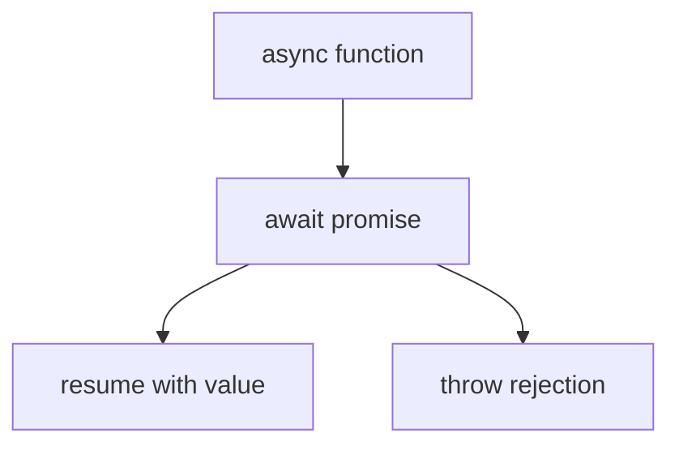

# Async/Await

## Detailed explanation
`async` and `await` are syntax over promises that make asynchronous code read like sequential code. An `async` function always returns a promise. `await` pauses that async function until the awaited promise settles, while the JavaScript thread remains free to run other work.

For interviews, the important points are error handling, sequential vs parallel awaits, promise return behavior, and event-loop ordering.

## 1. One-line mental model
`async/await` is promise chaining written in a synchronous-looking style.

## 2. Problem it solves
Promise-heavy workflows can become hard to read when each step depends on previous results.

## 3. Core idea
- `async` functions return promises.
- `await` unwraps fulfilled values or throws rejected reasons.
- Use `try/catch` for awaited errors.
- Sequential awaits wait one by one.
- Start promises before awaiting when work can run in parallel.

## 4. Visual / analogy
`await` is like pausing one recipe step while the kitchen can still handle other orders.



## 5. Minimal example

```js
async function loadUser(id) {
  try {
    const user = await fetchUser(id);
    return user.name;
  } catch (error) {
    return "Unknown";
  }
}
```

## 6. Real-world example
In data loading code, fetching user and permissions sequentially may be correct if permissions need the user id. Fetching independent dashboard widgets should usually start in parallel.

## 7. Common interview questions
#### What does an async function return?
- **The Engine Mechanism (Why it behaves this way):** When a function is declared with `async`, the JavaScript engine intercepts its return value. No matter what the function returns inside its body (a primitive, an object, or even another Promise), the engine always wraps it inside a **Promise object** allocated in the Heap.
  - If the function returns a non-promise value, the engine wraps it in a fulfilled Promise (`Promise.resolve(value)`).
  - If the function throws an error, the engine wraps it in a rejected Promise (`Promise.reject(error)`).
  - If the function returns a Promise, the engine returns that Promise directly (or wraps/adopts it under the specification's promise resolution rules).
- **The Unforgettable Mental Model:** The **Amazon Shipping Department**. No matter how small the item you order (a tiny primitive coin or a massive object laptop), the shipping room always wraps it inside an Amazon Box (a Promise) before handing it over to the courier (caller).
- **The Trap:** Thinking that returning a value from an `async` function allows you to read it synchronously outside the function (e.g. `const name = asyncFn()`). You must await or `.then()` the returned promise to extract the inner value.
- **Senior Interview Playbook (Verbal Script):** "When asked this in an interview, say: An `async` function always returns a Promise. If the function returns a plain value, the JS engine implicitly wraps it in a resolved Promise. If the function throws an exception, it returns a rejected Promise. If it returns an existing Promise, that Promise is returned directly, ensuring that the call is always asynchronous."

#### Does `await` block the main thread?
- **The Engine Mechanism (Why it behaves this way):** No. `await` does **not** block the main single thread of execution. When the engine encounters `await promise`, it pauses the execution of *only* that specific `async` function context. It serializes the remaining code of the function as a microtask reaction, pushes it onto the Promise's reaction queue, pops the `async` function's execution context frame off the **Call Stack**, and immediately resumes executing whatever code was after the function call or continues running the Event Loop. When the awaited promise eventually settles, its reaction microtask is pushed onto the Microtask Queue, which will resume the `async` function's execution when popped.
- **The Unforgettable Mental Model:** The **Restaurant Pager**. You go to a restaurant, place your order, and are handed a pager (await). Instead of freezing all operations in the kitchen and lobby until your steak is done, the cashier continues serving the next customers (event loop/main thread). When the pager buzzes (promise resolves), you return to the counter to collect your food (callback resumes).
- **The Trap:** Thinking that an `await` block acts like a synchronous `while(true) {}` loop or a sleep statement, which would freeze all animations, clicks, and timers in the browser.
- **Senior Interview Playbook (Verbal Script):** "When asked this in an interview, say: Absolutely not. `await` does not block the main thread. Instead, it pauses only the execution of the enclosing `async` function, yielding control back to the call stack and event loop. The remaining lines of the `async` function are packaged as a microtask that is scheduled to run only after the awaited promise settles, keeping the application fully responsive."

#### How do you handle errors?
- **The Engine Mechanism (Why it behaves this way):** `async/await` integrates directly with the language's native `try/catch` syntax. When a promise is awaited and transitions to the `"rejected"` state, the engine unwraps the rejection reason stored in the promise's internal `[[PromiseResult]]` slot and injects it back into the execution context as a thrown error. This triggers the engine's stack-unwinding mechanism, instantly diverting execution to the nearest enclosing `catch` block on the call stack.
- **The Unforgettable Mental Model:** The **Safety Trampoline**. A rejection is like falling off a high wire. If you have wrapped your high-wire act (the awaits) in a safety net (`try`), you land safely in the trampoline (`catch`) instead of plunging into the floor (unhandled crash).
- **The Trap:** Forgetting to wrap your `await` calls in a `try/catch`, which causes rejected promises to propagate up. If not caught globally, this crashes the application thread or logs unhandled rejection errors.
- **Senior Interview Playbook (Verbal Script):** "When asked this in an interview, say: We handle errors in `async/await` using standard synchronous-looking `try/catch` blocks. When an awaited promise rejects, the JS engine converts the rejection reason into a throw statement, immediately passing control to the associated `catch` block. We can also handle errors by appending a `.catch()` method to the promise being awaited."

#### How do you run async work in parallel?
- **The Engine Mechanism (Why it behaves this way):** If you write `const a = await getA(); const b = await getB();`, you create a sequential blocking waterfall. The engine must wait for `getA()` to completely settle before it even initiates `getB()`. To run them in parallel, you must **initiate the async operations before awaiting them**. By executing `const promiseA = getA(); const promiseB = getB();`, both network fetches or background operations are launched concurrently on the runtime's background threads. You then await their results together, typically via `const [a, b] = await Promise.all([promiseA, promiseB])`.
- **The Unforgettable Mental Model:** The **Kitchen Preparations**. If you need to boil pasta and chop tomatoes, you don't boil the pasta, wait 10 minutes (sequential await), and then start chopping tomatoes. You turn on the stove (initiate A), and while the water is heating up, you chop the tomatoes (initiate B concurrently), and then bring both together (await both).
- **The Trap:** Placing the `await` keyword directly in front of the call of the individual tasks when wrapping them inside `Promise.all` (e.g. `await Promise.all([await getA(), await getB()])`), which still executes them sequentially!
- **Senior Interview Playbook (Verbal Script):** "When asked this in an interview, say: To execute async tasks in parallel, we must trigger their executions concurrently before awaiting them. Writing sequential awaits creates a performance waterfall. By firing the functions first and storing their promise references, and then passing them to `Promise.all` or `Promise.allSettled`, we allow the engine to execute the network requests in parallel."

#### How does async/await relate to promises?
- **The Engine Mechanism (Why it behaves this way):** `async/await` is not a new asynchronous model; it is strictly syntactic sugar built directly on top of native **Promises** and **Generators**. Under the hood, when the compiler processes an `async` function, it translates it into a generator function wrapped in a co-routine execution helper. Every `await` is transformed into a `yield` statement that yields a Promise. The helper co-routine automatically hooks up a `.then()` and `.catch()` listener to that promise and resumes the generator once the promise settles.
- **The Unforgettable Mental Model:** The **Automatic Transmission Car**. The car's engine (Promises/Generators) still operates with gears, clutches, and mechanical shifts. However, the driver is given an automatic gear shifter (`async/await`) that makes driving seamless and eliminates the manual clutch work.
- **The Trap:** Thinking that `async/await` is faster or fundamentally different in performance compared to pure Promises. Under the hood, it allocates the exact same microtasks and heap promises.
- **Senior Interview Playbook (Verbal Script):** "When asked this in an interview, say: `async/await` is syntactic sugar built on top of Promises and Generators. It compiles down to a generator function where `await` acts as a `yield` point, and a co-routine helper automates the `.then` and `.catch` resolution loop. Therefore, it shares the exact same event loop and microtask scheduling semantics as pure Promises."

## 8. Active recall test
1. **What is returned from an async function?**
   - **Explanation:** An `async` function always returns a Promise. If a non-promise value is returned, it is implicitly wrapped in a resolved Promise.
2. **What happens when awaited promise rejects?**
   - **Explanation:** The engine throws the rejection reason as a runtime exception, which must be caught using a `try/catch` block, or it will reject the outer Promise returned by the async function.
3. **Does `await` block all JavaScript?**
   - **Explanation:** No. It only pauses the execution of the enclosing `async` function. The main call stack and event loop continue executing other scripts, user events, and paint tasks.
4. **How do you avoid unnecessary sequential waits?**
   - **Explanation:** By initiating all independent asynchronous operations first (creating active promises in the heap), and then awaiting them concurrently using `Promise.all()` or individual awaits later.
5. **What is top-level await?**
   - **Explanation:** It is a feature in ES modules that allows using the `await` keyword outside of an `async` function at the top level of a module, pausing the module's execution and resolution until the awaited promise settles.

## 9. Mistakes / traps
- Awaiting independent requests one by one.
- Forgetting `try/catch`.
- Assuming `await` blocks the browser thread.
- Not returning from an async function.
- Mixing `.then` and `await` without reason.

## 10. Compare with related concepts
- **Async/await vs promises:** syntax over promise behavior.
- **Sequential await vs `Promise.all`:** dependent work vs independent parallel work.
- **Await vs blocking:** pauses the async function, not the entire thread.

## 11. Summary from memory
Explain how to load two independent resources efficiently with `async/await`.

## 12. Spaced revision prompts
- After 1 day: Define async function behavior.
- After 3 days: Explain rejected await.
- After 7 days: Compare sequential and parallel awaits.
- After 14 days: Predict async output ordering.
