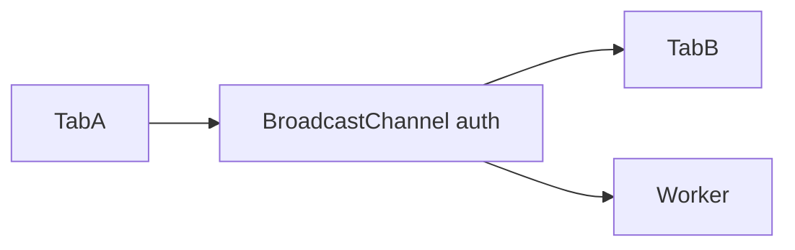

# BroadcastChannel

## Detailed explanation
BroadcastChannel lets same-origin tabs, windows, iframes, and workers send messages to each other through named channel. It is cleaner than localStorage events for cross-tab communication.

Frontend use: logout sync, theme sync, cache invalidation, multi-tab collaboration signals.

## 1. One-line mental model
BroadcastChannel is pub-sub for same-origin browser contexts.

## 2. Problem it solves
Tabs need direct cross-tab messages without server roundtrip.

## 3. Core idea
- Create channel by name.
- Use `postMessage`.
- Listen with `onmessage`.
- Same-origin only.
- Close channel when done.

## 4. Visual / analogy
Named radio channel for browser tabs.



## 5. Minimal example

```js
const channel = new BroadcastChannel("auth");
channel.postMessage({ type: "logout" });
```

## 6. Real-world example

```js
channel.onmessage = (event) => {
  if (event.data.type === "logout") redirectToLogin();
};
```

## 7. Common interview questions

#### What is BroadcastChannel?
- **The Engine Mechanism (Why it behaves this way):** `BroadcastChannel` is a modern browser API that implements an asynchronous publish-subscribe message bus scoped strictly to the origin. When `new BroadcastChannel(channelName)` is executed, the browser's kernel process instantiates a message port linked to a shared named channel router. When `channel.postMessage(data)` is invoked:
  1. The JavaScript engine executes the Structured Clone Algorithm to serialize the `data` payload, copying it deep-by-value.
  2. The browser process routes this serialized payload to all other active threads (renderer processes of other tabs, iframes, Web Workers, or Service Workers) currently subscribed to the same channel name.
  3. Sibling contexts receive the message, deserialize it back into native JS objects in their own heaps, and fire a `message` event. Just like `storage` events, the sending instance is excluded from receiving its own message.
- **The Unforgettable Mental Model:** A private, same-origin CB radio channel. Tabs tune their radio dials to the same frequency (channel name). When one tab presses the talk button and speaks, everyone else tuned to that frequency hears the voice instantly in their head, completely unblocked by any server or disk writes.
- **The Trap:** Believing that `BroadcastChannel` can cross origin boundaries (different domains). By specification, browsers enforce strict isolation: a BroadcastChannel created on `https://a.com` has zero visibility into a channel with the exact same name created on `https://b.com`.
- **Senior Interview Playbook (Verbal Script):** "When asked this in an interview, say: '`BroadcastChannel` is a native, high-performance API that provides an asynchronous pub-sub message bus for same-origin browser contexts—including tabs, windows, iframes, Web Workers, and Service Workers. It leverages the browser’s structured clone algorithm to transmit rich, multi-dimensional JavaScript objects directly in memory without writing to disk or routing requests through a server.'"

#### How to sync logout across tabs?
- **The Engine Mechanism (Why it behaves this way):** When a user logs out in Tab A, the application executes a series of actions:
  1. It instantiates `const authChannel = new BroadcastChannel('auth_state')`.
  2. It broadcasts an explicit command: `authChannel.postMessage({ action: 'LOGOUT', timestamp: Date.now() })`.
  3. In Sibling Tabs B and C, which have a long-lived listener listening to `authChannel`, the `onmessage` callback is triggered asynchronously.
  4. Sibling tabs read the action payload, execute local cleanup (clearing memory caches, dropping active web sockets), and immediately redirect their viewports to the logout screen using `window.location.replace('/login')`.
- **The Unforgettable Mental Model:** A security guard at a central control desk hitting a silent alarm button. Instantly, all emergency exit signs in the building flash, locking doors and notifying all security systems simultaneously across all wings of the complex.
- **The Trap:** Not closing the channel during cleanup in single-page apps (SPAs). If components mount and create new channel listeners without unbinding them or closing the channel instance on unmount, you leak channels and event listeners, leading to memory bloat and duplicate callbacks.
- **Senior Interview Playbook (Verbal Script):** "When asked this in an interview, say: 'To sync logout, we instantiate a named `BroadcastChannel` like `auth_sync`. When a logout action occurs, we broadcast a `LOGOUT` payload. Sibling tabs listening to this channel capture the event, clean up their memory buffers and session caches, and redirect to the login screen. Finally, we ensure that both the emitting and receiving tabs close their channel instances during unmounting to prevent memory leaks.'"

#### BroadcastChannel vs storage event?
- **The Engine Mechanism (Why it behaves this way):**
  - **`BroadcastChannel`:** Is a pure, in-memory asynchronous message channel. It bypasses the disk system entirely, making it extremely fast. It can transmit full JS objects, arrays, Blobs, and other structured data types. It works in Service Workers and Web Workers because workers have access to the `BroadcastChannel` API.
  - **`storage` event:** Is a side-effect of persistent database mutation in `localStorage`. It must write to disk (or the OS storage cache) on every write, causing I/O bottlenecks. It is restricted to storing and transmitting string key-value pairs and does not work inside Workers because Web Workers have no access to the DOM-tied `localStorage` object.
- **The Unforgettable Mental Model:** `BroadcastChannel` is like shouting through a megaphone to your coworkers in the next room (in-memory, immediate, supports complex objects). The `storage` event is like engraving a message into a stone tablet in the lobby; your coworkers have to physically walk to the lobby to read the text (disk bound, slow, string-only).
- **The Trap:** Using the `storage` event inside a Web Worker or Service Worker. Web Workers have no DOM access, meaning `window` and `localStorage` are completely unavailable. `BroadcastChannel` is the only native choice for communicating between workers and tabs.
- **Senior Interview Playbook (Verbal Script):** "When asked this in an interview, say: '`BroadcastChannel` is an in-memory, highly efficient message pipeline that supports structured cloning of rich objects and works inside Web Workers and Service Workers. The `storage` event is a secondary notification triggered by a disk-bound `localStorage` mutation, restricted only to string payloads and unavailable in Worker threads. For real-time, cross-context messaging, `BroadcastChannel` is always the architectural best practice.'"

#### Same-origin limitation?
- **The Engine Mechanism (Why it behaves this way):** Browsers enforce the Same-Origin Policy (SOP) at the C++ kernel level to protect user security. A BroadcastChannel instance is keyed on the origin tuple of the active document (`protocol + host + port`). When a renderer process attempts to broadcast a message, the kernel verifies the source origin and only distributes the cloned payload to renderer processes whose active document origins match the sender's origin tuple exactly. If they do not match, the communication is silently blocked.
- **The Unforgettable Mental Model:** A security passcode to a secure building. Even if two buildings have a room named "Room 101" (the channel name), a guard (Same-Origin Policy) standing at the door of Building A will physically block anyone from Building B from entering their room or listening in on their discussions.
- **The Trap:** Thinking that subdomains (like `app.mysite.com` and `api.mysite.com`) share the same origin. They do not! They are treated as separate origins, and a BroadcastChannel cannot bridge communications between them unless you use a bridge mechanism like a shared iframe and `postMessage`.
- **Senior Interview Playbook (Verbal Script):** "When asked this in an interview, say: '`BroadcastChannel` is strictly bound to the Same-Origin Policy. The browser identifies the origin tuple—protocol, host, and port—at the core system level, restricting all channel communications to matches of that exact origin. This ensures that malicious external domains cannot intercept or spoof communication channels belonging to our application.'"

#### Why close the channel?
- **The Engine Mechanism (Why it behaves this way):** When a `BroadcastChannel` object is instantiated, the browser engine allocates inter-process communication (IPC) descriptors and handles, keeping open an active socket-like connection to the operating system's browser process. If you continuously instantiate these channels (especially in React/Vue SPAs where components mount and unmount) without calling `channel.close()`, the C++ engine retains references to these handles in memory. This prevents the garbage collector from reclaiming the associated memory, resulting in severe heap memory leaks and eventual resource exhaustion.
- **The Unforgettable Mental Model:** Hanging up a telephone call. If you call someone, complete your conversation, but lay the phone on the desk instead of hitting the end button (calling `close()`), the telephone line stays active, billing you money and keeping the line blocked indefinitely.
- **The Trap:** Letting anonymous listeners drift in your SPA: `new BroadcastChannel('sync').onmessage = () => {}` inside a React `useEffect` without a cleanup return. Every time the component re-renders, a new channel is created, leading to massive memory leaks and duplicated handler executions.
- **Senior Interview Playbook (Verbal Script):** "When asked this in an interview, say: 'We must call `channel.close()` to release the browser's underlying inter-process communication resources. If left un-closed, the garbage collector cannot clean up the channel handles or their associated event bindings, creating memory leaks. In modern frameworks, we should always clean up our channel allocations inside lifecycle hooks or React `useEffect` returns by invoking `.close()`.'"

## 8. Active recall test

#### 1. How to create a channel?
- **Explanation/Answer:** By calling `const channel = new BroadcastChannel(channelName)` with a unique string name.

#### 2. How to send a message?
- **Explanation/Answer:** By calling `channel.postMessage(payload)` on the channel instance.

#### 3. How to receive a message?
- **Explanation/Answer:** By assigning a handler callback to the `channel.onmessage` property or registering a listener via `channel.addEventListener('message', callback)`.

#### 4. What origin rule applies?
- **Explanation/Answer:** The Same-Origin Policy applies: contexts must share the exact same protocol, domain, and port to exchange messages.

#### 5. Name a use case.
- **Explanation/Answer:** Caching/theme synchronization: synchronizing dark-mode preference transitions instantly across all open browser tabs without page reloads.

## 9. Mistakes / traps
- Forgetting `close()`.
- Sending sensitive data unnecessarily.
- Assuming cross-origin works.
- Not handling unsupported browsers if needed.

## 10. Compare with related concepts
- **BroadcastChannel vs storage event:** direct message vs storage mutation notification.
- **BroadcastChannel vs WebSocket:** local tabs vs network server.
- **BroadcastChannel vs postMessage:** channel pub-sub vs targeted window messaging.

## 11. Summary from memory
Explain cross-tab logout with BroadcastChannel.

## 12. Spaced revision prompts
- 1 day: Define BroadcastChannel.
- 3 days: Send/receive message.
- 7 days: Compare storage event.
- 14 days: Design cache invalidation signal.

