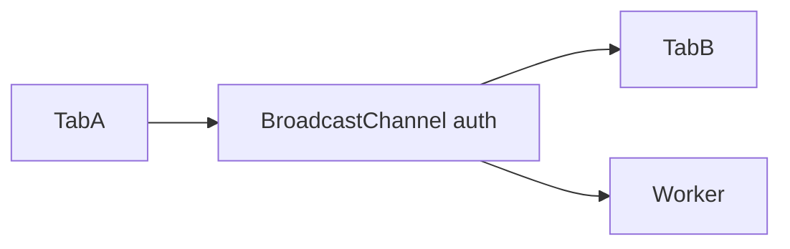

# BroadcastChannel

## Detailed explanation
BroadcastChannel lets same-origin tabs, windows, iframes, and workers send messages to each other through named channel. It is cleaner than localStorage events for cross-tab communication.

Frontend use: logout sync, theme sync, cache invalidation, multi-tab collaboration signals.

## 1. One-line mental model
BroadcastChannel is pub-sub for same-origin browser contexts.

## 2. Problem it solves
Tabs need direct cross-tab messages without server roundtrip.

## 3. Core idea
- Create channel by name.
- Use `postMessage`.
- Listen with `onmessage`.
- Same-origin only.
- Close channel when done.

## 4. Visual / analogy
Named radio channel for browser tabs.



## 5. Minimal example

```js
const channel = new BroadcastChannel("auth");
channel.postMessage({ type: "logout" });
```

## 6. Real-world example

```js
channel.onmessage = (event) => {
  if (event.data.type === "logout") redirectToLogin();
};
```

## 7. Common interview questions
- What is BroadcastChannel?
- How sync logout across tabs?
- BroadcastChannel vs storage event?
- Same-origin limitation?
- Why close channel?

## 8. Active recall test
1. How create channel?
2. How send message?
3. How receive message?
4. What origin rule applies?
5. Name use case.

## 9. Mistakes / traps
- Forgetting `close()`.
- Sending sensitive data unnecessarily.
- Assuming cross-origin works.
- Not handling unsupported browsers if needed.

## 10. Compare with related concepts
- **BroadcastChannel vs storage event:** direct message vs storage mutation notification.
- **BroadcastChannel vs WebSocket:** local tabs vs network server.
- **BroadcastChannel vs postMessage:** channel pub-sub vs targeted window messaging.

## 11. Summary from memory
Explain cross-tab logout with BroadcastChannel.

## 12. Spaced revision prompts
- 1 day: Define BroadcastChannel.
- 3 days: Send/receive message.
- 7 days: Compare storage event.
- 14 days: Design cache invalidation signal.

