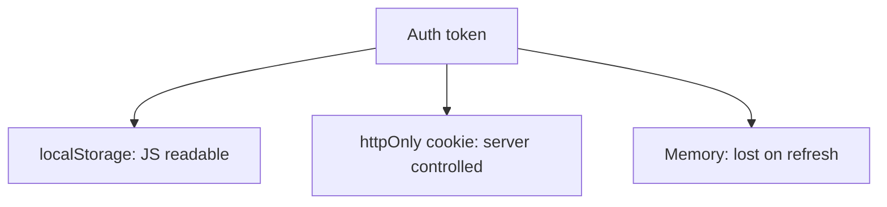

# Browser Storage and Token Risks

## Detailed explanation
Browser storage includes cookies, localStorage, sessionStorage, IndexedDB, Cache Storage, and in-memory variables. Authentication tokens are sensitive because storage choice affects XSS exposure, CSRF behavior, persistence, and user experience.

A strong frontend answer does not say one storage option is always perfect. It explains the threat model and commonly prefers secure, httpOnly, SameSite cookies for session or refresh tokens where the backend supports it.

## 1. One-line mental model
Token storage is a security trade-off between JavaScript access, persistence, CSRF behavior, and backend control.

## 2. Problem it solves
Apps need to preserve authenticated state without exposing credentials to avoidable browser attacks.

## 3. Core idea
- localStorage is easy but readable by injected JavaScript.
- httpOnly cookies are not readable by JavaScript.
- Cookies need SameSite/CSRF planning.
- Memory-only tokens reduce persistence but improve XSS exposure.
- Never store secrets that the frontend should not know.

## 4. Visual / analogy
Storage choices are like keeping a key on a desk, in a locked drawer, or only in your hand.



## 5. Minimal example

```js
// Risky if XSS is possible:
localStorage.setItem("accessToken", token);
```

Prefer server-set cookies with `httpOnly`, `Secure`, and `SameSite` where architecture allows.

## 6. Real-world example
An XSS bug can read localStorage tokens and send them to an attacker. An httpOnly cookie cannot be read directly by that script, though the app still needs CSRF and XSS defenses.

## 7. Common interview questions

#### Where should JWTs be stored?
- **The Engine Mechanism (Why it behaves this way):** The storage location of a JSON Web Token (JWT) directly defines its vulnerability profile under cross-origin or cross-site scripting scenarios. A highly secure architecture stores short-lived access JWTs in-memory (inside a standard closure or private class within the application's runtime JavaScript heap), and stores the longer-lived refresh JWT in a `Secure`, `httpOnly`, and strict/lax `SameSite` cookie set via the HTTP `Set-Cookie` header. When the access token expires or the page is refreshed, the frontend uses an asynchronous silent fetch request (`/refresh`) to the authorization server; the browser automatically includes the HTTP-only refresh cookie in the request, validating the session and returning a fresh access token to JS memory without exposing the credentials to storage APIs.
- **The Unforgettable Mental Model:** A security guard at a high-security facility. The access token (in-memory) is a temporary day-pass you hold in your hand—if you drop it or refresh the page, it's gone, but it's very hard for someone outside to sneak in and snatch it. The refresh token (httpOnly cookie) is a secure thumbprint scanner at the main entrance door—you can't see the database containing the thumbprint (JavaScript cannot read the cookie), but whenever you walk up to the door, the scanner automatically verifies you.
- **The Trap:** Storing both access and refresh tokens in `localStorage`. If an attacker executes a successful XSS exploit (e.g., via a compromised npm package or DOM-based injection), they can execute a single synchronous line of code `Object.entries(localStorage)` to extract all tokens and immediately compromise the user's account indefinitely.
- **Senior Interview Playbook (Verbal Script):** "When asked this in an interview, say: There is no single silver bullet, but the industry-standard architecture is to store the short-lived access token in-memory, completely isolated from global JavaScript access, and store the long-lived refresh token in a secure, `httpOnly`, `SameSite` cookie. This structure isolates the critical long-term authentication credential from local scripting environments, utilizing silent refreshing over HTTPS to retrieve new access tokens seamlessly while minimizing the attack surfaces of both XSS and CSRF."

#### Why is localStorage risky?
- **The Engine Mechanism (Why it behaves this way):** `localStorage` is bound to the document's origin under the Same-Origin Policy (SOP). However, any JavaScript code executing within that same origin has complete, unrestricted, synchronous read and write access to the origin's `localStorage` database via the `window.localStorage` global host object. If an application is compromised by a Cross-Site Scripting (XSS) vulnerability, the injected script runs inside the origin's execution context. V8 grants the attacker's script the exact same security privileges as the legitimate application code, allowing the script to read all keys in `localStorage`, package them, and exfiltrate them via a simple asynchronous `fetch` call to an external malicious server.
- **The Unforgettable Mental Model:** Writing your safe combination on a sticky note and gluing it to the front of your office desk. Anyone who gains access to your office (XSS injection) can walk right up to your desk, read the sticky note, and immediately walk away with the code to your safe, with no alarms triggered.
- **The Trap:** Assuming that encrypting tokens in `localStorage` resolves the risk. Because the decryption key and routine must also reside in the client-side JavaScript bundle, an attacker can simply reverse-engineer the bundle, locate the decryption logic, or override the decryption function at runtime to steal the raw decrypted token as it is being processed.
- **Senior Interview Playbook (Verbal Script):** "When asked this in an interview, say: `localStorage` is fundamentally vulnerable because it lacks any runtime access controls within its origin. If a Cross-Site Scripting vulnerability is exploited, the injected script executes with the full security context of the active origin. It can synchronously query `localStorage` and exfiltrate all data. Client-side encryption does not mitigate this, as the V8 execution thread holds the decryption keys, allowing attackers to easily compromise the secret credentials."

#### What does httpOnly do?
- **The Engine Mechanism (Why it behaves this way):** The `httpOnly` attribute is a directive set by the web server in the `Set-Cookie` HTTP response header. When the browser receives a cookie with this flag, it registers it in its internal sandboxed cookie jar, but strictly prevents client-side scripting APIs (such as `document.cookie` or the newer `CookieStore` API) from reading, modifying, or querying the cookie value. The cookie is only transmitted over the wire in HTTP request headers (`Cookie`) to its matching domain and path parameters. Even if an XSS payload is executed on the page, the browser's DOM thread is physically blocked from accessing the string contents of that cookie.
- **The Unforgettable Mental Model:** A locked secure mailbox. The mail carrier (the server) can drop letters (cookies) through the slot, and the post office (the browser) automatically takes the letters and carries them directly to the recipient (the server) in a locked truck. The homeowner (JavaScript) can stand outside the mailbox all day, but they are physically blocked from reaching inside to read or steal the letters.
- **The Trap:** Thinking `httpOnly` completely neutralizes XSS. While an attacker cannot *read* the cookie, they can still execute actions on behalf of the user. For instance, an XSS payload can run an asynchronous `fetch('/api/delete-account', { method: 'POST' })`, and the browser will automatically append the `httpOnly` authentication cookie to that request, executing the malicious action anyway. This is known as XSS-driven request forgery.
- **Senior Interview Playbook (Verbal Script):** "When asked this in an interview, say: The `httpOnly` directive is a critical browser enforcement flag that completely isolates a cookie from the client-side scripting environment. When active, it blocks APIs like `document.cookie` from reading the value, which effectively prevents XSS payloads from directly exfiltrating the token string. However, we must remember that `httpOnly` is not a complete XSS shield; an attacker can still execute silent API requests on the main thread, and the browser will automatically append the cookie to those requests."

#### How do SameSite cookies help?
- **The Engine Mechanism (Why it behaves this way):** The `SameSite` attribute controls whether cookies are sent along with cross-site requests (requests initiated by a third-party website). It accepts three values:
  1. `SameSite=Strict`: The browser never sends the cookie in cross-site requests, not even when the user clicks a standard external link pointing to the target site.
  2. `SameSite=Lax` (Modern Browser Default): The browser blocks cookies on cross-site subresource requests (like images or AJAX calls) but permits them when the user executes a "safe" top-level navigation (e.g., clicking a standard link `<a href="...">` that changes the URL in the address bar).
  3. `SameSite=None`: The browser sends the cookie in all contexts, including cross-site contexts, but it requires the `Secure` flag to be set (HTTPS only).
  By leveraging `Strict` or `Lax`, the browser blocks cross-site request forgery (CSRF) attacks because requests forged from a malicious domain (`malicious.com` POSTing to `bank.com/transfer`) will be stripped of their authentication cookies.
- **The Unforgettable Mental Model:** A specialized ID badge. If you are standing inside the factory (Same-Origin), the badge is fully active. If you try to jump over the fence from a competitor's factory (Cross-Site) to show your badge, the gate immediately detects that you are crossing a boundary and turns the badge invisible, blocking you from entering.
- **The Trap:** Relying on `SameSite=Lax` to protect against all CSRF. If your application handles mutating state changes (like deleting records or updating emails) using HTTP `GET` requests instead of `POST`, the `Lax` policy will still send the cookie during a top-level cross-site click, allowing the forgery to succeed. Always enforce RESTful method boundaries (e.g., POST/PUT/DELETE for mutations).
- **Senior Interview Playbook (Verbal Script):** "When asked this in an interview, say: `SameSite` cookies mitigate Cross-Site Request Forgery by letting us control cookie transmission based on the request's origin context. `SameSite=Strict` completely blocks cookies on cross-site transitions, while `SameSite=Lax` permits them only during safe, top-level HTTP GET navigations. Setting `Lax` or `Strict` ensures that forged cross-site requests, such as malicious AJAX forms targeting our API, are transmitted without credentials, neutralizing CSRF attacks."

#### What is the trade-off with memory-only tokens?
- **The Engine Mechanism (Why it behaves this way):** Memory-only token storage relies on V8 heap variables (such as a local closure variable or a private class field) to hold the access token string. Because the variable is scoped within the active JavaScript runtime environment, it is highly isolated from storage APIs. The trade-off is persistence: the JavaScript execution context is bound to the lifetime of the document. Whenever the user does a hard page reload (`F5`), navigates away and back, or opens the site in a new tab, the entire V8 execution context is torn down and garbage collected, erasing the memory token. To bridge this gap, the application must implement a silent refresh mechanism using a secondary persistent cookie-based refresh token.
- **The Unforgettable Mental Model:** Storing a passcode in your short-term memory (RAM) rather than writing it in a physical notebook (disk storage). It is incredibly secure because nobody can steal a physical copy from your desk, but the moment you take a nap (refresh the page), you completely forget the passcode and must ask your boss (the refresh token server) to tell it to you again.
- **The Trap:** Not optimizing the silent refresh loop. If your silent refresh takes 1-2 seconds to boot up on page load, the application will display a jarring "unauthenticated" flash or loading spinner to the user every time they refresh or open a new tab.
- **Senior Interview Playbook (Verbal Script):** "When asked this in an interview, say: Storing tokens strictly in memory dramatically reduces XSS vulnerability because the token is insulated from local storage APIs. The primary trade-off is persistence: any page refresh or tab initialization clears the V8 heap and wipes the token. We solve this by introducing a silent refresh architecture, where the frontend queries the server on startup to obtain a new access token via a secure, HTTP-only refresh cookie, striking a balanced trade-off between strict client-side security and seamless user experience."

## 8. Active recall test

#### 1. Which browser storage mechanisms are directly readable by client-side JavaScript?
`localStorage`, `sessionStorage`, standard cookies (those without the `httpOnly` flag), and `IndexedDB`.

#### 2. What specific attack vector does setting the httpOnly flag on a cookie prevent?
It prevents Cross-Site Scripting (XSS) payloads from directly reading and exfiltrating the cookie's token string using `document.cookie` or other client scripting APIs.

#### 3. Does transitioning auth tokens from localStorage to standard cookies completely eliminate CSRF vulnerabilities?
No. In fact, using standard cookies *introduces* Cross-Site Request Forgery (CSRF) risks, because the browser automatically attaches cookies to outbound HTTP requests to the target domain, even those forged from third-party sites. CSRF protection requires configuring the cookies with `SameSite=Lax` or `SameSite=Strict`, or implementing anti-CSRF double-submit tokens.

#### 4. What is the immediate consequence of storing an authentication token exclusively in memory when a user performs a hard reload?
The browser tears down the active document and its V8 execution context, wiping the heap memory and completely clearing the in-memory token, requiring a new authentication phase or a silent refresh process.

#### 5. Why must a frontend developer never store critical, raw API secret keys within client-side variables or source code?
Because frontend assets (JS bundles, environmental settings, source maps) are downloaded, decompiled, and fully visible to anyone inspecting the client browser environment, making them instantly vulnerable to theft and abuse.

## 9. Mistakes / traps
- Saying JWT always belongs in localStorage.
- Treating httpOnly cookies as complete XSS protection.
- Forgetting CSRF with cookie-based auth.
- Storing refresh tokens where JavaScript can read them.
- Putting API secrets in frontend env variables.

## 10. Compare with related concepts
- **localStorage vs sessionStorage:** persistent across sessions vs tab/session scoped.
- **Cookie vs localStorage:** automatic request inclusion vs manual JS access.
- **Access token vs refresh/session token:** short-lived API credential vs longer-lived trust mechanism.

## 11. Summary from memory
Explain token storage trade-offs for a React SPA with a backend.

## 12. Spaced revision prompts
- After 1 day: List browser storage options.
- After 3 days: Explain localStorage XSS risk.
- After 7 days: Explain httpOnly and SameSite.
- After 14 days: Design a safer auth storage strategy.
