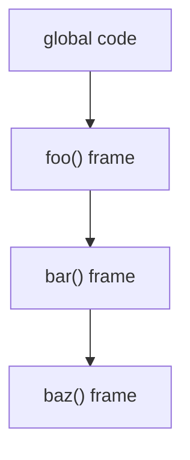

# Call Stack

## Detailed explanation
The call stack is the runtime structure JavaScript uses to track which function is currently running and where execution should return after that function finishes. Every function call pushes a stack frame; every return pops it.

For frontend interviews, the call stack explains synchronous execution, stack traces, recursion limits, and why long-running JavaScript blocks rendering and event handling.

## 1. One-line mental model
The call stack is JavaScript's active function to-do list.

## 2. Problem it solves
JavaScript needs a predictable way to remember nested function calls and return points.

## 3. Core idea
- Function calls push frames.
- Returns pop frames.
- The top frame is currently executing.
- Deep recursion can overflow the stack.
- The event loop can only run another task after the stack becomes empty.

## 4. Visual / analogy
The call stack is like stacked plates: the last plate added is the first one removed.



## 5. Minimal example

```js
function first() {
  second();
}

function second() {
  console.log("done");
}

first();
```

`first` is pushed, then `second`; `second` finishes first.

## 6. Real-world example
When a click handler performs a heavy loop, it occupies the stack and blocks painting, input handling, and timers until the handler returns.

## 7. Common interview questions

#### What is the call stack?
- **The Engine Mechanism (Why it behaves this way):** The Call Stack is a synchronous, Last-In, First-Out (LIFO) stack data structure managed by the JavaScript engine's thread of execution (single-threaded). Each entry on the stack is a **Stack Frame** representing an active Execution Context. When a function is called, its stack frame is allocated memory and pushed onto the top of the stack. The engine's CPU program counter pointer shifts to point directly to the bytecode of that newly pushed frame. When a function completes execution (returns a value or throws an uncaught error), its frame is popped off, and control instantly returns to the execution address immediately below it.
- **The Unforgettable Mental Model:** A stack of Pringles chips in a narrow can. You can only eat (execute) the very top Pringles chip. To eat a chip below, you must first consume and remove (return/pop) the top chip. You can never jump ahead or skip a chip in the middle.
- **The Trap:** Thinking that asynchronous callbacks get pushed directly onto the call stack when their timer/fetch triggers. They are actually placed on event/macrotask or microtask queues, waiting for the Call Stack to completely empty before being pushed by the Event Loop.
- **Senior Interview Playbook (Verbal Script):** When asked this in an interview, say: "The Call Stack is the synchronous execution tracking mechanism in JavaScript. Operating as a LIFO structure on a single thread, it manages active Execution Contexts as stack frames. Every function invocation pushes a new frame onto the stack, and every return pops it off, resuming execution of the frame immediately below it."

#### Why does recursion cause stack overflow?
- **The Engine Mechanism (Why it behaves this way):** The Call Stack has a finite, engine-defined memory allocation limit (typically around 10,000 to 50,000 frames in modern browsers like V8). Every time a function calls itself recursively without hit-testing a base case, the engine must push a new Execution Context frame onto the stack. Since no frame returns, no frame is popped. Eventually, the stack frame count hits the hardware allocation ceiling. To prevent the entire operating system process from crashing due to memory exhaustion, the JS engine throws a protective `RangeError: Maximum call stack size exceeded`.
- **The Unforgettable Mental Model:** Imagine stacking wooden Jenga blocks higher and higher without ever taking any off. Eventually, the stack reaches the ceiling of the room, hits the hard structural limit, and collapses in a heap (crashes).
- **The Trap:** Thinking that wrapping a recursive call in a `setTimeout` will still crash the stack. Since `setTimeout` is asynchronous, it registers the callback in the Web API timer module and exits the current execution context immediately, popping the frame off the stack. The callback runs on a *clean* call stack in a future event loop tick, avoiding stack overflow.
- **Senior Interview Playbook (Verbal Script):** When asked this in an interview, say: "Recursion causes a stack overflow when a function invokes itself continuously without hitting a base case. Because each recursive call allocates a new stack frame without returning, the call stack grows linearly until it breaches the engine's hard-coded memory allocation limits, triggering a RangeError stack overflow."

#### How does the stack relate to the event loop?
- **The Engine Mechanism (Why it behaves this way):** The JavaScript engine executes synchronous code on the Call Stack in a single thread. The Event Loop is an orchestration loop that coordinates this stack with the asynchronous task queues (Microtask Queue and Macrotask/Task Queue). The Event Loop operates under a strict rule: **It will never push a task from a queue onto the Call Stack unless the Call Stack is completely empty** (i.e., the Global Execution Context has finished its initial synchronous execution and popped, leaving 0 frames on the stack).
- **The Unforgettable Mental Model:** The Call Stack is a busy surgeon operating in an OR. The Event Loop is a nurse standing at the door holding a list of waiting patients (asynchronous callbacks). The nurse will never wheel a new patient in until the surgeon has completely finished the current operation, put down their tools, and cleaned the room (stack is empty).
- **The Trap:** Believing `Promise.resolve().then(cb)` executes asynchronously in parallel with current code. The promise callback `cb` is queued in the microtask queue, but it must wait for the entire synchronous block currently running on the stack to finish before the event loop can push it to the stack.
- **Senior Interview Playbook (Verbal Script):** When asked this in an interview, say: "The Call Stack handles immediate synchronous execution, while the Event Loop acts as a gatekeeper. The Event Loop continuously monitors the stack, and only when the stack is completely empty of active frames will it poll the Microtask and Macrotask queues to push the next scheduled callback onto the stack for execution."

#### Why does synchronous JavaScript block the UI?
- **The Engine Mechanism (Why it behaves this way):** In web browsers, the JavaScript execution thread and the rendering/layout engine share a single main thread (often called the GUI/main thread). When a heavy, long-running synchronous calculation (like a massive `for` loop or a blocking HTTP request) occupies the Call Stack, no frames can be popped to yield control back to the rendering pipeline. Consequently, the browser cannot run paint, layout, style calculation, or user interaction tasks. The UI freezes, and the browser becomes unresponsive.
- **The Unforgettable Mental Model:** Think of the main thread as a single-lane toll bridge. If a massive, slow-moving semi-truck (heavy synchronous code) gets stuck in the middle of the bridge, all other passenger cars (painting, user clicks, animations) are completely stuck waiting behind it, unable to cross.
- **The Trap:** Thinking that setting an element's background color in a heavy synchronous loop will animate dynamically. The browser queues visual paints in the rendering pipeline, but it cannot paint until the active JS call stack is fully cleared, resulting in a sudden jump to the final state.
- **Senior Interview Playbook (Verbal Script):** When asked this in an interview, say: "JavaScript shares a single main thread with the browser's rendering engine. When a synchronous block of code executes on the call stack, it monopolizes this main thread, blocking the browser from running its layout, styling, and paint pipelines, rendering the user interface frozen until the stack is entirely cleared."

#### How do stack traces help debugging?
- **The Engine Mechanism (Why it behaves this way):** When an error is thrown or `console.trace()` is called, the engine captures the state of the Call Stack at that exact microsecond. It compiles a sequential list of the active stack frames, starting with the frame that threw the error (the top of the stack) and tracing backwards through the caller frames down to the global entry point (the bottom of the stack). This metadata provides absolute traceability for code execution geography.
- **The Unforgettable Mental Model:** A trail of breadcrumbs in the forest. If you fall into a pit (throw an error), you don't just know you are in the pit; you can trace every single step and path you took from the entrance of the forest (global scope) to land in that exact pit.
- **The Trap:** Trusting stack traces across asynchronous boundaries in older engines. If a function throws an error inside an asynchronous callback (like a `setTimeout`), the original stack frames that registered the callback have already been popped off. Modern engines solve this by stitching together async stack traces, but historically, the trace would end abruptly at the callback's event entry.
- **Senior Interview Playbook (Verbal Script):** When asked this in an interview, say: "Stack traces provide an instantaneous snapshot of the call stack at the moment of an error or inspection. By listing the chain of active frames from the top of the stack down to the global context, they allow developers to trace the precise execution path and nesting of function calls that led to the execution failure."

## 8. Active recall test

1. **What gets pushed on a function call?**
   - **Answer:** A Stack Frame, which is the physical representation of the function's Execution Context, holding its local variables, arguments, and return pointer in memory.

2. **What happens when a function returns?**
   - **Answer:** Its stack frame is popped off the Call Stack, memory is released (or scheduled for GC), and control is handed back to the calling execution frame immediately below it.

3. **When can the event loop pick the next task?**
   - **Answer:** Only when the Call Stack is completely empty of active frames, including the initial global context execution.

4. **Why can recursion crash?**
   - **Answer:** Because each recursive invocation adds a stack frame to the Call Stack without popping any off. Without a base case, it rapidly consumes the stack's allocated memory and triggers a Stack Overflow protective crash.

5. **What is at the top of the stack?**
   - **Answer:** The stack frame of the currently executing function context (the Active Execution Context).

## 9. Mistakes / traps
- Thinking timers run while synchronous code is still on the stack.
- Confusing the call stack with the memory heap.
- Ignoring stack overflow risk in recursive solutions.
- Assuming async code removes the need to understand sync execution.

## 10. Compare with related concepts
- **Call stack vs heap:** stack tracks active execution; heap stores objects.
- **Call stack vs task queue:** stack runs now; queues wait for the stack to empty.
- **Stack frame vs execution context:** a frame is the stack entry for an active execution context.

## 11. Summary from memory
Explain what happens on the call stack when three nested functions call each other.

## 12. Spaced revision prompts
- After 1 day: Define call stack.
- After 3 days: Explain stack overflow.
- After 7 days: Connect call stack to event loop.
- After 14 days: Debug a stack trace from nested calls.
