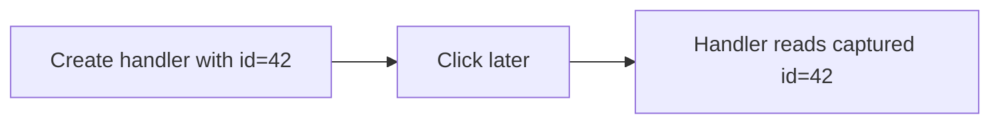

# Closures in Event Handlers

## Detailed explanation
Event handlers often close over variables from the scope where they were created. This is powerful because handlers can access configuration, IDs, state snapshots, or helper functions without global variables. It is also risky when the handler keeps stale or large values alive.

Frontend developers see this in DOM listeners, React handlers, debounce/throttle utilities, and analytics callbacks. Understanding closure behavior helps debug stale state, wrong IDs, and memory leaks.

## 1. One-line mental model
An event handler remembers variables from the scope where it was created.

## 2. Problem it solves
Handlers need access to contextual data when they run later, after user interaction.

## 3. Core idea
- Event handlers are functions.
- They can close over outer variables.
- They run later when an event occurs.
- Captured values can be stale or retained.
- Cleanup removes long-lived handlers when needed.

## 4. Visual / analogy
An event handler is like a sealed instruction envelope: when opened later, it contains the context from when it was sealed.



## 5. Minimal example

```js
function bindRow(rowId) {
  button.addEventListener("click", () => {
    console.log(rowId);
  });
}
```

## 6. Real-world example

```js
function setupAnalytics(pageName) {
  document.addEventListener("click", (event) => {
    trackClick(pageName, event.target);
  });
}
```

The handler retains `pageName`.

## 7. Common interview questions
- How do closures work in event handlers?
- Why can handlers access old variables?
- Can event handlers cause memory leaks?
- How do you clean up event listeners?
- How do closures relate to React handlers?
- What is a stale event handler?
- How do you avoid wrong loop values in handlers?

## 8. Active recall test
1. When does the handler run?
2. What scope does it remember?
3. How can it retain memory?
4. Why remove listeners?
5. What is one stale handler bug?

## 9. Mistakes / traps
- Capturing changing values and expecting automatic updates.
- Adding listeners repeatedly without removing them.
- Capturing large objects in long-lived handlers.
- Using `var` loop variables in event handlers.
- Confusing `event.target` with captured variables.

## 10. Compare with related concepts
- **Closure in handler vs closure in timer:** both run later with captured scope.
- **Event handler closure vs event object:** closure is surrounding data; event object describes the event.
- **Closure vs data attribute:** closure stores JS context; data attributes store DOM-visible metadata.

## 11. Summary from memory
Explain how a row click handler can remember a row ID and how it can go wrong.

## 12. Spaced revision prompts
- After 1 day: Define event handler closure.
- After 3 days: Explain wrong loop ID bug.
- After 7 days: Describe listener cleanup.
- After 14 days: Compare closure data and DOM data attributes.

