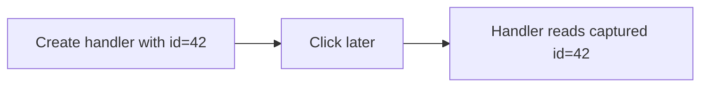

# Closures in Event Handlers

## Detailed explanation
Event handlers often close over variables from the scope where they were created. This is powerful because handlers can access configuration, IDs, state snapshots, or helper functions without global variables. It is also risky when the handler keeps stale or large values alive.

Frontend developers see this in DOM listeners, React handlers, debounce/throttle utilities, and analytics callbacks. Understanding closure behavior helps debug stale state, wrong IDs, and memory leaks.

## 1. One-line mental model
An event handler remembers variables from the scope where it was created.

## 2. Problem it solves
Handlers need access to contextual data when they run later, after user interaction.

## 3. Core idea
- Event handlers are functions.
- They can close over outer variables.
- They run later when an event occurs.
- Captured values can be stale or retained.
- Cleanup removes long-lived handlers when needed.

## 4. Visual / analogy
An event handler is like a sealed instruction envelope: when opened later, it contains the context from when it was sealed.



## 5. Minimal example

```js
function bindRow(rowId) {
  button.addEventListener("click", () => {
    console.log(rowId);
  });
}
```

## 6. Real-world example

```js
function setupAnalytics(pageName) {
  document.addEventListener("click", (event) => {
    trackClick(pageName, event.target);
  });
}
```

The handler retains `pageName`.

## 7. Common interview questions
#### How do closures work in event handlers?
- **The Engine Mechanism (Why it behaves this way):** When you attach an event handler using `element.addEventListener('click', handler)`, the `handler` function object is saved in the memory heap, and its internal `[[Environment]]` property gets set to reference the Lexical Environment of the scope where it was declared. The browser's C++ DOM engine stores a pointer to this function in its event registry associated with the target element. When a user interacts with the page and triggers the event, the event dispatcher pushes the handler callback onto the task queue. When it executes, the engine creates a new Execution Context for the handler and sets its scope chain to resolve names against the parent Lexical Environments saved in `[[Environment]]`. This is why the handler can retrieve outer scope variables.
- **The Unforgettable Mental Model:** The **Spy with a Wiretap**. The event handler is a spy stationed inside the DOM. It keeps a secret radio link (`[[Environment]]`) directly back to its home base (its creation scope), allowing it to report and receive data from home even when operating far away on the DOM page.
- **The Trap:** Thinking that the variables in the outer scope must be passed explicitly into the handler, or that they are copied at the time the handler is defined.
- **Senior Interview Playbook (Verbal Script):** "When asked this in an interview, say: Closures in event handlers work because every function declared in JS stores a reference to its parent Lexical Environment via the internal `[[Environment]]` property. When a user event fires and triggers the handler, the engine resolves any outer variable references by traversing this lexical chain, allowing the handler to access contextual variables long after the parent scope has finished executing."

#### Why can handlers access old variables?
- **The Engine Mechanism (Why it behaves this way):** They can access those variables because the Lexical Environment in which the handler was created remains alive in the Heap. The garbage collector will not reclaim any environment record that has at least one active, reachable reference pointing to it. Since the C++ DOM engine has a strong reference to the event handler, and the event handler has a reference to the Lexical Environment, all variables declared inside that Lexical Environment (even if they have since changed, or the parent function has terminated) are kept reachable and preserved.
- **The Unforgettable Mental Model:** The **Museum Display Case**. The outer variable is locked inside a glass display case (the lexical scope). Since the event handler has the key (`[[Environment]]`), it can always walk up to the case and view the contents, even if the building around it (the parent execution context) has closed for the day.
- **The Trap:** Expecting variables inside the handler to "auto-update" if the outer scope re-declares them (e.g. re-execution of a parent function like a React component render, which creates a *new* scope instead of updating the *old* one).
- **Senior Interview Playbook (Verbal Script):** "When asked this in an interview, say: Handlers can access outer variables because the outer Lexical Scope is permanently allocated on the Memory Heap. The presence of the active event handler prevents the Garbage Collector from freeing the outer scope's environment record, maintaining a live, read-write bridge to those specific variable bindings."

#### Can event handlers cause memory leaks?
- **The Engine Mechanism (Why it behaves this way):** Yes. A memory leak occurs when a DOM element is removed from the document, but a reference to it (or its event handler) remains reachable. Alternatively, if a handler is attached to a long-lived element (like `window` or `document`) and closes over massive objects, those objects will remain in the Heap forever. If the handler is never removed, the heap grows linearly with every page transition that mounts a new listener without removing the old one.
- **The Unforgettable Mental Model:** The **Hydra**. Every time you mount a component, a new listener head grows on the `window` object. If you don't chop them off (cleanup), you end up with hundreds of heads draining your memory pool.
- **The Trap:** Assuming that destroying a React component or deleting a DOM node from the DOM tree automatically garbage collects its registered event handlers. If the handlers were bound to global elements, the listeners and the entire component subtree remain in memory (detached DOM nodes).
- **Senior Interview Playbook (Verbal Script):** "When asked this in an interview, say: Yes, event listeners are a primary source of memory leaks in modern single-page applications. If handlers are registered on long-lived global objects like `window` or `document`, they remain in memory indefinitely. Since they close over the scope where they were created, they keep that entire context—including potentially massive state objects, arrays, and React component trees—reachable and immune to garbage collection."

#### How do you clean up event listeners?
- **The Engine Mechanism (Why it behaves this way):** You clean them up by explicitly invoking `element.removeEventListener(type, handlerRef)`. For this to succeed, `handlerRef` must be a direct reference to the *exact same function object in memory* that was passed to `addEventListener`. Alternatively, in modern JS, you can pass an `AbortSignal` via an `AbortController` in the options object: `element.addEventListener('click', handler, { signal: controller.signal })`. Calling `controller.abort()` tells the browser engine to automatically unregister the listener, severing the link in the event dispatch registry.
- **The Unforgettable Mental Model:** The **Matching Puzzle Pieces**. You cannot remove a listener by passing an identical-looking anonymous function (e.g., `() => {}`); you must pass the exact same physical puzzle piece (function reference) that you put in initially, or use an `AbortController` kill-switch.
- **The Trap:** Using inline anonymous functions: `window.addEventListener('scroll', () => handleScroll())` and then attempting to clean up with `window.removeEventListener('scroll', () => handleScroll())`. These are two different function objects in the heap, so the cleanup fails silently.
- **Senior Interview Playbook (Verbal Script):** "When asked this in an interview, say: We clean up event listeners by passing the exact same function reference to `removeEventListener` that was used during registration. Alternatively, we can use an `AbortController` and pass its `AbortSignal` to the event listener options, which allows us to unsubscribe clean and declaratively by simply calling `abort()`. This breaks the C++ event registry reference, freeing the handler and its closed-over scope for garbage collection."

#### How do closures relate to React handlers?
- **The Engine Mechanism (Why it behaves this way):** In React, every render is a brand new function invocation that produces a completely fresh Lexical Environment. Event handlers declared inside a component are recreated as unique function objects on every single render, closing over the *current* render's state and props. If a handler is cached via `useCallback` or is registered inside a `useEffect` with an empty dependency array `[]`, it retains a reference to the Lexical Environment of the render in which it was declared. When it runs, it reads the stale props and state from that specific render's environment, ignoring all subsequent state updates.
- **The Unforgettable Mental Model:** The **Polaroid Snapshot**. Every render prints a new photo (state). If your handler was created during Render 1, it is looking at the Render 1 photo. It cannot see the new photo printed in Render 2 unless you update the handler's dependencies or use a ref.
- **The Trap:** Forgetting that hooks like `useCallback(fn, [])` will cache the *original* handler function forever, meaning its closure will never see updated state variables unless they are declared in the dependency array.
- **Senior Interview Playbook (Verbal Script):** "When asked this in an interview, say: In React, component event handlers are closures that capture state and props from their specific render cycle. If a handler is cached or registered inside a hook with a stale dependency array, its `[[Environment]]` reference will perpetually point to an old render's lexical environment. To avoid stale state bugs, we must keep dependency arrays fully updated, use functional state updates, or store mutable references in `useRef`."

#### What is a stale event handler?
- **The Engine Mechanism (Why it behaves this way):** A stale event handler is a callback function that is bound to a DOM event or React lifecycle event but continues to reference a historical, outdated environment. Because it closes over a previous execution context's lexical environment, it resolves state and prop identifiers to historical values that are no longer accurate in the current application state.
- **The Unforgettable Mental Model:** The **Outdated Map**. A traveler (the stale handler) is navigating using a map printed three years ago (the stale scope), completely unaware that roads have been rebuilt and cities have moved since then.
- **The Trap:** Assuming that since JS variables are references, they will always stay in sync. While the *object reference* remains in sync, the primitive variables (like strings, numbers) or structural re-assignments inside the parent environment are trapped in the stale execution context's state.
- **Senior Interview Playbook (Verbal Script):** "When asked this in an interview, say: A stale event handler is a callback that has captured an outdated snapshot of variables from a past execution context or render. Even though the application state has advanced, the handler executes against a historical lexical environment, leading to bugs where the UI displays or operates on obsolete values. We resolve this by ensuring handlers are re-bound when their dependent variables change."

#### How do you avoid wrong loop values in handlers?
- **The Engine Mechanism (Why it behaves this way):** To avoid capturing the incorrect loop index, you must ensure that each handler closes over a unique, immutable lexical scope instead of a shared mutable one. This is achieved natively in ES6 by using `let` in the `for` loop header, which instructs the JS compiler to create a new lexical block scope and a new variable binding for each loop iteration. Alternatively, using array methods like `forEach` or `map` passes the index as an argument to a callback function, creating a separate function execution context with its own parameter binding for every single element.
- **The Unforgettable Mental Model:** The **Individual Cubby Holes**. Instead of dumping all IDs into a single shared box, we give each button its own separate cubby hole (`let` scope or `forEach` parameter), ensuring they never mix up their tags.
- **The Trap:** Believing that using `const i` instead of `let i` inside the loop body fixes a `var` loop without changing the loop header.
- **Senior Interview Playbook (Verbal Script):** "When asked this in an interview, say: To avoid wrong loop values in event handlers, we should avoid `var` entirely and use `let` in the loop declaration. This creates a distinct block-scoped binding for each loop iteration. Alternatively, utilizing declarative array iterations like `forEach` or `map` natively isolates each iteration's parameters in a separate execution context, ensuring that each handler closes over the correct, independent value."

## 8. Active recall test
1. **When does the handler run?**
   - **Explanation:** The handler runs asynchronously when the corresponding event is dispatched by the browser (e.g. user click, scroll) or simulated programmatically, long after the enclosing setup function has completed.
2. **What scope does it remember?**
   - **Explanation:** It remembers the exact Lexical Environment in which it was declared, stored inside its internal `[[Environment]]` property, which forms a scope chain up to the global scope.
3. **How can it retain memory?**
   - **Explanation:** By maintaining a live reference to its outer Lexical Environment, it prevents the garbage collector from reclaiming any variables or objects stored within that environment, even if they are no longer used anywhere else in the application.
4. **Why remove listeners?**
   - **Explanation:** Removing listeners is critical to sever the C++ DOM engine's reference to the JS handler, allowing the handler and its associated lexical scope to be garbage collected and avoiding memory leaks.
5. **What is one stale handler bug?**
   - **Explanation:** In React, a click handler created on mount with `useEffect(..., [])` that captures a state variable `active` will always read `active` as its initial value (e.g., `false`), even if the user has since toggled `active` to `true` on subsequent renders.

## 9. Mistakes / traps
- Capturing changing values and expecting automatic updates.
- Adding listeners repeatedly without removing them.
- Capturing large objects in long-lived handlers.
- Using `var` loop variables in event handlers.
- Confusing `event.target` with captured variables.

## 10. Compare with related concepts
- **Closure in handler vs closure in timer:** both run later with captured scope.
- **Event handler closure vs event object:** closure is surrounding data; event object describes the event.
- **Closure vs data attribute:** closure stores JS context; data attributes store DOM-visible metadata.

## 11. Summary from memory
Explain how a row click handler can remember a row ID and how it can go wrong.

## 12. Spaced revision prompts
- After 1 day: Define event handler closure.
- After 3 days: Explain wrong loop ID bug.
- After 7 days: Describe listener cleanup.
- After 14 days: Compare closure data and DOM data attributes.

