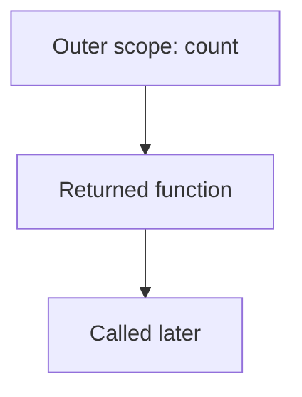

# Closures

## Detailed explanation
A closure is created when a function retains access to variables from its outer lexical environment after that outer function has finished executing. Closures are normal JavaScript behavior, not a special syntax.

They power callbacks, event handlers, factories, module patterns, memoization, custom hooks, and private state. They can also cause stale values and memory retention bugs.

## 1. One-line mental model
A closure is a function carrying access to the scope where it was created.

## 2. Problem it solves
Functions often need to remember configuration, state, or dependencies without using globals.

## 3. Core idea
- Functions remember their creation environment.
- Outer variables stay reachable while an inner function can use them.
- Closures can preserve private state.
- Closures capture bindings, not snapshots of primitive values.
- Retained references can keep memory alive.

## 4. Visual / analogy
A closure is like a backpack a function carries with the variables it still needs.



## 5. Minimal example

```js
function makeCounter() {
  let count = 0;
  return function increment() {
    count += 1;
    return count;
  };
}
```

## 6. Real-world example
Debounce functions use closures to remember the current timer id between calls.

## 7. Common interview questions
#### What is a closure?
- **The Engine Mechanism (Why it behaves this way):** When a function is declared, the JavaScript engine assigns an internal property called `[[Environment]]` to the function object in the Memory Heap. This `[[Environment]]` holds a reference to the Lexical Environment in which the function was created. During the execution phase of the outer function, its Execution Context is pushed to the Call Stack and its Variable Environment (containing local variables) is initialized in the heap. When the outer function returns the inner function, the outer function's Execution Context is popped off the Call Stack. However, because the inner function's `[[Environment]]` still maintains a direct reference to the outer function's Lexical Environment, the garbage collector cannot reclaim that outer environment's memory. Thus, the inner function retains full runtime access to the scope boundary of its outer parent.
- **The Unforgettable Mental Model:** The **Lexical Umbilical Cord**. Even if the parent function's execution context dies (popped off the stack), the child function remains connected to the parent's environment memory through a permanent life-support cord (`[[Environment]]`).
- **The Trap:** Believing closures only occur when a function is explicitly returned. Any function that references a variable outside its immediate scope—including event listeners, callbacks, or functions passed as arguments—creates a closure at declaration time.
- **Senior Interview Playbook (Verbal Script):** "When asked this in an interview, say: A closure is the combination of a function bundled together with references to its surrounding state, known as its lexical environment. Under the hood, the JS engine assigns the outer lexical environment to the inner function's internal `[[Environment]]` property at creation time. This keeps the outer environment alive in the memory heap even after the outer execution context has been popped off the Call Stack, enabling the inner function to access and mutate those variables at any point in the future."

#### Why are closures useful?
- **The Engine Mechanism (Why it behaves this way):** They allow state to be encapsulated securely. Instead of polluting the global Lexical Environment (which would reside in the global object, e.g., `window` or `globalThis`), closures create a localized, private Lexical Environment in the Memory Heap. Access to this environment is constrained strictly to the inner functions that close over it, providing encapsulation that cannot be breached from the outside scope.
- **The Unforgettable Mental Model:** The **VIP Backstage Pass**. Only holders of the pass (the returned inner functions) can access the VIP room (the encapsulated variables); the general public (outside scopes) cannot see or modify anything inside.
- **The Trap:** Thinking closures are purely for state. They are also heavily used for partial application/currying, where configuration variables are loaded into memory and held there for subsequent executions.
- **Senior Interview Playbook (Verbal Script):** "When asked this in an interview, say: Closures are indispensable for data encapsulation, modularity, and managing state without polluting the global namespace. They enable patterns like the Module Pattern, partial function application, and memoization. By enclosing variables within a lexical scope that is only accessible via exposed public functions, we create truly private state, which is the foundational mechanic behind React custom hooks and utility abstractions like throttle and debounce."

#### Do closures copy values?
- **The Engine Mechanism (Why it behaves this way):** No. Closures do not take a static snapshot or copy of variables. They retain a live, read-write reference to the actual bindings inside the outer Lexical Environment. When a variable in the outer scope is mutated, the inner function sees the updated value instantly, because both the outer and inner functions are resolving identifiers against the exact same memory reference in the Heap.
- **The Unforgettable Mental Model:** The **Shared Google Doc**. The outer and inner functions are not looking at separate PDF exports (copies); they are looking at and editing the same live Google Doc (the Lexical Environment binding).
- **The Trap:** Creating functions inside loops using `var`. Since `var` is function-scoped, all loop iterations share the exact same Lexical Environment binding, causing all closures to resolve to the final value of the loop variable.
- **Senior Interview Playbook (Verbal Script):** "When asked this in an interview, say: No, closures do not copy values. They capture live references to variables in the lexical environment. This means any mutations made to those variables by the outer scope, or by other sibling closures sharing the same scope, will be immediately visible to the function when it executes."

#### How do closures cause memory leaks?
- **The Engine Mechanism (Why it behaves this way):** The JavaScript Garbage Collector (GC) operates on reachability. As long as the inner function is reachable in memory (e.g., attached to a global event listener, window object, or long-lived interval), the internal `[[Environment]]` link keeps the entire outer Lexical Environment alive. If the outer Lexical Environment contains large objects, arrays, or DOM references, they cannot be garbage-collected, leading to a steady increase in heap size.
- **The Unforgettable Mental Model:** The **Anchor Chain**. A tiny, lightweight anchor (the inner function) is chained to a massive iron ship (the outer scope variables). Even if the ship is decommissioned, the chain keeps it pinned to the bottom of the harbor (the heap), preventing the cleanup crew (the Garbage Collector) from towing it away.
- **The Trap:** The "Shared Scope" vulnerability. If multiple inner functions are declared in the same outer scope, they share the exact same Lexical Environment object. Even if only one inner function is retained and it doesn't use a large variable, that large variable remains in the shared Lexical Environment and is kept alive.
- **Senior Interview Playbook (Verbal Script):** "When asked this in an interview, say: Closures cause memory leaks when a reference to an inner function is retained indefinitely—such as in a global event listener or a setInterval callback—while it holds onto large objects or DOM references in its lexical scope. Because the Garbage Collector sees the inner function's reference as reachable, it is forced to keep the entire associated lexical environment alive in the memory heap. We must prevent this by nil-ing out the references or removing the event listeners when they are no longer needed."

#### How do closures relate to React stale state?
- **The Engine Mechanism (Why it behaves this way):** In React, every render is a unique function execution with its own props, state, and Lexical Environment. When a hook or callback (like `useEffect` or `useCallback`) is declared, it captures variables from the *current* render's scope. If that callback is stored or scheduled (e.g., inside a `setTimeout` or an empty dependency array in `useEffect`), it will forever close over the lexical environment of that *specific* historic render. Even if the component re-renders and creates new state variables, the stale closure is still referencing the old variables stored in the heap from the historic render.
- **The Unforgettable Mental Model:** The **Time Capsule**. A closure created during Render 1 is a time capsule containing the exact state values of Render 1. No matter when you open it (execute it), it will only show you the state that existed when it was buried.
- **The Trap:** Missing dependencies in `useCallback` or `useEffect`, or thinking that React's state variables update in-place in existing closures.
- **Senior Interview Playbook (Verbal Script):** "When asked this in an interview, say: In React, a stale closure occurs when a callback closes over props or state from a past render but is executed during a later render without being recreated. This happens when dependencies are omitted from `useEffect`, `useCallback`, or `useMemo`, forcing the callback to execute against the stale lexical environment of an older render. To solve this, we must maintain accurate dependency arrays, use the functional state updater pattern, or use the `useRef` hook to read the latest mutable value."

## 8. Active recall test
1. **What does a function retain?**
   - **Explanation:** A function retains a live reference to its outer lexical environment via its internal `[[Environment]]` property, which is established at declaration time. This allows it to access and mutate any variables that were in scope when the function was defined, even after the parent function has finished execution and its execution context has been destroyed.
2. **When can an outer variable stay alive?**
   - **Explanation:** An outer variable stays alive in the Memory Heap as long as there is at least one active, reachable inner function whose `[[Environment]]` chain links back to the Lexical Environment containing that variable.
3. **Name two closure use cases.**
   - **Explanation:** 
     - *Encapsulating private state* (e.g., creating a counter factory where the count variable cannot be directly modified except through returned increment/decrement methods).
     - *Function factories / currying* (e.g., creating a debounce or throttle utility that stores timer references across multiple invocations).
4. **What is stale closure?**
   - **Explanation:** A stale closure occurs when a function retains a reference to an outdated variable binding from an older execution context (or React render) and fails to access the latest current value because it was not recreated with the new environment.
5. **How can closures retain memory?**
   - **Explanation:** They retain memory by keeping the entire outer Lexical Environment object alive in the heap. If the outer environment contains large objects, arrays, or DOM elements, they cannot be garbage collected as long as any inner function referencing that scope is still reachable.

## 9. Mistakes / traps
- Saying closure only happens when returning functions.
- Thinking closures copy values at creation time.
- Ignoring cleanup for event listeners.
- Using closures accidentally in loops with `var`.

## 10. Compare with related concepts
- **Closure vs scope:** scope is where names are available; closure keeps outer scope reachable.
- **Closure vs object state:** both can store state; closures hide it through lexical access.
- **Closure vs class private fields:** lexical privacy vs class syntax privacy.

## 11. Summary from memory
Explain closures through a counter factory and one frontend use case.

## 12. Spaced revision prompts
- After 1 day: Define closure.
- After 3 days: Build debounce from memory.
- After 7 days: Explain stale closures.
- After 14 days: Diagnose closure memory retention.
