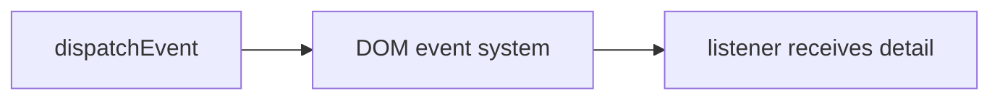

# Custom Events

## Detailed explanation
Custom events let code create and dispatch application-specific DOM events. They are useful for integrating plain JavaScript widgets, web components, analytics hooks, or legacy code where React/state libraries are not managing communication.

Use `CustomEvent` with `detail` for payload. In modern React apps, prefer props/state/context for React-to-React communication, but know custom events for browser-level integration.

## 1. One-line mental model
Custom events let code publish named DOM events with optional data.

## 2. Problem it solves
Independent browser components sometimes need event-based communication without direct imports.

## 3. Core idea
- Create with `new CustomEvent(name, { detail })`.
- Dispatch from DOM node.
- Listen with `addEventListener`.
- Payload lives in `event.detail`.
- Useful for web components and integration boundaries.

## 4. Visual / analogy
Custom event is announcement on DOM event bus.



## 5. Minimal example

```js
const event = new CustomEvent("cart:add", { detail: { id: 1 } });
window.dispatchEvent(event);
```

## 6. Real-world example

```js
window.addEventListener("auth:logout", () => {
  clearSession();
});
```

Legacy shell can notify independent widgets.

## 7. Common interview questions

#### What is `CustomEvent`?
- **The Engine Mechanism (Why it behaves this way):** The `CustomEvent` interface represents an event initialized by an application for any purpose. It extends the browser's base `Event` class, which means it inherits standard event behavior (including phase propagation like capturing and bubbling, and methods like `stopPropagation()`). When `new CustomEvent(type, options)` is executed, the JavaScript engine allocates memory in the Heap for the event instance. In the creation phase of the event instance, the second argument options object is parsed; if a `detail` property is provided, it is stored internally and exposed as a read-only property on the event object.
- **The Unforgettable Mental Model:** Imagine the DOM event system is a postal delivery network. A standard `Event` is an empty envelope that just says "Priority" or "Notice." A `CustomEvent` is a custom parcel package containing a designated bubble-wrap compartment (`detail`) where you can tuck in any item (data payload) you want to send across town.
- **The Trap:** Attempting to assign custom properties directly to a base `Event` object (e.g., `new Event('my-event').someData = {}`). The browser engine seals or strictly regulates base `Event` objects, meaning custom properties might be silently ignored or cause errors in strict mode. You must use `CustomEvent` and the specified `detail` key for passing payloads.
- **Senior Interview Playbook (Verbal Script):** "When asked this in an interview, say: '`CustomEvent` is a web platform interface that extends the base DOM `Event` interface, specifically designed to carry arbitrary payloads via a read-only `detail` property. It allows developers to leverage the browser's built-in event-propagation system—including capturing, bubbling, and cancelability—for application-specific, decoupled communication.'"

#### Where is payload stored?
- **The Engine Mechanism (Why it behaves this way):** The payload is stored in the `detail` property of the `CustomEvent` instance. When the event is dispatched, the engine passes a reference to this `CustomEvent` object to all matching listeners on the event path. Inside the listener's lexical environment, the event is received as an argument (usually `e` or `event`), and `event.detail` is accessed. Because `event.detail` contains a reference to the heap-allocated payload, passing large objects doesn't copy the data—it merely copies the reference, which is highly efficient but means listeners can mutate the payload unless it is frozen.
- **The Unforgettable Mental Model:** A specialized lockbox embedded in the side of a courier's truck labeled "DETAIL". Anyone who intercepts the truck can open this lockbox and read the documents inside, but they cannot replace the lockbox itself.
- **The Trap:** Modifying properties inside `event.detail` inside a listener. If `detail` contains a non-frozen reference-type object (like a plain object or array), a downstream listener can mutate it, causing hard-to-debug side-effects across unrelated files.
- **Senior Interview Playbook (Verbal Script):** "When asked this in an interview, say: 'The payload is stored in the `detail` property of the event object. It is passed as the second argument inside the options object when initializing `new CustomEvent()`. To ensure state predictability, it is best practice to pass read-only or deeply frozen data in `detail` to prevent listeners from inadvertently mutating the payload.'"

#### How do you dispatch custom event?
- **The Engine Mechanism (Why it behaves this way):** Dispatching is triggered via the `dispatchEvent()` method, which is defined on the `EventTarget` prototype (inherited by `Node`, `Element`, `Document`, and `Window`). When `element.dispatchEvent(event)` is called:
  1. The Call Stack is paused for synchronous event execution.
  2. The browser engine calculates the event path (based on the DOM tree from the target element up to `Window`).
  3. It executes matching event listeners registered along that path (Capturing phase, then Target, then Bubbling phase if `{ bubbles: true }` was specified in the event options).
  4. The method returns `false` if the event is cancelable and at least one listener called `preventDefault()`, and `true` otherwise.
- **The Unforgettable Mental Model:** A megaphone broadcast from a specific floor of a building. The sound either stays in that room, or travels all the way up to the roof (Window) depending on whether you enabled the "echo booster" (bubbles: true).
- **The Trap:** Forgetting that `dispatchEvent` is a *synchronous* operation. If you dispatch an event, the JavaScript engine suspends the execution of the dispatching function and immediately executes all synchronous event handlers bound to that event before returning. This can block the Call Stack if listeners are heavy.
- **Senior Interview Playbook (Verbal Script):** "When asked this in an interview, say: 'We dispatch custom events using `targetElement.dispatchEvent(customEventInstance)`. This is a synchronous operation on `EventTarget` that immediately resolves the event path and invokes all matched capturing and bubbling listeners on the Call Stack before the execution of the main dispatching block resumes.'"

#### When use custom events?
- **The Engine Mechanism (Why it behaves this way):** Custom events are ideal at architectural boundaries where framework-specific reactivity (like React Context, Vue props, or Redux) is unavailable or undesirable. This includes micro-frontends, Web Components (Shadow DOM boundaries), third-party vanilla JS libraries, and legacy script integrations. By using the native DOM as the event bus, disparate modules communicate without shared runtime packages or build-time dependencies.
- **The Unforgettable Mental Model:** A universal power adapter. It doesn't matter if your appliance is from Europe or America; if both conform to the physical socket shape (the DOM), they can share power (data).
- **The Trap:** Using custom events inside a single unified SPA framework (like React or Vue) for general state management. This bypasses the framework's reactive data flow, making state tracing, debugging, and Time-Travel debugging near impossible.
- **Senior Interview Playbook (Verbal Script):** "When asked this in an interview, say: 'Custom events should be reserved for decoupled boundaries, such as communicating between independent Micro-Frontends, Web Components crossing Shadow DOM boundaries, or integrating third-party vanilla JavaScript plugins. Within a dedicated SPA framework like React, we should rely on standard props, state, and context to preserve declarative reactivity and deterministic debugging.'"

#### Custom events vs pub-sub?
- **The Engine Mechanism (Why it behaves this way):**
  - **Custom Events:** Leverage the browser's native DOM tree for propagation. Listeners must be bound to nodes that lie on the event path, and the events propagate using Capture/Bubble phases, which makes them aware of visual hierarchies.
  - **Pub-Sub (Publish-Subscribe):** Is a pure JavaScript construct (usually an object mapping strings to arrays of callback functions). It has zero knowledge of the DOM, no propagation phases, operates strictly in memory via direct function calls, and is faster because it avoids DOM traversal overhead.
- **The Unforgettable Mental Model:** Custom events are like smoke signals sent from a specific physical tower (DOM node)—only towers within sight line (ancestry) can see and react to them. Pub-sub is a central cell-tower network—any device anywhere in the country can receive a text message if subscribed to the number.
- **The Trap:** Thinking custom events are slower than pub-sub. While DOM traversal does introduce overhead, custom events are highly optimized by the browser engine and offer unique context-awareness (e.g., stopping propagation midway up the DOM tree) that pure memory-based Pub-Sub cannot match.
- **Senior Interview Playbook (Verbal Script):** "When asked this in an interview, say: 'Custom events are DOM-centric, propagating through capturing and bubbling phases based on the DOM hierarchy, which makes them context-aware and highly integrated with native elements. In contrast, Pub-Sub is a pure in-memory JavaScript pattern that is completely detached from the DOM, executing linear callback queues for subscribed observers, which makes it faster and lighter for pure data-centric tasks.'"

## 8. Active recall test

#### 1. Which constructor creates custom event?
- **Explanation/Answer:** `new CustomEvent(eventType, options)` is the constructor, where `eventType` is a string and `options` can contain `detail` (the payload), `bubbles` (whether it bubbles), and `cancelable` (whether it can be canceled via `preventDefault()`).

#### 2. Where does payload go?
- **Explanation/Answer:** The payload is assigned to the `detail` property inside the second argument object, and retrieved via `event.detail` in listeners.

#### 3. What method dispatches it?
- **Explanation/Answer:** The `dispatchEvent(event)` method, called on any `EventTarget` (such as an Element, Document, or Window).

#### 4. What method listens?
- **Explanation/Answer:** The `addEventListener(eventType, handler)` method, called on any ancestor node (if bubbling is enabled) or directly on the target node.

#### 5. When is React state better?
- **Explanation/Answer:** React state (or context/props) is better for communications within the React application tree because it maintains declarative UI synchronization, adheres to unidirectional data flow, supports hooks, and avoids direct imperative DOM operations.

## 9. Mistakes / traps
- Using custom events for normal React parent-child flow.
- Forgetting listener cleanup.
- Putting large mutable objects in `detail`.
- Naming events inconsistently.

## 10. Compare with related concepts
- **CustomEvent vs Event:** custom payload via `detail`.
- **Custom event vs pub-sub:** DOM-based vs app-level emitter.
- **Custom event vs React props:** browser integration vs component data flow.

## 11. Summary from memory
Explain how web component can notify host app with `CustomEvent`.

## 12. Spaced revision prompts
- 1 day: Define custom event.
- 3 days: Dispatch event with `detail`.
- 7 days: Add/remove listener.
- 14 days: Compare with pub-sub.

