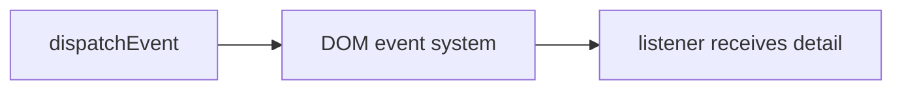

# Custom Events

## Detailed explanation
Custom events let code create and dispatch application-specific DOM events. They are useful for integrating plain JavaScript widgets, web components, analytics hooks, or legacy code where React/state libraries are not managing communication.

Use `CustomEvent` with `detail` for payload. In modern React apps, prefer props/state/context for React-to-React communication, but know custom events for browser-level integration.

## 1. One-line mental model
Custom events let code publish named DOM events with optional data.

## 2. Problem it solves
Independent browser components sometimes need event-based communication without direct imports.

## 3. Core idea
- Create with `new CustomEvent(name, { detail })`.
- Dispatch from DOM node.
- Listen with `addEventListener`.
- Payload lives in `event.detail`.
- Useful for web components and integration boundaries.

## 4. Visual / analogy
Custom event is announcement on DOM event bus.



## 5. Minimal example

```js
const event = new CustomEvent("cart:add", { detail: { id: 1 } });
window.dispatchEvent(event);
```

## 6. Real-world example

```js
window.addEventListener("auth:logout", () => {
  clearSession();
});
```

Legacy shell can notify independent widgets.

## 7. Common interview questions
- What is `CustomEvent`?
- Where is payload stored?
- How do you dispatch custom event?
- When use custom events?
- Custom events vs pub-sub?

## 8. Active recall test
1. Which constructor creates custom event?
2. Where does payload go?
3. What method dispatches it?
4. What method listens?
5. When is React state better?

## 9. Mistakes / traps
- Using custom events for normal React parent-child flow.
- Forgetting listener cleanup.
- Putting large mutable objects in `detail`.
- Naming events inconsistently.

## 10. Compare with related concepts
- **CustomEvent vs Event:** custom payload via `detail`.
- **Custom event vs pub-sub:** DOM-based vs app-level emitter.
- **Custom event vs React props:** browser integration vs component data flow.

## 11. Summary from memory
Explain how web component can notify host app with `CustomEvent`.

## 12. Spaced revision prompts
- 1 day: Define custom event.
- 3 days: Dispatch event with `detail`.
- 7 days: Add/remove listener.
- 14 days: Compare with pub-sub.

