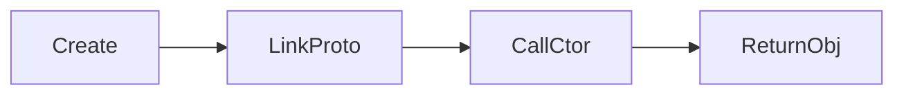

# Custom new Operator

## Detailed explanation
Custom `new` implementation tests prototype, constructor calls, `this`, and object return rules. `new Fn(args)` creates object linked to `Fn.prototype`, calls `Fn` with that object as `this`, and returns constructor's object return if present.

Frontend relevance lower, but common senior JS coding exercise.

## 1. One-line mental model
`new` creates object, links prototype, calls constructor, returns object.

## 2. Problem it solves
Explains constructor behavior and prototype chain.

## 3. Core idea
- Create object with constructor prototype.
- Call constructor with object as `this`.
- Pass arguments.
- If constructor returns object/function, use it.
- Otherwise return created object.

## 4. Visual / analogy
`new` builds house shell, lets constructor furnish it, then hands back house.



## 5. Minimal example

```js
function myNew(Ctor, ...args) {
  const obj = Object.create(Ctor.prototype);
  const result = Ctor.apply(obj, args);
  return result !== null && (typeof result === "object" || typeof result === "function")
    ? result
    : obj;
}
```

## 6. Real-world example

```js
function Person(name) {
  this.name = name;
}
const p = myNew(Person, "Asha");
```

## 7. Common interview questions
- What does `new` do?
- How implement custom `new`?
- What if constructor returns object?
- How prototype linked?
- What is `this` inside constructor?

## 8. Active recall test
1. First step of `new`?
2. How link prototype?
3. What `this` points to?
4. What return override rule?
5. Why Object.create?

## 9. Mistakes / traps
- Ignoring constructor object return.
- Using `{}` without prototype link.
- Not passing args.
- Forgetting functions can be returned too.

## 10. Compare with related concepts
- **`new` vs Object.create:** constructor call + prototype link vs object creation only.
- **Constructor vs class:** classes use constructor semantics with syntax.
- **Prototype vs instance:** shared methods vs created object.

## 11. Summary from memory
Explain custom `new` in four steps.

## 12. Spaced revision prompts
- 1 day: List `new` steps.
- 3 days: Implement `myNew`.
- 7 days: Explain return object rule.
- 14 days: Compare with Object.create.

