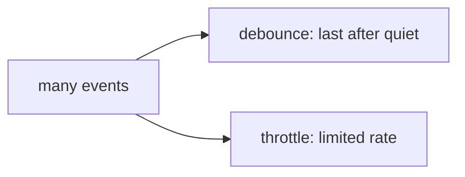

# Debounce and Throttle

## Detailed explanation
Debounce and throttle control how often a function runs during repeated events. Debounce waits until events stop for a delay. Throttle runs at most once in a fixed interval.

Frontend interviews ask this for search boxes, resize handlers, scroll tracking, autosave, rate-limited APIs, and performance-sensitive UI.

## 1. One-line mental model
Debounce waits for quiet; throttle enforces a maximum rate.

## 2. Problem it solves
High-frequency events can trigger too much work, causing API spam, jank, or wasted renders.

## 3. Core idea
- Debounce is best for final value after user pauses.
- Throttle is best for steady updates during continuous activity.
- Both usually use closures to remember timers/timestamps.
- Cleanup matters for components and listeners.
- Choose delay based on UX, not habit.

## 4. Visual / analogy
Debounce waits until someone stops talking; throttle lets one update through every interval.



## 5. Minimal example

```js
function debounce(fn, delay) {
  let timer;
  return (...args) => {
    clearTimeout(timer);
    timer = setTimeout(() => fn(...args), delay);
  };
}
```

## 6. Real-world example
Search autocomplete usually debounces network requests so typing "react" does not fire five separate queries.

## 7. Common interview questions

#### What is debounce?
- **The Engine Mechanism (Why it behaves this way):** Debouncing is a technique that limits the execution rate of a function by delaying its invocation until a specified interval of inactivity has elapsed. In JavaScript, this is achieved by wrapping the target function in a closure that retains a lexical reference to a timer variable (`timerId`). Each time the debounced function is invoked, the event handler immediately cancels any pending asynchronous task using `clearTimeout(timerId)` and schedules a new execution using `setTimeout(fn, delay)`. As long as new events fire before the delay is reached, the V8 macro-task queue entry is repeatedly cleared and rescheduled, postponing execution until the event flurry ceases.
- **The Unforgettable Mental Model:** An automated elevator door. When a passenger steps in, the elevator starts a countdown to close the door (e.g., 5 seconds). If another passenger arrives before the 5 seconds are up, the countdown is completely reset back to 5 seconds. The doors will only close (the function executes) when there is a continuous period of quiet with no new passengers.
- **The Trap:** Re-creating a debounced function on every component render in frameworks like React. If declared raw within a functional component, the function is re-instantiated on every state update, creating a brand-new closure with a fresh, empty `timer` reference, completely defeating the debounce mechanism. To fix this, wrap the debounced function in `useCallback` or `useMemo` with a stable dependency array.
- **Senior Interview Playbook (Verbal Script):** "When asked this in an interview, say: Debouncing is a rate-limiting technique that delays a function's execution until a specified window of absolute quiet has occurred. The implementation wraps the target function in a closure to track a persistent timeout ID. Every invocation clears the previous timeout and schedules a new one, meaning the actual target function will only execute exactly once—after high-frequency triggers have ceased for the duration of the delay."

#### What is throttle?
- **The Engine Mechanism (Why it behaves this way):** Throttling is a rate-limiting technique that guarantees a function runs at most once inside a fixed time interval, regardless of how many times the trigger event is fired. Throttling can be implemented using either a timestamp check (comparing `Date.now()` or `performance.now()` against the last execution time) or a timer-based lock (`isWaiting` boolean state or a persistent `timeoutId` inside a closure). When an event fires, the throttle checks the lock or timestamp. If the cooling period is active, the invocation is discarded or optionally queued; if inactive, the target function executes immediately and the lock is engaged, resolving after the cooling window.
- **The Unforgettable Mental Model:** A security turnstile gate at an amusement park. Even if a massive crowd of 100 people is pushing against the gate simultaneously, the mechanical arm is locked to release only one person every 10 seconds.
- **The Trap:** Writing a throttle function that discards the final event. In mouse-scroll or window-resize tracking, if a user scrolls rapidly and stops mid-way through a throttle window, the final, exact ending coordinates of the scroll will be dropped if the throttle only triggers on the leading edge. A robust throttle must support a "trailing" edge call to capture and execute the final event frame after the interval resolves.
- **Senior Interview Playbook (Verbal Script):** "When asked this in an interview, say: Throttling is a performance optimization that restricts a function to executing at most once per defined time interval. Unlike debouncing, which waits for absolute inactivity, throttling ensures a steady, periodic execution stream during continuous event streams. It is typically implemented using a timestamp differential or a boolean lock inside a closure, and is crucial for high-frequency feedback loops like viewport resizing or scroll position calculations."

#### When would you use each?
- **The Engine Mechanism (Why it behaves this way):** The choice depends on whether the intermediate states of the user's action are relevant. Debouncing is ideal when you only care about the *final resting state* of a high-frequency action. If a user is typing a search query, firing an API request on every keystroke causes heavy server load and race conditions; debouncing waits until the typing stops to send a single query. Throttling is required when you need *continuous, real-time updates* at a controlled, performant frame rate. For example, when rendering infinite scroll, recalculating element positions during active scrolling, or tracking drag-and-drop mouse movements, waiting for the user to stop scrolling (debounce) would result in a broken UI experience. Throttling guarantees smooth, periodic updates (e.g., every 100ms) without locking the main thread.
- **The Unforgettable Mental Model:** A search query is like a writer typing a letter: you wait until they finish the sentence (debounce) before you read it. Mouse-tracking is like drawing a line: you want to see the pen moving smoothly across the screen (throttle), not have the ink suddenly teleport from the start to the end.
- **The Trap:** Debouncing a drag-and-drop handler. If you debounce it, the element being dragged will not update its position at all while the mouse is moving, remaining completely frozen until the user holds their mouse still for a moment, destroying the drag UX.
- **Senior Interview Playbook (Verbal Script):** "When asked this in an interview, say: Use debouncing when you only care about the final result of an action, such as executing an autocomplete search or performing an autosave after typing. Use throttling when you require periodic updates during an active event stream, such as calculating scroll-spy sections, resizing page elements, or updating drag-and-drop coordinates. Throttling maintains a responsive UI while protecting the main thread from event-loop congestion."

#### Implement debounce.
- **The Engine Mechanism (Why it behaves this way):** A robust, production-ready debounce must return a wrapper function that preserves the dynamic lexical context (`this`) and event arguments using rest parameters. It implements an inner closure that holds a private `timeoutId`. To make it enterprise-grade, it should include a `cancel()` method bound to the returned wrapper to clear any pending timeout, which is critical for cleaning up timers when host components unmount to prevent memory leaks.
- **The Unforgettable Mental Model:** A custom stopwatch that you can wind up, trigger, or hit the physical "reset" button (cancel) to stop the chime from going off if you decide to leave the room.
- **The Trap:** Losing the execution context of the original function. If you call `fn(...args)` without using `fn.apply(this, args)` inside non-arrow setups, the target function might lose its reference to the calling class or component instance, causing runtime errors if the function relies on `this`.
- **Senior Interview Playbook (Verbal Script):** "When asked this in an interview, say: Here is a standard, robust implementation of debounce. It utilizes a closure to preserve the `timeoutId` and returns a wrapper function that correctly preserves the invocation context and arguments. Crucially, it exposes a `.cancel` method on the returned function to allow host components to clean up pending macro-tasks on unmount, avoiding memory leaks and state updates on destroyed components."

```js
function debounce(fn, delay) {
  let timeoutId;
  
  const debounced = function(...args) {
    const context = this;
    if (timeoutId) {
      clearTimeout(timeoutId);
    }
    timeoutId = setTimeout(() => {
      fn.apply(context, args);
    }, delay);
  };
  
  debounced.cancel = function() {
    if (timeoutId) {
      clearTimeout(timeoutId);
      timeoutId = null;
    }
  };
  
  return debounced;
}
```

#### How do leading and trailing calls work?
- **The Engine Mechanism (Why it behaves this way):**
  - **Leading Call (Immediate):** The target function is executed immediately on the *first* trigger, and then a cooling lock is engaged. Any subsequent calls within the delay window are ignored or queued. Once the delay passes without any new events, the lock is released.
  - **Trailing Call (Delayed):** The standard behavior. The execution is deferred. When events fire, the function waits for the quiet window to elapse before executing the *last* captured event arguments.
  A robust utility library (like Lodash) merges both behaviors. In debounce, a leading configuration allows a search button to fire immediately on the first click, preventing double-submission, while trailing captures any final typed values if the user continues typing.
- **The Unforgettable Mental Model:** Leading is a gun firing immediately when you pull the trigger, then cooling down. Trailing is a fuse burning slowly: it won't explode until the spark reaches the end, and every shake resets the fuse.
- **The Trap:** Enrolling both leading and trailing calls without realizing that if they both run on a single isolated event click, the function might run twice: once immediately on the click, and a second time after the delay, which can double-submit forms or duplicate data.
- **Senior Interview Playbook (Verbal Script):** "When asked this in an interview, say: Leading-edge execution fires the target function immediately on the initial event trigger, initiating a lockdown period where subsequent calls are ignored. Trailing-edge execution defers the call, running the target function only after the trigger events have ceased for the duration of the delay. A standard utility allows toggling both configurations, which is vital for use cases like protecting submit buttons from rapid double-clicks while still capturing trailing updates."

## 8. Active recall test

#### 1. Which rate-limiting technique waits for a period of absolute quiet before executing the target function?
Debounce.

#### 2. Which technique guarantees that the target function will run at most once per fixed time interval?
Throttle.

#### 3. Why do debounce and throttle implementations rely on JavaScript closures?
To maintain private, persistent state variables—such as the active `timeoutId` or the `lastExecuted` timestamp—across successive invocations without exposing them to or polluting the global namespace.

#### 4. What is a "trailing call" in the context of these rate-limiting functions?
A trailing call refers to executing the target function with the final, most recently captured arguments at the very end of the delay window, once inactivity is detected or the throttle interval resolves, ensuring the final state is never lost.

#### 5. What critical action must be executed when unmounting a React component that uses a debounced event handler?
The component must invoke the debounced function's `.cancel()` cleanup method within the `useEffect` unmount callback to clear any pending asynchronous timeouts in the browser's macro-task queue, eliminating memory leaks and guarding against updates on destroyed component states.

## 9. Mistakes / traps
- Using debounce for scroll progress that needs steady updates.
- Forgetting to preserve arguments and `this` when needed.
- Not canceling timers on unmount.
- Choosing arbitrary delays.
- Recreating debounced functions every render.

## 10. Compare with related concepts
- **Debounce vs throttle:** after inactivity vs limited frequency.
- **Client rate control vs backend rate limiting:** UX/performance helper vs enforcement.
- **Timer cleanup vs memory leak:** pending callbacks can outlive the owner.

## 11. Summary from memory
Explain which one to use for search input, resize, and scroll tracking.

## 12. Spaced revision prompts
- After 1 day: Define debounce and throttle.
- After 3 days: Implement debounce.
- After 7 days: Explain leading/trailing options.
- After 14 days: Apply each to real UI events.
