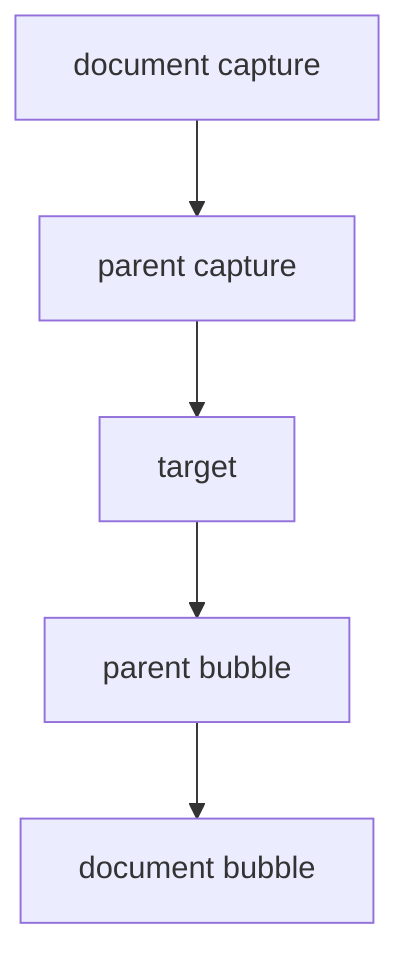

# DOM Event Propagation

## Detailed explanation
DOM event propagation is the path an event follows through the document tree. Most events move through capture phase from ancestors to target, target phase on the target element, and bubble phase back up through ancestors.

This matters for event delegation, modal/backdrop clicks, nested interactive elements, analytics handlers, keyboard handling, and React's event system.

## 1. One-line mental model
An event travels down to the target, runs on the target, then usually bubbles back up.

## 2. Problem it solves
Browsers need a consistent way for ancestors and targets to respond to the same interaction.

## 3. Core idea
- Capture phase goes from root toward target.
- Target phase runs on the target.
- Bubble phase goes from target back to root.
- `stopPropagation` stops further propagation.
- Event delegation listens on an ancestor and checks `event.target`.

## 4. Visual / analogy
Event propagation is like a message passing through building security, the room, then back to reception.



## 5. Minimal example

```js
list.addEventListener("click", (event) => {
  const button = event.target.closest("button[data-id]");
  if (!button) return;
  selectItem(button.dataset.id);
});
```

## 6. Real-world example
A table can handle row action clicks through one delegated listener instead of attaching thousands of listeners to individual rows.

## 7. Common interview questions

#### What are capture and bubble phases?
- **The Engine Mechanism (Why it behaves this way):** When a physical event (e.g., clicking) occurs, the browser's layout engine maps the coordinates to a target element in the render tree. The browser then builds a propagation path (an array of ancestor nodes from `Window` down to the target).
  - **Capture Phase (Phase 1):** The engine iterates through the propagation path starting at index `0` (`Window`) down to the parent of the target node. It executes any listeners registered on these ancestors with the `{ capture: true }` (or `true`) parameter.
  - **Target Phase (Phase 2):** The engine invokes all listeners bound directly to the target element itself.
  - **Bubbling Phase (Phase 3):** The engine walks the propagation path in reverse, from the parent of the target node back up to the `Window`. It executes all standard listeners registered without the capture flag.
- **The Unforgettable Mental Model:** A deep-sea submarine dive. The submarine starts at the surface (`Window`) and descends deep into the ocean trench (Capture Phase) until it lands on the ocean floor/target (Target Phase). After exploring, it ascends straight back up to the surface (Bubbling Phase).
- **The Trap:** Believing that capturing event handlers will execute *after* bubbling ones because they are "higher up" in the DOM tree. Capturing handlers are checked first because the engine must travel down the tree before it reaches the target.
- **Senior Interview Playbook (Verbal Script):** "When asked this in an interview, say: 'DOM event propagation operates in three distinct, sequential phases: Capture, Target, and Bubbling. During the capturing phase, the event travels down from the `Window` through the DOM hierarchy to the parent of the target. The target phase executes all handlers bound directly to the target. Finally, the bubbling phase bubbles the event back up the DOM hierarchy to the `Window`, allowing ancestors to intercept and process the event.'"

#### What is event delegation?
- **The Engine Mechanism (Why it behaves this way):** Event delegation is a memory and performance optimization pattern that exploits the event bubbling phase. Instead of instantiating and attaching separate, heap-allocated event listener functions to hundreds of child elements, a single event listener is attached to a mutual ancestor. When a child is clicked, the event bubbles up to the ancestor, where the event handler executes. Inside this handler, `event.target` points to the actual clicked leaf element. The handler can use methods like `event.target.closest('selector')` to traverse the parent chain and find the active target.
- **The Unforgettable Mental Model:** A central post office sorting desk. Instead of hiring a postman to stand inside every single house in a city (individual element listeners), all outgoing mail is sent to a single post office (ancestor listener) where a single postal worker sorts it by reading the sender address printed on the envelope (`event.target`).
- **The Trap:** Thinking delegation handles clicks on nested SVG icons or nested spans automatically. If you listen on a button, and the button contains an `<i>` tag or an `<svg>`, `event.target` will return the `<i>` or `<path>` element, not the button! You *must* use `event.target.closest('button')` to correctly capture the intended container element.
- **Senior Interview Playbook (Verbal Script):** "When asked this in an interview, say: 'Event delegation is a design pattern where we bind a single event listener to a parent container to manage events bubbled up from its descendants. This avoids allocating hundreds of individual event listeners in memory and handles dynamically appended children seamlessly. To write resilient delegation logic, we always use `event.target.closest()` to reliably locate our interactive boundaries regardless of how deeply nested the child elements are.'"

#### What is `event.target` vs `currentTarget`?
- **The Engine Mechanism (Why it behaves this way):**
  - **`event.target`:** Is a reference to the absolute lowest DOM element in the tree that initiated the event (the actual element that was clicked or focused). It remains constant as the event propagates.
  - **`event.currentTarget`:** Is a dynamic reference pointing directly to the DOM element that is *currently* executing the active event handler callback. If you bind a listener to `document.body` and click an internal button, `event.target` will be the `<button>` node, while `event.currentTarget` will point to the `<body>` node while that listener is running on the Call Stack.
- **The Unforgettable Mental Model:** A crime scene detective. `event.target` is the criminal who pulled the trigger (origin). `event.currentTarget` is the precinct station that is currently interrogating them (the current location of execution).
- **The Trap:** Inspecting `event.currentTarget` inside an asynchronous callback (like `setTimeout` or an `async` response) or printing the event object to `console.log`. Because event objects are recycled or updated dynamically by the engine, `event.currentTarget` becomes `null` as soon as the synchronous event loop execution finishes.
- **Senior Interview Playbook (Verbal Script):** "When asked this in an interview, say: 'The difference lies in origin versus execution context. `event.target` is the absolute leaf node that triggered the interaction, which remains unchanged. `event.currentTarget` is the specific DOM element to which the active event handler is attached and is currently executing. In delegated event handlers, we use `event.target` to identify which child was clicked, and `event.currentTarget` when we need to reference the wrapper component itself.'"

#### What does `stopPropagation` do?
- **The Engine Mechanism (Why it behaves this way):** Calling `event.stopPropagation()` sets an internal Boolean flag on the `Event` object to `true`. When the event loop finishes executing the current listener, the browser's propagation engine checks this flag. If it is set, the engine immediately halts traversal along the calculated DOM path, preventing any subsequent capture or bubbling listeners from firing.
- **The Unforgettable Mental Model:** A fire break in a forest fire. When the fire (event) reaches a specific barrier, you execute a controlled burn (stopPropagation) that cuts off the pathway, preventing the flames from traveling to the rest of the forest (ancestors).
- **The Trap:** Thinking `stopPropagation()` prevents other event listeners bound to the *same* element from running. It does not! If there are three separate listeners bound to the same element, calling `stopPropagation()` in the first listener will still let the second and third listeners execute. To prevent other handlers on the same element from running, you must call `event.stopImmediatePropagation()`.
- **Senior Interview Playbook (Verbal Script):** "When asked this in an interview, say: '`event.stopPropagation()` stops the event from propagating further down the capture path or up the bubbling path to ancestor nodes. However, it does not prevent other event handlers bound to the same element from executing. To stop both propagation and same-element siblings from firing, we must use `event.stopImmediatePropagation()`.'"

#### Which events do not bubble normally?
- **The Engine Mechanism (Why it behaves this way):** By W3C specification, several events are designated as non-bubbling because bubbling would make no logical sense or cause severe performance cascades. These events are initialized with `{ bubbles: false }` at the engine level. Examples include `focus`, `blur`, `load`, `unload`, `scroll`, `mouseenter`, and `mouseleave`.
- **The Unforgettable Mental Model:** A private whisper in a room. When you whisper a secret to someone (focus), only they hear it; they don't scream it out loud for the whole house to hear (no bubbling).
- **The Trap:** Trying to delegate `mouseenter` or `mouseleave` on a grid container. Because they do not bubble, you will not receive notifications when the pointer enters child elements. You must use `mouseover` and `mouseout` instead, which *do* bubble.
- **Senior Interview Playbook (Verbal Script):** "When asked this in an interview, say: 'Many interface-specific events do not bubble, notably `focus`, `blur`, `scroll`, `load`, and the mouse hover boundaries `mouseenter` and `mouseleave`. If we need to implement event delegation for these events, we must either bind our handlers to the capturing phase or utilize their bubbling counterparts, such as `focusin`, `focusout`, `mouseover`, and `mouseout`.'"

## 8. Active recall test

#### 1. What phase runs first?
- **Explanation/Answer:** The Capturing phase runs first, descending from the Window down to the target's parent.

#### 2. What is the target phase?
- **Explanation/Answer:** The Target phase is when the event reaches the destination DOM node and invokes its registered listeners.

#### 3. What does bubbling enable?
- **Explanation/Answer:** Bubbling enables event delegation, allowing ancestor containers to handle events initiated by deeply nested descendants, which optimizes memory allocation.

#### 4. What is `currentTarget`?
- **Explanation/Answer:** `currentTarget` is the DOM node that the active event listener is bound to and is currently executing its callback.

#### 5. When should delegation be avoided?
- **Explanation/Answer:** Delegation should be avoided for non-bubbling events (unless using capture), complex custom gestures with highly nested SVGs where calculating parent paths creates performance overhead, or when different children require highly distinct event handling that is cleaner to manage declaratively at the component level.

## 9. Mistakes / traps
- Confusing `target` and `currentTarget`.
- Stopping propagation too broadly.
- Ignoring keyboard events for delegated controls.
- Delegating across boundaries where selectors become fragile.

## 10. Compare with related concepts
- **Capture vs bubble:** ancestor-to-target vs target-to-ancestor.
- **Delegation vs direct listeners:** one ancestor listener vs many element listeners.
- **Native events vs React synthetic events:** browser mechanism vs React wrapper on top.

## 11. Summary from memory
Explain how a click on a nested button reaches a parent listener.

## 12. Spaced revision prompts
- After 1 day: Define event propagation.
- After 3 days: Explain delegation.
- After 7 days: Compare target and currentTarget.
- After 14 days: Design delegated list actions.
