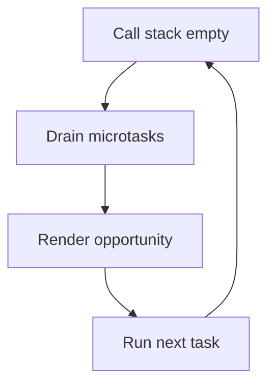

# Event Loop

## Detailed explanation
The event loop coordinates the call stack, task queues, microtask queue, and rendering opportunities. JavaScript runs one piece of code at a time; async callbacks wait until the current stack is empty and scheduling rules allow them to run.

Frontend interviews use the event loop to test timers, promises, async/await, UI blocking, rendering, and why microtasks run before the next macrotask.

## 1. One-line mental model
The event loop decides what runs next after the call stack becomes empty.

## 2. Problem it solves
Browsers need to coordinate JavaScript, timers, network callbacks, user events, microtasks, and painting on one main thread.

## 3. Core idea
- Synchronous code runs on the call stack.
- Macrotasks include timers, events, and script execution.
- Microtasks include promise reactions and `queueMicrotask`.
- After a task, microtasks drain before rendering and the next task.
- Long tasks block input and paint.

## 4. Visual / analogy
The event loop is a dispatcher choosing the next job only when the current worker is free.



## 5. Minimal example

```js
console.log("A");

setTimeout(() => console.log("B"), 0);
Promise.resolve().then(() => console.log("C"));

console.log("D");
```

Output: `A`, `D`, `C`, `B`.

## 6. Real-world example
An expensive table filter can freeze typing because the current task keeps the stack busy and delays input handlers and rendering.

## 7. Common interview questions

#### What is the event loop?
- **The Engine Mechanism (Why it behaves this way):** The Event Loop is an orchestration loop designed to make a single-threaded runtime environment highly concurrent. JavaScript engines like V8 are single-threaded (having one Call Stack and executing one task at a time). However, modern web environments run on multiple browser-level C++ threads (e.g., timer threads, network fetching threads, input handler threads). When an asynchronous operation (like `setTimeout` or `fetch`) is executed, the main thread offloads the work to a helper thread. Once that helper thread completes the work, it pushes a callback into a queue. The **Event Loop** is a continuous, infinite loop that monitors the Call Stack: the microsecond the stack becomes empty, it drains the Microtask Queue, executes any pending browser layout/render cycles, and then grabs the next callback from the Macrotask Queue, pushing it onto the stack to run.
- **The Unforgettable Mental Model:** A lazy dispatcher at a taxi company. The dispatcher (Event Loop) only sends out a new taxi (queues a new callback) when the garage parking lot (the call stack) is 100% empty. If there is even one car in the garage (active frame), the dispatcher sleeps.
- **The Trap:** Thinking the Event Loop is part of the JavaScript engine (like V8). It is actually built into the **Host Environment** (the browser window/workers or Node.js runtime). V8 merely executes the code when handed to it; the host environment coordinates when V8 receives that code.
- **Senior Interview Playbook (Verbal Script):** When asked this in an interview, say: "The Event Loop is the asynchronous orchestration mechanism built into the host environment that enables non-blocking I/O on JavaScript's single thread. It continuously monitors the call stack. The moment the stack is empty, it processes microtasks, performs layout and paints if necessary, and then dequeues the next macrotask, pushing it onto the stack for execution."

#### Why do promises run before `setTimeout`?
- **The Engine Mechanism (Why it behaves this way):** This behavior is governed by the **Execution Priority Rules** of the Event Loop.
  - A Promise callback (`.then()`, `.catch()`, or `await` continuation) is classified as a **Microtask**.
  - A `setTimeout` callback is classified as a **Macrotask** (or Task).
  During the event loop cycle, the engine executes the current synchronous script (which is a macrotask). Immediately after this script completes, before yielding control to browser rendering or selecting the next macrotask, the engine must completely drain the **Microtask Queue**. Since promise callbacks are waiting in the Microtask Queue, they are executed immediately at the end of the current task, while the `setTimeout` callback remains sitting in the Macrotask Queue waiting for a future tick.
- **The Unforgettable Mental Model:** Boarding an airplane. The passengers currently standing in the aisle (microtasks) have ultimate priority to sit down first. The passengers sitting in the gate waiting room (macrotasks/timers) must wait patiently until the aisle is completely clear and the boarding call is announced for their group.
- **The Trap:** Thinking that creating a Promise is asynchronous. Doing `new Promise((resolve) => { resolve(5); })` executes its executor function *synchronously* on the spot. Only the `.then(val => ...)` callback is scheduled as a microtask.
- **Senior Interview Playbook (Verbal Script):** When asked this in an interview, say: "Promises run before `setTimeout` because promise resolutions are categorized as microtasks, whereas `setTimeout` callbacks are categorized as macrotasks. The event loop specification requires the microtask queue to be completely drained immediately following the current task, meaning promise reactions execute on the same tick, while timers are deferred to a subsequent loop tick."

#### What are microtasks and macrotasks?
- **The Engine Mechanism (Why it behaves this way):**
  - **Macrotasks (Tasks):** Discrete, self-contained units of execution scheduled by the host environment. Examples include: executing a `<script>` block, user input events (click, keydown), network response callbacks (`fetch`), and timer events (`setTimeout`, `setInterval`).
  - **Microtasks:** Highly lightweight callbacks scheduled by the active script itself to run immediately after the current execution context completes. Examples include: `Promise.then/catch/finally` callbacks, `MutationObserver` triggers, and the explicit `queueMicrotask(cb)` API.
  In terms of scheduling, macrotasks are polled one at a time per event loop tick, and rendering is permitted between ticks. Microtasks, however, are executed in a contiguous block, recursively draining the queue until empty, completely bypassing rendering opportunities during their execution.
- **The Unforgettable Mental Model:** Macrotasks are regular package deliveries arriving at your house one by one throughout the day. Microtasks are the letters inside the package that you must open and read *immediately* the moment you sign for that specific package, before you can do anything else.
- **The Trap:** Believing that Node's `process.nextTick` is a standard microtask. `process.nextTick` is a custom Node.js scheduling phase that executes *even earlier* than standard promise microtasks, draining completely before the promise microtask queue is checked.
- **Senior Interview Playbook (Verbal Script):** When asked this in an interview, say: "Macrotasks represent independent, host-scheduled operations like timers and network events that run one per event loop tick. Microtasks are lightweight, script-scheduled callbacks like promise reactions and `queueMicrotask` that execute contiguously immediately after the current task finishes, taking precedence over rendering and the next scheduled macrotask."

#### When does rendering happen?
- **The Engine Mechanism (Why it behaves this way):** Rendering occurs during specific **Rendering Opportunities** synchronized with the hardware display's refresh rate (typically 60Hz or 120Hz). A rendering opportunity is calculated every 16.6ms or 8.3ms. 
  At the beginning of a loop tick, if a rendering opportunity is due, and *only* if the Call Stack is empty and the Microtask Queue has been completely drained, the Event Loop pauses task execution and yields control to the layout/paint engine. The browser then executes any active media queries, fires all `requestAnimationFrame` callbacks, performs CSS style calculations, computes layout metrics (reflow), paints the pixels, and composites layers before resuming the Event Loop.
- **The Unforgettable Mental Model:** A bus that scheduled departure every 15 minutes. The bus (render) sits at the station ready to go. If passengers are walking out of the terminal (microtasks), the bus waits. The moment the terminal door is clear, the bus drives off. If there are no style or DOM modifications made during the preceding task, the browser might skip the rendering step entirely to conserve GPU cycles.
- **The Trap:** Thinking that every DOM mutation in JavaScript causes an immediate visual paint on the screen. The change is merely written to the virtual DOM representation in memory, and the physical paint on your monitor is delayed until the next rendering opportunity yields.
- **Senior Interview Playbook (Verbal Script):** When asked this in an interview, say: "Rendering happens during rendering opportunities that align with the monitor's refresh rate. The Event Loop yields to the browser's rendering engine only when the current stack is empty and all pending microtasks are drained. If a paint is due, the browser triggers animation frame callbacks, calculates styles, computes layout geometries, and repaints layers."

#### Why does synchronous code block the UI?
- **The Engine Mechanism (Why it behaves this way):** Because the JavaScript main thread and the browser's rendering thread are bound to the exact same CPU thread. When synchronous code executes on the Call Stack, the Event Loop's tick is physically halted at that line of code. The instruction pointer is occupied running JS bytecode, meaning the Event Loop cannot transition to the rendering phase, nor can it check the task queues to dispatch click or keyboard events. The browser is frozen, unable to update animations, re-layout elements, or react to user actions.
- **The Unforgettable Mental Model:** A single-lane drive-thru lane at a fast-food restaurant. If the customer at the window has a massive, complicated order that takes 10 minutes to resolve (heavy synchronous code), all other customers in line who just want to grab a quick soda (painting animations or typing a letter) are completely stuck waiting behind them.
- **The Trap:** Assuming that using `async/await` inside a heavy loop prevents UI blocking. Writing `async function process() { while (true) {} }` still runs the infinite loop *synchronously* on the main thread the second it is called, completely freezing the browser. Only yielding control via `await new Promise(r => setTimeout(r, 0))` or offloading the work to a Web Worker keeps the UI responsive.
- **Senior Interview Playbook (Verbal Script):** When asked this in an interview, say: "Synchronous code blocks the UI because JavaScript execution and browser rendering share the main thread. A blocking execution context keeps the call stack occupied, preventing the event loop from spinning. This starves both the rendering engine's paint pipeline and the input thread, leaving the browser completely unresponsive until the stack clears."

## 8. Active recall test

1. **What must happen before queued callbacks run?**
   - **Answer:** The Call Stack must be completely empty of all active execution frames (including the initial global context execution) and the Microtask Queue must be drained.

2. **Which runs first: promise callback or timer?**
   - **Answer:** The promise callback runs first because it is queued in the high-priority Microtask Queue, which drains immediately at the end of the current task, whereas the timer is a macrotask that executes on a subsequent tick.

3. **What happens after each macrotask?**
   - **Answer:** The Event Loop checks the Microtask Queue and completely drains it (executing all pending microtasks), and then checks if a browser rendering opportunity is due before proceeding to the next macrotask.

4. **Why can microtasks starve rendering?**
   - **Answer:** Because if a microtask recursively schedules another microtask, the Event Loop continues executing them indefinitely. Since the rule is to drain the microtask queue *fully* before rendering, the rendering engine is starved of opportunities and the page freezes.

5. **What is a long task?**
   - **Answer:** Any contiguous block of main-thread execution that takes longer than 50 milliseconds, degrading Core Web Vitals like INP and TBT.

## 9. Mistakes / traps
- Saying async means parallel JavaScript execution on the main thread.
- Forgetting microtasks drain fully.
- Assuming `setTimeout(fn, 0)` runs immediately.
- Ignoring browser rendering between tasks.

## 10. Compare with related concepts
- **Event loop vs call stack:** scheduler vs active execution.
- **Microtask vs macrotask:** promise/job callbacks vs timer/event/script tasks.
- **Concurrency vs parallelism:** event loop interleaves work; it does not run JS callbacks simultaneously on one thread.

## 11. Summary from memory
Predict the output order of sync logs, promises, and timers.

## 12. Spaced revision prompts
- After 1 day: Define event loop.
- After 3 days: Explain promises before timers.
- After 7 days: Connect event loop to rendering.
- After 14 days: Debug a UI freeze using event-loop terms.
