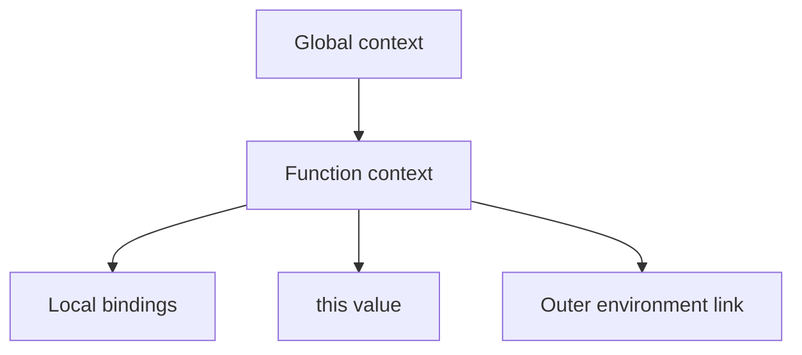

# Execution Context

## Detailed explanation
An execution context is the environment JavaScript creates to run code. It contains the current scope, variable/function bindings, `this` value, and links needed to resolve identifiers.

JavaScript creates a global execution context first, then creates a function execution context for each function call. Interview questions about hoisting, closures, `this`, and scope chains usually depend on this model.

## 1. One-line mental model
An execution context is the runtime box a piece of JavaScript executes inside.

## 2. Problem it solves
JavaScript needs to know which variables, functions, and `this` value are available while code runs.

## 3. Core idea
- Global code runs in the global execution context.
- Each function call creates a function execution context.
- Context creation sets up bindings before execution.
- Identifier lookup uses the current context and outer lexical environments.
- Contexts disappear after execution unless closures retain needed bindings.

## 4. Visual / analogy
An execution context is a workbench with the tools available for the current job.



## 5. Minimal example

```js
const tax = 0.18;

function total(price) {
  const fee = 10;
  return price + fee + price * tax;
}
```

Calling `total` creates a function context with `price`, `fee`, `this`, and access to outer `tax`.

## 6. Real-world example
A React event handler closes over values from the render where it was created. That happens because functions keep links to their lexical environment.

## 7. Common interview questions

#### What is an execution context?
- **The Engine Mechanism (Why it behaves this way):** An Execution Context is an internal, specification-defined environment wrapper created by the JS engine to compile and execute code. Structurally, each Execution Context contains a **Lexical Environment** (resolving block-scoped variables, functions, let/const), a **Variable Environment** (resolving var-scoped variables and hoisted bindings), a **`this` Binding**, and a reference pointer to an **Outer Lexical Environment** (linking it to parent scopes to form the scope chain). The engine dynamically pushes and pops these records to and from the Call Stack as control flows in and out of scripts, functions, or blocks.
- **The Unforgettable Mental Model:** Think of an Execution Context as a fully equipped VR space. When you enter a zone (script or function), you put on a headset. The virtual space displays your inventory (local variables), maps your interactions (`this`), has a portal pointing back to the previous world (outer environment), and operates strictly while you are logged in.
- **The Trap:** Conflating "Scope" and "Execution Context". Scope is compile-time (static, determined by where you write code in the source file). Execution Context is runtime (dynamic, created only when the code actually executes).
- **Senior Interview Playbook (Verbal Script):** When asked this in an interview, say: "An Execution Context is the fundamental runtime environment abstraction in JavaScript. It encapsulates the Variable and Lexical environments, the `this` binding state, and the outer scope links necessary for identifier resolution. Whenever JavaScript executes top-level code or invokes a function, a dedicated context is instantiated and managed via the Call Stack."

#### What is created before code executes?
- **The Engine Mechanism (Why it behaves this way):** Before running any statement line-by-line, the engine completes the **Creation Phase** of the Execution Context:
  1. It instantiates the Environment Records (Lexical and Variable).
  2. It performs scope-wide scanning (hoisting) where function declarations are fully registered with their bodies, `var` variables are registered and initialized to `undefined`, and `let` or `const` variables are registered but marked as uninitialized.
  3. It establishes the outer lexical environment link.
  4. It evaluates and binds the value of `this` depending on the call site.
- **The Unforgettable Mental Model:** A surgeon laying out their medical instruments on a sterilized tray before performing the operation. Every scalpel, stitch, and monitor is in place and verified (Creation Phase) before the first incision is made (Execution Phase).
- **The Trap:** Thinking that the Creation Phase performs value assignments for regular variables. Statements like `let a = 10` are not executed in the creation phase; `a` is only registered in memory as uninitialized, and the assignment `10` occurs during the subsequent Execution Phase.
- **Senior Interview Playbook (Verbal Script):** When asked this in an interview, say: "Prior to execution, during the Creation Phase, the engine registers variable and function identifiers in memory. It fully hoists function declarations, initializes `var` variables to `undefined`, locks `let` and `const` in their uninitialized Temporal Dead Zone, links the outer scope reference, and resolves the runtime `this` binding."

#### How are global and function contexts different?
- **The Engine Mechanism (Why it behaves this way):** The **Global Execution Context (GEC)** is created automatically upon program start, is unique, resides at the very bottom of the Call Stack, and has its Variable Environment bound to the global object (`window` or `globalThis`). It does not have an `arguments` object. A **Function Execution Context (FEC)** is created dynamically on every function invocation, pushed to the top of the stack, has an implicit `arguments` array-like object, does not bind its Variable Environment to the global object, and has a reference pointer to the lexical environment of its definition scope.
- **The Unforgettable Mental Model:** GEC is the town hall of a city (always open, manages public utilities, only one exists). FEC is a temporary meeting room booked by a private team (multiple can exist, they open and close dynamically, and keep private notes).
- **The Trap:** Thinking that the Global context has an outer scope link. The GEC's outer environment pointer is explicitly set to `null` because it represents the outermost scope boundary in the ECMAScript engine.
- **Senior Interview Playbook (Verbal Script):** When asked this in an interview, say: "The Global Execution Context is a single, permanent environment created at program startup that manages global object mappings and has no outer parent scope. Function Execution Contexts are created dynamically for every invocation, hold local arguments and variables, have lexical links pointing to their outer defining scope, and are popped off the stack upon execution completion."

#### How does execution context relate to hoisting?
- **The Engine Mechanism (Why it behaves this way):** Hoisting is the direct side-effect of the **Creation Phase** of an Execution Context. Before executing statements, the engine scans the AST (Abstract Syntax Tree) for variable and function declarations. Because the engine allocates memory slots for these identifiers *before* stepping into the line-by-line Execution Phase, the code can reference those identifiers syntactically earlier in the source text.
- **The Unforgettable Mental Model:** It is like declaring your variables in a hotel register at the front desk before you actually walk up to your room. Even though you are not in the room yet, the hotel database knows your name and has allocated a slot for you.
- **The Trap:** Assuming hoisting moves code. It does not alter the physical source code files. It is entirely a memory allocation behavior that occurs during the context creation phase in the engine.
- **Senior Interview Playbook (Verbal Script):** When asked this in an interview, say: "Hoisting is the logical result of the execution context's dual-phase lifecycle. During the Creation Phase, the compiler registers declaration identifiers in memory before executing line-by-line statements. This memory pre-allocation makes those bindings syntactically accessible prior to their literal declaration lines in the source code."

#### How do closures retain variables?
- **The Engine Mechanism (Why it behaves this way):** When a function is defined, it receives an internal `[[Environment]]` slot that stores a reference to the active execution context's Lexical Environment. When that function is executed, it spawns a new FEC, and its Outer Lexical Environment reference is set to the value of that `[[Environment]]` slot. If this inner function is returned or stored, its active presence keeps the outer context's Lexical Environment reachable. The garbage collector will not reclaim any heap allocations in that Lexical Environment because they remain reachable in the active pointer tree.
- **The Unforgettable Mental Model:** A space capsule (inner function) docking with a space station (outer environment). Even when the station crew leaves (outer context pops off the stack), the capsule remains physically attached to the station, preventing the station's rooms (lexical environment variables) from drifting away and being dismantled by garbage collection.
- **The Trap:** Believing that only the specific closed-over variable is retained in memory. The engine retains the *entire* lexical environment record, meaning all variables declared in the same outer scope are also kept in memory, which can lead to accidental memory leaks.
- **Senior Interview Playbook (Verbal Script):** When asked this in an interview, say: "Closures preserve scope because every function carries a hidden `[[Environment]]` reference to the Lexical Environment in which it was created. Even when the outer function's execution context is popped off the Call Stack, its environment record remains anchored in the heap via this reference, shielding its variables from garbage collection."

## 8. Active recall test

1. **What is inside an execution context?**
   - **Answer:** It consists of a Lexical Environment (for block scopes, variables, let/const), a Variable Environment (for hoisted functions and vars), a `this` binding, and a pointer to the outer lexical environment.

2. **Which context is created first?**
   - **Answer:** The Global Execution Context (GEC) is created first by the engine, prior to running any top-level statements.

3. **What creates a function execution context?**
   - **Answer:** It is created dynamically by the engine on every function invocation (`()`), and is pushed onto the Call Stack.

4. **How does context relate to scope?**
   - **Answer:** Scope is the compile-time rule set determining variable visibility based on code geography. Execution Context is the runtime environment wrapper that physically instantiates and resolves those scope rules.

5. **Why do closures keep values reachable?**
   - **Answer:** Because the inner function maintains an immutable, hidden `[[Environment]]` reference to the outer Lexical Environment, preventing the Garbage Collector's reachability graph from freeing the outer scope's heap memory.

## 9. Mistakes / traps
- Treating execution context and scope as identical.
- Forgetting the creation phase before execution.
- Assuming all contexts stay in memory forever.
- Ignoring module-specific top-level behavior.

## 10. Compare with related concepts
- **Execution context vs lexical environment:** context includes runtime execution details; lexical environment handles identifier bindings and outer links.
- **Execution context vs call stack:** contexts are represented as frames on the stack while active.
- **Global vs function context:** app start environment vs per-call environment.

## 11. Summary from memory
Explain what JavaScript creates before running a function body.

## 12. Spaced revision prompts
- After 1 day: Define execution context.
- After 3 days: Compare global and function contexts.
- After 7 days: Connect context to hoisting.
- After 14 days: Explain context plus closure behavior.
