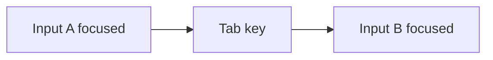

# Focus and Blur

## Detailed explanation
Focus means an element is active for keyboard input. Blur means it lost focus. These events are central to accessible forms, modals, menus, validation, keyboard navigation, and focus traps.

Frontend interviews test focus knowledge because mouse-only UI often fails accessibility. Senior developers must manage focus intentionally after route changes, dialog open/close, validation errors, and dynamic content updates.

## 1. One-line mental model
Focus tracks which element receives keyboard input; blur means focus left it.

## 2. Problem it solves
Users need predictable keyboard navigation and input targeting.

## 3. Core idea
- Focus moves through interactive elements.
- `focus` fires when element gains focus.
- `blur` fires when it loses focus.
- Programmatic focus uses `.focus()`.
- Accessible UI must preserve visible focus.

## 4. Visual / analogy
Focus is cursor of page interaction.



## 5. Minimal example

```js
input.addEventListener("blur", () => {
  validate(input.value);
});
```

## 6. Real-world example

```js
firstInvalidField.focus();
```

After failed form submit, move focus to first invalid field.

## 7. Common interview questions
- What is focus?
- What is blur?
- How do you focus element in JS?
- Why visible focus matters?
- How do modals manage focus?
- Focus vs focusin?

## 8. Active recall test
1. What element receives keyboard input?
2. What event fires when focus leaves?
3. How do you programmatically focus?
4. Why focus first invalid field?
5. What does modal focus trap do?

## 9. Mistakes / traps
- Removing focus outline without replacement.
- Opening modal without moving focus inside.
- Closing modal without restoring focus.
- Validating only on every keypress when blur better.

## 10. Compare with related concepts
- **Focus vs active:** focus is keyboard target; active is pressed state.
- **Blur vs change:** blur is focus loss; change is value commit.
- **focus vs focusin:** `focusin` bubbles; `focus` does not in same way.

## 11. Summary from memory
Explain focus handling for accessible modal and failed form submit.

## 12. Spaced revision prompts
- 1 day: Define focus/blur.
- 3 days: Focus invalid field.
- 7 days: Explain focus trap.
- 14 days: Compare focus and focusin.

