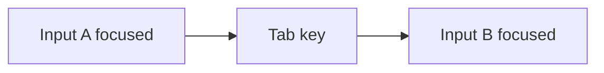

# Focus and Blur

## Detailed explanation
Focus means an element is active for keyboard input. Blur means it lost focus. These events are central to accessible forms, modals, menus, validation, keyboard navigation, and focus traps.

Frontend interviews test focus knowledge because mouse-only UI often fails accessibility. Senior developers must manage focus intentionally after route changes, dialog open/close, validation errors, and dynamic content updates.

## 1. One-line mental model
Focus tracks which element receives keyboard input; blur means focus left it.

## 2. Problem it solves
Users need predictable keyboard navigation and input targeting.

## 3. Core idea
- Focus moves through interactive elements.
- `focus` fires when element gains focus.
- `blur` fires when it loses focus.
- Programmatic focus uses `.focus()`.
- Accessible UI must preserve visible focus.

## 4. Visual / analogy
Focus is cursor of page interaction.



## 5. Minimal example

```js
input.addEventListener("blur", () => {
  validate(input.value);
});
```

## 6. Real-world example

```js
firstInvalidField.focus();
```

After failed form submit, move focus to first invalid field.

## 7. Common interview questions

#### What is focus?
- **The Engine Mechanism (Why it behaves this way):** In the browser engine, focus indicates which DOM element is the active recipient of keyboard events in the current document. At any given moment, the document maintains a reference to the active element in `document.activeElement` (stored as a pointer to an `Element` node in the DOM C++ layer). When focus shifts to an element, the engine places that element in a focused state, triggering the `:focus` pseudo-class matcher in the style engine, and fires a synchronous `focus` event targeting that element.
- **The Unforgettable Mental Model:** A stage spotlight. Only one actor can be in the spotlight's center beam (`document.activeElement`) at a time, receiving commands directly from the director (the keyboard).
- **The Trap:** Thinking all DOM elements can receive focus by default. Standard divs, spans, and paragraphs cannot be focused because they are not natively interactive. You must explicitly assign a `tabindex` attribute (like `tabindex="0"` to make it reachable via Tab, or `tabindex="-1"` for programmatic focus only) to make non-interactive elements focusable.
- **Senior Interview Playbook (Verbal Script):** "When asked this in an interview, say: 'Focus represents the active targeting of keyboard input within a document, which the DOM exposes via the read-only pointer `document.activeElement`. Natively interactive elements like inputs, anchors, and buttons are focusable by default, whereas static elements require a configured `tabindex` attribute to be registered in the browser's sequential focus navigation list.'"

#### What is blur?
- **The Engine Mechanism (Why it behaves this way):** A blur event represents the loss of focus from an element. Under the hood, when the active focus target changes, the browser engine executes a strict sequence:
  1. It fires a `blur` event on the currently focused element (`document.activeElement`), as well as a bubbling `focusout` event.
  2. It updates `document.activeElement` to the new focus target (or `document.body` if focus is lost to the window).
  3. It fires a `focus` event on the new target, along with a bubbling `focusin` event.
  During this transition, the old element loses its `:focus` CSS pseudo-class matches.
- **The Unforgettable Mental Model:** Passing a baton in a relay race. The current runner must hand off the baton (blur) before the next runner can grab it and start running (focus). The baton is never floating in empty air; it's always either held by a runner or sitting at the base station (`document.body`).
- **The Trap:** Trying to validate a field on `blur` and immediately calling `.focus()` inside the same `blur` handler if validation fails. In some browsers, this creates an infinite loop or locks the UI, preventing the user from clicking anywhere else on the screen.
- **Senior Interview Playbook (Verbal Script):** "When asked this in an interview, say: 'Blur is the event triggered when an element loses its active keyboard target status, represented by a change in `document.activeElement`. It marks the transition point where the element’s focus state is destroyed, making it the perfect lifecycle hook for executing field-level validations or dismissing temporary dropdown overlays.'"

#### How do you focus element in JS?
- **The Engine Mechanism (Why it behaves this way):** Programmatic focus is achieved by invoking the `.focus()` method defined on the `HTMLElement` prototype. When called, the browser engine invokes its internal focus algorithm: it checks if the element is focusable (i.e., is not disabled, is visible, and has a valid tab index), updates the internal focus pointer, fires the `blur` event on the previous element, and fires `focus` on the target. You can optionally pass a configuration object like `element.focus({ preventScroll: true })` to prevent the engine from automatically scrolling the viewport to bring the focused element into view.
- **The Unforgettable Mental Model:** A remote-control spotlight. Instead of waiting for the actor to walk into the light, you press a button on your controller (`.focus()`) to snap the beam directly onto them instantly.
- **The Trap:** Calling `.focus()` on an element that has `display: none` or `visibility: hidden`. The browser engine will ignore the call because invisible elements are disqualified from receiving focus. If you are showing a modal, you must ensure the transition finishes or the element is fully painted before calling `.focus()`.
- **Senior Interview Playbook (Verbal Script):** "When asked this in an interview, say: 'We programmatically move focus by invoking the `HTMLElement.prototype.focus()` method. To ensure high-quality UX, we can pass options like `preventScroll: true` to prevent abrupt layout jumps, and we must always verify that the target is fully visible and mounted in the DOM before invoking it, as hidden nodes cannot receive focus.'"

#### Why visible focus matters?
- **The Engine Mechanism (Why it behaves this way):** Visible focus indicators (such as the default browser outline or custom styles applied via CSS `:focus` / `:focus-visible`) are essential for the browser's accessibility rendering layer. Assistive technologies and keyboard-only users rely entirely on these indicators to track their position on the page. If a CSS stylesheet removes these styles (e.g., `outline: none;` without providing a visible alternative), the user becomes "blind" to their interactive context, making navigation impossible.
- **The Unforgettable Mental Model:** The blinking text cursor in a text document. If you turn off the cursor, you have absolutely no idea where your letters will appear when you start typing.
- **The Trap:** Removing the default blue outline with `outline: none` or `outline: 0` because a UI designer felt it looked "ugly", without implementing a highly visible custom focus state. This violates WCAG 2.1 AA success criterion 2.4.7 (Focus Visible).
- **Senior Interview Playbook (Verbal Script):** "When asked this in an interview, say: 'Visible focus is a non-negotiable accessibility requirement. Keyboard-only users depend entirely on visual outlines to locate their active interactive coordinates on the screen. Removing the outline with `outline: none` without providing an elegant, highly visible keyboard-specific alternative completely isolates screen-reader and mobility-impaired users, violating WCAG compliance.'"

#### How do modals manage focus?
- **The Engine Mechanism (Why it behaves this way):** Robust modal overlays implement three distinct focus management routines:
  1. **Focus Trap:** When the modal is open, the application intercepts `Tab` keypress events. If the user presses `Tab` while on the last focusable element in the modal, the engine intercepts the keypress and programmatically redirects focus to the first focusable element. Similarly, `Shift + Tab` on the first element wraps focus to the last element.
  2. **Initial Focus:** When the modal mounts, the engine programmatically focuses the close button or the first form input inside the modal.
  3. **Restored Focus:** Before moving focus into the modal, the application saves a reference to `document.activeElement` in memory (e.g., using a closure or React useRef). When the modal unmounts, the application immediately calls `.focus()` on that saved element, returning the user to their original place.
- **The Unforgettable Mental Model:** A virtual quarantine room. When you enter the room, the doors lock behind you (Focus Trap), you are placed right at the check-in table (Initial Focus), and when you leave, you are teleported exactly back to the spot you stood before entering (Restored Focus).
- **The Trap:** Failing to restore focus to the triggering element when the modal is closed. This causes the focus to reset to the top of the body (`document.body`), forcing keyboard users to tab through the entire page from the beginning.
- **Senior Interview Playbook (Verbal Script):** "When asked this in an interview, say: 'Modals must manage focus symmetrically: we capture the currently active element, shift focus programmatically into the modal's first interactive node upon mounting, restrict sequential tab navigation inside the modal using a keydown listener to create a focus trap, and restore focus to the original triggering element upon unmounting to maintain standard layout flow.'"

#### Focus vs focusin?
- **The Engine Mechanism (Why it behaves this way):**
  - **`focus`:** Does not bubble up the DOM tree. If a child input gains focus, an event listener bound to `document.body` will not catch a `focus` event unless it is registered in the capturing phase (by setting the third parameter of `addEventListener` to `true`).
  - **`focusin`:** Bubbles normally. When a child input gains focus, the event bubbles up through its ancestors, allowing for event delegation of focus states. The same relationship applies to `blur` (non-bubbling) vs `focusout` (bubbling).
- **The Unforgettable Mental Model:** `focus` is a laser beam pointing directly at a single spot—only that spot knows it's illuminated. `focusin` is a flare shot from that spot—it climbs up into the sky and anyone on the mountain above can see it rising.
- **The Trap:** Attempting to implement event delegation for validation on an ancestor element using `addEventListener('focus', handler)` without setting `{ capture: true }`. The event handler will never execute.
- **Senior Interview Playbook (Verbal Script):** "When asked this in an interview, say: 'The difference lies in event propagation. The standard `focus` event is non-bubbling, meaning to delegate focus monitoring at a container level, we must bind our listeners to the capturing phase. Conversely, `focusin` bubbles natively up the DOM tree, enabling simple, standard event delegation workflows without modifying capture parameters.'"

## 8. Active recall test

#### 1. What element receives keyboard input?
- **Explanation/Answer:** The element currently pointed to by `document.activeElement` is the designated recipient of keyboard input.

#### 2. What event fires when focus leaves?
- **Explanation/Answer:** The `blur` event (non-bubbling) or the `focusout` event (bubbling) fires when focus leaves.

#### 3. How do you programmatically focus?
- **Explanation/Answer:** By calling `element.focus(options)` on a focusable DOM element (one that has an interactive tag or a valid `tabindex` and is visible).

#### 4. Why focus first invalid field?
- **Explanation/Answer:** It reduces cognitive load for the user by immediately highlighting the error, placing the cursor directly where corrective action is required, and announcing the invalid input state to screen readers.

#### 5. What does modal focus trap do?
- **Explanation/Answer:** A focus trap captures the Tab and Shift+Tab key presses inside a modal container, forcing the focus ring to cycle exclusively through elements inside the modal and preventing the user from tabbing out into hidden background content.

## 9. Mistakes / traps
- Removing focus outline without replacement.
- Opening modal without moving focus inside.
- Closing modal without restoring focus.
- Validating only on every keypress when blur better.

## 10. Compare with related concepts
- **Focus vs active:** focus is keyboard target; active is pressed state.
- **Blur vs change:** blur is focus loss; change is value commit.
- **focus vs focusin:** `focusin` bubbles; `focus` does not in same way.

## 11. Summary from memory
Explain focus handling for accessible modal and failed form submit.

## 12. Spaced revision prompts
- 1 day: Define focus/blur.
- 3 days: Focus invalid field.
- 7 days: Explain focus trap.
- 14 days: Compare focus and focusin.

