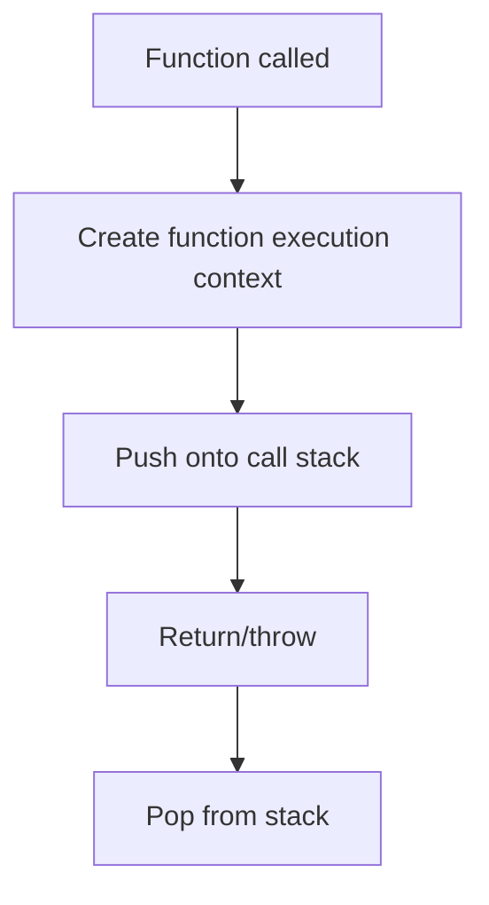

# Function Execution Context

## Detailed explanation
A function execution context is created every time a function is called. It contains the function's local variables, parameters, arguments, scope references, and `this` binding. It is pushed onto the call stack when the function starts and popped when the function returns or throws.

This concept explains what happens when a function is called, why local variables disappear after return unless captured by closure, how recursion grows the stack, and why `this` depends on the call style.

## 1. One-line mental model
Every function call creates a temporary runtime environment for that call.

## 2. Problem it solves
JavaScript needs isolated storage for each function call so parameters and local variables do not collide between calls.

## 3. Core idea
- Created when a function is invoked.
- Stores parameters, local variables, and function declarations.
- Has a link to outer lexical environment.
- Has a `this` binding based on call site.
- Removed from the call stack when execution completes.

## 4. Visual / analogy
Each function call is like opening a new work folder. When the work is done, the folder is closed, unless something kept a reference to its contents.



## 5. Minimal example

```js
function add(a, b) {
  const total = a + b;
  return total;
}

add(2, 3);
```

Calling `add` creates an execution context with `a`, `b`, and `total`.

## 6. Real-world example

```js
function handleClick(event) {
  const id = event.currentTarget.dataset.id;
  selectRow(id);
}
```

Every click creates a new execution context for `handleClick`, with its own `event` and `id`.

## 7. Common interview questions
- What happens when a function is called?
- What is a function execution context?
- What is stored inside it?
- How is it related to the call stack?
- What happens after a function returns?
- How do closures keep variables alive?
- How does `this` get assigned?

## 8. Active recall test
1. When is a function execution context created?
2. What variables does it contain?
3. What happens when the function returns?
4. How does recursion affect the stack?
5. How can closures keep local variables alive?

## 9. Mistakes / traps
- Thinking one function has only one context forever.
- Forgetting each call gets its own parameters.
- Saying local variables always disappear immediately; closures may retain them.
- Confusing lexical scope with call stack.
- Assuming `this` is decided by where the function is written.

## 10. Compare with related concepts
- **Function execution context vs global execution context:** per-call environment vs top-level environment.
- **Execution context vs lexical environment:** execution context includes lexical environment plus runtime details like `this`.
- **Call stack vs execution context:** stack stores active contexts.

## 11. Summary from memory
Explain what happens internally when `handleClick(event)` runs.

## 12. Spaced revision prompts
- After 1 day: Define function execution context.
- After 3 days: Explain call stack push/pop.
- After 7 days: Connect function context to closures.
- After 14 days: Explain `this` binding inside a function call.

