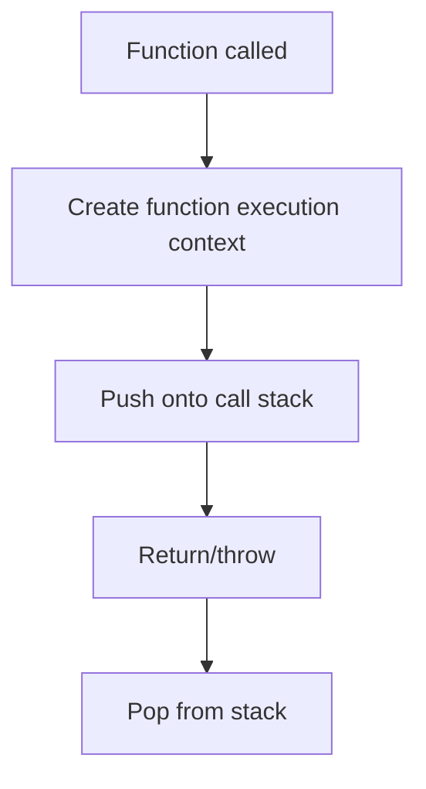

# Function Execution Context

## Detailed explanation
A function execution context is created every time a function is called. It contains the function's local variables, parameters, arguments, scope references, and `this` binding. It is pushed onto the call stack when the function starts and popped when the function returns or throws.

This concept explains what happens when a function is called, why local variables disappear after return unless captured by closure, how recursion grows the stack, and why `this` depends on the call style.

## 1. One-line mental model
Every function call creates a temporary runtime environment for that call.

## 2. Problem it solves
JavaScript needs isolated storage for each function call so parameters and local variables do not collide between calls.

## 3. Core idea
- Created when a function is invoked.
- Stores parameters, local variables, and function declarations.
- Has a link to outer lexical environment.
- Has a `this` binding based on call site.
- Removed from the call stack when execution completes.

## 4. Visual / analogy
Each function call is like opening a new work folder. When the work is done, the folder is closed, unless something kept a reference to its contents.



## 5. Minimal example

```js
function add(a, b) {
  const total = a + b;
  return total;
}

add(2, 3);
```

Calling `add` creates an execution context with `a`, `b`, and `total`.

## 6. Real-world example

```js
function handleClick(event) {
  const id = event.currentTarget.dataset.id;
  selectRow(id);
}
```

Every click creates a new execution context for `handleClick`, with its own `event` and `id`.

## 7. Common interview questions

#### What happens when a function is called?
- **The Engine Mechanism (Why it behaves this way):** When a function is called, the JavaScript engine halts current code execution in the running context, allocates a new **Function Execution Context (FEC)** record, and places it on top of the Call Stack. The parser initializes its parameters, assigns actual argument values, creates the `arguments` array-like object, determines the outer lexical environment reference (scope chain link), establishes the `this` binding, and hoists internal variables and inner functions. Only then does the engine begin executing the function's bytecode statements step-by-step.
- **The Unforgettable Mental Model:** It is like walking into a themed breakout room in an escape game. The moment you cross the threshold (call the function), a local timer starts, you are handed tools specific to this room (arguments, local scope), and you cannot interact with the main lobby until you solve the puzzle and exit (return a value).
- **The Trap:** Thinking that just referencing a function or passing it as a callback instantiates a context. The context is only created upon physical invocation (when the `()` operator is executed).
- **Senior Interview Playbook (Verbal Script):** When asked this in an interview, say: "When a function is invoked, the execution of the calling context is paused, a new Function Execution Context is instantiated, and it is pushed onto the Call Stack. During this Creation Phase, local parameters, the `arguments` object, inner declarations, the outer Lexical Environment pointer, and the `this` value are initialized. The engine then transitions to the Execution Phase, running the function's body line-by-line."

#### What is a function execution context?
- **The Engine Mechanism (Why it behaves this way):** A Function Execution Context is an internal engine specification record representing the runtime environment of a specific function invocation. It is composed of a **Variable Environment** (for `var` and hoisted identifiers), a **Lexical Environment** (for `let`, `const`, and block scope variables), a **Binding Table** for the `this` value, and a reference pointer to the outer environment (enabling Lexical Scope resolution).
- **The Unforgettable Mental Model:** Think of it as a sandbox. Every time you start a new game session (function call), a pristine sandbox is created. You can build sandcastles (create variables) inside it. No other sandbox is affected by your play, and once you leave, the sandbox is typically completely flattened.
- **The Trap:** Believing a function has only one execution context. If a function is called 5 times or recursively, 5 separate execution context records are dynamically created and stored concurrently on the call stack.
- **Senior Interview Playbook (Verbal Script):** When asked this in an interview, say: "A Function Execution Context is the dynamic evaluation environment generated on a per-invocation basis. It encapsulates the local Lexical Environment, Variable Environment, `this` binding, and an outer lexical environment pointer. This structure guarantees local scope isolation, ensuring variables declared inside one invocation do not leak or clash with other active environments."

#### What is stored inside it?
- **The Engine Mechanism (Why it behaves this way):** An FEC stores:
  1. The **Formal Parameters** and the implicit **`arguments` object** containing a mapped array of passed arguments.
  2. The **Variable Environment** storing local function declarations and `var` bindings.
  3. The **Lexical Environment** storing block-scoped `let` and `const` variables.
  4. The **`this` Binding** representing the context of the call site.
  5. The **Outer Lexical Environment Reference**, which is a copy of the parent environment pointer saved in the function's internal `[[Environment]]` slot when the function was compiled.
- **The Unforgettable Mental Model:** It is like a private office workstation. It has a desk (local environment record), phone extensions to other departments (outer lexical reference), the physical employee sitting there (`this`), and incoming mail in the inbox (arguments/parameters).
- **The Trap:** Assuming `arguments` is a true JavaScript Array. It is actually an array-like object with indexes and a `.length` property, but it lacks array prototype methods like `.map()`, `.filter()`, or `.reduce()`.
- **Senior Interview Playbook (Verbal Script):** When asked this in an interview, say: "An FEC contains the local environment records comprising the formal parameters, the implicit `arguments` object, hoisted declarations, let/const bindings, the runtime-determined `this` reference, and a pointer to the outer Lexical Environment that facilitates scope chain resolution."

#### How is it related to the call stack?
- **The Engine Mechanism (Why it behaves this way):** The Call Stack is a LIFO (Last-In, First-Out) data structure that tracks active execution contexts. When a function is called, its FEC is pushed onto the stack and becomes the "Active Execution Context" (top of stack). The CPU's instruction pointer points to this context. When a nested function is called, a new FEC is pushed, pushing the former context down. When a function exits, its FEC is popped, and the engine resumes execution of the parent context immediately below it.
- **The Unforgettable Mental Model:** A stack of books on a desk. You can only read or edit the book on the very top (current context). To read a book below it, you must finish the top book, close it, and take it off the pile.
- **The Trap:** Thinking asynchronous callbacks like `setTimeout` put their execution contexts directly on the stack. The stack must be completely empty of all other user contexts before the Event Loop can push an asynchronous callback's context onto it.
- **Senior Interview Playbook (Verbal Script):** When asked this in an interview, say: "The Call Stack is the engine's LIFO mechanism that orchestrates the execution order of all environments. A Function Execution Context is pushed onto the stack upon invocation, rendering it active, and is immediately popped off when a return or throw is executed, restoring the previous caller context as active."

#### What happens after a function returns?
- **The Engine Mechanism (Why it behaves this way):** When a function executes a `return` statement (or reaches the end of its body), its FEC is popped off the Call Stack. The engine resumes the caller context at the saved execution point. If the returned value is a primitive, and no variables inside the popped context were captured by an active outer closure, the memory allocated for that FEC's local Lexical and Variable Environments is detached. The garbage collector will sweep this detached environment in its next cycle.
- **The Unforgettable Mental Model:** A clean-up crew entering a hotel conference room after a meeting. They wipe the boards clean, throw away leftover papers (local variables), and reset the room for the next meeting.
- **The Trap:** Thinking that returning a value instantly frees memory. If the function returns a closure that maintains a reference to any local variable, that lexical environment remains pinned in the memory heap, escaping garbage collection.
- **Senior Interview Playbook (Verbal Script):** When asked this in an interview, say: "Once a function returns, its execution context is popped off the Call Stack, and the engine returns to the calling frame. In terms of memory, if no closure captures variables from this popped frame, its environment records are detached from the execution graph, rendering them eligible for immediate garbage collection."

#### How do closures keep variables alive?
- **The Engine Mechanism (Why it behaves this way):** During the Creation Phase of a function, V8 attaches a hidden `[[Environment]]` property to the function object. This property holds a direct reference to the parent FEC's Lexical Environment. If that function is returned and stored globally or passed elsewhere, it retains this `[[Environment]]` pointer. Even though the parent FEC is popped off the stack, its Lexical Environment record remains reachable via the returned function's hidden pointer. The Garbage Collector sees this active reference path and refuses to collect the memory heap blocks containing those enclosed variables.
- **The Unforgettable Mental Model:** Imagine you go on vacation and leave a string tied to a safe back in your home. Even when you lock the house and leave (the function returns), you can still pull the string from far away to open and retrieve items from the safe.
- **The Trap:** Retaining massive objects in a closure accidentally. Since the entire Lexical Environment of the parent is kept in memory (not just the individual variable used), all other variables in that environment are also kept alive, risking severe memory leaks.
- **Senior Interview Playbook (Verbal Script):** When asked this in an interview, say: "Closures maintain variables in memory because inner functions store a reference to their outer Lexical Environment via their internal `[[Environment]]` slot. Even after the outer function's execution context is popped off the Call Stack, its environment remains reachable in the memory heap through this slot, preventing the garbage collector from reclaiming it."

#### How does `this` get assigned?
- **The Engine Mechanism (Why it behaves this way):** Unlike lexical variables which are determined at compile time, `this` is a dynamic property evaluated at runtime during the Creation Phase of the FEC, determined entirely by the **Call Site** (how the function is called).
  - If called as a method (`obj.func()`), `this` is assigned a reference to `obj`.
  - If called standalone (`func()`), `this` is assigned `window` (classic script) or `undefined` (strict mode).
  - If called via `new`, `this` points to the newly instantiated object.
  - If called via `call/apply/bind`, `this` is overridden with the explicitly passed argument.
  - Arrow functions are the sole exception: they do not have a `this` slot in their FEC; they resolve `this` lexically by looking up the outer scope chain.
- **The Unforgettable Mental Model:** `this` is like a chameleon. It doesn't care what branch of the tree it was born on (where the function was declared); it only cares what color leaves it is physically sitting on right now (how it is called).
- **The Trap:** Passing an object method as a callback (e.g., `setTimeout(obj.func, 1000)`). The call site resolves standalone, stripping `this` from `obj` and binding it to `window` or `undefined`.
- **Senior Interview Playbook (Verbal Script):** When asked this in an interview, say: "The `this` value is determined dynamically during the FEC's Creation Phase based on the call site. It binds to the execution context's calling object, the global object, or `undefined` in strict mode. Explicit binding using `call`, `apply`, or `bind` overrides this, while arrow functions bypass this completely, resolving `this` lexically via the outer scope chain."

## 8. Active recall test

1. **When is a function execution context created?**
   - **Answer:** It is created on a per-invocation basis, precisely at the moment a function is called (`()`), and not when the function is defined.

2. **What variables does it contain?**
   - **Answer:** It contains formal parameters, the `arguments` object, hoisted variable and function declarations inside the function body, and block-scoped variables.

3. **What happens when the function returns?**
   - **Answer:** The FEC is popped off the Call Stack, the caller context resumes execution, and the local variables are detached and scheduled for GC unless captured by an active closure.

4. **How does recursion affect the stack?**
   - **Answer:** Each recursive call pushes a brand-new FEC onto the Call Stack. If the recursion is too deep without reaching a base case, the stack exceeds its maximum memory capacity, throwing a "Maximum call stack size exceeded" error (Stack Overflow).

5. **How can closures keep local variables alive?**
   - **Answer:** Because an inner function retains a reference to its parent's Lexical Environment via its hidden `[[Environment]]` slot, keeping the parent's environment reachable in the heap even after the parent context is popped from the stack.

## 9. Mistakes / traps
- Thinking one function has only one context forever.
- Forgetting each call gets its own parameters.
- Saying local variables always disappear immediately; closures may retain them.
- Confusing lexical scope with call stack.
- Assuming `this` is decided by where the function is written.

## 10. Compare with related concepts
- **Function execution context vs global execution context:** per-call environment vs top-level environment.
- **Execution context vs lexical environment:** execution context includes lexical environment plus runtime details like `this`.
- **Call stack vs execution context:** stack stores active contexts.

## 11. Summary from memory
Explain what happens internally when `handleClick(event)` runs.

## 12. Spaced revision prompts
- After 1 day: Define function execution context.
- After 3 days: Explain call stack push/pop.
- After 7 days: Connect function context to closures.
- After 14 days: Explain `this` binding inside a function call.

