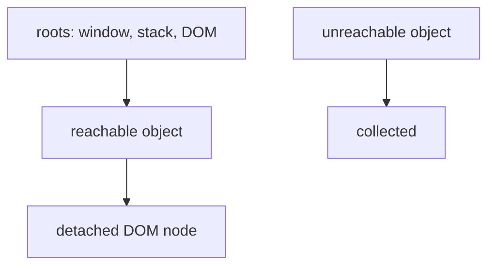

# Garbage Collection and Memory Leaks

## Detailed explanation
JavaScript garbage collection automatically frees memory for values that are no longer reachable. A memory leak happens when unused data remains reachable through references, so the garbage collector cannot reclaim it.

Frontend interviews focus on leaks from detached DOM nodes, global caches, event listeners, timers, closures, subscriptions, and large retained data in long-lived single-page apps.

## 1. One-line mental model
Garbage collection frees unreachable objects; leaks are unused objects that are still reachable.

## 2. Problem it solves
JavaScript needs automatic memory cleanup while long-running browser apps must avoid retaining old UI and data.

## 3. Core idea
- Reachability from roots determines what stays alive.
- Globals, closures, DOM references, and caches can retain objects.
- Event listeners and timers can keep owners reachable.
- Detached DOM nodes leak when JS references still point to them.
- DevTools heap snapshots help find retainers.

## 4. Visual / analogy
Garbage collection removes boxes nobody can reach; leaks are boxes still tied to a rope.



## 5. Minimal example

```js
const cache = [];

function rememberNode(node) {
  cache.push(node);
}
```

If `node` is later removed from the DOM, `cache` can still keep it alive.

## 6. Real-world example
A modal component that adds a `window` event listener but never removes it can retain component data after the modal closes.

## 7. Common interview questions

#### How does JavaScript garbage collection work?
- **The Engine Mechanism (Why it behaves this way):** Modern JavaScript engines (like V8) utilize an advanced, generational garbage collector based on the *Mark-and-Sweep* algorithm, supplemented by a *Scavenger* collector for short-lived objects. The memory heap is split into two spaces:
  1. **New Space (Young Generation):** Where new, small allocations occur. This is managed by a lightweight *Scavenger* collector using Cheney's copying algorithm, which splits memory into "From-Space" and "To-Space" and periodically copies active objects, clearing the rest. Objects that survive multiple scavenges are promoted to Old Space.
  2. **Old Space (Old Generation):** Managed by the *Mark-Sweep-Compact* collector. During the "Mark" phase, the GC pauses execution (or runs concurrently using idle times) to traverse the object graph starting from "GC Roots" (such as the active stack, global context, and DOM trees). It sets a bit flag on every reachable object. During the "Sweep" phase, it traverses the heap linearly, identifying unmarked blocks and adding them to a free-memory list. Finally, the "Compact" phase reorganizes surviving objects to eliminate fragmentation.
- **The Unforgettable Mental Model:** A professional city cleanup crew. The Scavenger crew is like a fast sweeper truck that sweeps up fresh leaves and trash on the main street every hour (New Space). The Old Space crew is a heavy demolition and reorganization team that comes in at night, tags abandoned buildings with a red spray-painted "X" (Mark phase), demolishes them (Sweep phase), and pushes the surviving buildings closer together to make room for new blocks (Compact phase).
- **The Trap:** Believing that setting a variable to `null` synchronously triggers garbage collection. Setting `x = null` merely severs that specific pointer reference. V8 runs garbage collection heuristically according to heap allocation thresholds and idle CPU frames, meaning actual memory reclamation is asynchronous and delayed.
- **Senior Interview Playbook (Verbal Script):** "When asked this in an interview, say: JavaScript engines utilize a generational Mark-and-Sweep algorithm integrated with a Scavenger collector for new allocations. During collection, the engine stops the main thread or leverages concurrent threads to trace the active object graph from GC Roots. It marks all reachable nodes, sweeps away unmarked structures, and compacts old space to optimize allocation alignment. Crucially, garbage collection is heuristic and asynchronous—clearing a reference merely makes the target eligible for collection; it does not force immediate reclamation."

#### What is reachability?
- **The Engine Mechanism (Why it behaves this way):** In V8, reachability is the mathematical definition of whether an object can be accessed from a designated set of baseline entry points known as "GC Roots". The GC Roots consist of:
  1. The Global Object (`window` or `globalThis`).
  2. Active Lexical Environments in the Call Stack (the variables and parameters inside currently executing frames).
  3. Built-in host objects (like the browser's active C++ DOM Document object).
  If a directed path of pointers exists in the heap graph connecting at least one GC Root to an object, the object is classified as reachable. If no path exists, even if the object has internal cyclic references (e.g. Object A points to Object B, and B points back to A), they are classified as unreachable and swept away.
- **The Unforgettable Mental Model:** A physical network of climbing ropes anchored to a cliff deck (the GC Roots). Any climber holding onto a rope, or holding onto someone else who is holding onto a rope, is "reachable" and safe. A pair of climbers floating in mid-air holding onto each other's hands, but completely severed from the ropes anchored to the cliff deck, will plunge into the valley (garbage collected) because they are unreachable.
- **The Trap:** Confusing reachability with utility. An object can be completely useless to your application (e.g. an old cache array that is never read again), but as long as it remains reachable via an active global reference, V8 must preserve it, resulting in a memory leak. The GC does not understand business logic; it only understands reference topology.
- **Senior Interview Playbook (Verbal Script):** "When asked this in an interview, say: Reachability is the core topological constraint that governs garbage collection. An object is reachable if it can be accessed through a chain of references starting from a Garbage Collection Root, such as the global execution context, active stack frames, or the DOM document. If no reference path exists from these roots to the object, it is deemed unreachable and is immediately eligible for garbage collection, regardless of any cyclic references between isolated objects."

#### What causes frontend memory leaks?
- **The Engine Mechanism (Why it behaves this way):** Frontend memory leaks occur when an application fails to sever reference paths pointing to objects that are no longer needed by the UI lifecycle. The V8 engine is forced to retain these objects because a valid reference chain still terminates at them. Common causes include:
  1. **Accidental Globals:** Declaring variables without `let`, `const`, or `var` (or binding them to `this` in the global scope), anchoring them permanently to the `window` root.
  2. **Uncleared Timers and Listeners:** A component registers an event listener on `window` (e.g. `window.addEventListener('resize', handler)`) or creates an interval (`setInterval(handler, 1000)`). The handler closure holds lexical references to the component instance. If the component is unmounted but the listener/timer is not explicitly cleared, the global `window` or active timer thread retains the handler, which retains the entire component subtree.
  3. **Unbounded Caches:** Growing arrays or maps that collect telemetry, data packets, or search results indefinitely without a eviction strategy like LRU (Least Recently Used).
  4. **Closures:** A long-lived outer function retaining reference to a massive variable inside its lexical environment due to a small, nested, inner function that is exported and kept active.
- **The Unforgettable Mental Model:** Forgetting to turn off the water faucet after taking a bath. The water keeps running (allocating memory), the tub overflows, and it slowly floods your entire house (bloats V8 heap) because you forgot to turn the handle (clean up references) when you were done.
- **The Trap:** Relying on `WeakMap` or `WeakSet` without realizing that they only accept objects as keys, and that key-value garbage collection is only triggered if the key object itself has no other strong references in the heap.
- **Senior Interview Playbook (Verbal Script):** "When asked this in an interview, say: Frontend memory leaks are caused by retaining active references to unused objects, preventing the GC from breaking their root paths. The most common triggers in modern SPAs are uncleaned global event listeners, active intervals that hold references to destroyed component scopes, unbounded global data caches, and closures that capture large variables. To prevent this, we must maintain a strict cleanup lifecycle, clearing timers and event bindings inside unmount hooks, and using `WeakMap` for metadata caching."

#### What is a detached DOM node?
- **The Engine Mechanism (Why it behaves this way):** A DOM node exists in a hybrid environment: it has a C++ representation in the browser's rendering engine and a JavaScript wrapper object in V8. When a node is removed from the active DOM tree (`parent.removeChild(node)`), it is physically disconnected from the document root. However, if a JavaScript variable, closure environment, or event listener target holds a strong reference to that node, V8's GC cannot collect the JS wrapper. Because the JS wrapper holds a strong reference pointing to the C++ DOM node, the C++ node is also forced to remain in C++ heap memory. This node is classified as "Detached."
- **The Unforgettable Mental Model:** A tooth that has been pulled out of your jaw (the active DOM tree) but is still attached to your gums by a single, strong metal brace wire (a JavaScript variable reference). The tooth is physically outside the jaw, but it cannot be discarded because the wire holds it in place.
- **The Trap:** Not realizing that keeping a reference to a single, tiny child element (like a nested `<span>` inside a massive detached list element) keeps the *entire* detached parent tree and all its sibling nodes alive in memory. This happens because DOM nodes maintain native, bidirectional tree pointers (`parentNode` and `childNodes`), so retaining a leaf node retains the whole tree.
- **Senior Interview Playbook (Verbal Script):** "When asked this in an interview, say: A detached DOM node is a DOM element that has been removed from the document tree but continues to reside in memory because a JavaScript reference is still holding onto it. This keeps the V8 wrapper alive, which in turn forces the browser to retain the C++ DOM tree. Crucially, due to bidirectional DOM tree pointers, maintaining a reference to even a single leaf node will leak the entire parent tree structure, making meticulous reference clearing and DOM cleanup essential."

#### How do heap snapshots help?
- **The Engine Mechanism (Why it behaves this way):** Heap snapshots serialize the entire V8 heap graph, capturing the structural network of nodes (objects) and edges (references) at a single millisecond. By taking multiple snapshots across a user flow (e.g. Snapshot 1 before mounting, Snapshot 2 after unmounting) and comparing them using the "Comparison" view, the DevTools engine calculates the allocation delta. This highlights persisting objects that should have been collected. In the "Retainers" panel, DevTools traces the shortest active reference chain from the leaked object back to a GC Root, identifying the exact variable, closure scope, or DOM node that is keeping the leaked object reachable.
- **The Unforgettable Mental Model:** An automated security audit report. Instead of walking around a massive warehouse trying to manually find which crate is locked to a support beam, you run a diagnostic scan (heap comparison) that immediately highlights the orphaned crates and highlights the exact metal chains (retaining paths) pinning them to the wall.
- **The Trap:** Trying to debug leaks by looking only at a single snapshot. A single snapshot contains massive noise—hundreds of system strings, internal compiled arrays, and transient variables. You must take a comparative approach, tracking allocation deltas across consistent user cycles to filter out background V8 system noise.
- **Senior Interview Playbook (Verbal Script):** "When asked this in an interview, say: Heap snapshots are the primary diagnostic tool for memory leaks because they serialize the complete V8 reference graph. By comparing snapshots taken before and after a suspect user journey, we can isolate persisting objects that failed to be garbage collected. Once isolated, the Retainers panel provides the exact, directed reference path connecting the leaked object back to a GC Root, telling us precisely which listener, closure, or variable we need to disconnect in our code."

## 8. Active recall test

#### 1. What determines whether an object is eligible for V8 garbage collection?
Reachability. If an object is structurally unreachable via any chain of active references starting from GC Roots, it is eligible for garbage collection.

#### 2. Name three common frontend memory leak sources in modern SPAs.
Uncleaned global event listeners, uncleared active interval timers (`setInterval`), and growing unbounded global caches or maps.

#### 3. Why do global event listeners registered on 'window' leak entire components when not cleaned up?
Because `window` is a permanent GC Root. It retains a reference to the registered callback listener. Since the callback listener holds a closure that captures the lexical environment of the component scope, the entire component tree and its heap allocations are kept reachable and cannot be garbage collected.

#### 4. Define a detached DOM node.
A detached DOM node is a DOM element that has been removed from the active layout document tree but remains alive in browser C++ and V8 memory because a strong reference to it is still retained in JavaScript.

#### 5. Outline the systematic workflow for debugging a suspected React view memory leak using DevTools.
1. Force Garbage Collection manually inside the DevTools Memory panel to establish a baseline.
2. Take Heap Snapshot 1.
3. Open and close the target view 10 times to amplify the leak signature.
4. Force Garbage Collection again to sweep transient allocations.
5. Take Heap Snapshot 2.
6. Select Snapshot 2, open the "Comparison" view against Snapshot 1, sort by delta size, isolate persisting instances of the unmounted component, and inspect their Retainer tree to identify the root reference keeping them reachable.

## 9. Mistakes / traps
- Thinking garbage collection prevents all leaks.
- Keeping unbounded global caches.
- Forgetting to remove listeners/subscriptions.
- Capturing large objects in long-lived closures.
- Ignoring memory in SPAs because pages do not reload often.

## 10. Compare with related concepts
- **Garbage collection vs memory leak:** automatic cleanup vs reachable unused data.
- **Reachable vs used:** reachable means collectible status, not business usefulness.
- **Heap snapshot vs performance trace:** memory retainers vs runtime timing.

## 11. Summary from memory
Explain why a removed DOM node can still leak memory.

## 12. Spaced revision prompts
- After 1 day: Define reachability.
- After 3 days: List frontend leak sources.
- After 7 days: Explain detached DOM node leaks.
- After 14 days: Describe a heap snapshot debugging workflow.
