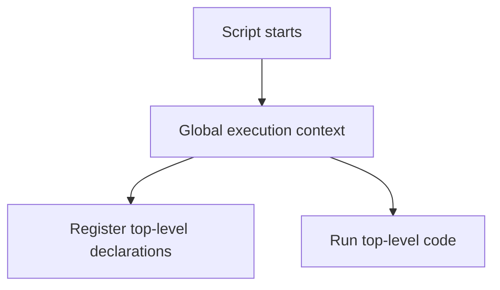

# Global Execution Context

## Detailed explanation
The global execution context is the first execution context JavaScript creates when a script starts. It represents top-level code. In browsers, it sets up the global object (`window`), the `this` value for non-module scripts, and top-level variable/function declarations.

This concept matters because many interview questions about hoisting, `var`, globals, `this`, script loading, and modules depend on knowing what happens before any function is called. It also explains why accidental globals are dangerous in frontend apps.

## 1. One-line mental model
The global execution context is the top-level runtime environment created before your script runs.

## 2. Problem it solves
JavaScript needs an initial environment to store top-level declarations and start executing code.

## 3. Core idea
- Created before top-level code executes.
- Contains global bindings and references to the global object.
- Function declarations are registered during creation.
- `var` declarations become global-context bindings in scripts.
- ES modules have different top-level behavior than classic scripts.

## 4. Visual / analogy
The global execution context is like opening the main office before any meeting rooms are used.



## 5. Minimal example

```js
var appName = "Portal";

function start() {
  console.log(appName);
}
```

`appName` and `start` are created in the global execution context for a classic script.

## 6. Real-world example

```html
<script>
  var debugMode = true;
</script>
```

In a browser classic script, this can create `window.debugMode`, which may collide with other scripts. Modern apps avoid this with modules and bundlers.

## 7. Common interview questions

#### What is the global execution context?
- **The Engine Mechanism (Why it behaves this way):** The Global Execution Context (GEC) is the base execution context created by the JavaScript engine's Parser and Compiler phases before compiling or executing a single line of top-level code. Structurally, it consists of an Execution Context record containing a **Lexical Environment** and a **Variable Environment**. Unlike Function Execution Contexts, the GEC does not have an `arguments` object or a `[[SavedFrameState]]` pointing to a caller frame. It represents the bottom-most frame on the Call Stack, and it persists until the entire program terminates (e.g., when a browser tab is closed).
- **The Unforgettable Mental Model:** The GEC is the foundation slab of a skyscraper. Every other room (function execution context) built later is stacked on top of this foundation. The foundation is poured before any walls go up, and it stays there until the building itself is demolished (program terminates).
- **The Trap:** Believing that each `<script>` tag in HTML gets a separate GEC. In classic HTML scripts, they all share a single, unified Global Execution Context. An error in one `<script>` block might halt execution for that block, but variables declared with `var` in it are still accessible to later `<script>` tags because they reside in the same global Variable Environment.
- **Senior Interview Playbook (Verbal Script):** When asked this in an interview, say: "The Global Execution Context is the initial, default environment created by the JavaScript engine before parsing or running any code. It establishes the global scope boundary, instantiates the global object and the `this` binding, compiles top-level function and variable declarations during the Creation Phase, and serves as the permanent base frame of the Call Stack throughout the application's lifecycle."

#### What is created before code runs?
- **The Engine Mechanism (Why it behaves this way):** Before a single statement executes, the engine completes the **Creation Phase** of the GEC. The compiler scans the top-level AST (Abstract Syntax Tree) to perform two primary actions:
  1. It instantiates the **Global Object** (e.g., `window` in browsers, `global` in Node.js) and binds the global `this` reference.
  2. It allocates memory for variables and functions in the **Variable Environment** and **Lexical Environment**. Function declarations are hoisted with their actual function body, `var` variables are registered and initialized to `undefined`, and `let` or `const` declarations are registered in the Lexical Environment but left uninitialized (entering the Temporal Dead Zone).
- **The Unforgettable Mental Model:** Imagine setting up a theater stage before the actors walk out. The stagehands place the main props (the global object and `this`) and label the actors' starting spots (hoisting variables as `undefined` or functions with their scripts) before the director yells "Action!" and execution begins.
- **The Trap:** Thinking that `let` and `const` are not hoisted or registered during the creation phase. They *are* registered in memory, but they lack an initialization pointer, meaning they cannot be accessed until their declaration line is executed at runtime.
- **Senior Interview Playbook (Verbal Script):** When asked this in an interview, say: "Prior to code execution, during the Creation Phase, the engine sets up the Global Object, binds `this` to it, and scans the code to register identifiers in memory. Function declarations are fully allocated and bound to their bodies, `var` declarations are initialized to `undefined`, and `let` and `const` variables are registered but kept uninitialized in the Lexical Environment, triggering the Temporal Dead Zone."

#### How does `var` behave globally?
- **The Engine Mechanism (Why it behaves this way):** When `var` is declared at the top-level of a classic script, the engine registers it in the **Variable Environment** of the GEC. Crucially, the GEC's Variable Environment is bound to the **Global Object** (such as `window`). Consequently, V8 creates a getter/setter property on the `window` object corresponding to that `var` name. Assigning or updating this variable directly mutates the property on the global object itself.
- **The Unforgettable Mental Model:** Declaring `var` at the top level is like graffitiing the outer wall of your apartment building (the global object). Everyone can see it, anyone can overwrite it, and it makes the building look messy and prone to vandalism (variable collisions).
- **The Trap:** Thinking top-level `let` and `const` behave the same way. They do not! They are stored in the GEC's **Lexical Environment**, which is distinct from the Global Object mapping. Doing `let x = 5` globally does *not* create `window.x`.
- **Senior Interview Playbook (Verbal Script):** When asked this in an interview, say: "In classic scripts, top-level `var` declarations are registered in the GEC's Variable Environment, which is directly bound to the global object. This automatically creates an equivalent property on `window` in browsers. Modern development avoids this because it litters the global namespace, creating vulnerability to silent re-declarations and collisions."

#### What is the global object in browsers?
- **The Engine Mechanism (Why it behaves this way):** In browsers, the global object is `window` (which also references `self` and `frames`). It represents the global execution environment and provides access to Web APIs like `fetch`, `setTimeout`, and the `document`. Under the hood, modern browsers implement a dual-layer global scope where `window` is the global object, and `globalThis` is a standardized, platform-independent reference introduced in ES2020 that points to `window` in browsers and `global` in Node.
- **The Unforgettable Mental Model:** The global object is a giant public bulletin board in a town square. Anyone can pin a flyer (variable) onto it, and anyone else can read, edit, or rip it down. It is always accessible no matter what street (function) you are currently walking down.
- **The Trap:** Relying on `window` in code that might run in server-side contexts like Next.js SSR. If the GEC executes on a Node.js server, referencing `window` throws a `ReferenceError` because Node's global object is `global`. Using `globalThis` is the modern, safe way to access the global object cross-platform.
- **Senior Interview Playbook (Verbal Script):** When asked this in an interview, say: "In the browser, the global object is `window`, which exposes Web APIs and holds all top-level `var` declarations and functions. To ensure environment-agnostic code across Node and browsers, we should reference `globalThis`, which standardizes access to the global scope's object representation regardless of the runtime environment."

#### How is top-level `this` different in modules?
- **The Engine Mechanism (Why it behaves this way):** When a JavaScript file is parsed as an ES Module (`type="module"`), the engine creates a **Module Execution Context** instead of a standard classic GEC. By ECMAScript specification design, the top-level `this` binding in an ES Module is explicitly initialized to `undefined`. In classic scripts, top-level `this` is bound directly to the global `window` object.
- **The Unforgettable Mental Model:** A classic script is like a wild-west saloon where anyone can grab the house microphone (`this` is the global object). An ES Module is a private, soundproofed recording studio where the microphone is switched off by default to prevent noise leakage (`this` is `undefined`).
- **The Trap:** Assuming that inside an ES Module, `this.fetch` will work. It will throw a `TypeError: Cannot read properties of undefined (reading 'fetch')` because `this` is `undefined`. You must reference `globalThis.fetch` or `fetch` directly.
- **Senior Interview Playbook (Verbal Script):** When asked this in an interview, say: "In classic scripts, top-level `this` evaluates to the global object (`window` or `global`). In ES Modules, however, the top-level `this` evaluates to `undefined` by design. This enforcement prevents accidental mutations of the global scope and promotes encapsulation within modular boundaries."

#### How does global context relate to hoisting?
- **The Engine Mechanism (Why it behaves this way):** Hoisting is a direct side-effect of the split between the **Creation** and **Execution** phases of the Global Execution Context. During the Creation Phase, the compiler scans the source code to locate declarations. It pre-allocates memory slots for functions (binding the entire executable code to the name) and `var` variables (initializing them to `undefined`). When the subsequent Execution Phase begins, these names are already defined in the environment record, allowing them to be referenced prior to their line-by-line declaration point in the source file.
- **The Unforgettable Mental Model:** It is like preparing a cheat sheet before an open-book exam. The teacher (compiler) goes through the exam papers and lists all the vocabulary definitions on the board (hoists them) before you start writing the answers (executing the code).
- **The Trap:** Confusing hoisting behavior of function declarations with function expressions. `function foo() {}` is fully hoisted during the creation phase. `var foo = function() {}` is hoisted as `var foo = undefined`, meaning calling `foo()` before its declaration throws a `TypeError: foo is not a function`.
- **Senior Interview Playbook (Verbal Script):** When asked this in an interview, say: "Hoisting is the physical manifestation of the GEC's Creation Phase. Before execution, function declarations are fully registered with their bodies, and `var` declarations are allocated and assigned `undefined`. Because these slots in the Variable Environment are populated before line-by-line execution, we can access hoisted items earlier, though modern styling heavily discourages this via strict `let` and `const` usage."

#### Why are accidental globals bad?
- **The Engine Mechanism (Why it behaves this way):** In non-strict mode, if you assign a value to an undeclared identifier (e.g., `myData = 10` inside a function), the engine searches the scope chain up to the global execution context. Finding no such binding, the global scope's Variable Environment dynamically creates a new property on the global object (`window.myData`). This memory allocation persists permanently in the heap as a property of `window`, bypassing the local function's garbage collection boundary.
- **The Unforgettable Mental Model:** It is like dropping your garbage in the middle of the town square instead of throwing it in your kitchen trash can. The garbage stays in the square forever, smells bad, and runs the risk of someone else tripping over it.
- **The Trap:** Relying on global variables for state sharing across React components. Accidental globals break component isolation, lead to non-deterministic rendering bugs during concurrent updates, and cause memory leaks since the GC never sweeps `window` properties.
- **Senior Interview Playbook (Verbal Script):** When asked this in an interview, say: "Accidental globals occur in non-strict mode when assigning a value to an undeclared variable, forcing the engine to attach the property to the global object. This is highly problematic because it leaks memory, bypasses local garbage collection, pollutes the namespace, and introduces silent, non-deterministic bugs that can be avoided entirely by enforcing `'use strict'` or utilizing ES Modules."

## 8. Active recall test

1. **What is the first execution context?**
   - **Answer:** The Global Execution Context (GEC), which is automatically created by the JS engine before compiling or executing any top-level code.

2. **What browser object is tied to global context?**
   - **Answer:** The `window` object (also accessible cross-platform as `globalThis`). In classic scripts, top-level `var` and function declarations are added as properties of this object.

3. **What happens to top-level function declarations?**
   - **Answer:** They are fully hoisted and registered with their actual function bodies in memory during the GEC's Creation Phase, allowing them to be safely invoked before their literal definition lines.

4. **Why can top-level `var` be risky?**
   - **Answer:** Because top-level `var` declarations are bound directly to the global `window` object, meaning they can easily collide with and overwrite existing global APIs, or be overwritten by other scripts silently.

5. **How do modules reduce global pollution?**
   - **Answer:** ES Modules create a file-level module scope rather than registering variables on the global object. Furthermore, their top-level `this` is initialized to `undefined`, preventing accidental attachments to the global object.

## 9. Mistakes / traps
- Assuming top-level `let` creates a `window` property.
- Ignoring module vs classic script differences.
- Creating accidental globals by assigning undeclared variables.
- Thinking global code has no execution context.
- Treating all environments like browsers; Node has different globals.

## 10. Compare with related concepts
- **Global execution context vs function execution context:** top-level environment vs per-function call environment.
- **Global object vs global lexical environment:** object properties and lexical bindings are related but not identical.
- **Script vs module:** modules avoid many global-scope behaviors.

## 11. Summary from memory
Explain what JavaScript sets up before the first line of a browser script executes.

## 12. Spaced revision prompts
- After 1 day: Define global execution context.
- After 3 days: Explain `var` at top level.
- After 7 days: Compare script and module top-level behavior.
- After 14 days: Explain accidental global risk.

