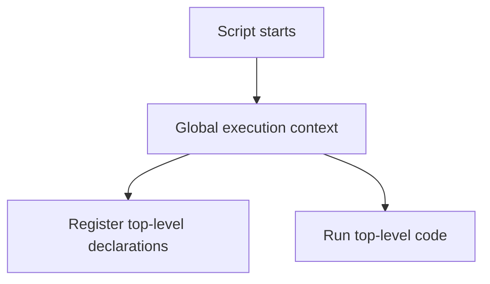

# Global Execution Context

## Detailed explanation
The global execution context is the first execution context JavaScript creates when a script starts. It represents top-level code. In browsers, it sets up the global object (`window`), the `this` value for non-module scripts, and top-level variable/function declarations.

This concept matters because many interview questions about hoisting, `var`, globals, `this`, script loading, and modules depend on knowing what happens before any function is called. It also explains why accidental globals are dangerous in frontend apps.

## 1. One-line mental model
The global execution context is the top-level runtime environment created before your script runs.

## 2. Problem it solves
JavaScript needs an initial environment to store top-level declarations and start executing code.

## 3. Core idea
- Created before top-level code executes.
- Contains global bindings and references to the global object.
- Function declarations are registered during creation.
- `var` declarations become global-context bindings in scripts.
- ES modules have different top-level behavior than classic scripts.

## 4. Visual / analogy
The global execution context is like opening the main office before any meeting rooms are used.



## 5. Minimal example

```js
var appName = "Portal";

function start() {
  console.log(appName);
}
```

`appName` and `start` are created in the global execution context for a classic script.

## 6. Real-world example

```html
<script>
  var debugMode = true;
</script>
```

In a browser classic script, this can create `window.debugMode`, which may collide with other scripts. Modern apps avoid this with modules and bundlers.

## 7. Common interview questions
- What is the global execution context?
- What is created before code runs?
- How does `var` behave globally?
- What is the global object in browsers?
- How is top-level `this` different in modules?
- How does global context relate to hoisting?
- Why are accidental globals bad?

## 8. Active recall test
1. What is the first execution context?
2. What browser object is tied to global context?
3. What happens to top-level function declarations?
4. Why can top-level `var` be risky?
5. How do modules reduce global pollution?

## 9. Mistakes / traps
- Assuming top-level `let` creates a `window` property.
- Ignoring module vs classic script differences.
- Creating accidental globals by assigning undeclared variables.
- Thinking global code has no execution context.
- Treating all environments like browsers; Node has different globals.

## 10. Compare with related concepts
- **Global execution context vs function execution context:** top-level environment vs per-function call environment.
- **Global object vs global lexical environment:** object properties and lexical bindings are related but not identical.
- **Script vs module:** modules avoid many global-scope behaviors.

## 11. Summary from memory
Explain what JavaScript sets up before the first line of a browser script executes.

## 12. Spaced revision prompts
- After 1 day: Define global execution context.
- After 3 days: Explain `var` at top level.
- After 7 days: Compare script and module top-level behavior.
- After 14 days: Explain accidental global risk.

