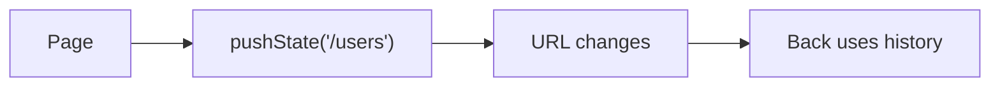

# History API

## Detailed explanation
History API lets JavaScript read and modify browser session history without full page reload. SPAs use it for client-side routing via `pushState`, `replaceState`, and `popstate`.

It matters for React Router, filters in URL, back/forward behavior, and deep links.

## 1. One-line mental model
History API changes URL/history while staying on same document.

## 2. Problem it solves
SPAs need navigable URLs without server document reload each click.

## 3. Core idea
- `pushState` adds history entry.
- `replaceState` replaces current entry.
- `popstate` fires on back/forward.
- URL can change without reload.
- Server fallback still needed for direct visits.

## 4. Visual / analogy
History API edits browser breadcrumb trail.



## 5. Minimal example

```js
history.pushState({ page: "users" }, "", "/users");
```

## 6. Real-world example

```js
window.addEventListener("popstate", () => {
  renderRoute(location.pathname);
});
```

## 7. Common interview questions
- What is History API?
- `pushState` vs `replaceState`?
- What is `popstate`?
- How SPAs use it?
- Why need server fallback?

## 8. Active recall test
1. Which method adds entry?
2. Which replaces entry?
3. What event on back?
4. Does page reload?
5. Why server fallback?

## 9. Mistakes / traps
- Expecting `pushState` to trigger `popstate`.
- Forgetting direct URL refresh server config.
- Putting huge state objects in history.
- Confusing hash routing.

## 10. Compare with related concepts
- **History API vs hash routing:** clean path history vs hash fragment.
- **pushState vs replaceState:** new entry vs current entry.
- **URL state vs app state:** shareable navigation/filter state vs internal UI.

## 11. Summary from memory
Explain how SPA route changes URL without reload.

## 12. Spaced revision prompts
- 1 day: Define History API.
- 3 days: Compare push/replace.
- 7 days: Explain popstate.
- 14 days: Connect to React Router.

