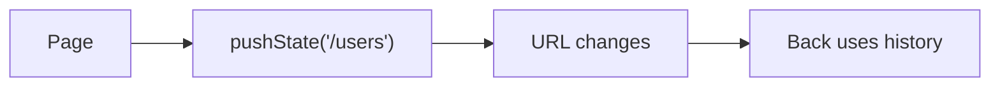

# History API

## Detailed explanation
History API lets JavaScript read and modify browser session history without full page reload. SPAs use it for client-side routing via `pushState`, `replaceState`, and `popstate`.

It matters for React Router, filters in URL, back/forward behavior, and deep links.

## 1. One-line mental model
History API changes URL/history while staying on same document.

## 2. Problem it solves
SPAs need navigable URLs without server document reload each click.

## 3. Core idea
- `pushState` adds history entry.
- `replaceState` replaces current entry.
- `popstate` fires on back/forward.
- URL can change without reload.
- Server fallback still needed for direct visits.

## 4. Visual / analogy
History API edits browser breadcrumb trail.



## 5. Minimal example

```js
history.pushState({ page: "users" }, "", "/users");
```

## 6. Real-world example

```js
window.addEventListener("popstate", () => {
  renderRoute(location.pathname);
});
```

## 7. Common interview questions

#### What is History API?
- **The Engine Mechanism (Why it behaves this way):** The HTML5 History API is an interface exposed by the browser's `Window` object (`window.history`) that allows direct programmatic manipulation of the browser's session history stack (a list of visited URLs and state records associated with the current tab). When JavaScript calls methods like `pushState()` or `replaceState()`, the browser's rendering engine and host environment update the current document's address bar and the session history list *without* triggering a document unloading sequence or executing a new network HTTP request for the new URL. The V8 environment allocates a serialized clone of the provided `state` object inside the browser's native session database.
- **The Unforgettable Mental Model:** A professional film editor modifying a movie reel. Instead of shooting an entirely new scene (full page reload), they splice a new label onto the current frame (pushState/replaceState) or rewind the reel back and forth (back/forward navigations), altering what the audience perceives as the sequence of events without changing the physical theater room.
- **The Trap:** Believing that changing the URL via the History API is a purely synchronous DOM action. While the address bar changes immediately, the actual session history entry serialization is asynchronous and can fail if the state object size exceeds browser limits (typically 640KB in Chrome).
- **Senior Interview Playbook (Verbal Script):** "When asked this in an interview, say: The History API is a DOM-host interface that allows single-page applications to perform client-side routing by programmatically updating the address bar and session history stack. It operates by bypassing the default browser navigation lifecycle, preventing full document teardown and network reload, while serializing lightweight state objects directly associated with each historical record."

#### `pushState` vs `replaceState`?
- **The Engine Mechanism (Why it behaves this way):** `history.pushState(state, title, url)` pushes a brand new history entry onto the session history stack at the current index, incrementing the stack's length (`history.length`) and discarding any forward history entries if the user had navigated backward before calling it. `history.replaceState(state, title, url)`, on the other hand, overwrites the current active history entry at the current index without altering the stack's length or discarding the forward history entries.
- **The Unforgettable Mental Model:** `pushState` is adding a new page to a physical binder of notes, placing it on top of the current page. `replaceState` is taking an eraser, rubbing out the content of the current page, and writing new notes on that exact same sheet of paper without increasing the page count.
- **The Trap:** Using `pushState` for incremental UI states like toggling a modal or updating a minor search filter. This pollutes the history stack, forcing the user to click the "Back" button dozens of times just to exit a page, destroying the back-button UX. Use `replaceState` for filters and `pushState` only for structural route transitions.
- **Senior Interview Playbook (Verbal Script):** "When asked this in an interview, say: The fundamental difference lies in their impact on the session history stack. `pushState` appends a new entry onto the stack, enabling back-button traversal and incrementing the stack length. `replaceState` modifies the current active stack frame in-place, which is ideal for reflecting transient state changes like search queries or filters in the URL without cluttering the user's navigation history."

#### What is `popstate`?
- **The Engine Mechanism (Why it behaves this way):** The `popstate` event is dispatched to the `window` object by the browser user agent whenever the active history entry changes due to a user-driven navigation action (such as clicking the browser's Back/Forward buttons, or programmatically calling `history.back()`, `history.forward()`, or `history.go()`). The engine retrieves the serialized state object associated with the newly active history entry from the database, deserializes it (creating a structured clone), and attaches it to the event object as `event.state`.
- **The Unforgettable Mental Model:** An automated sensor on a security turnstile. It doesn't trip when *you* manually push the bar to go through (pushState/replaceState), but it sounds a chime (`popstate`) whenever a customer walks backwards or forwards through the gate, checking their ticket badge (`event.state`) to verify who they are.
- **The Trap:** Assuming that calling `history.pushState()` or `history.replaceState()` triggers a `popstate` event. It does not! The event *only* fires as a result of active user navigation or programmatically calling navigation travel methods like `history.back()`.
- **Senior Interview Playbook (Verbal Script):** "When asked this in an interview, say: The `popstate` event is a window-level event that fires only when the active history entry changes due to browser navigation, such as clicking back or forward. Crucially, calling `pushState` or `replaceState` programmatically does *not* trigger `popstate`. To build a router, we must listen to `popstate` to render the correct view when the user navigates, and manually handle programmatic routing changes within our application code."

#### How SPAs use it?
- **The Engine Mechanism (Why it behaves this way):** Modern SPA routers (like React Router or Vue Router) implement client-side routing by intercepting anchor element click events (`<a href="...">`) using `event.preventDefault()`. Instead of letting the browser perform its default navigation, the router calls `history.pushState()` to update the URL in the address bar. It then invokes its internal state management mechanism to trigger a re-render of the component tree matching the new path. Finally, it binds a listener to the `popstate` event to handle instances where the user clicks the browser's back/forward buttons, capturing the updated path and synchronizing the UI accordingly.
- **The Unforgettable Mental Model:** A theatrical stage manager. When an actor walks towards a door (clicks a link), instead of tearing down the entire theater building and constructing a new one (full reload), the manager swaps out the painted background screen (rendering new components) and quickly prints a new scene name in the playbill (History API URL update).
- **The Trap:** Not cleaning up custom route listener bindings on component unmount, which leads to memory leaks because the global `window` object retains references to these route listener closures.
- **Senior Interview Playbook (Verbal Script):** "When asked this in an interview, say: SPAs use the History API to implement seamless client-side routing. They intercept clicks on internal links, call `preventDefault` to block browser reload, invoke `history.pushState` to update the URL and serialize route state, and trigger a synchronous rendering cycle for the matching route component. They also register a global `popstate` listener to ensure that when a user navigates using the browser's native back and forward buttons, the UI remains perfectly in sync with the current URL."

#### Why need server fallback?
- **The Engine Mechanism (Why it behaves this way):** The History API is a client-side virtualization of routing. The web server hosting the SPA is completely unaware of client-side routes like `/dashboard/settings`. If a user lands directly on `/dashboard/settings` via a bookmark or performs a hard browser refresh, the browser bypasses the client-side router and sends an HTTP GET request directly to the host server for `/dashboard/settings`. Without server-side configuration, the server will search for a physical file or route named `/dashboard/settings`, fail to find it, and return a `404 Not Found` error.
- **The Unforgettable Mental Model:** A scavenger hunt taking place inside a mall. As long as you are inside the mall (the SPA has loaded), the clues direct you perfectly. But if you try to teleport directly to clue #5 from outside the mall, you will smash into the wall unless there's an entrance door (server fallback) that directs everyone back to the main lobby to start the game.
- **The Trap:** Deploying an SPA to a static file hosting service (like AWS S3 or Netlify) without configuring a redirection rule that rewrites all non-file incoming HTTP requests to point directly to `index.html`.
- **Senior Interview Playbook (Verbal Script):** "When asked this in an interview, say: A server-side fallback is mandatory because the History API's client-side routes only exist in the browser's runtime memory once the SPA has loaded. If a user does a hard reload or accesses a nested route directly, the browser requests that specific path from the server. To prevent 404 errors, the server must be configured with a fallback mechanism that intercepts all non-asset requests and rewrites them to serve the root `index.html`, allowing the client-side router to boot up, parse the URL, and render the correct view."

## 8. Active recall test

#### 1. Which History API method appends a new entry to the history stack?
`history.pushState(state, title, url)` adds a brand new entry to the browser's session history stack, updating the URL and incrementing the stack length.

#### 2. Which History API method replaces the current entry on the history stack?
`history.replaceState(state, title, url)` replaces the current active entry on the browser's session history stack in-place, without altering the stack's length.

#### 3. What event is dispatched when navigating using the back or forward button, and does pushState trigger it?
The `popstate` event is triggered on the `window` object during active browser traversal. Crucially, calling `pushState()` or `replaceState()` programmatically does *not* trigger the `popstate` event.

#### 4. Does utilizing pushState or replaceState cause the page to reload?
No. Both `pushState` and `replaceState` update the address bar and session history synchronously without triggering a document unloading sequence or network reload.

#### 5. Why is a server-side fallback necessary when using client-side routing?
Because client-side routes only exist in-memory inside the browser. A direct visit or refresh prompts the browser to request that path directly from the server, which will fail with a 404 unless the server is configured to serve the root `index.html` fallback.

## 9. Mistakes / traps
- Expecting `pushState` to trigger `popstate`.
- Forgetting direct URL refresh server config.
- Putting huge state objects in history.
- Confusing hash routing.

## 10. Compare with related concepts
- **History API vs hash routing:** clean path history vs hash fragment.
- **pushState vs replaceState:** new entry vs current entry.
- **URL state vs app state:** shareable navigation/filter state vs internal UI.

## 11. Summary from memory
Explain how SPA route changes URL without reload.

## 12. Spaced revision prompts
- 1 day: Define History API.
- 3 days: Compare push/replace.
- 7 days: Explain popstate.
- 14 days: Connect to React Router.

