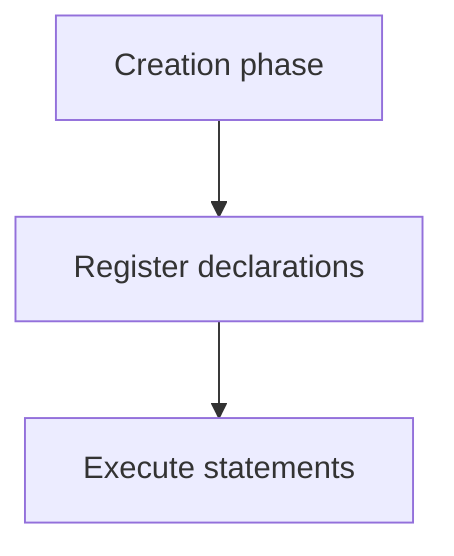

# Hoisting

## Detailed explanation
Hoisting is the interview shorthand for JavaScript setting up declarations before executing code. Function declarations are initialized during context creation, `var` is initialized to `undefined`, and `let`/`const` bindings exist but cannot be accessed before initialization because of the temporal dead zone.

Good senior answers avoid saying "JavaScript moves code to the top." The engine prepares bindings; source code is not literally rearranged.

## 1. One-line mental model
Hoisting means declarations are registered before code executes, but different declarations initialize differently.

## 2. Problem it solves
JavaScript must know declared identifiers before running statements in an execution context.

## 3. Core idea
- Function declarations can be called before their source line.
- `var` exists before assignment with value `undefined`.
- `let` and `const` exist but are inaccessible before initialization.
- Function expressions follow variable rules.
- Hoisting is tied to execution context creation.

## 4. Visual / analogy
Hoisting is like preparing name tags before a meeting, but not all people have arrived yet.



## 5. Minimal example

```js
sayHi(); // works

function sayHi() {
  console.log("hi");
}

console.log(count); // undefined
var count = 1;
```

## 6. Real-world example
Codebases avoid relying on hoisting because reordering declarations can hide bugs and make refactors risky.

## 7. Common interview questions

#### What is hoisting?
- **The Engine Mechanism (Why it behaves this way):** Hoisting is a compilation-phase behavior where the JavaScript engine registers all variable, function, and class declarations in the active Environment Record before executing a single statement. When the engine compiles a block or function, it performs a scan of the Abstract Syntax Tree (AST). It registers these identifiers in the Lexical or Variable Environments. Crucially, the engine does not physically rearrange or move your source code text. It simply pre-allocates memory slots for these names in the execution context's memory record during the Creation Phase.
- **The Unforgettable Mental Model:** A restaurant host taking reservations. Before the restaurant doors open (Execution Phase), the host writes down all the names of reserved guests in their logbook (Creation Phase). The guests aren't physically in their seats yet, but their seats are pre-allocated and the system knows they exist.
- **The Trap:** Telling an interviewer that "JavaScript physically moves variable declarations to the top of the file." This is factually incorrect and exposes a surface-level understanding. The source code is never altered; it is strictly a memory pre-allocation process.
- **Senior Interview Playbook (Verbal Script):** When asked this in an interview, say: "Hoisting is the conceptual shorthand for how the JS engine pre-allocates memory for declarations during the Execution Context's Creation Phase. Before line-by-line execution begins, the engine scans the code to register identifiers. Function declarations are initialized with their bodies, `var` is initialized to `undefined`, and `let` and `const` are registered as uninitialized, leaving them in the Temporal Dead Zone."

#### Are `let` and `const` hoisted?
- **The Engine Mechanism (Why it behaves this way):** Yes, `let` and `const` are hoisted. During the GEC or FEC Creation Phase, the compiler locates all `let` and `const` declarations and registers them in the Lexical Environment record. However, unlike `var` (which is immediately initialized to `undefined`), `let` and `const` are registered in an **uninitialized** state. They remain in this uninitialized state in memory until the engine's runtime execution thread physically reaches and completes their declaration statement in the code. Any attempt to read or write to them before this moment results in a `ReferenceError` due to the Temporal Dead Zone.
- **The Unforgettable Mental Model:** A reserved parking space with a barrier. The space is clearly marked (hoisted/registered in memory), but the barrier is locked (uninitialized). If you try to park your car there before the owner arrives with the key (declaration line), you will get a security violation (ReferenceError).
- **The Trap:** Thinking `let` and `const` are not hoisted because they throw a ReferenceError. If they weren't hoisted, accessing an undeclared variable `x` would print `x is not defined`. Instead, accessing `let x` before its line prints `Cannot access 'x' before initialization`, proving the engine is fully aware of `x`'s existence in memory.
- **Senior Interview Playbook (Verbal Script):** When asked this in an interview, say: "Yes, `let` and `const` are indeed hoisted. The JS engine registers them in the Lexical Environment during the creation phase. However, they are left uninitialized in memory, placing them in the Temporal Dead Zone. They remain completely inaccessible until the runtime execution thread physically evaluates their declaration statement."

#### Why does `var` log `undefined`?
- **The Engine Mechanism (Why it behaves this way):** When the engine compiles an execution context and encounters a `var` declaration, it registers the identifier in the **Variable Environment** record. By engine specification design, `var` variables are immediately initialized to the primitive value `undefined` during this Creation Phase. Because they have a valid, allocated value (`undefined`) in memory before the first line of code runs, referencing them prior to their line of assignment does not trigger a ReferenceError; instead, the engine resolves the current value, which is `undefined`.
- **The Unforgettable Mental Model:** A default cardboard box. When the movers (the compiler) set up your room, they put a default empty box labeled "clothes" in the corner. If you open it before you unpack (execute the assignment line), you don't crash; you just find it empty (`undefined`).
- **The Trap:** Writing code that depends on `var` hoisting. It makes code highly fragile, extremely difficult to read, and prone to silent bugs where variables are read as `undefined` instead of throwing a helpful runtime crash.
- **Senior Interview Playbook (Verbal Script):** When asked this in an interview, say: "Variables declared with `var` log `undefined` when accessed before declaration because the engine registers them in the Variable Environment and immediately initializes them to `undefined` during the Creation Phase. The variable is already in a valid, readable state in memory before the runtime thread executes its assignment statement."

#### Why can function declarations run before definition?
- **The Engine Mechanism (Why it behaves this way):** During the Creation Phase of the execution context, function declarations (e.g., `function foo() {}`) are treated with highest priority. The compiler registers the function identifier in the Environment Record and immediately initializes it, writing a direct pointer to the compiled function object in the heap. Because the identifier is fully bound to its executable function body in memory *before* the first line of code executes, you can invoke the function syntactically earlier in the source code file without issues.
- **The Unforgettable Mental Model:** A pre-installed app on a new smartphone. The day you unbox the phone (start execution), you can open and run the calculator app immediately because it was fully compiled and installed in memory (hoisted with its body) before you even turned the screen on.
- **The Trap:** Thinking this applies to function declarations inside block statements in strict mode. In ES6 strict mode, function declarations are block-scoped, meaning their hoisting is restricted to the enclosing block `{}` and they are not hoisted to the outer function scope.
- **Senior Interview Playbook (Verbal Script):** When asked this in an interview, say: "Function declarations can be invoked before their definition because during the Execution Context's Creation Phase, the engine fully hoists them, mapping their identifier directly to the compiled function object in memory. This pre-allocation allows execution of the function body even if the call site precedes the definition in the source file."

#### How are function expressions different?
- **The Engine Mechanism (Why it behaves this way):** A function expression (e.g., `var myFunc = function() {}` or `const myFunc = () => {}`) behaves exactly like a standard variable declaration. 
  - If declared with `var`, the variable `myFunc` is hoisted in the Variable Environment and initialized to `undefined`. Attempting to invoke it as `myFunc()` before the assignment line throws a `TypeError: myFunc is not a function` because `undefined` is not a callable object type.
  - If declared with `let` or `const`, the variable is hoisted but left uninitialized, throwing a `ReferenceError` if called early.
  The actual function body is only assigned to the variable during the Execution Phase when the assignment statement is evaluated.
- **The Unforgettable Mental Model:** Ordering a pizza. Declaring the variable is like making the phone call. The pizza box (variable) is registered, but it doesn't contain any pizza (the function body) yet. If you try to take a bite from the box before the delivery driver arrives with the hot pizza (assignment line), you will chew on empty cardboard (Type/Reference Error).
- **The Trap:** Confusing `TypeError` with `ReferenceError`. Calling a `var` function expression early throws a `TypeError` because the variable exists in memory (it's `undefined`), but it is of the wrong type to be invoked.
- **Senior Interview Playbook (Verbal Script):** When asked this in an interview, say: "Function expressions differ because they follow variable hoisting semantics rather than function hoisting semantics. The variable holding the function is registered during the creation phase, but the function body is only assigned during the execution phase at the declaration line. Invoking a `var` function expression early throws a `TypeError`, while a `let` or `const` expression throws a `ReferenceError`."

## 8. Active recall test

1. **Is code physically moved?**
   - **Answer:** No, the source code remains completely unchanged. Hoisting is entirely a compiler-phase memory allocation behavior in the environment records.

2. **What is `var` initialized to?**
   - **Answer:** It is initialized directly to the primitive value `undefined` during the context's Creation Phase.

3. **Can `const` be accessed before declaration?**
   - **Answer:** No, attempting to access it throws a `ReferenceError` because it resides in the Temporal Dead Zone (hoisted but left in an uninitialized state in memory).

4. **Are function declarations initialized?**
   - **Answer:** Yes, they are fully initialized during the Creation Phase, mapping their identifier to the compiled function object, allowing them to be invoked early.

5. **What happens with arrow function variables?**
   - **Answer:** They follow variable scoping rules. If declared with `const` or `let`, invoking them before assignment throws a `ReferenceError`. If declared with `var`, invoking them early throws a `TypeError`.

## 9. Mistakes / traps
- Saying `let` and `const` are not hoisted.
- Forgetting TDZ.
- Calling a function expression before assignment.
- Relying on hoisting for readability.

## 10. Compare with related concepts
- **Hoisting vs TDZ:** setup exists, but access can still be illegal.
- **Declaration vs initialization:** name registration vs value assignment.
- **Function declaration vs expression:** initialized early vs follows variable binding.

## 11. Summary from memory
Explain why `var`, `let`, `const`, and function declarations behave differently before their source line.

## 12. Spaced revision prompts
- After 1 day: Define hoisting accurately.
- After 3 days: Compare `var` and `let`.
- After 7 days: Explain function declaration hoisting.
- After 14 days: Predict output with mixed declarations.
