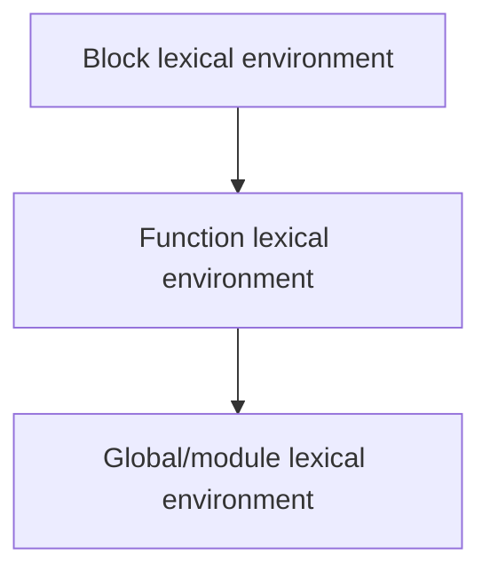

# Lexical Environment

## Detailed explanation
A lexical environment is the internal structure that stores identifier bindings and a reference to an outer lexical environment. JavaScript creates lexical environments for global code, functions, blocks, and modules.

This is the precise mechanism behind lexical scope, closures, `let`/`const`, temporal dead zone behavior, and nested function access.

## 1. One-line mental model
A lexical environment is a scope record plus a link to its outer scope.

## 2. Problem it solves
JavaScript needs a structured place to store variables and know where to look next.

## 3. Core idea
- It contains an environment record of bindings.
- It links to an outer lexical environment.
- Functions remember the environment where they were created.
- Blocks can create lexical environments for `let` and `const`.
- Modules have their own lexical environment.

## 4. Visual / analogy
A lexical environment is a folder of local names with a shortcut to the parent folder.



## 5. Minimal example

```js
function makeCounter() {
  let count = 0;
  return function increment() {
    count += 1;
    return count;
  };
}
```

`increment` retains access to the lexical environment containing `count`.

## 6. Real-world example
Custom hooks often return callbacks that read state from the render's lexical environment. This is why stale closures happen when dependencies are wrong.

## 7. Common interview questions

#### What is a lexical environment?
- **The Engine Mechanism (Why it behaves this way):** According to the ECMAScript standard specification, a **Lexical Environment** is a specification type used to define the association of Identifiers to specific variables and functions based upon the lexical nesting structure of ECMAScript code. Structurally, every Lexical Environment consists of exactly two components:
  1. An **Environment Record**: A map/dictionary that physically binds variable and function names to their actual values in memory.
  2. An **Outer Lexical Environment Reference** (or `outer` pointer): A memory reference pointing to the enclosing parent Lexical Environment.
  Lexical Environments are created dynamically whenever the engine enters a new block `{}`, function, or module script.
- **The Unforgettable Mental Model:** Imagine a custom folder on your computer. Inside the folder, you have files containing names and values (the Environment Record). The folder also contains a physical shortcut/link pointing directly to its parent directory (the outer environment reference). If you cannot find a file in the current folder, you double-click the shortcut to jump to the parent folder.
- **The Trap:** Conflating Environment Records with standard JavaScript objects. You cannot iterate over or print a Lexical Environment using `for...in` or `Object.keys()` because it is an internal C++ specification engine structure completely hidden from user-land JS.
- **Senior Interview Playbook (Verbal Script):** When asked this in an interview, say: "A Lexical Environment is an internal ECMAScript engine specification record that maps identifier names to their values. It is comprised of an Environment Record that stores local variable bindings, and an outer reference pointer that links it to its parent environment, dynamically establishing the physical scope chain of the application."

#### How does it relate to closures?
- **The Engine Mechanism (Why it behaves this way):** When a function is created, the JS compiler instantiates a function object on the heap and adds a hidden internal property named `[[Environment]]`. The compiler writes the address of the currently active Lexical Environment directly into this property. At any point in the future when this function is invoked, the engine instantiates a new Function Execution Context and points its FEC's Outer Lexical Environment Reference directly to the address stored in the function's hidden `[[Environment]]` slot. This is a closure: the function carries a permanent, immutable reference to the Lexical Environment in which it was born, preventing the garbage collector from sweeping that environment.
- **The Unforgettable Mental Model:** A child leaving home for college. Before leaving, they attach a long, unbreakable wire spool (`[[Environment]]`) to their parents' kitchen. Wherever the child travels in the world (wherever the function is called), they can pull the wire to instantly fetch recipes (variables) from the parent's kitchen.
- **The Trap:** Thinking that only active variables are preserved. The entire Lexical Environment record is retained in the heap. If a parent function declares `let bigArray = new Array(1000000)` and `let age = 30`, and the returned closure only uses `age`, the massive `bigArray` is still kept in memory because the entire environment record is shielded from the garbage collector.
- **Senior Interview Playbook (Verbal Script):** When asked this in an interview, say: "Closures are the direct byproduct of Lexical Environments. When a function is defined, it permanently stores a reference to its current Lexical Environment in its hidden `[[Environment]]` property. Consequently, even when its parent execution context is popped off the call stack, the environment record remains allocated in heap memory via this persistent link, allowing the function to access parent variables at runtime."

#### How is it different from execution context?
- **The Engine Mechanism (Why it behaves this way):** An **Execution Context** is a dynamic runtime wrapper record that tracks execution state. It consists of multiple properties: a code execution state, a Lexical Environment, a Variable Environment, and a `this` binding value. A **Lexical Environment** is simply a sub-component within this execution context, specifically responsible for holding identifier bindings and outer scope references. While an Execution Context is actively managed on the Call Stack and destroyed instantly when a function returns, a Lexical Environment can decouple and persist in the memory heap long after its parent execution context is popped, due to closure references.
- **The Unforgettable Mental Model:** Think of an Execution Context as a live theater play currently running on a stage. The Lexical Environment is the physical set design (the background trees, props, and signs) used during the play. The play (execution context) finishes and leaves the theater (stack), but the props and set pieces (lexical environment) can be moved and stored in a warehouse (heap) to be used again.
- **The Trap:** Thinking that Variable Environment and Lexical Environment are always identical. While they are initialized to point to the same environment record at context start, they can diverge. For example, during a `try...catch` block, a new block Lexical Environment is temporarily created for the catch parameter, but the Variable Environment (for `var` declarations) remains linked to the outer function boundary.
- **Senior Interview Playbook (Verbal Script):** When asked this in an interview, say: "An Execution Context is the overall runtime container managed LIFO-style on the Call Stack to track active code execution, containing `this` bindings and lexical environments. A Lexical Environment is a specific static data structure within that context that manages identifier mappings and outer scope references. While execution contexts are popped and destroyed, their lexical environments can survive in the heap to support closures."

#### Why do `let` and `const` have temporal dead zone?
- **The Engine Mechanism (Why it behaves this way):** During the Creation Phase of an execution context or block execution, the compiler scans the scope for all declarations. Variables declared with `var` are placed in the Variable Environment and immediately initialized to `undefined`. In contrast, variables declared with `let` and `const` are placed in the Lexical Environment record, but are marked as **uninitialized** (meaning they have a special internal "empty" state marker). Any attempt by the engine to read a variable in this uninitialized state throws a `ReferenceError`. The variable is only initialized when the engine's instruction pointer executes the actual assignment/declaration statement at runtime, ending the Temporal Dead Zone (TDZ).
- **The Unforgettable Mental Model:** Imagine reserving a table at a VIP restaurant. The restaurant registers your name on the table (it exists in memory), but until you physically arrive, present your ID, and sit down (execute the declaration line), the security guards will throw you out (throw a ReferenceError) if you try to sit or place your coat there.
- **The Trap:** Believing `let` and `const` are not hoisted. They *are* hoisted (registered in memory during the creation phase). If they weren't hoisted, accessing them before their declaration line would throw a standard `ReferenceError: x is not defined` (meaning it doesn't exist). Instead, it throws `ReferenceError: Cannot access 'x' before initialization`, proving it *does* exist in memory but is locked in the TDZ.
- **Senior Interview Playbook (Verbal Script):** When asked this in an interview, say: "The Temporal Dead Zone is a direct mechanism of Lexical Environments. During the creation phase, `let` and `const` identifiers are registered in the Environment Record but are flagged as uninitialized. Any read or write attempt on these identifiers before the runtime thread executes their declaration line encounters this uninitialized state, throwing a ReferenceError."

#### What does outer environment reference mean?
- **The Engine Mechanism (Why it behaves this way):** The **Outer Lexical Environment Reference** (denoted as `outer` in engine specs) is a memory pointer that points directly to the parent Lexical Environment that geographically encloses the current scope in the source code. This reference is determined statically at compile time. In a nested function chain `outerFunc -> middleFunc -> innerFunc`, `innerFunc`'s Lexical Environment's outer reference points to `middleFunc`'s Lexical Environment, which points to `outerFunc`'s Lexical Environment, forming a chain that terminates at the Global Lexical Environment whose outer reference is `null`.
- **The Unforgettable Mental Model:** It is like having the emergency phone number of your supervisor. If you don't know how to solve a local problem (resolve a variable name), you don't call a random colleague; you immediately dial the phone number pointing directly to your supervisor (the outer reference) to get the answer.
- **The Trap:** Thinking that the outer environment reference changes if the parent function is called from a different location. The outer environment reference is immutable and is permanently locked to the lexical birthplace of the function, regardless of call-site dynamics.
- **Senior Interview Playbook (Verbal Script):** When asked this in an interview, say: "The outer environment reference is a static, compile-time established memory pointer in a Lexical Environment that references its enclosing parent Lexical Environment. This reference facilitates the physical mechanism of the scope chain, allowing the engine's resolver to step outward sequentially to find variables not declared in the immediate local scope."

## 8. Active recall test

1. **What two parts does a lexical environment have?**
   - **Answer:** It consists of an **Environment Record** (which maps identifier names directly to values in memory) and an **Outer Lexical Environment Reference** (a pointer to the parent Lexical Environment).

2. **What does a function remember?**
   - **Answer:** A function permanently remembers the Lexical Environment active at its birth location by saving a reference to it in its hidden internal `[[Environment]]` property.

3. **What creates a block lexical environment?**
   - **Answer:** Block scope structures like `{}` containing block-scoped `let` or `const` declarations, `try...catch` blocks, and `for` loops.

4. **How does this explain closures?**
   - **Answer:** Because the returned inner function retains a hidden `[[Environment]]` pointer linking to the parent Lexical Environment, keeping the parent's environment record reachable in the memory heap and shielding it from garbage collection.

5. **How does it explain TDZ?**
   - **Answer:** Variables declared with `let` and `const` are registered in the environment record during the context creation phase but are left in an "uninitialized" state. Attempting to access them before their declaration statement initializes them throws a ReferenceError.

## 9. Mistakes / traps
- Using the term without explaining bindings plus outer link.
- Treating lexical environment as the same as the call stack.
- Forgetting closures keep environments reachable.
- Ignoring block scope.

## 10. Compare with related concepts
- **Lexical environment vs scope chain:** environments are linked together to form the chain.
- **Lexical environment vs execution context:** execution context uses lexical environments while code runs.
- **Lexical environment vs closure:** closure is function plus retained environment.

## 11. Summary from memory
Explain lexical environment using a closure example.

## 12. Spaced revision prompts
- After 1 day: Define lexical environment.
- After 3 days: Explain outer environment links.
- After 7 days: Connect lexical environment to TDZ.
- After 14 days: Explain stale closure through lexical environments.
