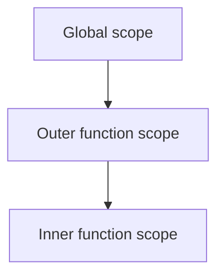

# Lexical Scoping

## Detailed explanation
Lexical scoping means a function's available variables are determined by where the function is written in the source code, not where it is called. Inner functions can access variables from outer scopes because those scopes are part of their lexical environment.

This is the foundation for closures. Frontend developers use lexical scoping constantly in event handlers, callbacks, React hooks, debounce/throttle utilities, and module-level state.

## 1. One-line mental model
Lexical scope means variable access is decided by code location.

## 2. Problem it solves
JavaScript needs predictable rules for resolving variable names in nested functions.

## 3. Core idea
- Scope is based on where code is written.
- Inner scopes can access outer scopes.
- Outer scopes cannot access inner local variables.
- Function calls do not change lexical scope.
- Closures preserve lexical scope after outer functions return.

## 4. Visual / analogy
Lexical scope is like nested rooms: an inner room can see signs in outer rooms, but outer rooms cannot see private notes inside the inner room.



## 5. Minimal example

```js
const name = "Asha";

function greet() {
  console.log(name);
}
```

`greet` can access `name` because it is written in an outer scope.

## 6. Real-world example

```js
function createLogger(prefix) {
  return function log(message) {
    console.log(`${prefix}: ${message}`);
  };
}
```

The returned function can still access `prefix` because of lexical scoping and closure.

## 7. Common interview questions
- What is lexical scoping?
- How is scope decided?
- How does lexical scoping relate to closures?
- Can call site change lexical scope?
- What is scope chain?
- Why can inner functions access outer variables?
- How does lexical scoping affect React hooks?

## 8. Active recall test
1. Is scope based on call location or write location?
2. Can an outer function access inner variables?
3. Why can `log` access `prefix` after `createLogger` returns?
4. How is lexical scoping different from `this` binding?
5. What is one frontend use case?

## 9. Mistakes / traps
- Confusing lexical scope with dynamic `this`.
- Thinking functions search variables from the call site.
- Assuming outer scopes can access inner locals.
- Forgetting modules also create scope.
- Ignoring closure retention.

## 10. Compare with related concepts
- **Lexical scope vs `this`:** lexical variables come from code position; `this` depends on call style unless arrow function.
- **Lexical scope vs closure:** lexical scope is the rule; closure is a function retaining access to that scope.
- **Scope chain vs call stack:** scope chain resolves names; call stack tracks active calls.

## 11. Summary from memory
Explain why a returned inner function can still read a variable from the outer function.

## 12. Spaced revision prompts
- After 1 day: Define lexical scoping.
- After 3 days: Draw nested scopes.
- After 7 days: Compare lexical scope and `this`.
- After 14 days: Connect lexical scoping to closures.

