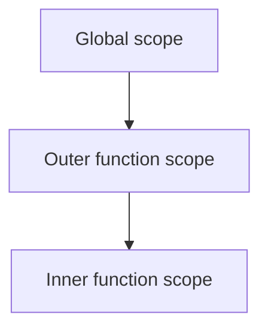

# Lexical Scoping

## Detailed explanation
Lexical scoping means a function's available variables are determined by where the function is written in the source code, not where it is called. Inner functions can access variables from outer scopes because those scopes are part of their lexical environment.

This is the foundation for closures. Frontend developers use lexical scoping constantly in event handlers, callbacks, React hooks, debounce/throttle utilities, and module-level state.

## 1. One-line mental model
Lexical scope means variable access is decided by code location.

## 2. Problem it solves
JavaScript needs predictable rules for resolving variable names in nested functions.

## 3. Core idea
- Scope is based on where code is written.
- Inner scopes can access outer scopes.
- Outer scopes cannot access inner local variables.
- Function calls do not change lexical scope.
- Closures preserve lexical scope after outer functions return.

## 4. Visual / analogy
Lexical scope is like nested rooms: an inner room can see signs in outer rooms, but outer rooms cannot see private notes inside the inner room.



## 5. Minimal example

```js
const name = "Asha";

function greet() {
  console.log(name);
}
```

`greet` can access `name` because it is written in an outer scope.

## 6. Real-world example

```js
function createLogger(prefix) {
  return function log(message) {
    console.log(`${prefix}: ${message}`);
  };
}
```

The returned function can still access `prefix` because of lexical scoping and closure.

## 7. Common interview questions
- What is lexical scoping?
- How is scope decided?
- How does lexical scoping relate to closures?
- Can call site change lexical scope?
- What is scope chain?
- Why can inner functions access outer variables?
- How does lexical scoping affect React hooks?

## 7. Common interview questions

#### What is lexical scoping?
- **The Engine Mechanism (Why it behaves this way):** Lexical scoping (also called static scoping) is a scoping paradigm where variable visibility is established statically during the compiler's compilation/parsing phase, rather than dynamically at runtime. The compiler scans the Abstract Syntax Tree (AST) and locks in the hierarchical boundaries of scopes based strictly on their physical nesting in the source code. Internally, when a function is declared, the engine assigns its parent Lexical Environment reference to the function's internal `[[Environment]]` slot. At runtime, when the function is executed, the engine resolves variable identifiers by traversing this static environment link, entirely ignoring the call stack hierarchy.
- **The Unforgettable Mental Model:** Lexical scope is like your permanent birthplace written on your passport. No matter what city you travel to, what hotel you stay at, or who calls you to a meeting (call site), your place of birth (scope origin) remains absolutely unchangeable and locked in.
- **The Trap:** Believing that JavaScript has some dynamic scoping capabilities. It does not. Every identifier (except `this` and dynamic properties) is resolved 100% lexically.
- **Senior Interview Playbook (Verbal Script):** When asked this in an interview, say: "Lexical scoping means that variable resolution is determined statically at compile time based entirely on where functions are declared in the source code. The JS engine saves the outer scope reference within a hidden internal `[[Environment]]` slot on the function object, ensuring that identifier resolution is completely predictable and independent of where the function is ultimately invoked."

#### How is scope decided?
- **The Engine Mechanism (Why it behaves this way):** Scope boundaries are decided by the parser as it converts raw text into an Abstract Syntax Tree (AST) during the Compilation Phase. When the parser encounters scope boundaries—such as block statements `{}` containing `let`/`const`, function bodies, catch blocks, or modules—it defines a new Lexical Environment scope block. Any variables declared within this block are mapped in the Environment Record of this newly parsed scope. Because this occurs entirely before the code is executed, scope is fully determined by the geography of your source text.
- **The Unforgettable Mental Model:** Think of an architect drawing blueprints for a house. The layout of the master bedroom, the guest room, and the hallways is finalized on paper (compile-time) before a single brick is laid or a single person moves in (runtime). You can't move walls dynamically just by walking in a certain door.
- **The Trap:** Thinking that dynamic code execution helpers like `eval()` are lexical scoping friendly. Running `eval("var x = 10")` forces the engine to dynamically compile new variables into the active lexical scope at runtime, destroying compiler optimization paths and introducing massive security/performance risks.
- **Senior Interview Playbook (Verbal Script):** When asked this in an interview, say: "Scope is decided statically during the parser's compilation phase by the structural nesting of code blocks and functions. Variable declarations are mapped in their respective lexical environments as the AST is built, meaning the layout of variable accessibility is fixed and immutable before runtime execution ever begins."

#### How does lexical scoping relate to closures?
- **The Engine Mechanism (Why it behaves this way):** A closure is the runtime mechanism that preserves this lexical scope. Because of lexical scoping, an inner function has access to the outer function's variables. When the outer function finishes executing and its frame is popped from the call stack, its Lexical Environment would normally be collected. However, because the inner function was instantiated inside that outer scope, its internal `[[Environment]]` slot holds a direct pointer to that Lexical Environment. If the inner function is returned and retained in memory, the outer Lexical Environment remains reachable in the heap, keeping those outer variables alive.
- **The Unforgettable Mental Model:** Lexical scope is the blueprint that says "Inner Room A has a secret window to Outer Room B." A closure is a physical telescope that stays in Inner Room A. Even if you lock up and demolish Outer Room B's entrance, you can still peer through the telescope from Room A to see everything inside Room B.
- **The Trap:** Believing closures are a special "feature" you must manually invoke. Every single function in JavaScript is a closure because every function carries its lexical birth scope in its hidden `[[Environment]]` slot.
- **Senior Interview Playbook (Verbal Script):** When asked this in an interview, say: "Lexical scoping is the rule set, and a closure is the physical manifestation of that rule. Because JavaScript resolves scopes lexically, functions retain references to their birth scopes. A closure simply arises when a function is executed outside its lexical birthplace while still retaining a live reference to its original parent environment record."

#### Can call site change lexical scope?
- **The Engine Mechanism (Why it behaves this way):** No. The **Call Site**—the physical line of code where a function is invoked, and its corresponding position on the Call Stack—has absolutely zero effect on Lexical Scope. When the engine executes a function, the outer scope link (scope chain) resolves strictly via the static address stored in the function's internal `[[Environment]]` slot. The call stack frame that called the function is completely bypassed during variable resolution.
- **The Unforgettable Mental Model:** Imagine you have a locked diary. You only share the key with your family (definition scope). If you bring the diary to a public stadium (the call site) and a stranger calls you on the phone (invokes you), they still cannot read the diary because the key remains lexically bound to your family, not the stadium.
- **The Trap:** Thinking that calling a function inside another function allows it to access the caller's local variables. This is a classic trap. Variable lookup will jump directly to the global scope (or enclosing scopes where it was defined), completely bypassing the caller's variables.
- **Senior Interview Playbook (Verbal Script):** When asked this in an interview, say: "No, the call site cannot alter the lexical scope. When a function is called, its scope chain is resolved solely through its statically defined outer environment pointer. It cannot access variables inside the caller's environment record, maintaining strict separation between the LIFO call stack hierarchy and static scoping boundaries."

#### What is scope chain?
- **The Engine Mechanism (Why it behaves this way):** The Scope Chain is a runtime linked list of Environment Records. It is formed by linking the active Execution Context's Lexical Environment to its parent Lexical Environment via the `outer` reference pointer. The parent environment, in turn, points to its parent, continuing up to the Global Lexical Environment. When looking up an identifier, the engine's lexical resolver starts at the first node in this linked list (local scope) and traverses node-by-node along the outer pointers until the identifier is found or the list terminates at `null`.
- **The Unforgettable Mental Model:** A chain of command. If a private (local scope) needs an authorization code (variable), they look in their own drawer. If it's missing, they ask their lieutenant (outer scope), who asks the captain (global scope). The request only moves up the chain of command, never down.
- **The Trap:** Assuming the scope chain search is slow. Modern JS engines compile variable offsets and use inline caches to bypass dynamic lookups entirely, turning scope chain traversal into immediate, high-performance memory offsets.
- **Senior Interview Playbook (Verbal Script):** When asked this in an interview, say: "The Scope Chain is the physical linked list of Lexical Environments utilized by the engine during runtime. Starting from the active execution context's environment record, the resolver traverses up the chain using the outer environment pointers until it locates the matching variable binding or reaches the global scope boundary."

#### Why can inner functions access outer variables?
- **The Engine Mechanism (Why it behaves this way):** By ECMAScript specification design, when a new Execution Context is instantiated, its Lexical Environment's outer pointer is set to the Lexical Environment of the scope where it was created. Because the outer reference points to the parent's environment, the lookup resolver can transition from the inner environment record directly to the outer environment record. Access is strictly one-way: parent environments have no pointers linking to inner/child environments, preventing outer scopes from seeing inward.
- **The Unforgettable Mental Model:** A one-way mirror in an interrogation room. The detective inside the inner room can peer out to see what is happening in the outer hallway, but people in the hallway see only a mirror and cannot see what is inside the inner room.
- **The Trap:** Declaring a variable inside an inner function with `var` and assuming it leaks to the outer function. `var` is function-scoped, meaning it is registered strictly inside the inner function's Variable Environment, completely hidden from the outer scope.
- **Senior Interview Playbook (Verbal Script):** When asked this in an interview, say: "Inner functions can access outer variables because the engine structures scopes as a one-way linked list. The inner function's environment record holds an explicit pointer to its parent's lexical environment record. When resolving an identifier, the search naturally traverses outward along this pointer, whereas outer scopes have no reference pointers looking inward."

#### How does lexical scoping affect React hooks?
- **The Engine Mechanism (Why it behaves this way):** React hooks, particularly `useState`, `useEffect`, and `useCallback`, rely entirely on lexical scoping closures. When a React component renders, it executes as a standard function context. Any handlers or effects declared inside it close over the state and prop variables of that specific render cycle. Because of lexical scoping, those callbacks are bound to the specific value of those variables *during that specific render*. If you capture a state variable in a stale closure (e.g., in a `useCallback` with an empty dependency array), the handler will permanently reference the old, closed-over lexical state from the original render frame, ignoring subsequent state updates in new render cycles.
- **The Unforgettable Mental Model:** A camera snapshot. Every render cycle of a React component is a new frame (snapshot) of the world. Handlers created during that render are looking at that specific photograph. If you don't update your references (dependencies), the handler continues to describe the old photograph even though the real world has moved on.
- **The Trap:** The "Stale Closure" bug. Writing a `useEffect` that listens to a state variable but leaving the dependency array empty. The effect will close over the initial value of that state variable and will never see any updated values because the function is never re-instantiated in the new lexical environment frame.
- **Senior Interview Playbook (Verbal Script):** When asked this in an interview, say: "Lexical scoping dictates React hook lifecycles. Since a React functional component is simply a function, each render executes a new context with a fresh lexical environment. Handlers and effects close over state and props from that specific render frame. If dependencies are not properly managed, callbacks will suffer from stale closures, permanently referencing old variable values from historical execution frames."

## 8. Active recall test

1. **Is scope based on call location or write location?**
   - **Answer:** It is based strictly on write location (Lexical Scoping), determined at compile time based on where the code is declared in the source text.

2. **Can an outer function access inner variables?**
   - **Answer:** No, the outer scope has no pointer references or visibility into the environment records of inner scopes.

3. **Why can `log` access `prefix` after `createLogger` returns?**
   - **Answer:** Because the `log` function retains a persistent reference to the `createLogger` Lexical Environment via its hidden `[[Environment]]` slot, creating a closure that keeps those variables alive in the heap.

4. **How is lexical scoping different from `this` binding?**
   - **Answer:** Lexical scoping is resolved statically at compile time based on code location. The `this` binding is resolved dynamically at runtime based on the call site (how the function is invoked), unless overridden by arrow functions or explicit binding APIs.

5. **What is one frontend use case?**
   - **Answer:** Encapsulating private variables inside a module or utility factory function (like debounce, throttle, or custom event hooks) where internal state must be protected from external modification.

## 9. Mistakes / traps
- Confusing lexical scope with dynamic `this`.
- Thinking functions search variables from the call site.
- Assuming outer scopes can access inner locals.
- Forgetting modules also create scope.
- Ignoring closure retention.

## 10. Compare with related concepts
- **Lexical scope vs `this`:** lexical variables come from code position; `this` depends on call style unless arrow function.
- **Lexical scope vs closure:** lexical scope is the rule; closure is a function retaining access to that scope.
- **Scope chain vs call stack:** scope chain resolves names; call stack tracks active calls.

## 11. Summary from memory
Explain why a returned inner function can still read a variable from the outer function.

## 12. Spaced revision prompts
- After 1 day: Define lexical scoping.
- After 3 days: Draw nested scopes.
- After 7 days: Compare lexical scope and `this`.
- After 14 days: Connect lexical scoping to closures.

