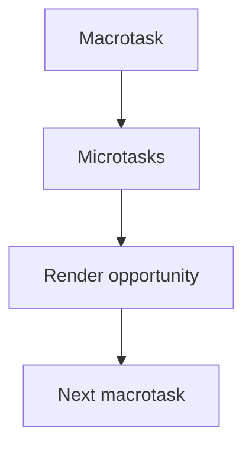

# Macrotask Queue

## Detailed explanation
The macrotask queue holds larger event-loop tasks such as initial script execution, timers, user events, message events, and many browser callbacks. After one macrotask runs, the browser drains microtasks before moving to rendering and another macrotask.

Frontend engineers need this to reason about timers, click handlers, `postMessage`, rendering delays, and why `setTimeout(..., 0)` is not immediate.

## 1. One-line mental model
Macrotasks are the main event-loop jobs JavaScript handles one at a time.

## 2. Problem it solves
Browsers need a queue for scheduled work from timers, events, parsing, and other host APIs.

## 3. Core idea
- Initial script execution is a macrotask.
- Timer callbacks run as macrotasks.
- User interaction handlers are dispatched as tasks.
- Microtasks drain after each macrotask.
- Rendering can happen between macrotasks.

## 4. Visual / analogy
Macrotasks are full tickets in a support queue; microtasks are urgent notes completed between tickets.



## 5. Minimal example

```js
setTimeout(() => console.log("timer"), 0);
console.log("script");
```

The script task finishes before the timer task can run.

## 6. Real-world example
Breaking a heavy calculation into timer-scheduled chunks can give the browser chances to handle input and paint between chunks.

## 7. Common interview questions

#### What is a macrotask?
- **The Engine Mechanism (Why it behaves this way):** A **Macrotask** (referred to in the HTML standard simply as a **Task**) is a discrete, standalone execution job scheduled by the browser's host environment. A macrotask establishes its own brand-new Call Stack frame. When the browser receives events from the operating system or internal threads (such as network packets, timer alarms, layout changes, or user actions), it places these actions as macrotasks inside task-specific FIFO queues (e.g., the Timer Task Queue, the DOM Event Task Queue). The Event Loop executes exactly **one** macrotask per tick. The second this single macrotask completes, the Event Loop pauses task dequeuing to process microtasks and rendering operations before proceeding to fetch the next macrotask.
- **The Unforgettable Mental Model:** A customer entering a busy bank. Each customer represents a single, independent macrotask. The teller works through exactly one customer's entire transaction (one macrotask). Once that transaction is finished, the teller takes a moment to clean the desk, organize receipts, and file paperwork (microtasks & rendering) before calling the next customer in line.
- **The Trap:** Thinking there is only one "macrotask queue" in browsers. Modern browsers actually maintain multiple task queues with varying priority weights (e.g., user-input tasks like clicks are prioritized far higher than background analytics timer tasks) to guarantee UI responsiveness.
- **Senior Interview Playbook (Verbal Script):** When asked this in an interview, say: "A macrotask, formally referred to as a task in the HTML standard, is a self-contained execution job scheduled by the host environment. Each macrotask runs to completion on a new stack frame. The event loop is designed to execute exactly one macrotask per tick, immediately followed by the microtask checkpoint and rendering phase before the next macrotask is dequeued."

#### Is `setTimeout` a microtask or macrotask?
- **The Engine Mechanism (Why it behaves this way):** `setTimeout` is a Web API provided by the browser host environment. Its callback is classified strictly as a **Macrotask**. When you invoke `setTimeout(callback, delay)`, the execution thread offloads the timer countdown to the browser's background C++ Timer Thread. When the timer thread determines that the specified `delay` milliseconds have elapsed, it registers this by pushing the `callback` function directly into the **Timer Task Queue**. The callback will wait in this queue until the Event Loop finishes all preceding macrotasks, empties the microtask queue, completes any scheduled paints, and finally dequeues the timer callback for execution on the Call Stack.
- **The Unforgettable Mental Model:** Placing an order at a bakery. Calling `setTimeout` is like placing a custom cake order. The baker goes to the kitchen to bake it (the background timer thread). When it is ready, they put it on the pick-up counter (the timer queue). You only get to take it home (execute the callback) when your number is finally called at the front of the queue.
- **The Trap:** Thinking that the delay specified in `setTimeout(cb, 1000)` is the exact execution time. The 1000ms delay is only the *minimum* time required for the background thread to push the callback to the queue. If the main thread is occupied by a heavy synchronous task or a long microtask chain, the actual callback execution can be delayed by seconds.
- **Senior Interview Playbook (Verbal Script):** When asked this in an interview, say: "`setTimeout` is strictly a macrotask. The `setTimeout` function registers a timer with the host's background API. When the timer expires, the host pushes the callback into the timer macrotask queue, where it must wait for its turn in the event loop, behind current synchronous execution, pending microtasks, and rendering cycles."

#### Why does zero-delay timeout wait?
- **The Engine Mechanism (Why it behaves this way):** When you run `setTimeout(cb, 0)`, the background timer thread immediately pushes the `cb` callback into the Timer Task Queue (virtually instantly, subject to a browser minimum clamp of 1-4ms for nested timers). However, the currently executing synchronous code (the "main" script) is itself a running macrotask actively occupying the Call Stack. By Event Loop design, the active macrotask must run to completion first. Furthermore, after it completes, the Event Loop must execute all queued microtasks (like promise resolutions) and perform any due layout/paint updates. Only after the stack, microtasks, and render steps are completely cleared can the event loop spin to the next tick and dequeue the waiting zero-delay timer callback.
- **The Unforgettable Mental Model:** A customer who runs to the back of the line at a store and yells "I'll be super quick!" Even if their purchase takes zero seconds to scan, they must wait until the customer currently at the cash register finishes paying, and any VIP customers with express passes (microtasks) are checked out first.
- **The Trap:** Assuming that `setTimeout(cb, 0)` is a good way to write high-performance asynchronous pipelines. It introduces an artificial 4ms clamping delay in modern browsers when nested, and is always slower than `queueMicrotask` or `MessageChannel` due to the overhead of yielding to the macro queue and passing through the full event loop cycle.
- **Senior Interview Playbook (Verbal Script):** When asked this in an interview, say: "A zero-delay timeout must wait because the currently executing synchronous script is a macrotask that has already occupied the call stack. The event loop must run this task to completion, drain all generated microtasks, and handle rendering before it can step to the next tick and process the queued `setTimeout` macrotask."

#### What happens after each macrotask?
- **The Engine Mechanism (Why it behaves this way):** Immediately after a macrotask finishes execution and its context is popped from the Call Stack, the Event Loop executes its **Microtask Checkpoint**. The engine loops through the Microtask Queue, executing and dequeuing every pending microtask until the queue length is exactly zero. Once the microtask checkpoint finishes, the Event Loop checks if the current browser window is due for a visual update. If a paint is due, it yields control to the browser's layout and paint pipelines (running `requestAnimationFrame`, style calculations, layout calculations, layer repaints, and compositing). Only after this complete checklist is finalized does the Event Loop spin its wheel to fetch the next macrotask.
- **The Unforgettable Mental Model:** A surgeon finishing a major surgery (a macrotask). Immediately after finishing, the surgeon must wash their hands, sanitize all instruments, and clean up the operating room (microtasks & rendering) to ensure absolute safety before they are permitted to bring in the next patient for the next surgery (the next macrotask).
- **The Trap:** Assuming that rendering happens after *every* macrotask. If a macrotask runs in 1ms and the next macrotask runs 1ms later, the browser will likely skip rendering between them because the device display does not require a fresh frame (e.g. at 60Hz, a paint is only needed once every 16.6ms).
- **Senior Interview Playbook (Verbal Script):** When asked this in an interview, say: "Immediately after a macrotask finishes, the event loop initiates a microtask checkpoint, completely draining the microtask queue. Following this, the loop assesses if a rendering opportunity is due based on display refresh synchronization, executes animation frame callbacks and paints if necessary, and then proceeds to poll the next macrotask."

#### How can tasks affect rendering?
- **The Engine Mechanism (Why it behaves this way):** Rendering is heavily impacted by the size and frequency of macrotasks. Because JavaScript and browser rendering share the exact same main thread, a single macrotask that executes for a long duration (exceeding 50ms standard, or worse, 16.6ms frame budget) physically holds the Call Stack locked. The Event Loop's tick is paused mid-flight, making it impossible to step into the rendering phase. This causes the browser to drop frames (creating visible stutter or "jank") and delays input responsiveness, which severely degrades user-centric Core Web Vitals performance metrics like INP (Interaction to Next Paint) and TBT (Total Blocking Time).
- **The Unforgettable Mental Model:** A flipbook animation. If you flip the pages smoothly every fraction of a second, the image flows beautifully. But if your hand gets stuck holding a single page for 5 seconds (a long-running macrotask), the animation completely stops, and the viewer is left staring at a frozen, broken image.
- **The Trap:** Writing long-running computation loops in React/JS and hoping that simple asynchronous timeouts will solve the issue. If the individual chunks are still too large, they will block the rendering pipeline. The chunks must be kept strictly below 50ms (ideally < 10ms) to ensure the layout/paint engine has regular opportunities to slip in and render.
- **Senior Interview Playbook (Verbal Script):** When asked this in an interview, say: "Macrotasks directly control rendering performance because they share the single main thread. If a macrotask runs beyond the display's frame budget—taking longer than 16 milliseconds—it blocks the event loop from reaching the rendering phase. This causes dropped frames, visual stutter, and increases Total Blocking Time and Interaction to Next Paint."

## 8. Active recall test

1. **Name three macrotask sources.**
   - **Answer:** `setTimeout`/`setInterval` callbacks, DOM user interaction events (like `click` or `keydown`), and initial `<script>` execution/compilation.

2. **What runs after a macrotask?**
   - **Answer:** The Microtask Queue is completely drained, followed by browser rendering operations if a frame paint opportunity is due.

3. **Can rendering happen between macrotasks?**
   - **Answer:** Yes. The Event Loop yields to the browser's layout/paint rendering pipeline between macrotask ticks when a rendering opportunity is due (synchronized with display refresh rate).

4. **Why is zero-delay timer delayed?**
   - **Answer:** Because the active synchronous script is a currently executing macrotask. The timer callback is placed in the task queue and must wait for the active script to finish, all pending microtasks to drain, and rendering checks to complete.

5. **How can chunking work improve responsiveness?**
   - **Answer:** By breaking a single, massive, blocking synchronous task into several smaller macrotasks (e.g. using `setTimeout` or `postMessage`), you allow the Event Loop to slip in, process user inputs, and run rendering opportunities in the gaps between the smaller chunks, keeping the UI fluid and highly responsive.

## 9. Mistakes / traps
- Thinking timer delay is exact.
- Forgetting microtasks run before the next macrotask.
- Scheduling too much work in one task.
- Treating all browser callbacks as same-priority.

## 10. Compare with related concepts
- **Macrotask vs microtask:** broad scheduled work vs promise-level follow-up jobs.
- **Macrotask vs animation frame:** tasks are event-loop jobs; `requestAnimationFrame` runs before paint.
- **Task queue vs call stack:** queue waits; stack executes.

## 11. Summary from memory
Explain what happens around a `setTimeout(fn, 0)` callback.

## 12. Spaced revision prompts
- After 1 day: Define macrotask.
- After 3 days: Compare timer and promise callbacks.
- After 7 days: Explain rendering between tasks.
- After 14 days: Design a chunked long-running task.
