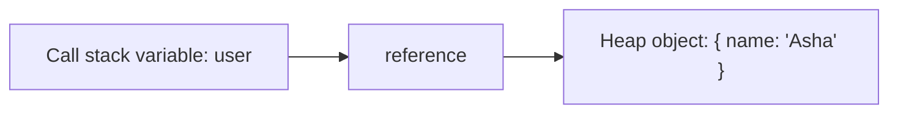

# Memory Heap

## Detailed explanation
The memory heap is the area where JavaScript stores dynamically allocated values such as objects, arrays, functions, closures, maps, sets, DOM references, and other reference-type data. The call stack stores active function calls, but the heap stores the larger data those calls point to.

For frontend interviews, the memory heap matters because React state objects, cached API responses, event listener references, closures, and detached DOM nodes all live by reference. Understanding the heap helps explain memory leaks, object identity, garbage collection, and why copying an object reference is not the same as copying the object itself.

## 1. One-line mental model
The memory heap is where JavaScript keeps objects and other dynamic data that live beyond a single stack frame.

## 2. Problem it solves
JavaScript needs a place to store values whose size and lifetime are not known at compile time, especially objects shared across functions and asynchronous callbacks.

## 3. Core idea
- Primitive local values may be handled directly in execution records, but objects and functions live in heap-managed memory.
- Variables often store references to heap values.
- Multiple variables can point to the same heap object.
- Garbage collection frees heap values that are no longer reachable.
- Memory leaks happen when unused heap values remain reachable.

## 4. Visual / analogy
The stack is a desk with active paperwork. The heap is the storage room where larger files are kept, and stack variables hold labels pointing to those files.



## 5. Minimal example

```js
const user = { name: "Asha" };
const sameUser = user;

sameUser.name = "Ravi";

console.log(user.name); // "Ravi"
```

Both variables point to the same heap object.

## 6. Real-world example

```js
const cache = new Map();

function rememberUser(user) {
  cache.set(user.id, user);
}
```

The `Map` keeps references to user objects. If entries are never removed, the heap can keep growing even when the UI no longer needs those users.

## 7. Common interview questions

#### What is the memory heap?
- **The Engine Mechanism (Why it behaves this way):** The memory heap is a massive, unstructured region of memory allocated by the host operating system to the JavaScript engine process (e.g., V8 in Chrome/Node.js). When the engine parses code and encounters dynamic allocations—such as creating an object, declaring an array, or defining a function—it asks the OS for a block of heap space. Unlike the call stack, which operates on a strict Last-In, First-Out (LIFO) execution frame allocation with fixed-size records, the heap has no fixed size per entry. Instead, the engine utilizes a memory allocator that tracks free blocks and allocates variable-sized memory segments. In V8, the heap is split into different spaces (like New Space for short-lived objects and Old Space for long-lived surviving objects) to optimize garbage collection cycles.
- **The Unforgettable Mental Model:** Think of the memory heap as a giant Amazon Warehouse. Items (objects, arrays, functions) are of wildly different sizes and are placed wherever there is free shelf space. To find an item, you don't look through the warehouse manually; you have a tracking slip (a reference/pointer) kept on your desk (the call stack) that lists the exact aisle and shelf location (memory address) of that item.
- **The Trap:** Interviewers might ask if primitive values are *never* stored in the heap. The trap is assuming a strict "primitives = stack, objects = heap" dichotomy. In modern JS engines, if a primitive is captured by a closure, or if it is a property of a heap-allocated object (e.g., `const user = { age: 30 }`), the primitive (`30`) lives entirely inside the object's heap block.
- **Senior Interview Playbook (Verbal Script):** When asked this in an interview, say: "The memory heap is a large, unstructured pool of memory used by the JS engine to dynamically allocate space for reference types like objects, arrays, and functions whose sizes cannot be determined at compile time. While the call stack handles ordered frame-based execution and fixed-size primitives, the heap handles arbitrary, long-lived data, returning a 64-bit memory address—or pointer—back to the stack variable that references it."

#### How is heap different from call stack?
- **The Engine Mechanism (Why it behaves this way):** The Call Stack is managed directly by the CPU's stack pointer, operating strictly in LIFO order. When a function is called, a fixed-size stack frame containing arguments, local variables, and the return address is pushed. When the function returns, this frame is immediately popped and reclaimed at zero cost. The memory heap, conversely, is an unsorted, dynamically sized pool of memory. Allocation in the heap requires searching for a free block (causing memory fragmentation), and deallocation is asynchronous, handled by the Garbage Collector scanning object reference graphs. 
- **The Unforgettable Mental Model:** The Call Stack is a stack of cafeteria trays: you can only add or remove from the very top, and it is highly structured and immediate. The Heap is a public parking lot: cars (objects) of various sizes park in open spots, stay for unpredictable durations, and must eventually be towed (garbage collected) when their owners abandon them.
- **The Trap:** Assuming that stack variables are completely isolated from heap dynamics. If a stack variable goes out of scope and its frame is popped, any heap object it was pointing to does *not* get instantly destroyed—it merely loses one reference in the GC's reachability graph.
- **Senior Interview Playbook (Verbal Script):** When asked this in an interview, say: "The call stack and the memory heap serve entirely different allocation lifecycles. The stack is synchronous, fast, and LIFO-driven, managing execution contexts and local primitives that are immediately discarded when a function exits. The heap is asynchronous and unstructured, designed to hold dynamically sized reference types that persist across execution contexts. The stack stores the references, while the heap stores the actual data."

#### Where are objects stored?
- **The Engine Mechanism (Why it behaves this way):** Objects are stored in the memory heap. When you write `const obj = {}`, the engine allocates a chunk of heap memory to represent the object instance (in V8, this includes a map pointing to the object's shape/hidden class, properties storage, and element storage). The variable `obj` itself is allocated on the current stack frame (or inside a parent lexical environment if closed over) and stores only a 64-bit pointer representing the memory address of that heap block.
- **The Unforgettable Mental Model:** Think of an object as a physical house, and the variable referencing it as the mailing address written on a post-it note. The house itself occupies physical earth (the heap), while your post-it note sits on your desk (the stack). You can copy the address to multiple post-it notes, but they all still point to that single physical house.
- **The Trap:** Believing that assigning an object to a new variable duplicates the object. It only duplicates the pointer on the stack, not the heap allocation.
- **Senior Interview Playbook (Verbal Script):** When asked this in an interview, say: "All objects in JavaScript are stored in the memory heap. The variables we declare do not hold the object's actual data; instead, they store a memory reference pointing to the object's heap location. Consequently, assigning an object to a new variable simply copies the reference pointer, meaning both variables now point to the exact same heap address."

#### What does it mean for variables to hold references?
- **The Engine Mechanism (Why it behaves this way):** When a variable holds a reference, its value in the Execution Context's Lexical Environment is not the literal payload of the object, but a memory pointer (typically a 64-bit integer pointing to an address in the heap). When you access a property, e.g., `obj.name`, the engine dereferences the pointer to locate the actual block in the heap, retrieves the value of the property, and returns it.
- **The Unforgettable Mental Model:** It is like sharing a Google Doc link. The document itself (the object) resides in the cloud (the heap). You can email the link (the reference) to five different people. They all see and edit the exact same document, not five different copies.
- **The Trap:** Thinking that reassigning a referenced variable changes the original object. Doing `obj = { new: true }` merely overrides the stack pointer for `obj` to point to a new heap address; it does not mutate the original object that was previously referenced.
- **Senior Interview Playbook (Verbal Script):** When asked this in an interview, say: "Holding a reference means a variable stores the memory address of a heap-allocated object rather than its literal value. When we copy a reference variable, we are duplicate-passing the pointer. Any mutation through one pointer is immediately reflected when accessing the object via any other pointer pointing to that same address."

#### How can heap memory leak in frontend apps?
- **The Engine Mechanism (Why it behaves this way):** A memory leak in the heap occurs when objects that are no longer needed by the application's business logic remain reachable in the garbage collector's reachability graph. If a root object (such as `window` or a global cache, or an active event listener attached to the DOM) maintains a direct or indirect reference path to an object, that object (and everything it points to) cannot be reclaimed by the garbage collector. Examples include closures capturing large scopes inside long-running intervals, detached DOM nodes held in JS variables, and global caches that grow without bounds.
- **The Unforgettable Mental Model:** Imagine you tie a balloon (the object) to a heavy anchor (the global window object) with a string (a reference). Even if you walk away and don't need the balloon anymore, it cannot float away and be cleaned up because the string is still securely tied to the anchor.
- **The Trap:** Thinking that removing an element from the DOM with `element.remove()` completely frees its memory. If you have a global variable or a closure still referencing that DOM element in JavaScript, it becomes a "detached DOM node" and stays in the heap forever.
- **Senior Interview Playbook (Verbal Script):** When asked this in an interview, say: "Heap memory leaks occur in frontend apps when unused objects remain reachable from the GC roots. The most common vectors are uncleaned global variables, event listeners that are never unsubscribed when components unmount, setInterval callbacks retaining large closures, and detached DOM nodes where JS retains a reference to an element removed from the active DOM tree."

#### How does garbage collection decide what to free?
- **The Engine Mechanism (Why it behaves this way):** Modern JavaScript engines use the **Mark-and-Sweep** algorithm. The engine maintains a list of "roots" (such as the global object, active local stack frames, and active event queues). 
  1. **Mark Phase:** The GC starts at these roots, traverses the reference pointers recursively, and marks every object it encounters as "reachable".
  2. **Sweep Phase:** The GC sweeps through the heap memory, identifying all unmarked memory blocks, freeing their space, and returning it to the OS or allocating it to a pool of free blocks. 
  Additionally, engines use generational hypothesis (splitting the heap into Young and Old generations) to run fast, frequent scavenges on short-lived allocations, and deeper, slower mark-sweep runs on long-lived survivors.
- **The Unforgettable Mental Model:** Imagine a giant social network graph. The GC starts at the VIPs (the roots: globals and stack frames) and traces all their friendships (references). Anyone who is completely disconnected from the network—meaning no one has a link to them—is removed from the system.
- **The Trap:** Relying on reference counting (where memory is freed when reference count hits 0). Reference counting fails to handle circular references (e.g., Object A references B, and B references A). Mark-and-Sweep easily handles circular references because if A and B are disconnected from the roots, they won't be marked, and both will be swept.
- **Senior Interview Playbook (Verbal Script):** When asked this in an interview, say: "Modern engines rely on the Mark-and-Sweep garbage collection algorithm rather than reference counting. Starting from root nodes like the global object and active execution contexts, the engine traverses the reference graph, marking all reachable objects. Unmarked objects are deemed unreachable and are safely swept from the heap, solving the issue of circular references."

#### Why can two variables mutate the same object?
- **The Engine Mechanism (Why it behaves this way):** When two variables are assigned the same object, e.g., `const b = a`, the engine copies the memory address stored in `a` directly into `b`. Both variables now hold identical binary address values. When a property mutation is executed via `b.prop = 5`, the engine dereferences `b`'s pointer, locates the object in the heap, modifies the value stored at `prop`, and finishes. When `a.prop` is later accessed, the engine dereferences `a`'s identical pointer, landing on the exact same physical heap memory block, and reads the modified value.
- **The Unforgettable Mental Model:** Imagine you and your friend both have keys to the same apartment. If your friend goes inside and paints the living room walls yellow (mutates the object), when you unlock the door with your key and walk in, you will also see yellow walls. There is only one apartment, accessed by two different keys.
- **The Trap:** Thinking that `const` prevents object mutation. `const` only locks the variable's *binding* (meaning you cannot reassign the pointer to a new address), but it does not make the referenced heap object immutable.
- **Senior Interview Playbook (Verbal Script):** When asked this in an interview, say: "This occurs because both variables hold copy-references pointing to the same unique address in the memory heap. Since no copy of the actual object is created, mutating properties through either variable alters the shared heap block, making the mutation visible to any other variable holding a reference to that same address."

## 8. Active recall test

1. **What kind of values usually live in the heap?**
   - **Answer:** Dynamic, non-primitive reference values whose size and lifetime are not known at compile-time. This includes Objects, Arrays, Functions, Closures, Maps, Sets, and DOM elements/references.

2. **What does a variable store when assigned an object?**
   - **Answer:** It stores a 64-bit reference pointer representing the specific address of the object inside the memory heap, rather than the object's actual data payload.

3. **Why does mutating `sameUser` also affect `user`?**
   - **Answer:** Because both variables hold copy-references containing the exact same memory address pointing to a single object block in the heap. Mutating the object via one variable modifies the shared heap data directly.

4. **What makes heap data eligible for garbage collection?**
   - **Answer:** When it becomes completely unreachable in the reference graph starting from the garbage collection roots (e.g., globals, stack frames, event listeners). If no active reference paths lead to the object, it is swept.

5. **How can a cache cause memory growth?**
   - **Answer:** A cache stores references to objects in a collection (like a `Map` or `Object`). As long as the cache itself remains reachable from a root, all cached objects remain reachable in the GC graph, preventing them from being collected, which leads to steady memory growth unless evicted.

## 9. Mistakes / traps
- Saying everything is stored on the call stack.
- Thinking object assignment creates a deep copy.
- Forgetting closures can keep heap values reachable.
- Keeping large values in global caches without eviction.
- Holding DOM references after nodes are removed.

## 10. Compare with related concepts
- **Heap vs call stack:** heap stores dynamic data; stack tracks active function calls.
- **Heap vs garbage collector:** heap is storage; garbage collector cleans unreachable heap data.
- **Reference vs value:** references point to heap data; primitive values behave like direct values.

## 11. Summary from memory
Explain why two variables can point to the same object and how that relates to frontend memory leaks.

## 12. Spaced revision prompts
- After 1 day: Define memory heap.
- After 3 days: Compare heap and call stack.
- After 7 days: Explain object reference mutation.
- After 14 days: Describe one heap memory leak in a frontend app.

