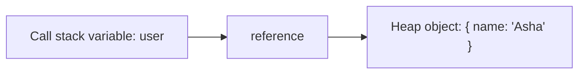

# Memory Heap

## Detailed explanation
The memory heap is the area where JavaScript stores dynamically allocated values such as objects, arrays, functions, closures, maps, sets, DOM references, and other reference-type data. The call stack stores active function calls, but the heap stores the larger data those calls point to.

For frontend interviews, the memory heap matters because React state objects, cached API responses, event listener references, closures, and detached DOM nodes all live by reference. Understanding the heap helps explain memory leaks, object identity, garbage collection, and why copying an object reference is not the same as copying the object itself.

## 1. One-line mental model
The memory heap is where JavaScript keeps objects and other dynamic data that live beyond a single stack frame.

## 2. Problem it solves
JavaScript needs a place to store values whose size and lifetime are not known at compile time, especially objects shared across functions and asynchronous callbacks.

## 3. Core idea
- Primitive local values may be handled directly in execution records, but objects and functions live in heap-managed memory.
- Variables often store references to heap values.
- Multiple variables can point to the same heap object.
- Garbage collection frees heap values that are no longer reachable.
- Memory leaks happen when unused heap values remain reachable.

## 4. Visual / analogy
The stack is a desk with active paperwork. The heap is the storage room where larger files are kept, and stack variables hold labels pointing to those files.



## 5. Minimal example

```js
const user = { name: "Asha" };
const sameUser = user;

sameUser.name = "Ravi";

console.log(user.name); // "Ravi"
```

Both variables point to the same heap object.

## 6. Real-world example

```js
const cache = new Map();

function rememberUser(user) {
  cache.set(user.id, user);
}
```

The `Map` keeps references to user objects. If entries are never removed, the heap can keep growing even when the UI no longer needs those users.

## 7. Common interview questions
- What is the memory heap?
- How is heap different from call stack?
- Where are objects stored?
- What does it mean for variables to hold references?
- How can heap memory leak in frontend apps?
- How does garbage collection decide what to free?
- Why can two variables mutate the same object?

## 8. Active recall test
1. What kind of values usually live in the heap?
2. What does a variable store when assigned an object?
3. Why does mutating `sameUser` also affect `user`?
4. What makes heap data eligible for garbage collection?
5. How can a cache cause memory growth?

## 9. Mistakes / traps
- Saying everything is stored on the call stack.
- Thinking object assignment creates a deep copy.
- Forgetting closures can keep heap values reachable.
- Keeping large values in global caches without eviction.
- Holding DOM references after nodes are removed.

## 10. Compare with related concepts
- **Heap vs call stack:** heap stores dynamic data; stack tracks active function calls.
- **Heap vs garbage collector:** heap is storage; garbage collector cleans unreachable heap data.
- **Reference vs value:** references point to heap data; primitive values behave like direct values.

## 11. Summary from memory
Explain why two variables can point to the same object and how that relates to frontend memory leaks.

## 12. Spaced revision prompts
- After 1 day: Define memory heap.
- After 3 days: Compare heap and call stack.
- After 7 days: Explain object reference mutation.
- After 14 days: Describe one heap memory leak in a frontend app.

