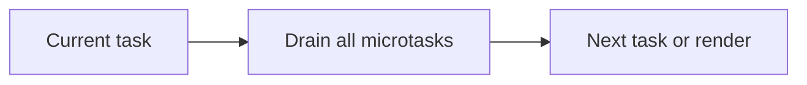

# Microtask Queue

## Detailed explanation
The microtask queue holds jobs that should run soon after the current synchronous code finishes, before the browser moves to the next macrotask. Promise `.then`, `.catch`, `.finally`, `queueMicrotask`, and mutation observer callbacks use microtask behavior.

Microtasks are important because they run before timers and can delay rendering if they keep scheduling more microtasks.

## 1. One-line mental model
Microtasks are high-priority follow-up callbacks that run after the current stack clears.

## 2. Problem it solves
JavaScript needs a way to run promise reactions predictably before later tasks like timers or input events.

## 3. Core idea
- Promise callbacks are microtasks.
- Microtasks run after the current task's stack is empty.
- The queue drains completely before the next macrotask.
- Microtasks can schedule more microtasks.
- Too many microtasks can delay rendering.

## 4. Visual / analogy
Microtasks are urgent notes handled before opening the next ticket.



## 5. Minimal example

```js
Promise.resolve().then(() => console.log("microtask"));
setTimeout(() => console.log("task"), 0);
console.log("sync");
```

Output: `sync`, `microtask`, `task`.

## 6. Real-world example
Promise-heavy state coordination can delay paint if each callback schedules another microtask chain.

## 7. Common interview questions

#### What is a microtask?
- **The Engine Mechanism (Why it behaves this way):** A **Microtask** is a high-priority runtime callback that is scheduled by the currently executing script to run immediately after the active Call Stack becomes completely empty, but before control is yielded back to the browser's event loop to initiate rendering or execute a new macrotask. During the Creation/Execution phases, microtasks are placed in a dedicated, isolated FIFO array known as the **Microtask Queue**. Unlike macrotasks, which the browser runs one at a time per tick, the event loop handles microtasks via a recursive loop checkpoint: it executes and dequeues the first microtask, and then immediately repeats this check, continuing until the queue size is exactly `0`.
- **The Unforgettable Mental Model:** An VIP exit corridor at a stadium. Instead of making VIPs wait in the general ticket holder line outside (the macrotask queue), security escorts them through a private, dedicated exit corridor (the microtask queue) the very second the game ends.
- **The Trap:** Believing that microtasks are scheduled on a separate thread. Microtasks run on the exact same main thread stack as your synchronous code, meaning they will block all interactions and rendering if they run for too long.
- **Senior Interview Playbook (Verbal Script):** When asked this in an interview, say: "A microtask is an asynchronous, high-priority callback scheduled to execute immediately after the current synchronous execution context has cleared the call stack. The event loop maintains a dedicated microtask queue that it must completely drain during its checkpoint phase before it can proceed to browser rendering or the next macrotask."

#### Which APIs schedule microtasks?
- **The Engine Mechanism (Why it behaves this way):** The host environments (browsers and Node.js) explicitly map certain APIs to place their reactions into the Microtask Queue. The standard standard-compliant APIs that generate microtasks are:
  1. `Promise.prototype.then()`, `.catch()`, and `.finally()` reactions.
  2. `await` continuations (internally compiled as promise `.then` wrappers).
  3. The dedicated, standard `queueMicrotask(callback)` API.
  4. `MutationObserver` callbacks (triggered when observed DOM mutations occur).
  5. In Node.js, `process.nextTick` behaves like a microtask, but is processed in an exclusive queue that drains *before* standard microtasks.
- **The Unforgettable Mental Model:** A priority mail service. When you use one of these five specific stamps (APIs) on your letter, the post office (Event Loop) intercepts it and places it in the red priority pouch (Microtask Queue) instead of the standard blue mailboxes (Macrotask Queue).
- **The Trap:** Thinking that DOM event listeners, `fetch` callbacks, or `setTimeout` schedule microtasks. They all generate standard *macrotasks*.
- **Senior Interview Playbook (Verbal Script):** When asked this in an interview, say: "Microtasks are scheduled using a select group of standard APIs, primarily `Promise` reaction handlers, the `await` keyword, the `queueMicrotask` API, and `MutationObserver` callbacks. In Node.js, `process.nextTick` also behaves similarly but runs in its own ultra-high-priority phase."

#### Why do promises beat timers?
- **The Engine Mechanism (Why it behaves this way):** The browser Event Loop runs on a strict priority protocol. Under this protocol, when the call stack becomes empty after executing a task (like the initial script compilation), the Event Loop transitions to the **Microtask Checkpoint** phase. It is a specification mandate that the Microtask Queue must be entirely drained before the Event Loop can select a new task from the Macrotask Queue (where timer callbacks sit). Therefore, even if a `setTimeout(cb, 0)` timer fires its hardware alarm and pushes its callback to the macrotask queue, the event loop refuses to process it until every promise callback currently in the microtask queue has finished executing.
- **The Unforgettable Mental Model:** A line at a bank. There is a general line (macrotask queue/timers) and a premium client desk (microtask queue/promises). The teller is instructed to *never* serve anyone from the general line if there is even a single premium client waiting. The premium clients will always "beat" the general line.
- **The Trap:** Assuming that a nested promise will be beaten by an already resolved timer. Even if a promise callback schedules *another* promise callback internally, that nested promise reaction is pushed to the end of the microtask queue and still runs *before* the event loop moves on to process the waiting timer macrotask.
- **Senior Interview Playbook (Verbal Script):** When asked this in an interview, say: "Promises beat timers because promise reactions are queued as microtasks, which have a superior execution priority. The event loop is specified to perform a microtask checkpoint and fully drain the microtask queue immediately after the current task finishes, prioritizing them ahead of the macrotask queue where timer callbacks reside."

#### Can microtasks block rendering?
- **The Engine Mechanism (Why it behaves this way):** Yes, they can completely freeze rendering. The browser's rendering opportunity is evaluated at the end of an event loop cycle, *after* the microtask checkpoint. If you continuously add items to the microtask queue (e.g. through a recursive promise or a loop containing `queueMicrotask`), the Microtask Checkpoint never completes. The queue size never reaches `0`. Consequently, the Event Loop remains trapped in this checkpoint loop indefinitely, never yielding to the style, layout, paint, or composite pipelines.
- **The Unforgettable Mental Model:** A janitor (the Event Loop) trying to lock up a school building. The rule is that the janitor cannot lock up and go home (render) until they check the library (microtask queue) and ensure *every single student* has left. If students keep sneaking in through a back window (recursive microtasks), the janitor is stuck checking the library forever, and the school never gets locked up.
- **The Trap:** Believing that because promises are "asynchronous," they let the UI breathe. They only execute asynchronously in relation to the original call site, but they execute *synchronously* in relation to the event loop's render phase.
- **Senior Interview Playbook (Verbal Script):** When asked this in an interview, say: "Yes, microtasks can block rendering. The rendering pipeline is only executed after the microtask queue has been completely drained. If microtasks are recursively queued—for instance, via recursive promise resolution—the queue size never reaches zero, trapping the event loop in its microtask phase and starving the rendering engine."

#### What is microtask starvation?
- **The Engine Mechanism (Why it behaves this way):** Microtask Starvation is the specific performance pathology where the Macrotask Queue and browser rendering engine are completely starved of CPU cycles because the engine is stuck continuously executing microtasks. Because the Event Loop has a strict constraint to run all pending microtasks before yielding to any other phase, generating a high-volume, endless stream of microtasks keeps the main thread fully saturated, preventing input handlers, garbage collection checks, timer callbacks, or paints from ever executing.
- **The Unforgettable Mental Model:** A restaurant waiter who is told to keep refilling water glasses for a group of VIPs (microtasks) before they can take orders from any other tables (macrotasks). If the VIPs drink water as fast as it is poured, the waiter spends 100% of their time at that one table, starving the rest of the restaurant of service.
- **The Trap:** Using recursive `queueMicrotask` for long-running calculations under the assumption that it acts like a background thread. It will completely freeze your UI. To run long calculations without starvation, use a Web Worker or chunk the work using `requestIdleCallback` or `setTimeout`.
- **Senior Interview Playbook (Verbal Script):** When asked this in an interview, say: "Microtask Starvation is a performance bottleneck that occurs when a continuous stream of microtasks saturates the queue. Because the event loop mandates that the microtask queue must be entirely empty before rendering or processing macrotasks, this infinite recursion starves the browser of rendering opportunities and input events, causing a total application freeze."

## 8. Active recall test

1. **Name two microtask APIs.**
   - **Answer:** `Promise.prototype.then()` (or `await` continuation) and `queueMicrotask()`.

2. **When do microtasks run?**
   - **Answer:** They run immediately after the current synchronous task has finished and the Call Stack is completely empty, before the Event Loop yields to browser rendering or dequeues the next macrotask.

3. **Does the queue drain one item or all items?**
   - **Answer:** It drains **all items** in the queue, including any new microtasks that are queued while the current queue is actively being processed, until the queue size is exactly zero.

4. **Can a microtask schedule another microtask?**
   - **Answer:** Yes, a microtask can recursively queue another microtask, which will be appended to the end of the queue and executed during the same microtask checkpoint phase.

5. **Why can this hurt UX?**
   - **Answer:** Because if microtasks recursively queue more microtasks indefinitely, the Event Loop never exits the checkpoint phase, completely starving the browser of rendering opportunities and user interaction processing, freezing the user interface.

## 9. Mistakes / traps
- Calling every async callback a microtask.
- Forgetting that all microtasks drain before the next task.
- Scheduling endless microtasks.
- Expecting paint before a long microtask chain finishes.

## 10. Compare with related concepts
- **Microtask vs macrotask:** microtasks run sooner and drain fully; macrotasks are broader event-loop tasks.
- **Promise callback vs timer callback:** promise reaction is microtask; timer is macrotask.
- **Microtask vs render:** rendering usually waits until microtasks finish.

## 11. Summary from memory
Explain why a resolved promise callback logs before a zero-delay timer.

## 12. Spaced revision prompts
- After 1 day: Define microtask.
- After 3 days: List microtask APIs.
- After 7 days: Explain queue draining.
- After 14 days: Predict nested promise output.
