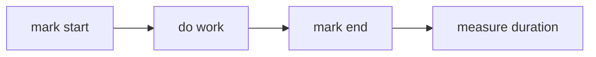

# Performance API

## Detailed explanation
Performance API gives high-resolution timing and measurement tools in browser. It helps measure page loads, user timing marks, resource timing, long tasks, and custom app performance.

Frontend engineers use it to debug slow interactions, compare optimizations, and feed real-user monitoring.

## 1. One-line mental model
Performance API measures browser and app timing.

## 2. Problem it solves
Performance work needs numbers, not guesses.

## 3. Core idea
- `performance.now()` gives high-resolution time.
- `performance.mark()` records named point.
- `performance.measure()` records duration.
- Performance entries expose navigation/resource data.
- Observers can stream metrics.

## 4. Visual / analogy
Performance API = stopwatch plus timeline labels.



## 5. Minimal example

```js
const start = performance.now();
doWork();
console.log(performance.now() - start);
```

## 6. Real-world example

```js
performance.mark("search-start");
renderResults();
performance.mark("search-end");
performance.measure("search-render", "search-start", "search-end");
```

## 7. Common interview questions

#### What is Performance API?
- **The Engine Mechanism (Why it behaves this way):** The W3C Performance API is a suite of standards exposed under the global `performance` object in both browser and Node.js host environments. It interacts directly with the host operating system's monotonic clock (a clock that only counts forward, independent of system adjustments) to record sub-millisecond timestamps. Crucially, the browser's rendering engine automatically populates a localized memory buffer—the Performance Timeline—with various performance entries (`PerformanceEntry` objects) detailing resource downloads, navigations, paint timings (FCP, LCP), and frame metrics, which can be queried programmatically to audit performance.
- **The Unforgettable Mental Model:** A professional telemetrics logger installed inside a racecar. It doesn't just look at the speedometer; it records the exact millisecond you hit the apex, how fast fuel was consumed, and when the tires lost grip, storing everything in a centralized black-box data recorder (the Performance Timeline) for review after the race.
- **The Trap:** Believing that query methods like `performance.getEntries()` are perfectly scalable. Calling query methods frequently can cause layout reflows or garbage collection cycles due to the instantiation of hundreds of `PerformanceEntry` objects on the V8 heap. Real-User Monitoring (RUM) libraries use `PerformanceObserver` instead to stream metrics asynchronously without polling.
- **Senior Interview Playbook (Verbal Script):** "When asked this in an interview, say: The Performance API is a high-resolution, programmatic monitoring suite that exposes sub-millisecond, monotonic timestamps and structured telemetry about the browser's loading and rendering lifecycle. It records detailed system markers like navigation timings, paint events, and resource metrics directly into a performance buffer, enabling frontend architects to capture actual Real-User Monitoring data directly from production environments."

#### `Date.now` vs `performance.now`?
- **The Engine Mechanism (Why it behaves this way):** `Date.now()` returns the number of milliseconds elapsed since the Unix epoch (January 1, 1970 00:00:00 UTC). It is a "wall-clock" timestamp derived from the operating system's system clock, which is subject to clock drift, NTP synchronization adjustments, or manual user overrides. This means `Date.now()` is not monotonic; it can jump backward or forward unexpectedly. In contrast, `performance.now()` returns a double-precision floating-point number representing the time elapsed in milliseconds (with microsecond precision) since the *navigation start* of the current document (the time origin). It is backed by a monotonic clock, ensuring that subsequent readings are guaranteed to be strictly increasing.
- **The Unforgettable Mental Model:** `Date.now()` is looking at the clock hanging on the wall—someone can walk up, spin the hands backward, and completely ruin your timing. `performance.now()` is a professional stopwatch that you clicked the moment the runner left the starting block—it only counts forward, and it measures down to the microsecond.
- **The Trap:** Using `Date.now()` to measure code execution duration. If the user's computer syncs its time with an NTP server mid-measurement, your execution time could calculate as a negative number or a massive, incorrect positive value. Always use `performance.now()` for telemetry.
- **Senior Interview Playbook (Verbal Script):** "When asked this in an interview, say: The fundamental difference is that `Date.now` is non-monotonic and measures system wall-clock time, which can drift, warp, or jump backwards during NTP updates or user modifications. `performance.now` is monotonic and measures the elapsed time since the document's origin with microsecond-level precision. This guarantees that `performance.now` will always increase, making it the only reliable choice for accurate code and network execution profiling."

#### What are marks/measures?
- **The Engine Mechanism (Why it behaves this way):** Marks and Measures are custom entries added to the Performance Timeline via the User Timing API. Calling `performance.mark(name)` records a static `PerformanceMark` entry containing a name and the exact monotonic timestamp of execution. Calling `performance.measure(name, startMark, endMark)` calculates the difference between two timestamps, creating a `PerformanceMeasure` entry. These calls populate the browser's Performance buffer. Crucially, the browser's developer tools capture these entries and plot them visually onto the performance profile track, allowing developers to see custom JavaScript actions relative to rendering pipeline events (like style recalculations and layout).
- **The Unforgettable Mental Model:** Placing colored flags along a race track. `performance.mark` is planting a flag where a car starts a turn (Mark A) and another where it exits the turn (Mark B). `performance.measure` is stretching a string between the flags to calculate the exact distance (duration) the car traveled.
- **The Trap:** Forgetting to clear marks and measures using `performance.clearMarks()` and `performance.clearMeasures()`. If your application frequently generates marks during user interactions (e.g., typing in an autocomplete field), the timeline buffer will slowly bloat V8 heap memory and eventually throw an overflow exception unless purged.
- **Senior Interview Playbook (Verbal Script):** "When asked this in an interview, say: Marks and Measures are the building blocks of the User Timing API. Calling `performance.mark` records a point-in-time snapshot of the engine clock, while `performance.measure` calculates the duration between two points. Beyond programmatic audits, a huge advantage of using these APIs is that Chrome DevTools automatically visualizes our marks and measures within the Performance Panel timeline, bridging the gap between JS application telemetry and native browser rendering cycles."

#### How measure slow interaction?
- **The Engine Mechanism (Why it behaves this way):** Slow interactions are measured by tracking Core Web Vitals, specifically Interaction to Next Paint (INP) or First Input Delay (FID). The engine measures the duration between a user input event (such as a `click` or `pointerdown`) and the exact moment the next animation frame is painted to the screen. To do this programmatically, we monitor long tasks (tasks exceeding 50ms) using the Long Tasks API and track layout thrashing or long-running event handlers. When an interaction occurs, we mark the start, register a `requestAnimationFrame` callback to detect when the frame starts, and use a nested `requestAnimationFrame` or `setTimeout(..., 0)` to calculate the end time, representing when the browser finishes updating the screen.
- **The Unforgettable Mental Model:** Measuring customer checkout times at a supermarket. You don't just measure how long the cashier took to scan the items (the JS event handler runtime); you measure the total time the customer stood in line from their initial reach (click input) until they walked out of the store with their receipt in hand (the screen repaint).
- **The Trap:** Measuring only the execution duration of the JavaScript event handler. An interaction can feel slow because the event handler triggered a massive DOM update that caused intensive style recalculations, layouts, and paints. The JavaScript event handler might run in 5ms, but the page repaints 150ms later; only measuring the JS runtime misses the real bottleneck.
- **Senior Interview Playbook (Verbal Script):** "When asked this in an interview, say: Measuring slow interactions requires capturing the full latency from the user event down to the actual browser repaint. While we can use simple telemetry with `requestAnimationFrame` wrappers to detect when the next paint frame fires, the industry standard is to use a `PerformanceObserver` listening for `event` entries. This captures the input delay, the synchronous processing time of our event handlers, and the critical presentation delay before V8 yields back to the browser's composite and paint threads, which directly represents Interaction to Next Paint, or INP."

#### What is PerformanceObserver?
- **The Engine Mechanism (Why it behaves this way):** `PerformanceObserver` is an asynchronous browser interface that allows developers to subscribe to specific types of performance events (like `'resource'`, `'paint'`, `'layout-shift'`, or `'longtask'`) as they occur. Unlike polling-based methods like `performance.getEntries()`, which require synchronously reading and filtering the performance memory buffer, `PerformanceObserver` registers a callback with the browser's internal telemetry observer pattern. The browser dispatches batches of matching performance entries to the callback asynchronously, bypassing main-thread blocking and preventing V8 heap fragmentation.
- **The Unforgettable Mental Model:** A modern push-notification subscription. Instead of having a courier constantly run back and forth to the front desk asking "Any packages? Any packages?" (polling `getEntries`), you sign up for text alerts (PerformanceObserver). The front desk simply texts you a batch of packages the minute they arrive at the loading dock.
- **The Trap:** Setting the `buffered: true` option in your observer configuration without filtering entries. While `buffered: true` is excellent for capturing events that occurred before the observer was instantiated, it can flood the callback with historical data, which you must process defensively.
- **Senior Interview Playbook (Verbal Script):** "When asked this in an interview, say: `PerformanceObserver` is an asynchronous, event-driven interface designed to stream performance telemetry directly from the browser's engine. Unlike polling via `getEntries`, which incurs thread blocking and memory allocations, a `PerformanceObserver` uses a passive callback pattern to receive entries like Cumulative Layout Shift or First Contentful Paint. This makes it the foundation of modern Real-User Monitoring libraries, allowing us to capture production performance data with negligible overhead."

## 8. Active recall test

#### 1. Which method returns the sub-millisecond, monotonic elapsed time?
`performance.now()` returns a high-resolution double-precision float representing time elapsed since the navigation start.

#### 2. How do you register a named, static time marker in the browser's performance buffer?
By calling `performance.mark("marker-name")`.

#### 3. How do you calculate and record the duration between two named marks?
By calling `performance.measure("measure-name", "start-marker", "end-marker")`.

#### 4. Why is relying on developer intuition or local desktop speed tests insufficient for performance work?
Because local environments lack the network constraints, CPU throttling, and operating system variance experienced by real users. Telemetry is required to quantify issues accurately across diverse real-world hardware.

#### 5. Outline a standard Real-User Monitoring (RUM) use case for the Performance API.
Instantiating a global `PerformanceObserver` to capture Core Web Vitals (such as FCP, LCP, and CLS) and custom user interaction marks, which are asynchronously batched and transmitted to an analytics server to monitor the application's real-world end-user performance.

## 9. Mistakes / traps
- Using one local measurement as final proof.
- Mixing wall-clock and high-res timing.
- Measuring dev build only.
- Ignoring user-device variance.

## 10. Compare with related concepts
- **Performance API vs DevTools:** programmatic measurement vs inspection UI.
- **`Date.now` vs `performance.now`:** wall time vs monotonic high-res.
- **Lab vs RUM:** controlled local test vs real user data.

## 11. Summary from memory
Explain how to measure search result render duration.

## 12. Spaced revision prompts
- 1 day: Define Performance API.
- 3 days: Use `performance.now`.
- 7 days: Use marks/measures.
- 14 days: Explain RUM.

